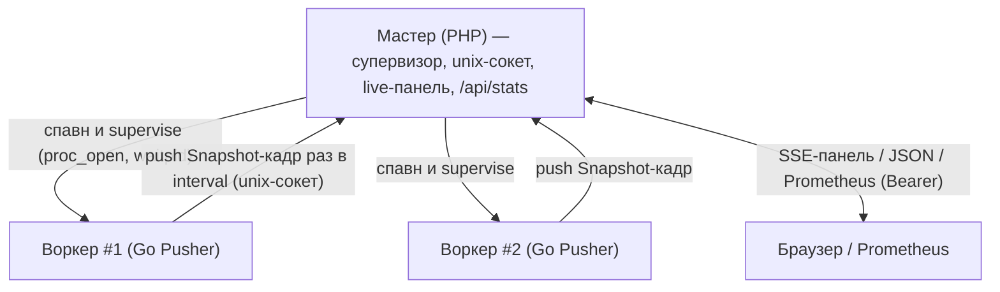

# Телеметрия в мастере и live-панель статистики

Статус: **черновик плана** (не реализовано). Ветка: `feature/servers-admin`.
Консолидация фичи [статистики сервера](../../docs/admin-stats.ru.md): пер-воркерные
файлы снапшотов и выделенный Go-`/api/stats` **убираются**; их заменяет
push-канал воркер→мастер и единый коллектор внутри мастера, отдающий live-панель и
центральный `/api/stats`.

Контекст. Эволюция предыдущего варианта (отдельный коллектор-процесс). Решение:
сложить коллектор в мастер — 0 дополнительных процессов. Мастер уже крутит
поллинг-цикл на неблокирующих пайпах (`src/Worker/WorkerMaster.php` — `usleep`-тик;
`src/Worker/WorkerProcess.php` — `stream_set_blocking(..., false)`), поэтому добавить
мультиплекс сокетов панели — естественный шаг, а не насилие над архитектурой.

## Идея

Каждый воркер best-effort пушит периодический снапшот по unix-сокету в мастер.
Мастер держит состояние пула в памяти (он же знает роли воркеров — сам их спавнит)
и отдаёт live-панель (SSE) и `/api/stats` (Prometheus/JSON/HTML). Файлов нет,
Go-ручки нет. Мастер остаётся pure-PHP (без расширения, без Go/cgo).

## Главный размен (зафиксирован осознанно)

Наблюдаемость становится **master-only**:

- Нет мастера (systemd/supervisord/bare/docker-scale) → статистики нет вовсе.
  Раньше `/api/stats` на reuse-порту работал без мастера — это свойство теряется.
- Мастер — единая точка отказа для всей наблюдаемости (не только панели).
- Рестарт мастера = блэкаут статы до одного интервала (≤5s), пока воркеры не
  перепушат. Файлы давали персистентность через рестарт — её больше нет.

Принимается ради компактности (0 доп. процессов, единый control-plane). Базовая
наблюдаемость без мастера — больше не цель.

Смягчение: push-канал — открытый контракт (framed-JSON, см. «Контракт
push-протокола»). Воркер пушит в *какой-то* сокет; коллектором может быть наш
мастер или сторонний супервизор. То есть воркерная сторона остаётся
supervisor-agnostic на уровне протокола — «нужен какой-то коллектор», а не «именно
наш мастер». В этом репозитории единственный поставляемый коллектор — мастер,
поэтому из коробки стата всё же master-only, пока кто-то не напишет свой коллектор
под тот же контракт.

## Принципы

1. Мастер — единственный потребитель и владелец состояния; pure-PHP.
2. Push — best-effort, lossy. Нет коннекта к мастеру — воркер дропает кадр (не
   копит, не блокируется). Воркер живёт и обслуживает трафик независимо от статы.
3. Цикл супервизии НИКОГДА не блокируется на I/O панели — жёсткое условие (см.
   «Цикл мастера»). Худшее при флуде/залипшем клиенте — деградирует панель,
   супервизия цела.
4. Воркер не отдаёт HTTP-статы и не пишет файлов; вся стата уходит одним каналом.

## Топология

## Push-сторона (Go, `ext/internal/stats/`)

`pusher.go` (новый) — best-effort клиент unix-сокета:

- Dial с backoff-реконнектом. Стартовая гонка «воркер раньше мастера»
  (`ENOENT`/`ECONNREFUSED`) и разрыв (рестарт мастера) → ретрай.
- Кадр через `internal/socket.WriteFrame` (`ext/internal/socket/frame.go`) — тот же
  length-prefix кодек, что у socket-сервера/клиента; новый формат не плодим.
- Тело кадра — JSON: конверт `{"t":"snapshot","s":<Snapshot>}`, где `Snapshot` —
  существующий тип из `ext/internal/stats/snapshot.go` (уже JSON-тегирован). JSON
  выбран сознательно ради открытого, языко-независимого контракта (см. ниже).
- Запись с коротким write-deadline; would-block → дроп кадра. Горутину не вешаем.

Две каденции (важно при `interval=1s`). `runtime.ReadMemStats`
(`ext/internal/stats/metrics.go`) — STW-пауза в процессе воркера; раз в секунду она
бьёт по p99 его же запросов. Поэтому:

- workload-счётчики (completed/avgMs/in-flight у HTTP, active/accepted у socket —
  дешёвые атомики/`sync.Map`) сэмплятся на каждом пуше (`interval`, дефолт 1s);
- процессные метрики со STW (`ReadMemStats`; RSS/CPU из `/proc` дешёвые, но для
  простоты в той же группе) под-сэмплятся реже (`processInterval`, дефолт 5s) и
  переносятся в кадр между выборками.

Кадр всегда полный (`Snapshot` целиком) — просто его процессная часть обновляется
реже workload-части. Панель остаётся «живой» по тому, что реально быстро меняется,
без STW 1×/с.

TODO (исправить, не оставлять). Под-сэмпл 5s — это лишь смягчение, а не решение:
`runtime.ReadMemStats` всё равно STW и раз в 5s даёт паузу в воркере. Цель —
**убрать STW совсем**: перейти на пакет `runtime/metrics` (`/memory/classes/*`
читаются без полного stop-the-world) или иной не-STW источник, и тогда вернуть
единую каденцию. Зависаний быть не должно — это обязательный follow-up, а не
опциональный (продублировано в «Отложено»).

Интеграция: в `newServerState` обоих серверов
(`ext/internal/features/httpserver/server.go`,
`ext/internal/features/socketserver/server.go`) поднимаем `Pusher` при заданном
`telemetrySocket`; гасим в `Close()`. Горячий путь запроса не затрагивается.
Workload-провайдеры (`httpserver/requeststats.go`, `socketserver/connectionstats.go`)
остаются — они наполняют снапшот, который теперь пушится, а не пишется в файл.

## Контракт push-протокола (открытый)

Документируемый, языко-независимый контракт — чтобы коллектором мог быть не только
наш мастер:

- Транспорт: unix-сокет (`SOCK_STREAM`), путь задаёт потребитель.
- Кадрирование: 4-байтный big-endian length-prefix + тело (кодек
  `internal/socket` — `ReadFrame`/`WriteFrame`).
- Тело: UTF-8 JSON, конверт `{"t":<type>,"s":<payload>}`. Сейчас `t="snapshot"`,
  `s` = `Snapshot` (схема — JSON-теги `ext/internal/stats/snapshot.go`). Будущие
  типы (`worker.start`/`worker.stop`/событие порога — фаза 2) добавляются как новые
  `t` без слома существующих.
- Семантика: best-effort, at-most-once, без ack; коллектор держит last-value по
  соединению; закрытие соединения = воркер ушёл.

Контракт фиксируется в `docs/admin-stats.ru.md`, чтобы сторонний супервизор мог
реализовать свой коллектор.

## Цикл мастера (`src/Worker/WorkerMaster.php`)

Слепой `usleep(TICK_MICROSECONDS)` заменяется на `stream_select` с таймаутом
= текущий тик (~100 мс) по набору дескрипторов:

- unix-listener телеметрии (`stream_socket_server('unix://<runtimeDir>/<name>.telemetry.sock')`,
  права 0600) + принятые соединения воркеров;
- HTTP-listener панели + принятые HTTP/SSE-клиенты;
- (опционально) пайпы воркеров — сейчас дренятся на тике, можно завести в тот же
  select.

Цикл просыпается на I/O либо по дедлайну тика; вся логика супервизии
(`waitpid`/рестарт/стейт-файл/дренаж) исполняется после пробуждения, как сейчас.
Жёсткие гард-рейлы: все потоки неблокирующие; буферы кадров ограничены; на
backpressure кадр дропается; число SSE-клиентов лимитировано; дедлайн тика
супервизии всегда соблюдается.

Коллектор оформляется отдельным компонентом `src/Telemetry/` (in-memory store,
агрегация, рендереры), который мастер композирует в свой цикл — мастер-класс не
разрастается спагетти, а компонент при необходимости переиспользуется отдельным
`bin/sconcur-telemetry` (standalone для master-less сетапов — отложено).

## Коллектор (`src/Telemetry/`, чистый PHP)

- In-memory store: последний снапшот по ключу-соединению (pid в payload).
- Детекция смерти воркера — двойной сигнал: мастер видит выход через `waitpid`
  (он сам спавнил воркера) и закрытие соединения (ядро закрывает fd при крахе).
  Никаких `kill(pid,0)`/flock/glob/гонок reuse-pid — они уходят вместе с файлами.
- Агрегация — перенос математики `fillTotals` (бывш. `ext/internal/stats/aggregate.go`)
  на PHP: сумма процессных метрик, avg взвешен по completed, сумма workload-секции.
  Скоуп по имени пула (роль воркера мастер и так знает).
- Hung: соединение живо, но пуша нет дольше N интервалов → флаг `hung`.
- Рендереры (перенос с Go на PHP): Prometheus (бывш. `prometheus.go`), HTML-панель
  (бывш. `html.go`), JSON.

## HTTP-эндпоинты мастера (на отдельном порту, Bearer)

- `GET /` — HTML live-панель (вёрстка — перенос из `ext/internal/stats/html.go`), на
  `EventSource`.
- `GET /events` — SSE: агрегат пула на каждом апдейте/тике.
- `GET /api/stats` — JSON/Prometheus/HTML по `Accept` (паритет с прежней ручкой, но
  центральный и real-time; per-worker серии `sconcur_worker_*` с label `pid`
  сохраняются — Prometheus-паритет).
- Авторизация — `Bearer SCONCUR_ADMIN_TOKEN` (теперь конфиг мастера, не воркера);
  отдельный порт, фаервол. Неверный/нет токена → 404, не-GET → 405 (как прежняя ручка).

## Что удаляется

Go (`ext/internal/stats/`): `server.go`, `listen.go`, `aggregate.go`,
`prometheus.go`, `html.go`; файловая запись из `collector.go` (остаётся
тикер+сэмплер, питающий пушер — можно слить в `pusher.go`). `stats_test.go` —
переписывается под пушер.
Остаются: `metrics.go`, `snapshot.go`, workload-провайдеры.

PHP: из `HttpServer`/`SocketServer` уходят `adminToken`, `statsDir`, `statsPort` и
`resolveStatsDir`; из `ServerRuntimeSupportTrait` — stats-часть `applyStatsEnvironment`.
Добавляется `telemetrySocket`. `serverName` остаётся как метка пула.

Payload `ServePayload` (PHP + Go): убрать `sp`/`at`/`sd`; оставить `sn`; добавить
`ts` (telemetrySocket). Версию расширения не бампаем — ветка уже на 0.3.1
(правило «раз на ветку»).

## Конфигурация

| Переменная | Назначение | Кто задаёт |
|---|---|---|
| `SCONCUR_TELEMETRY_SOCKET` | путь unix-сокета коллектора; пусто = push выкл. | мастер инжектит из `runtimeDir`/`name` |
| `SCONCUR_TELEMETRY_INTERVAL_MS` | каденция пуша = каденция workload-сэмпла | оператор; дефолт 1000 |
| `SCONCUR_TELEMETRY_PROCESS_INTERVAL_MS` | каденция процессного под-сэмпла (STW `ReadMemStats`) | оператор; дефолт 5000 |
| `SCONCUR_ADMIN_TOKEN` | токен панели/ручки (теперь у мастера) | оператор (env-блок) |

Под мастером телеметрия автоконфигурится: путь сокета мастер подставляет воркерам
через env (как уже инжектит роль/каталог). Оператор включает порт панели и токен —
и получает живую панель; больше настраивать нечего.

## Фазы

1. MVP: Go `Pusher`; мастер `usleep`→`stream_select`; коллектор `src/Telemetry/`
   (store + агрегация + JSON/Prometheus/HTML/SSE). Удаление файлов и Go-ручки.
2. Событийные кадры: `worker.start`/`worker.stop(graceful)`/пересечение порога
   (`inFlightOver15s>0`) поверх периодических снапшотов — мгновенная реакция панели.
3. Standalone `bin/sconcur-telemetry` для master-less сетапов (если понадобится).

## Тесты

- Go: `Pusher` коннектится и шлёт кадр (фейковый unix-listener принимает/декодит);
  реконнект после разрыва; дроп по write-deadline; пушер выключен при пустом
  `telemetrySocket`.
- PHP мастер/коллектор: приём кадров N воркеров и агрегация (totals корректны);
  `waitpid`-выход и закрытие соединения эвиктят воркера; `stream_select`-цикл не
  задерживает рестарт воркера под нагрузкой панели (гард-рейл); `/api/stats`
  JSON/Prometheus паритет; `/events` шлёт SSE; auth 404 без токена, 405 на не-GET.
- Регресс: существующие worker-master тесты зелёные после перевода цикла на select.

## Выполнено (бывш. обязательный follow-up)

- STW `runtime.ReadMemStats` убран: память Go-рантайма читается через
  `runtime/metrics` (`/memory/classes/total:bytes`) без stop-the-world. Двойная
  каденция схлопнута обратно в единую (`telemetryIntervalMs`, 1s); `tpi`/процессный
  под-сэмпл удалён из payload'ов, конфигов и env.

## Решения (закрыто)

- Каденция пуша/workload: 1000 мс. Процессный под-сэмпл (STW): 5000 мс — чтобы 1s
  не множил `ReadMemStats`-STW.
- Формат кадра: JSON — ради открытого контракта (сторонний коллектор/супервизор).

## Документация (по реализации)

- Переписать `docs/admin-stats.ru.md`: push-канал в мастер, live-панель,
  `/api/stats` из мастера; явно — файлов и Go-ручки больше нет; стата master-only.
- Обновить `docs/worker-master.ru.md`: мастер теперь несёт коллектор и панель;
  гард-рейлы цикла; новый порт/токен.
- Обновить `docs/adding-a-server.ru.md`: новый сервер получает push, подняв `Pusher`
  рядом с сэмплером.
