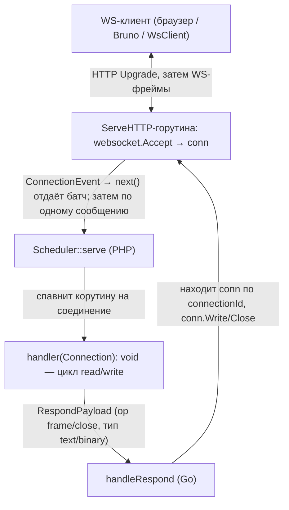

# План: WebSocket-сервер и клиент

Долгоживущий WebSocket-сервер (accept-side) и WebSocket-клиент (dial-side) поверх
паттерна из [«Как добавить новый сервер»](../../docs/adding-a-server.ru.md). Ключевая
особенность WS: соединение **начинается как HTTP-запрос с `Upgrade: websocket`**,
поэтому листенер — это `net/http.Server` (механику берём у `HttpServer`), а после
апгрейда соединение становится двунаправленным потоком сообщений — и здесь точное
зеркало **push-модели `SocketServer`** (`Connection` с `read()`/`write()`/`close()`).

Эталоны для копирования:
- листенер/рукопожатие/`SO_REUSEPORT`/graceful — `HttpServer`
  (`src/Features/HttpServer/`, `ext/internal/features/httpserver/`);
- push-модель соединения, `ConnectionEvent`, стриминг входящих сообщений, статистика —
  `SocketServer` (`src/Features/SocketServer/`, `ext/internal/features/socketserver/`);
- dial-side клиент — `SocketClient` (`src/Features/SocketClient/`,
  `ext/internal/features/socketclient/`).

## Зафиксированные решения (согласовано с заказчиком)

1. **Объём — сервер и клиент.** `WsServer` (accept-side, зеркало `SocketServer`) и
   `WsClient` (dial-side, зеркало `SocketClient`) в одной итерации.
2. **Go-библиотека — `github.com/coder/websocket`** (бывш. `nhooyr.io/websocket`):
   context-first API (`Accept`, `Dial`, `Read(ctx)`/`Write(ctx)`, `Ping(ctx)`,
   `Close(code, reason)`), минимальная, без транзитивных зависимостей. Один новый
   `require` в `ext/go.mod`. Сервер не маскирует фреймы, клиент маскирует — это
   делает библиотека.
3. **Тип сообщений — оба, по умолчанию `text`.** `Connection::read()` возвращает
   payload и сохраняет тип входящего сообщения (text/binary); `Connection::write()`
   по умолчанию шлёт `text`, опционально `binary`. Бинарно-безопасно (binary несёт
   любые байты), при этом дружелюбно к браузеру/Bruno (которые шлют text).
4. **Push-модель как у `SocketServer`.** Публичный обработчик
   `WsServer::serve(Closure(Connection): void)`; обработчик сам крутит цикл
   `read()`/`write()`/`close()`. Одна корутина на соединение, конкурентность — между
   соединениями. Внутри обработчика доступны async-вызовы (Sleeper, Mongodb, …).
   `Per-message` таймаута нет (push-модель, как у socket-сервера) — только idle и
   серверный ping-keepalive.
5. **Транспорт/масштаб — TCP `host:port`, `SO_REUSEPORT`** (пул процессов под
   [мастером](../../docs/worker-master.ru.md), как у `HttpServer`).
6. **Один эндпоинт.** Апгрейд принимается на любом пути (путь конфигурируемый,
   по умолчанию `/`); прикладных HTTP-маршрутов нет. Не-WS HTTP-запрос → `426 Upgrade
   Required`.
7. **Без auth на WS-слое** (как у socket-сервера). Origin-проверка — опциональный
   конфиг (`allowedOrigins`, по умолчанию разрешено всё, расчёт на firewall/мастер).
   Токен остаётся только у телеметри-панели.

## Ключевая идея: гибрид HttpServer (рукопожатие) + SocketServer (поток сообщений)

| Аспект | Откуда берём | Деталь |
| --- | --- | --- |
| Листенер + рукопожатие | HttpServer | `net/http.Server`, `BaseContext` = контекст задачи `Serve`, `SO_REUSEPORT`, `Shutdown` для дренажа, таймаут рукопожатия |
| Апгрейд | coder/websocket | `websocket.Accept(w, r, opts)` в `ServeHTTP` → `*websocket.Conn` |
| Соединение → PHP | SocketServer | каждое апгрейднутое соединение = батч `ConnectionEvent` (через `next()`) |
| Входящие сообщения | SocketServer | стрим: одно WS-сообщение за `Next()` → `Connection::read()` |
| Ответ/закрытие | SocketServer | `RespondPayload` (op frame/close) → write-loop с backpressure |
| 1 корутина на соединение | SocketServer | цикл `read → handler → write` внутри; порядок гарантирован |
| `maxConnections` | общий `Scheduler::serve` | тот же параметр (как `maxRequests`) |
| Статистика | `internal/stats` | `connectionStats` (active/totalAccepted) → секция `connections` |
| PHP-`Connection` | `Features/Socket/Dto/AbstractConnection` | третий подкласс (рядом с socket server/client) |

Фреймовый кодек — не наш length-prefix, а WS-фрейминг библиотеки (opcode, маскирование,
control-фреймы ping/pong/close, UTF-8-валидация text). Поэтому WS-серверу нужен свой
стрим входящих сообщений поверх `*websocket.Conn` (аналог `socketserver`/`internal/socket`
`MessageState`, но читает `conn.Read(ctx)` вместо `ReadFrame`).

## Поток данных одного сообщения

## PHP-сторона

### Method (PHP ↔ Go)
- `MethodEnum`: `WsServe = 11`, `WsRespond = 12`, `WsClient = 13`.
- Go `ext/internal/types/method.go`: `MethodWsServe`, `MethodWsRespond`, `MethodWsClient`.
- Клиент — командный конверт, как у `SocketClient`: `WsClientCommandEnum`
  (`Connect = 1`, `Send = 2`, `Close = 3`).

### Payloads (зеркало socketserver/socketclient)
- `Features/WsServer/Payloads/ServePayload` — `address`, `reusePort`,
  `maxConcurrency`, `handshakeTimeoutMs`, `idleTimeoutMs`, `maxMessageBytes`,
  `pingIntervalMs`, `path`, `allowedOrigins`, плюс телеметрия `ts`/`sn`/`ti`.
- `Features/WsServer/Payloads/RespondPayload` — `op` (`OP_FRAME`/`OP_CLOSE`) +
  `messageType` (text/binary) + payload. Фабрики `frame()`/`close()`.
- `ConnectionEvent` (Go→PHP) — `connectionId`, remote-метаданные (адрес, путь,
  выбранный subprotocol). PHP декодит в `Dto/Connection`/`ConnectionMeta`.

### DTO
- `Features/WsServer/Dto/Connection` — подкласс
  `Features/Socket/Dto/AbstractConnection`: `read(): ?string` (через `next()`),
  `write(string $data, bool $binary = false)`, `close()`, `isClosed()`. Поставляет
  свои frame/close-payloads и `WsConnectionClosedException`. Тип входящего сообщения —
  отдельным аксессором (например `lastMessageWasBinary()`), либо `read()` возвращает
  маленький DTO `{data, binary}` — выбрать при реализации, по умолчанию строка.
- `Features/WsClient/Dto/Connection` / `ConnectionMeta` — dial-side, как у
  `SocketClient`.

### Классы
- `WsServer` (`use ServerRuntimeSupportTrait;`): `serve(Closure(Connection): void)`,
  `fromArgs($argv)` (через `self::parseArgs` + `self::applyTelemetryEnvironment`),
  `serve()` поверх `Scheduler::serve(...)` с `onRequest`/`shouldStop`/`onDrainStart`
  (`wsStopAccepting`). Переписывать `Scheduler::serve` не нужно.
- `WsClient`: `connect(string $address): Connection` (стриминговый результат:
  первый — `ConnectionMeta`, далее входящие сообщения), `WsClientOptions`
  (`connectTimeoutMs`, `maxMessageBytes`, subprotocols, …).

## Go-сторона

### `ext/internal/features/wsserver/` (зеркало socketserver)
- `feature.go` — `Handle` switch → `handleServe`/`handleRespond`; глобальные
  `serverStates` (для `StopAccepting`) и `pendingConnections` (`connectionId → conn`,
  чтобы `Respond` нашёл соединение).
- `server.go` — `serverState` как `http.Handler`: в `ServeHTTP` захватить семафор
  `maxConcurrency`, `websocket.Accept(...)`, зарегистрировать соединение, отправить
  `ConnectionEvent` в буферизованный канал, гонять read-loop (`conn.Read(ctx)` →
  стрим сообщений) и write-loop (apply frame/close с backpressure). Серверный
  ping-keepalive по `pingIntervalMs`. `BaseContext` = контекст задачи. Access-лог на
  Go-стороне.
- listen + апгрейд переиспользуют подход HttpServer (`net.Listener` +
  `http.Server`); общий `listen()` с `SO_REUSEPORT` стоит вынести в общий хелпер
  (сейчас у httpserver свой) — либо аккуратно продублировать.
- `connectionstats.go` — `stats.WorkloadProvider` (active/totalAccepted), как у
  socketserver (счётчик тот же по смыслу; можно вынести в общий пакет или
  продублировать).
- WS-стрим входящих сообщений — свой `message_state` поверх `*websocket.Conn`
  (читает `conn.Read`), аналог `internal/socket/message_state.go`.

### `ext/internal/features/wsclient/` (зеркало socketclient)
- `connect.go` — `websocket.Dial(ctx, url, opts)` с `connectTimeout`; регистрирует
  `connectionState` (первый `Next()` → `ConnectionMeta`, далее входящие сообщения).
- `feature.go` — роутит `Connect`/`Send`/`Close` (командный конверт `WsClientCommand`).
- Ошибки дозвона несут маркер `net:` → `WsClientConnectException` (как у socketclient).

### Регистрация
- `ext/internal/features/factory.go` (`DetectMessageHandler`): один кейс на
  `MethodWsServe, MethodWsRespond` → `wsserver_feature.Get()`; отдельный — на
  `MethodWsClient` → `wsclient_feature.Get()`.

## cgo-экспорт и версия расширения

- Новый экспорт `wsStopAccepting` (у WS-сервера своя карта `serverStates`) по цепочке
  `ext/main.go` → `ext/sconcur.c` (`PHP_FUNCTION`/`arginfo`/`ZEND_NS_FE`) →
  `ext/sconcur.stub.php` → `src/Connection/Extension.php`.
- Новые методы `11/12/13` + новый экспорт — **протокольное изменение**. Делается на
  отдельной ветке `feature/websocket-server`; версия расширения `0.3.1 → 0.4.0`
  (minor — новая фича), бамп один раз на ветку (`ext/main.go` `version()` +
  `Extension::REQUIRED_EXTENSION_VERSION`).

## Телеметрия

Бесплатно, через нейтральный `ext/internal/stats`: WS-сервер пушит снапшоты с секцией
`connections` (active/totalAccepted) — идентично socket-серверу. `pusher.Start()` в
`newServerState`, `pusher.Stop()` в `Close()`. На стороне мастера (`src/Telemetry`)
**изменений не требуется** — панель уже умеет секцию `connections`. Под мастером
`panelPort`+`adminToken` включают сбор как обычно.

## Демо-сервер, docker-compose, Bruno

- `tests/servers/ws/ws-server.php` — демо по образцу `socket-server.php`: те же
  команды (`ping`→`pong`, `pid`, `upper:`, `msleep:`, `cpu:`, `push:`, `stream:`,
  `close`, echo), только через WS-сообщения.
- `docker-compose.yml` — новые проброшенные порты (например `29200:9200` приложение,
  `29201:9201` панель) + запись в `supervisord.conf`.
- Bruno — группа `tests/api/bruno/ws/` (websocket-запросы); **после фичи
  `socket/ping.yml`-подобный ws-запрос реально заработает** (`ping`→`pong`).

## Тесты (обязательно)

- Go: `wsserver/server_test.go` (рукопожатие, echo, text+binary, `maxConcurrency`,
  graceful shutdown, `SO_REUSEPORT` два сервера на порт, `maxConnections`, ping,
  oversize-сообщение → close), `wsclient/*_test.go` — клиентом `coder/websocket`.
- PHP: `tests/impl/WsServer/TestWsServer.php` (spawn реального процесса) +
  `tests/feature/Features/WsServer/...` (базовый кейс/стрим/конкурентность/orphan).
  PHP-клиент для ударов по серверу — **dogfood `WsClient`** (как socket-client/-server
  тестируют друг друга); плюс один протокол-тест минимальным raw-handshake хелпером.
- e2e под мастером — добавить кейс рядом с `WorkerMasterTest`/`*StatsTest`.
- Статистика: `tests/feature/Features/WsServer/...StatsTest` (секция `connections`),
  по образцу `SocketServerStatsTest`.

## Документация

- `docs/websocket-server.ru.md` и `docs/websocket-client.ru.md` (по образцу
  socket-server/-client), линки в `.ai/README.md` и в роадмап `README.md`.
- В `docs/adding-a-server.ru.md` — упомянуть WS как третий сервер (HTTP-Upgrade
  листенер + push-модель).

## Предлагаемый порядок этапов

1. Go `wsserver` (listen+upgrade+push) + методы `11/12` + `wsStopAccepting` + bump
   версии.
2. PHP `WsServer` (payloads, `Connection`, `serve`, `fromArgs`) + демо-сервер + тесты
   (dogfood пока нет — raw-handshake хелпер для первого кейса).
3. Go `wsclient` + PHP `WsClient` (метод `13`) + тесты; перевести WS-серверные тесты
   на dogfood `WsClient`.
4. docker-compose порты + supervisor + Bruno-группа `ws/` (ping заработал).
5. Доки: `websocket-server.ru.md`, `websocket-client.ru.md`, линки, роадмап.

## Вне объёма / открытые вопросы

- `permessage-deflate` (сжатие) — позже (`coder/websocket` умеет `CompressionMode`).
- Полноценная договорённость о subprotocol — минимально сейчас, расширить позже.
- Auth на WS-слое — нет (как у socket); при необходимости отдельной задачей.
- Unix-socket транспорт — нет (как у socket-сервера; `SO_REUSEPORT` к `AF_UNIX`
  неприменим).

## Чеклист

PHP:
- [ ] `MethodEnum` — `WsServe (11)`, `WsRespond (12)`, `WsClient (13)`; `WsClientCommandEnum`.
- [ ] Payloads: `ServePayload`, `RespondPayload` (op frame/close + тип text/binary),
      клиентские `Connect`/`Send`/`Close`.
- [ ] DTO: `WsServer/Dto/Connection` (подкласс `AbstractConnection`), `WsClient/Dto/Connection`+`ConnectionMeta`.
- [ ] `WsServer` (`use ServerRuntimeSupportTrait;`, `serve`, `fromArgs`), `WsClient` (`connect`, `WsClientOptions`).
- [ ] Телеметрия: `ServePayload` += `ts`/`sn`/`ti`, `applyTelemetryEnvironment` в `fromArgs`.

Go:
- [ ] `types/method.go` — три константы.
- [ ] `wsserver`: `Handle`-switch, `serverState` (http.Handler + `websocket.Accept`),
      WS message-stream, write-loop с backpressure, `StopAccepting`, ping, access-лог.
- [ ] `wsclient`: `Dial`, `connectionState`, роутинг `Connect`/`Send`/`Close`.
- [ ] `connectionStats` (`stats.WorkloadProvider`), `Pusher` в `newServerState`/`Close`.
- [ ] Регистрация в `factory.go`; `go.mod` += `github.com/coder/websocket`.

cgo / протокол:
- [ ] `wsStopAccepting` по цепочке `main.go`→`sconcur.c`→`stub`→`Extension.php`.
- [ ] Бамп версии `0.3.1 → 0.4.0` (на ветке `feature/websocket-server`, один раз).

Прочее:
- [ ] Демо `tests/servers/ws/ws-server.php`; docker-compose порты + supervisor.
- [ ] Bruno-группа `tests/api/bruno/ws/`.
- [ ] Доки + линки + роадмап.

Проверка: `make ext-build && make ext-test && make php-stan && make cs-fixer-check && make test`.
