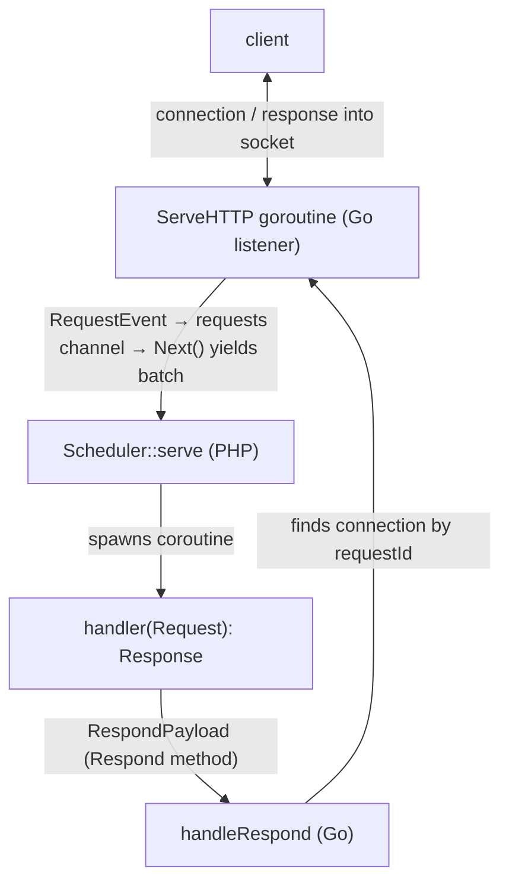

English | [Русский](adding-a-server.ru.md)

# How to add a new server

A server is a special kind of feature: a long-lived network listener that lives in
the Go extension, accepts incoming connections and streams every event into PHP,
where PHP handles it in a separate coroutine and sends the response back. This is an
"inversion" of an ordinary feature: rather than PHP calling Go and waiting for a
result, Go hands PHP a stream of incoming requests.

The reference to copy is `HttpServer`: PHP in `src/Features/HttpServer/`, Go in
`ext/internal/features/httpserver/`. The second server is `SocketServer`
(`src/Features/SocketServer/`, `ext/internal/features/socketserver/`) — built on the
same pattern, and the code shared by the two servers is already extracted into a
reusable trait (see below). The third — `WsServer` ([WebSocket server](websocket-server.md)) —
is a hybrid: it takes the listener and the handshake from `HttpServer`
(`net/http.Server` + `Upgrade`), and after the upgrade works on the push model of
`SocketServer`. This doc describes the pattern in general terms; for the full
implementation look at `HttpServer`.

Before reading, get comfortable with [how to add an ordinary feature](adding-a-feature.md) —
a server reuses its mechanics (`Method`, payloads, the state/streaming registry,
`next()`) and adds a network layer and a serving loop on top.

See also: [HTTP server](http-server.md) (the reference's user-facing doc) and
[Worker master](worker-master.md) (how a server scales across cores and is
supervised).

---

## Model: two `Method`s per server

A server is a pair of methods, both served by one Go feature (via a `switch` on
`Method`):

- `<Server>Serve` — open the listener and stream accepted requests into PHP
  (a streaming state: each request is the next "batch" that PHP pulls via
  `next()`).
- `<Server>Respond` — deliver one response record (whole, or head/chunk/end of a
  stream) from the PHP handler back to the waiting connection.

Data flow of a single request:



Reference: `MethodHttpServe` (3) + `MethodHttpRespond` (4), both → `httpserver_feature`.

---

## ⚠️ Mandatory requirements

Besides the two general feature requirements (context cancellation and execution
deadline — see [adding-a-feature.md](adding-a-feature.md)), a server has its own:

1. The server state's context = the server's lifetime. The context of the `Serve`
   task (`task.GetContext()`) is propagated into `http.Server.BaseContext`, so
   cancelling the flow / `stopFlow` also tears down the listener and all waiting
   connections. **No request may outlive the server's stop.**

2. A per-request limit, not only a per-server one. Each handler is bounded by
   `handlerTimeoutMs` on the Go side (a timer in a separate goroutine, firing
   independently of PHP — see ["Handler timeout" in the HTTP server](http-server.md)).
   Before the first write → the client gets a `504`; after the stream has started →
   the response is aborted.

3. Graceful drain and orphaned workers. A server must be able to: stop accepting new
   connections without touching in-flight ones (for a seamless handover to
   `SO_REUSEPORT` siblings), and self-terminate if its master died (`--masterPid`).
   See below.

---

## `Method` mapping (PHP ↔ Go)

Two new values, both mirrored on each side:

- PHP: `SConcur\Features\MethodEnum` — `case <Server>Serve = N;` and `case <Server>Respond = N+1;`
- Go: `ext/internal/types/method.go` — `Method<Server>Serve` and `Method<Server>Respond`.

Registration in `ext/internal/features/factory.go` (the `DetectMessageHandler`
function) — one case for both methods:

```go
case types.MethodHttpServe, types.MethodHttpRespond:
    return httpserver_feature.Get(), nil
```

---

## Payloads (PHP ↔ Go)

Written like an ordinary feature's (mirrored, `msgpack` tags = short keys,
cross-references — see the "Writing payloads" section in
[adding-a-feature.md](adding-a-feature.md)). A server needs at least three:

1. `ServePayload` — the listener address + tuning (timeouts in ms, limits in bytes,
   `reusePort`). Reference: `src/Features/HttpServer/Payloads/ServePayload.php` ↔
   `payloads.ServePayload`.

2. `RespondPayload` — one response record. The `op` field selects the record kind;
   for `HttpServer` these are `OP_FULL`(0) / `OP_HEAD`(1) / `OP_CHUNK`(2) / `OP_END`(3) — the
   factories `RespondPayload::full()/head()/chunk()/end()`. Headers are normalized to
   `array<string, list<string>>` (multi-valued). Reference:
   `src/Features/HttpServer/Payloads/RespondPayload.php` ↔ `payloads.RespondPayload`.

3. `RequestEvent` — what Go streams into PHP for each request (a Go-only struct;
   PHP decodes it into its own DTO `Request`). It carries `requestId`, the
   method/path/headers and the inline first body chunk + a streaming key for the rest
   of the body (`BodyKey`, see "Request body streaming" below). Reference:
   `payloads.RequestEvent` (Go) ↔ `SConcur\Features\HttpServer\Dto\Request`.

> `requestId` is the end-to-end identifier: Go generates it on accept (`flowKey:r:<n>`),
> puts it into `RequestEvent`, PHP returns it in every `RespondPayload`, and Go uses it
> to find the waiting connection. Make it unique within a flow.

---

## PHP side

### DTO

The shape of the request/response is up to you. Two ready examples in the repo:

- The HTTP server exposes PSR-7 outward: the handler receives
  `Psr\Http\Message\ServerRequestInterface` and returns `ResponseInterface`
  (see [HTTP server](http-server.md)). The request is assembled from `RequestEvent`
  in `HttpServer::decodeRequest()` via an injected PSR-17 factory; the body is
  `Dto/RequestBodyStream` (a lazy `StreamInterface` over `Dto/RequestBody` that reads
  the remainder via `next()`). A known-size response goes out as one `OP_FULL`, an
  unknown-size `StreamInterface` response — `OP_HEAD`/`OP_CHUNK`/`OP_END`.
- The Socket/WS servers use their own `readonly` DTOs instead of PSR-7 — for example
  `Dto/Connection` with `read()`/`write()`/`close()` (the push model). Take whichever
  shape is natural for the feature.

In both cases the request payload from Go is decoded from `RequestEvent`, and the
response is encoded into `RespondPayload` (`OP_FULL`/`OP_HEAD`/`OP_CHUNK`/`OP_END`),
and every command is acknowledged back — which is what gives write backpressure.

### The shared `ServerRuntimeSupportTrait` trait

Argv parsing, signal handlers and the orphan check are already extracted into the
shared trait `SConcur\Features\Server\ServerRuntimeSupportTrait`
(`src/Features/Server/ServerRuntimeSupportTrait.php`), used by both `HttpServer`
and `SocketServer` (`use ServerRuntimeSupportTrait;`). The trait is "lite"
(stateless): it provides behaviour but adds no properties. It provides:

- `parseArgs(array $argv): array` — collect the scalar (`int`/`bool`/`float`/
  `string`) constructor parameters by reflection, coerce each `--name=value` string
  to the type and throw `InvalidServerArgumentException` on an unknown argument;
- `installSignalHandlers(bool &$stopRequested): Closure` — install SIGTERM/SIGINT and
  return a restorer (see "Signals…" below);
- `isOrphaned(int $masterPid): bool` — the orphan check (see the same place).

A new server usually just needs to use the trait — rewriting this mechanic is not
necessary.

### `fromArgs()` (for the worker master)

To have the server launched under `bin/sconcur-server`, add a static constructor from
`argv` — modelled on `HttpServer::fromArgs()` (`HttpServer.php:117`): it only calls
`self::parseArgs($argv)` from the trait, adds `onError` if present, and unpacks the
result into the constructor. The master passes `--masterPid` right here (see
"Integration with the master").

### The serving loop: `serve()`

The public `serve(Closure $handler)` (`HttpServer::serve`, `HttpServer.php:145`):

1. Generate a `flowKey`, install signal handlers via
   `installSignalHandlers($stopRequested)` (from the trait; SIGTERM/SIGINT → the
   `stopRequested` flag), restore them in `finally`.
2. Start the listener: `Extension::get()->push($flowKey, new ServePayload(...))` —
   this is a streaming task (like a cursor), its first and subsequent batches are
   the incoming requests.
3. Hand control to the shared primitive `Scheduler::get()->serve(...)`
   (`Scheduler.php:301`), passing:
   - `serverFlowKey` / `serverTaskKey` — the keys of the listener stream;
   - `maxRequests` — cleanly finish after N requests (a measure against memory
     leaks);
   - `onRequest(string $payload)` — spawn-on-request: decode the request, call
     `handler`, send the response (`RespondPayload::full(...)` or
     head→chunk*→end for a stream). In the reference this is `HttpServer::handle()`
     (`HttpServer.php:240`);
   - `shouldStop(): bool` — `true` when a signal has arrived or the worker is
     orphaned (orphan check below);
   - `onDrainStart()` — called once when the drain begins: stop accepting early,
     `Extension::get()->httpStopAccepting($flowKey)`, so new connections go to
     `SO_REUSEPORT` siblings.

`Scheduler::serve` itself multiplexes the incoming requests and the async work of
their handlers in a single `waitAny` loop, re-arms the stream via `next()`, and on
drain shuts the flow down cleanly (`stopFlow`). This mechanic does not need to be
rewritten — it is shared.

### Signals and self-termination of orphaned workers

Both mechanisms are in the `ServerRuntimeSupportTrait` trait:

- Signals: `installSignalHandlers(&$stopRequested)` sets SIGTERM/SIGINT →
  `stopRequested = true` (via `pcntl_async_signals`; without ext-pcntl — a no-op, and
  the restorer is empty), and `shouldStop()` sees it. The previous handlers and the
  async-signals mode are restored by the returned closure in `finally`.
- Orphan check: if `masterPid` was passed to the constructor, `shouldStop()`
  additionally checks `isOrphaned($masterPid)` — `posix_getppid() !== $masterPid`
  (once the master dies the kernel reparents the process, immune to PID reuse;
  falls back to a signal-0 probe via `posix_kill` if `posix_getppid` is unavailable).
  See `ServerRuntimeSupportTrait::isOrphaned()`
  (`src/Features/Server/ServerRuntimeSupportTrait.php:205`).

---

## Go side

### The feature: `Handle` → `handleServe` / `handleRespond`

`ext/internal/features/<server>/feature.go`, implements `contracts.FeatureContract`.
`Handle` dispatches on `Method` (the reference — `HttpFeature.Handle`, `feature.go:54`):

```go
func (f *HttpFeature) Handle(task *tasks.Task) {
    switch task.GetMessage().Method {
    case types.MethodHttpServe:   f.handleServe(task)
    case types.MethodHttpRespond: f.handleRespond(task)
    default:                      /* unknown method error */
    }
}
```

Global maps (the feature is a singleton):
- `pendingRequests sync.Map` — `requestId → *pendingRequest` (a write-command
  channel). Global so that `Respond` (which arrives on a different flow) can find the
  connection.
- `serverStates sync.Map` — `flowKey → *serverState`, so `StopAccepting` can find the
  listener.

### `handleServe`: the listener as a streaming state

(`feature.go:69`)

1. Parse `ServePayload`.
2. `listener, err := listen(payload.Address, payload.ReusePort)` — a TCP listener;
   `reusePort` sets `SO_REUSEPORT` on the socket (`listen.go`).
3. `state := newServerState(task.GetContext(), message, listener, startTime, configFromPayload(payload))` —
   the state implementing `contracts.StateContract`. Inside it a standard
   `net/http.Server` is brought up (keep-alive, timeouts, parsing), whose
   `http.Handler` is the `serverState`; its `BaseContext` is bound to
   `task.GetContext()`.
4. `serverStates.Store(message.FlowKey, state)` — for the early stop of accepting.
5. `states.Get().Start(task.GetContext(), message.TaskKey, state)` — registers the
   state (like a cursor), which will itself hang `Close()` on context cancellation and
   return the first batch.

`serverState` (`server.go`):
- `ServeHTTP(w, r)` (the connection goroutine): acquire the `maxConcurrency` semaphore
  (before reading the body, so a request waiting for a slot does not hold a body
  buffer), read the first body chunk, register a `pendingRequest` in
  `pendingRequests`, send a `RequestEvent` into the buffered `requests` channel and
  wait for write commands from PHP, applying them to the socket. On
  `handlerTimeout`/disconnect — close `abandoned`, so a late response does not hang
  forever. A deferred access-log line is written (on the Go side, with no PHP↔Go per
  request).
- `Next() *dto.Result` — yield the next `RequestEvent` from the channel as a batch
  `dto.NewSuccessResultWithNext(...)` (the "more coming" flag); on `ctx.Done()` — a
  final batch without the flag (the PHP loop exits).
- `Close()` — stop the `http.Server`, remove it from `serverStates`, free resources
  (on a fresh context — the task context is already cancelled).

### `handleRespond`: routing the response into the connection

(`feature.go:112`) Decode `requestId` (with a separate mini-struct, so routing works
even when the rest of the payload is corrupt), find the `pendingRequest` in
`pendingRequests`, and `dispatch()` the write command
(`writeFull`/`writeHead`/`writeChunk`/`writeEnd`). `dispatch` waits for the command to
be applied (write backpressure): the handler coroutine continues only once the bytes
have gone into the socket, or `abandoned`/context cancellation arrives.

### Early stop of accepting + `SO_REUSEPORT`

`StopAccepting(flowKey)` (`feature.go:215`) finds the `serverState` and calls its
`stopAccepting()` (`server.go:439`), which closes only the listener
(`http.Server.Shutdown` in a separate goroutine on a background context), without
cancelling in-flight ones. In a `SO_REUSEPORT` pool the kernel immediately hands new
connections to siblings while this process drains. This is called from the PHP
`onDrainStart`.

### Request body streaming

If the body is larger than the inline first chunk — Go puts the remainder into a
separate streaming state (`bodyState`, registered under the key `<requestId>:body`)
and yields that key in `RequestEvent.BodyKey`; PHP reads the pieces via the same
shared `next()` mechanism (like a Mongo cursor). Reference — `body_state.go` and
`RequestBody`. The transport chunk granularity is fixed
(`defaultRequestBodyChunkSize`, 64 KiB).

---

## The cgo export `StopAccepting` (the only "server" export)

The shared exports (`push`, `next`, `stopFlow`, `waitAnyTimeout`, `waitAny`) a server
reuses. It additionally needs its own export for the early stop of accepting — each
server's `serverStates` is its own map, so another server's `httpStopAccepting` cannot
be reused (cf. `socketStopAccepting` in `SocketServer`). Add
`<server>StopAccepting` along the same chain as `httpStopAccepting`:

- `ext/main.go` — `//export <server>StopAccepting` → `<server>_feature.StopAccepting(...)`;
- `ext/sconcur.c` — `PHP_FUNCTION`, `arginfo`, the `ZEND_NS_FE` registration and the
  header line;
- `ext/sconcur.stub.php` — the function declaration;
- `src/Connection/Extension.php` — `use function` + a PHP wrapper.

This is a protocol change — the extension-version rule applies (bump no more than once
per branch, see the "Extension versioning" section in [.ai/README.md](../.ai/README.md)).

> A minimal server can do without `StopAccepting` and tear everything down via
> `stopFlow`, but then it loses the seamless `SO_REUSEPORT` drain/handover — a
> production server under a master needs it.

---

## Integration with the worker master

A server becomes a "server-agnostic" worker for `bin/sconcur-server` for free, if it
honours the contract:

- the worker script builds the server from argv and serves:
  ```php
  $server = MyServer::fromArgs($_SERVER['argv']);
  $server->serve(static fn (Request $request) => new Response(body: 'ok'));
  ```
- the parameters from the `server` block of the JSON config the master expands into
  `--key=value` argv (`fromArgs` parses them), and passes its own pid via the
  `--masterPid` flag (the orphan check);
- `reusePort: true` in the config enables `SO_REUSEPORT` — the master brings up a
  pool of processes, the kernel balances. The `reload` command performs a rolling
  restart with no downtime.

Contract details and parameters are in [Worker master](worker-master.md) (the
"Supported servers" and "Parameters" sections).

---

## Statistics

For a new server to collect and report statistics out of the box (like HTTP and
socket), plug in the neutral `ext/internal/stats` package — it provides a
process-metrics sampler and a `Pusher` that sends snapshots to the master's
collector. Aggregation and the panel are the master's job (`src/Telemetry`); the
server only pushes. User-facing details — [Server statistics](admin-stats.md).

PHP side:

- `ServePayload` += `telemetrySocket`/`serverName`/`telemetryIntervalMs` (keys
  `ts`/`sn`/`ti`), mirroring the Go payload.
- The server constructor += the same three parameters; in `fromArgs()` call
  `self::applyTelemetryEnvironment($overrides)` (a trait method) — it reads
  `SCONCUR_TELEMETRY_SOCKET`/`SCONCUR_SERVER_NAME`/`SCONCUR_TELEMETRY_INTERVAL_MS`.
  Pass the fields into `ServePayload` (the master injects `SCONCUR_TELEMETRY_SOCKET`
  when telemetry is enabled).

Go side:

- Add your own counter type (workload) implementing `stats.WorkloadProvider`
  (`WorkloadSnapshot() stats.Workload`) — for HTTP this is `requestStats` (the
  `Requests` section), for socket `connectionStats` (the `Connections` section).
  Increment it in the connection/request handler.
- Thread `telemetrySocket`/`serverName`/`telemetryIntervalMs` through `serverConfig`;
  in `newServerState` create `pusher := stats.NewPusher(name, telemetrySocket,
  intervalMs, startTime, provider)` and `pusher.Start()`.
- In `Close()` call `pusher.Stop()` (safe on a disabled configuration — an empty
  `telemetrySocket`).

`Pusher` works when `telemetrySocket` is set; it is best-effort — with no collector
the frame is dropped and the server is unaffected.

---

## Tests (mandatory)

- Bring up a real server process on loopback and hit it with `curl` — the
  infrastructure reference: `tests/impl/HttpServer/TestHttpServer.php` (spawn via
  `proc_open`, a free port, reading the access log) and
  `tests/feature/Features/HttpServer/BaseHttpServerTestCase.php` (its own server per
  class, `serverOptions()`, `request()`, `concurrentGet()`).
- Cover: a basic request/response, streaming, `maxConcurrency`, `handlerTimeoutMs`
  (including a natively-blocking handler), graceful shutdown, `SO_REUSEPORT` (two
  servers on one port), `maxRequests`, orphan self-termination (`--masterPid`).
  Examples — the neighbouring `HttpServer*Test.php`.
- Cover the Go listener/state logic with Go tests (`make ext-test`); the reference —
  `ext/internal/features/httpserver/server_test.go`.
- End-to-end under the master — `tests/feature/Worker/WorkerMasterTest.php`.

---

## Checklist

PHP:
- [ ] `MethodEnum` — two values (`<Server>Serve`, `<Server>Respond`).
- [ ] Payloads: `ServePayload`, `RespondPayload` (+ cross-references `Go: payloads.<Type>`).
- [ ] Request/response shape: your own `readonly` DTOs (like socket/ws `Dto/Connection`) or
      PSR-7 outward (like HttpServer: `ServerRequestInterface` → `ResponseInterface`).
- [ ] `use ServerRuntimeSupportTrait;` — `parseArgs`/`installSignalHandlers`/`isOrphaned`.
- [ ] `fromArgs()` via `self::parseArgs($argv)` — for the master; accepts `--masterPid`.
- [ ] `serve()`: start the listener via `push(ServePayload)` + `Scheduler::serve(...)`
      with `onRequest`/`shouldStop`/`onDrainStart`; signals + orphan check (from the trait).
- [ ] Statistics: `ServePayload` += `ts`/`sn`/`ti`, constructor += 3 parameters,
      `self::applyTelemetryEnvironment()` in `fromArgs()`, passed into `ServePayload`.
- [ ] Tests from a `BaseHttpServerTestCase` analogue (a real process + `curl`).

Go:
- [ ] The same two constants in `types/method.go`.
- [ ] Payload structs in `payloads.go` + `RequestEvent`; mirror PHP 1:1.
- [ ] The feature: `Handle` switch → `handleServe` (listen → `serverState`/`StateContract` →
      `states.Get().Start`) and `handleRespond` (rendezvous by `requestId` + write backpressure).
- [ ] `serverStates`/`pendingRequests` maps; `StopAccepting(flowKey)`; `SO_REUSEPORT` in `listen`.
- [ ] `BaseContext` = the task context; `handlerTimeout`; the access log on the Go side.
- [ ] Statistics: a `stats.WorkloadProvider` counter, `stats.NewPusher` + `Start` in
      `newServerState`, `pusher.Stop()` in `Close`.
- [ ] Registration in `features/factory.go` (one case for both methods).

cgo / protocol:
- [ ] `<server>StopAccepting` along the chain `main.go` → `sconcur.c` → `sconcur.stub.php` →
      `Extension.php`; account for the extension version (bump once per branch).

Check: `make ext-build && make ext-test && make php-stan && make cs-fixer-check && make test`.
