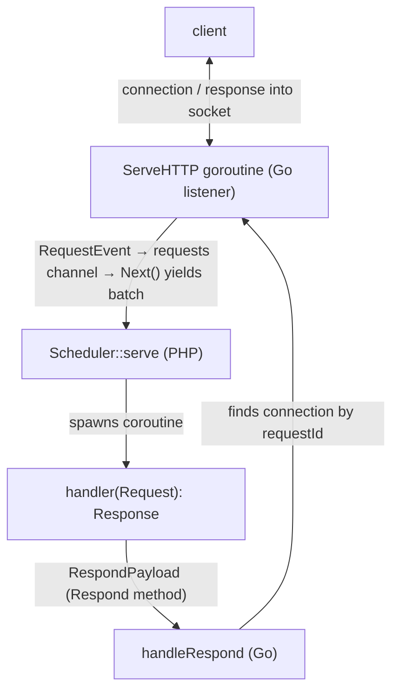

English | [Русский](adding-a-server.ru.md)

# How to add a new server

A server is a special kind of feature: a long-lived network listener that lives in
the Go extension, accepts incoming connections and streams every event into PHP,
which handles it in a separate coroutine and sends the response back. It inverts an
ordinary feature: rather than PHP calling Go and waiting for a result, Go hands PHP
a stream of incoming requests.

The reference to copy is `HttpServer` (`src/Features/HttpServer/`,
`ext/internal/features/httpserver/`). `SocketServer` follows the same pattern, and
the code shared by both is already extracted into a trait; `WsServer` is a hybrid —
the listener and handshake from `HttpServer`, the push model of `SocketServer`
after the upgrade.

Read [how to add an ordinary feature](adding-a-feature.md) first — a server reuses
its mechanics (`Method`, payloads, the state/streaming registry, `next()`) and adds
a network layer and a serving loop on top. See also the
[HTTP server](http-server.md) and [worker master](worker-master.md) docs.

## Model: two `Method`s per server

A server is a pair of methods, both served by one Go feature (via a `switch` on
`Method`):

- `<Server>Serve` — open the listener and stream accepted requests into PHP (a
  self-pumping stream: a Go-side goroutine publishes each request as the next
  stream result, no per-request `next()` crossing);
- `<Server>Respond` — deliver one response record (whole, or head/chunk/end of a
  stream) from the PHP handler back to the waiting connection.

Reference: `MethodHttpServe` (`hs`) + `MethodHttpRespond` (`hr`), both →
`httpserver_feature`. Both values are mirrored in PHP `MethodEnum` and Go
`types/method.go`, and registered in `ext/internal/features/factory.go` with one
case for both:

```go
case types.MethodHttpServe, types.MethodHttpRespond:
    return httpserver_feature.Get(), nil
```


```mermaid
flowchart TB
    client["client"]
    serve["ServeHTTP goroutine (Go listener)"]
    sched["Scheduler::serve (PHP)"]
    handler["handler(Request): Response"]
    respond["handleRespond (Go)"]

    client <-->|"connection / response into socket"| serve
    serve -->|"RequestEvent → requests channel → Next() yields batch"| sched
    sched -->|"spawns coroutine"| handler
    handler -->|"RespondPayload (Respond method)"| respond
    respond -->|"finds connection by requestId"| serve
```

## Mandatory requirements

Besides the two general feature requirements (context cancellation and execution
deadline), a server has its own:

1. The server state's context = the server's lifetime. The context of the `Serve`
   task is propagated into `http.Server.BaseContext`, so cancelling the flow or
   `stopFlow` tears down the listener and all waiting connections. **No request may
   outlive the server's stop.**
2. A per-request limit, not only a per-server one. Each handler is bounded by
   `handlerTimeoutMs` on the Go side (a timer in a separate goroutine, firing
   independently of PHP): before the first write the client gets a `504`, after the
   stream has started the response is aborted.
3. Graceful drain and orphaned workers. A server must be able to stop accepting new
   connections without touching in-flight ones (for a seamless handover to
   `SO_REUSEPORT` siblings) and to self-terminate if its master died
   (`--masterPid`).

## Payloads

Written like an ordinary feature's (mirrored, `msgpack` tags = short keys,
cross-references). A server needs at least three:

1. `ServePayload` — the listener address plus tuning (timeouts in ms, limits in
   bytes, `reusePort`).
2. `RespondPayload` — one response record. The `op` field selects the record kind;
   for `HttpServer` these are `OP_FULL`(0) / `OP_HEAD`(1) / `OP_CHUNK`(2) /
   `OP_END`(3), built by the factories `RespondPayload::full()/head()/chunk()/end()`.
   Headers are normalized to `array<string, list<string>>`.
3. `RequestEvent` — what Go streams into PHP per request (a Go-only struct; PHP
   decodes it straight into the handler's request object). It carries `requestId`,
   the method/path/headers, the inline first body chunk and a streaming key for the
   rest of the body (`BodyKey`).

> `requestId` is the end-to-end identifier: Go generates it on accept
> (`flowKey:r:<n>`), puts it into `RequestEvent`, PHP returns it in every
> `RespondPayload`, and Go uses it to find the waiting connection. Make it unique
> within a flow.

## PHP side

The shape of the request/response is up to you. The HTTP server exposes PSR-7
outward (the request is assembled from `RequestEvent` in
`HttpServer::decodeRequest()` via an injected PSR-17 factory; the body is
`Dto/RequestBodyStream` over `Dto/RequestBody`), while the socket and WS servers use
their own `readonly` DTOs — `Dto/Connection` with `read()`/`write()`/`close()` for
the push model. In both cases the response is encoded into `RespondPayload`, and
every command is acknowledged back, which is what gives write backpressure.

Argv parsing, signal handlers and the orphan check are already extracted into the
stateless `SConcur\Features\Server\ServerRuntimeSupportTrait`:

- `parseArgs(array $argv): array` — collect the scalar (`int`/`bool`/`float`/
  `string`) constructor parameters by reflection, coerce each `--name=value` string
  to the type and throw `InvalidServerArgumentException` on an unknown argument;
- `installSignalHandlers(bool &$stopRequested): Closure` — install SIGTERM/SIGINT
  (via `pcntl_async_signals`; without ext-pcntl it is a no-op) and return a
  restorer to call in `finally`;
- `isOrphaned(int $masterPid): bool` — `posix_getppid() !== $masterPid`, immune to
  PID reuse because the kernel reparents the process once the master dies;
- `applyTelemetryEnvironment(array $overrides): array` — read the telemetry env.

A new server just uses the trait, and to be launchable under `bin/sconcur-server`
it adds a static `fromArgs()` modelled on `HttpServer::fromArgs()`: call
`self::parseArgs($argv)`, add `onError` if present, unpack into the constructor.

The public `serve(Closure $handler)` then generates a `flowKey`, installs signal
handlers (restoring them in `finally`), starts the listener with
`Extension::get()->push($flowKey, new ServePayload(...))` — a streaming task whose
batches are the incoming requests — and hands control to the shared
`Scheduler::get()->serve(...)`, passing:

- `serverFlowKey`/`serverTaskKey` — the listener stream keys;
- `maxRequests` — finish cleanly after N requests;
- `onRequest(string $payload)` — spawn-on-request: decode, call the handler, send
  the response (`HttpServer::handle()` in the reference);
- `shouldStop(): bool` — a signal arrived or the worker is orphaned;
- `onDrainStart()` — called once when the drain begins: stop accepting early via
  `Extension::get()->httpStopAccepting($flowKey)`, so new connections go to
  `SO_REUSEPORT` siblings.

`Scheduler::serve` itself multiplexes the incoming requests and the async work of
their handlers in a single wait loop (`waitAnyTimeoutBatch`) and on drain shuts the
flow down cleanly (`stopFlow`). This mechanic is shared and does not need rewriting.

## Go side

`ext/internal/features/<server>/feature.go` implements `contracts.FeatureContract`,
and `Handle` dispatches on `Method` into `handleServe`/`handleRespond`. The feature
is a singleton with two global maps: `pendingRequests`
(`requestId → *pendingRequest`, a write-command channel — global so that `Respond`,
which arrives on a different flow, can find the connection) and `serverStates`
(`flowKey → *serverState`, so `StopAccepting` can find the listener).

`handleServe` parses `ServePayload`, opens the TCP listener (`listen.go`, which sets
`SO_REUSEPORT` when asked), builds the `serverState` — a `contracts.StateContract`
that also brings up a standard `net/http.Server` whose `http.Handler` it is, with
`BaseContext` bound to the task context — stores it in `serverStates` and registers
it via `states.Get().Start(...)`, which hangs `Close()` on context cancellation and
returns the first batch.

Inside `serverState` (`server.go`), `ServeHTTP` acquires the `maxConcurrency`
semaphore before reading the body (so a request waiting for a slot does not hold a
body buffer), registers a `pendingRequest`, sends a `RequestEvent` into the buffered
`requests` channel and waits for write commands from PHP, applying them to the
socket; on `handlerTimeout` or disconnect it closes `abandoned`, so a late response
does not hang forever, and it writes the access-log line on the Go side. `Next()`
yields the next `RequestEvent` as a batch with the "more coming" flag (on
`ctx.Done()` a final batch without it, which ends the PHP loop), and `Close()` stops
the `http.Server`, removes it from `serverStates` and frees resources on a fresh
context.

`handleRespond` decodes `requestId` (with a separate mini-struct, so routing works
even when the rest of the payload is corrupt), finds the `pendingRequest` and
dispatches the write command, waiting for it to be applied — the handler coroutine
continues only once the bytes have gone into the socket, or `abandoned`/context
cancellation arrives.

If the body is larger than the inline first chunk, Go puts the remainder into a
separate streaming state (`bodyState`, registered under `<requestId>:body`) and
yields that key in `RequestEvent.BodyKey`; PHP reads the pieces via the same shared
`next()` mechanism, with a fixed 64 KiB transport granularity.

## The cgo export `StopAccepting`

The shared exports (`push`, `next`, `stopFlow`, `waitAnyBatch`,
`waitAnyTimeoutBatch`) are reused as they are. A server additionally needs its own
export for the early stop of accepting — each server's `serverStates` is its own
map, so another server's `httpStopAccepting` cannot be reused (cf.
`socketStopAccepting`). Add `<server>StopAccepting` along the same chain:

- `ext/main.go` — `//export <server>StopAccepting` →
  `<server>_feature.StopAccepting(...)`;
- `ext/sconcur.c` — `PHP_FUNCTION`, `arginfo`, the `ZEND_NS_FE` registration and the
  header line;
- `ext/sconcur.stub.php` — the function declaration;
- `src/Connection/Extension.php` — `use function` plus a PHP wrapper.

`StopAccepting(flowKey)` finds the `serverState` and calls its `stopAccepting()`,
which closes only the listener (`http.Server.Shutdown` in a separate goroutine on a
background context) without cancelling in-flight requests. In a `SO_REUSEPORT` pool
the kernel immediately hands new connections to siblings while this process drains.

This is a protocol change, so the extension-version rule applies (bump at most once
per branch, see [.ai/README.md](../.ai/README.md)).

> A minimal server can do without `StopAccepting` and tear everything down via
> `stopFlow`, but then it loses the seamless `SO_REUSEPORT` drain — a production
> server under a master needs it.

## Integration with the worker master

A server becomes a server-agnostic worker for `bin/sconcur-server` for free if it
honours the contract: the worker script builds the server from argv
(`MyServer::fromArgs($_SERVER['argv'])`) and serves; the master expands the `server`
block of the JSON config into `--key=value` argv and passes its own pid via
`--masterPid`; `reusePort: true` enables `SO_REUSEPORT`, so the master brings up a
pool of processes and `reload` performs a rolling restart with no downtime. Details
in [Worker master](worker-master.md).

## Statistics

To collect and report statistics out of the box, plug in the neutral
`ext/internal/stats` package — a process-metrics sampler plus a best-effort
`Pusher` that sends snapshots to the master's collector; aggregation and the panel
are the master's job (`src/Telemetry`), see [Server statistics](admin-stats.md).

PHP side: `ServePayload` += `telemetrySocket`/`serverName`/`telemetryIntervalMs`
(keys `ts`/`sn`/`ti`), the constructor += the same three parameters, and
`fromArgs()` calls `self::applyTelemetryEnvironment($overrides)`, which reads the
env the master injects when telemetry is enabled.

Go side: add a workload counter implementing `stats.WorkloadProvider`
(`requestStats` for HTTP, `connectionStats` for socket) and increment it in the
connection/request handler; thread the three telemetry fields through
`serverConfig`; in `newServerState` create
`pusher := stats.NewPusher(name, telemetrySocket, intervalMs, startTime, provider)`
and `pusher.Start()`; call `pusher.Stop()` in `Close()` (safe on a disabled
configuration).

## Tests (mandatory)

Bring up a real server process on loopback and hit it with `curl` — the
infrastructure reference is `tests/impl/HttpServer/TestHttpServer.php` (spawn via
`proc_open`, a free port, reading the access log) plus
`BaseHttpServerTestCase.php`. Cover a basic request/response, streaming,
`maxConcurrency`, `handlerTimeoutMs` (including a natively-blocking handler),
graceful shutdown, `SO_REUSEPORT` (two servers on one port), `maxRequests` and
orphan self-termination. The Go listener/state logic goes into Go tests
(`ext/internal/features/httpserver/server_test.go`), and the end-to-end scenario
under the master is `tests/feature/Worker/WorkerMasterTest.php`.

## Checklist

PHP:

- [ ] `MethodEnum` — two values (`<Server>Serve`, `<Server>Respond`).
- [ ] Payloads: `ServePayload`, `RespondPayload` (+ cross-references
      `Go: payloads.<Type>`).
- [ ] Request/response shape: your own `readonly` DTOs or PSR-7 outward.
- [ ] `use ServerRuntimeSupportTrait;` —
      `parseArgs`/`installSignalHandlers`/`isOrphaned`.
- [ ] `fromArgs()` via `self::parseArgs($argv)`, accepting `--masterPid`.
- [ ] `serve()`: start the listener via `push(ServePayload)` plus
      `Scheduler::serve(...)` with `onRequest`/`shouldStop`/`onDrainStart`.
- [ ] Statistics: `ServePayload` += `ts`/`sn`/`ti`, constructor += 3 parameters,
      `self::applyTelemetryEnvironment()` in `fromArgs()`.
- [ ] Tests from a `BaseHttpServerTestCase` analogue (a real process + `curl`).

Go:

- [ ] The same two constants in `types/method.go`.
- [ ] Payload structs in `payloads.go` plus `RequestEvent`; mirror PHP 1:1.
- [ ] The feature: `Handle` switch → `handleServe` (listen → `serverState` →
      `states.Get().Start`) and `handleRespond` (rendezvous by `requestId` plus write
      backpressure).
- [ ] `serverStates`/`pendingRequests` maps; `StopAccepting(flowKey)`;
      `SO_REUSEPORT` in `listen`.
- [ ] `BaseContext` = the task context; `handlerTimeout`; the access log on the Go
      side.
- [ ] Statistics: a `stats.WorkloadProvider` counter, `stats.NewPusher` + `Start` in
      `newServerState`, `pusher.Stop()` in `Close`.
- [ ] Registration in `features/factory.go` (one case for both methods).

cgo / protocol:

- [ ] `<server>StopAccepting` along the chain `main.go` → `sconcur.c` →
      `sconcur.stub.php` → `Extension.php`; account for the extension version (bump
      once per branch).

Check:
`make ext-build && make ext-test && make php-stan && make cs-fixer-check && make test`.
