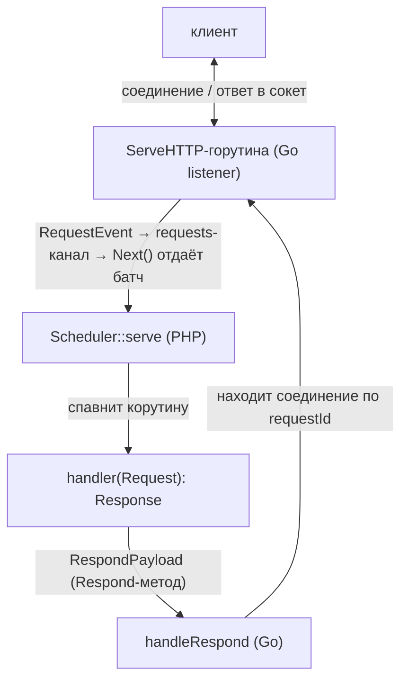

[English](adding-a-server.md) | Русский

# Как добавить новый сервер

Сервер — это особый вид фичи: долгоживущий сетевой слушатель, который живёт в
Go-расширении, принимает входящие соединения и стримит каждое событие в PHP, а
PHP обрабатывает его в отдельной корутине и отправляет ответ обратно. Это «инверсия»
обычной фичи: не PHP вызывает Go и ждёт результат, а Go отдаёт PHP поток входящих
запросов.

Эталон для копирования — `HttpServer`: PHP в `src/Features/HttpServer/`, Go в
`ext/internal/features/httpserver/`. Второй сервер — `SocketServer`
(`src/Features/SocketServer/`, `ext/internal/features/socketserver/`) — построен по тому
же паттерну, и общий код двух серверов уже вынесен в переиспользуемый трейт (см. ниже).
Третий — `WsServer` ([WebSocket-сервер](websocket-server.ru.md)) — гибрид: листенер и
рукопожатие он берёт у `HttpServer` (`net/http.Server` + `Upgrade`), а после апгрейда
работает по push-модели `SocketServer`. Эта дока описывает паттерн в общем виде; за полной
реализацией смотрите на `HttpServer`.

Перед чтением освойте [как добавить обычную фичу](adding-a-feature.ru.md) — сервер
переиспользует её механику (`Method`, payloads, реестр состояний/стриминг, `next()`) и
добавляет поверх неё сетевой слой и цикл обслуживания.

См. также: [HTTP-сервер](http-server.ru.md) (пользовательская дока эталона) и
[Мастер воркеров](worker-master.ru.md) (как сервер масштабируется на ядра и
супервизируется).

---

## Модель: два `Method` на один сервер

Сервер — это пара методов, оба обслуживает одна Go-фича (через `switch` по
`Method`):

- `<Server>Serve` — открыть слушатель и стримить принятые запросы в PHP
  (стриминговое состояние: каждый запрос — очередной «батч», который PHP тянет через
  `next()`).
- `<Server>Respond` — доставить одну запись ответа (целиком, либо
  head/chunk/end стрима) от PHP-обработчика обратно в висящее соединение.

Поток данных одного запроса:



Эталон: `MethodHttpServe` (3) + `MethodHttpRespond` (4), оба → `httpserver_feature`.

---

## ⚠️ Обязательные требования

Помимо двух общих требований к фиче (отмена контекста и предельное время выполнения —
см. [adding-a-feature.ru.md](adding-a-feature.ru.md)), у сервера есть свои:

1. Контекст серверного состояния = жизнь сервера. Контекст задачи `Serve`
   (`task.GetContext()`) пробрасывается в `http.Server.BaseContext`, поэтому отмена
   потока/`stopFlow` обрывает и слушатель, и все висящие соединения. **Никакой запрос не
   должен переживать остановку сервера.**

2. Лимит на запрос, а не только на сервер. Каждый обработчик ограничивается
   `handlerTimeoutMs` на Go-стороне (таймер в отдельной горутине, срабатывает
   независимо от PHP — см. [«Таймаут хендлера» в HTTP-сервере](http-server.ru.md)).
   До первой записи → клиент получает `504`; после начала стрима → ответ обрывается.

3. Graceful-дренаж и осиротевшие воркеры. Сервер обязан уметь: остановить приём
   новых соединений, не трогая in-flight (для бесшовного хендовера соседям по
   `SO_REUSEPORT`), и самозавершаться, если его мастер умер (`--masterPid`). См. ниже.

---

## Соответствие `Method` (PHP ↔ Go)

Два новых значения, оба дублируются с обеих сторон:

- PHP: `SConcur\Features\MethodEnum` — `case <Server>Serve = N;` и `case <Server>Respond = N+1;`
- Go: `ext/internal/types/method.go` — `Method<Server>Serve` и `Method<Server>Respond`.

Регистрация в `ext/internal/features/factory.go` (функция `DetectMessageHandler`) — один
кейс на оба метода:

```go
case types.MethodHttpServe, types.MethodHttpRespond:
    return httpserver_feature.Get(), nil
```

---

## Payloads (PHP ↔ Go)

Оформляются как у обычной фичи (зеркально, `msgpack`-теги = короткие ключи,
кросс-ссылки — см. раздел «Оформление payloads» в
[adding-a-feature.ru.md](adding-a-feature.ru.md)). Серверу нужны минимум три:

1. `ServePayload` — адрес слушателя + тюнинг (таймауты в мс, лимиты в байтах,
   `reusePort`). Эталон: `src/Features/HttpServer/Payloads/ServePayload.php` ↔
   `payloads.ServePayload`.

2. `RespondPayload` — одна запись ответа. Поле `op` выбирает вид записи; у
   `HttpServer` это `OP_FULL`(0) / `OP_HEAD`(1) / `OP_CHUNK`(2) / `OP_END`(3) — фабрики
   `RespondPayload::full()/head()/chunk()/end()`. Заголовки нормализуются в
   `array<string, list<string>>` (мульти-значные). Эталон:
   `src/Features/HttpServer/Payloads/RespondPayload.php` ↔ `payloads.RespondPayload`.

3. `RequestEvent` — то, что Go стримит в PHP на каждый запрос (Go-only структура;
   PHP декодирует её в свой DTO `Request`). Несёт `requestId`, метод/путь/заголовки и
   инлайн первый чанк тела + ключ стриминга остального тела (`BodyKey`, см.
   «Стриминг тела» ниже). Эталон: `payloads.RequestEvent` (Go) ↔
   `SConcur\Features\HttpServer\Dto\Request`.

> `requestId` — сквозной идентификатор: Go генерит его на приёме (`flowKey:r:<n>`),
> кладёт в `RequestEvent`, PHP возвращает его в каждом `RespondPayload`, и Go по нему
> находит висящее соединение. Делайте его уникальным в пределах flow.

---

## PHP-сторона

### DTO

Выбор формы запроса/ответа — за вами. Два готовых примера в репозитории:

- HTTP-сервер отдаёт наружу PSR-7: обработчик принимает
  `Psr\Http\Message\ServerRequestInterface` и возвращает `ResponseInterface`
  (см. [HTTP-сервер](http-server.ru.md)). Запрос собирается из `RequestEvent` в
  `HttpServer::decodeRequest()` через инъецированную PSR-17 фабрику; тело —
  `Dto/RequestBodyStream` (ленивый `StreamInterface` поверх `Dto/RequestBody` с
  дочитыванием остатка через `next()`). Ответ известного размера уходит одним
  `OP_FULL`, ответ-`StreamInterface` неизвестного размера — `OP_HEAD`/`OP_CHUNK`/`OP_END`.
- Socket/WS-серверы используют свои `readonly`-DTO вместо PSR-7 — например
  `Dto/Connection` с `read()`/`write()`/`close()` (push-модель). Берите ту форму,
  что естественна для фичи.

В обоих случаях payload запроса от Go декодится из `RequestEvent`, а ответ
кодируется в `RespondPayload` (`OP_FULL`/`OP_HEAD`/`OP_CHUNK`/`OP_END`), и каждая
команда подтверждается обратно — это и даёт backpressure записи.

### Общий трейт `ServerRuntimeSupportTrait`

Argv-разбор, обработчики сигналов и orphan-чек уже вынесены в общий трейт
`SConcur\Features\Server\ServerRuntimeSupportTrait`
(`src/Features/Server/ServerRuntimeSupportTrait.php`), который подключают и `HttpServer`,
и `SocketServer` (`use ServerRuntimeSupportTrait;`). Трейт «лёгкий» (stateless): даёт
поведение, но не добавляет свойств. Он предоставляет:

- `parseArgs(array $argv): array` — рефлексией собрать скалярные (`int`/`bool`/`float`/
  `string`) параметры конструктора, для каждого `--имя=значение` привести строку к типу
  и бросить `InvalidServerArgumentException` на неизвестный аргумент;
- `installSignalHandlers(bool &$stopRequested): Closure` — поставить SIGTERM/SIGINT и
  вернуть восстановитель (см. «Сигналы…» ниже);
- `isOrphaned(int $masterPid): bool` — orphan-чек (см. там же).

Новому серверу обычно достаточно подключить трейт — переписывать эту механику не нужно.

### `fromArgs()` (для мастера воркеров)

Чтобы сервер запускался под `bin/sconcur-server`, сделайте статический конструктор из
`argv` — по образцу `HttpServer::fromArgs()` (`HttpServer.php:117`): он лишь вызывает
`self::parseArgs($argv)` из трейта, при наличии добавляет `onError` и распаковывает
результат в конструктор. Мастер прокидывает `--masterPid` именно сюда (см. «Интеграция с
мастером»).

### Цикл обслуживания: `serve()`

Публичный `serve(Closure $handler)` (`HttpServer::serve`, `HttpServer.php:145`):

1. Сгенерировать `flowKey`, установить обработчики сигналов через
   `installSignalHandlers($stopRequested)` (из трейта; SIGTERM/SIGINT → флаг
   `stopRequested`), восстановить их в `finally`.
2. Запустить слушатель: `Extension::get()->push($flowKey, new ServePayload(...))` —
   это стриминговая задача (как курсор), её первый и последующие батчи — входящие
   запросы.
3. Отдать управление общему примитиву `Scheduler::get()->serve(...)`
   (`Scheduler.php:301`), передав:
   - `serverFlowKey` / `serverTaskKey` — ключи стрима-слушателя;
   - `maxRequests` — штатно завершиться после N запросов (мера против утечек памяти);
   - `onRequest(string $payload)` — спавн-на-запрос: декодить запрос, вызвать
     `handler`, отправить ответ (`RespondPayload::full(...)` или
     head→chunk*→end для стрима). У эталона это `HttpServer::handle()` (`HttpServer.php:240`);
   - `shouldStop(): bool` — `true`, когда пришёл сигнал или воркер осиротел
     (orphan-чек ниже);
   - `onDrainStart()` — вызывается один раз при начале дренажа: рано закрыть приём,
     `Extension::get()->httpStopAccepting($flowKey)`, чтобы новые соединения ушли
     соседям по `SO_REUSEPORT`.

`Scheduler::serve` сам мультиплексирует входящие запросы и async-работу их обработчиков
в одном `waitAny`-цикле, переармливает стрим через `next()` и на дренаже корректно
гасит поток (`stopFlow`). Эту механику переписывать не нужно — она общая.

### Сигналы и самозавершение осиротевших воркеров

Оба механизма — в трейте `ServerRuntimeSupportTrait`:

- Сигналы: `installSignalHandlers(&$stopRequested)` ставит SIGTERM/SIGINT →
  `stopRequested = true` (через `pcntl_async_signals`; без ext-pcntl — no-op, а
  восстановитель пустой), и `shouldStop()` это видит. Прежние обработчики и режим
  async-signals восстанавливаются возвращённым замыканием в `finally`.
- Orphan-чек: если в конструктор передан `masterPid`, `shouldStop()` дополнительно
  проверяет `isOrphaned($masterPid)` — `posix_getppid() !== $masterPid` (после смерти
  мастера ядро меняет родителя, без подверженности PID-reuse; фолбэк на signal-0 пробу
  через `posix_kill`, если `posix_getppid` недоступен). См.
  `ServerRuntimeSupportTrait::isOrphaned()`
  (`src/Features/Server/ServerRuntimeSupportTrait.php:205`).

---

## Go-сторона

### Фича: `Handle` → `handleServe` / `handleRespond`

`ext/internal/features/<server>/feature.go`, реализует `contracts.FeatureContract`.
`Handle` диспатчит по `Method` (эталон — `HttpFeature.Handle`, `feature.go:54`):

```go
func (f *HttpFeature) Handle(task *tasks.Task) {
    switch task.GetMessage().Method {
    case types.MethodHttpServe:   f.handleServe(task)
    case types.MethodHttpRespond: f.handleRespond(task)
    default:                      /* unknown method error */
    }
}
```

Глобальные карты (синглтон-фича):
- `pendingRequests sync.Map` — `requestId → *pendingRequest` (канал команд записи).
  Глобальная, чтобы `Respond` (приходит на другом flow) нашёл соединение.
- `serverStates sync.Map` — `flowKey → *serverState`, чтобы `StopAccepting` нашёл
  слушатель.

### `handleServe`: слушатель как стриминговое состояние

(`feature.go:69`)

1. Разобрать `ServePayload`.
2. `listener, err := listen(payload.Address, payload.ReusePort)` — TCP-слушатель;
   `reusePort` ставит `SO_REUSEPORT` на сокет (`listen.go`).
3. `state := newServerState(task.GetContext(), message, listener, startTime, configFromPayload(payload))` —
   состояние, реализующее `contracts.StateContract`. Внутри поднимается стандартный
   `net/http.Server` (keep-alive, таймауты, парсинг), у которого `serverState` —
   `http.Handler`; `BaseContext` привязан к `task.GetContext()`.
4. `serverStates.Store(message.FlowKey, state)` — для раннего закрытия приёма.
5. `states.Get().Start(task.GetContext(), message.TaskKey, state)` — регистрирует
   состояние (как у курсора), сам повесит `Close()` на отмену контекста и вернёт первый
   батч.

`serverState` (`server.go`):
- `ServeHTTP(w, r)` (горутина соединения): захватить семафор `maxConcurrency`
  (до чтения тела, чтобы ждущий слота запрос не держал буфер тела), прочитать первый чанк
  тела, завести `pendingRequest` в `pendingRequests`, отправить `RequestEvent` в
  буферизованный `requests`-канал и ждать команд записи от PHP, применяя их к
  сокету. На `handlerTimeout`/обрыве — закрыть `abandoned`, чтобы поздний ответ не висел
  вечно. Деферром пишется access-лог (на Go-стороне, без PHP↔Go на запрос).
- `Next() *dto.Result` — отдать следующий `RequestEvent` из канала как батч
  `dto.NewSuccessResultWithNext(...)` (флаг «будет ещё»); по `ctx.Done()` — финальный
  батч без флага (PHP-цикл выйдет).
- `Close()` — остановить `http.Server`, снять `serverStates`, освободить ресурсы (на
  свежем контексте — контекст задачи уже отменён).

### `handleRespond`: маршрут ответа в соединение

(`feature.go:112`) Декодить `requestId` (отдельной мини-структурой, чтобы маршрутизация
работала даже при битом остальном payload), найти `pendingRequest` в `pendingRequests`,
и `dispatch()` команду записи (`writeFull`/`writeHead`/`writeChunk`/`writeEnd`).
`dispatch` ждёт применения команды (write-backpressure): корутина-обработчик
продолжается, только когда байты ушли в сокет, либо приходит `abandoned`/отмена
контекста.

### Раннее закрытие приёма + `SO_REUSEPORT`

`StopAccepting(flowKey)` (`feature.go:215`) находит `serverState` и вызывает его
`stopAccepting()` (`server.go:439`), который закрывает только слушатель
(`http.Server.Shutdown` в отдельной горутине на фоновом контексте), не отменяя in-flight.
На пуле `SO_REUSEPORT` ядро тут же раздаёт новые соединения соседям, пока этот процесс
дренажит. Это вызывается из PHP-`onDrainStart`.

### Стриминг тела запроса

Если тело больше инлайнового первого чанка — Go кладёт остаток в отдельное
стриминговое состояние (`bodyState`, регистрируется под ключом `<requestId>:body`) и
отдаёт этот ключ в `RequestEvent.BodyKey`; PHP дочитывает куски через тот же общий
`next()`-механизм (как курсор Mongo). Эталон — `body_state.go` и `RequestBody`.
Гранулярность транспортного чанка фиксирована (`defaultRequestBodyChunkSize`, 64 KiB).

---

## cgo-экспорт `StopAccepting` (единственный «серверный» экспорт)

Общие экспорты (`push`, `next`, `stopFlow`, `waitAnyTimeout`, `waitAny`) сервер
переиспользует. Дополнительно ему нужен свой экспорт раннего закрытия приёма —
у `serverStates` каждого сервера своя карта, поэтому `httpStopAccepting` чужой сервер
переиспользовать не может (ср. `socketStopAccepting` у `SocketServer`). Заведите
`<server>StopAccepting` по той же цепочке, что и `httpStopAccepting`:

- `ext/main.go` — `//export <server>StopAccepting` → `<server>_feature.StopAccepting(...)`;
- `ext/sconcur.c` — `PHP_FUNCTION`, `arginfo`, регистрация `ZEND_NS_FE` и строка в шапке;
- `ext/sconcur.stub.php` — объявление функции;
- `src/Connection/Extension.php` — `use function` + PHP-обёртка.

Это **протокольное изменение** — действует правило версии расширения (бамп не чаще раза
на ветку, см. раздел «Extension versioning» в [.ai/README.md](../.ai/README.md)).

> Минимальный сервер может обойтись без `StopAccepting` и гасить всё через `stopFlow`,
> но тогда теряется бесшовный дренаж/хендовер `SO_REUSEPORT` — для продакшн-сервера под
> мастером он нужен.

---

## Интеграция с мастером воркеров

Сервер становится «server-agnostic»-воркером для `bin/sconcur-server` бесплатно, если
соблюдает контракт:

- воркер-скрипт строит сервер из argv и обслуживает:
  ```php
  $server = MyServer::fromArgs($_SERVER['argv']);
  $server->serve(static fn (Request $request) => new Response(body: 'ok'));
  ```
- параметры из блока `server` JSON-конфига мастер разворачивает в `--ключ=значение`
  argv (`fromArgs` их разбирает), а свой pid прокидывает флагом `--masterPid` (orphan-чек);
- `reusePort: true` в конфиге включает `SO_REUSEPORT` — мастер поднимает пул процессов,
  ядро балансирует. Команда `reload` делает rolling-перезапуск без простоя.

Подробности контракта и параметры — в [Мастер воркеров](worker-master.ru.md)
(разделы «Поддерживаемые серверы» и «Параметры»).

---

## Статистика

Чтобы новый сервер из коробки собирал и отдавал статистику (как HTTP и socket),
подключите нейтральный пакет `ext/internal/stats` — он даёт сэмплер процессных
метрик и `Pusher`, который шлёт снапшоты в коллектор мастера. Агрегацию и панель
несёт мастер (`src/Telemetry`); сервер только пушит. Детали для пользователя —
[Статистика сервера](admin-stats.ru.md).

PHP-сторона:

- `ServePayload` += `telemetrySocket`/`serverName`/`telemetryIntervalMs` (ключи
  `ts`/`sn`/`ti`), зеркалят Go-payload.
- Конструктор сервера += те же три параметра; в `fromArgs()` вызовите
  `self::applyTelemetryEnvironment($overrides)` (метод трейта) — он читает
  `SCONCUR_TELEMETRY_SOCKET`/`SCONCUR_SERVER_NAME`/`SCONCUR_TELEMETRY_INTERVAL_MS`.
  Передайте поля в `ServePayload` (мастер инжектит `SCONCUR_TELEMETRY_SOCKET`, когда
  телеметрия включена).

Go-сторона:

- Заведите свой тип-счётчик (workload), реализующий `stats.WorkloadProvider`
  (`WorkloadSnapshot() stats.Workload`) — у HTTP это `requestStats` (секция
  `Requests`), у socket `connectionStats` (секция `Connections`). Инкрементируйте
  его в обработчике соединения/запроса.
- В `serverConfig` протащите `telemetrySocket`/`serverName`/`telemetryIntervalMs`; в
  `newServerState` создайте `pusher := stats.NewPusher(name, telemetrySocket,
  intervalMs, startTime, provider)` и `pusher.Start()`.
- В `Close()` вызовите `pusher.Stop()` (безопасен на выключенной конфигурации —
  пустой `telemetrySocket`).

`Pusher` работает при заданном `telemetrySocket`; он best-effort — нет коллектора,
кадр дропается, сервер не страдает.

---

## Тесты (обязательно)

- Поднимайте реальный процесс сервера на loopback и бейте по нему `curl`'ом —
  эталон инфраструктуры: `tests/impl/HttpServer/TestHttpServer.php` (spawn через
  `proc_open`, свободный порт, чтение access-лога) и
  `tests/feature/Features/HttpServer/BaseHttpServerTestCase.php` (свой сервер на класс,
  `serverOptions()`, `request()`, `concurrentGet()`).
- Покрывайте: базовый запрос/ответ, стриминг, `maxConcurrency`, `handlerTimeoutMs`
  (включая нативно-блокирующий обработчик), graceful shutdown, `SO_REUSEPORT` (два
  сервера на одном порту), `maxRequests`, orphan-самозавершение (`--masterPid`).
  Примеры — соседние `HttpServer*Test.php`.
- Go-логику слушателя/состояния покрывайте Go-тестами (`make ext-test`); эталон —
  `ext/internal/features/httpserver/server_test.go`.
- e2e под мастером — `tests/feature/Worker/WorkerMasterTest.php`.

---

## Чеклист

PHP:
- [ ] `MethodEnum` — два значения (`<Server>Serve`, `<Server>Respond`).
- [ ] Payloads: `ServePayload`, `RespondPayload` (+ кросс-ссылки `Go: payloads.<Type>`).
- [ ] Форма запроса/ответа: свои `readonly`-DTO (как socket/ws `Dto/Connection`) либо
      PSR-7 наружу (как HttpServer: `ServerRequestInterface` → `ResponseInterface`).
- [ ] `use ServerRuntimeSupportTrait;` — `parseArgs`/`installSignalHandlers`/`isOrphaned`.
- [ ] `fromArgs()` через `self::parseArgs($argv)` — для мастера; принимает `--masterPid`.
- [ ] `serve()`: запуск слушателя через `push(ServePayload)` + `Scheduler::serve(...)`
      с `onRequest`/`shouldStop`/`onDrainStart`; сигналы + orphan-чек (из трейта).
- [ ] Статистика: `ServePayload` += `ts`/`sn`/`ti`, конструктор += 3 параметра,
      `self::applyTelemetryEnvironment()` в `fromArgs()`, проброс в `ServePayload`.
- [ ] Тесты от `BaseHttpServerTestCase`-аналога (реальный процесс + `curl`).

Go:
- [ ] Те же две константы в `types/method.go`.
- [ ] Payload-структуры в `payloads.go` + `RequestEvent`; зеркалят PHP 1:1.
- [ ] Фича: `Handle`-switch → `handleServe` (listen → `serverState`/`StateContract` →
      `states.Get().Start`) и `handleRespond` (rendezvous по `requestId` + write-backpressure).
- [ ] `serverStates`/`pendingRequests`-карты; `StopAccepting(flowKey)`; `SO_REUSEPORT` в `listen`.
- [ ] `BaseContext` = контекст задачи; `handlerTimeout`; access-лог на Go-стороне.
- [ ] Статистика: `stats.WorkloadProvider`-счётчик, `stats.NewPusher` + `Start` в
      `newServerState`, `pusher.Stop()` в `Close`.
- [ ] Регистрация в `features/factory.go` (один кейс на оба метода).

cgo / протокол:
- [ ] `<server>StopAccepting` по цепочке `main.go` → `sconcur.c` → `sconcur.stub.php` →
      `Extension.php`; учесть версию расширения (бамп раз на ветку).

Проверка: `make ext-build && make ext-test && make php-stan && make cs-fixer-check && make test`.
