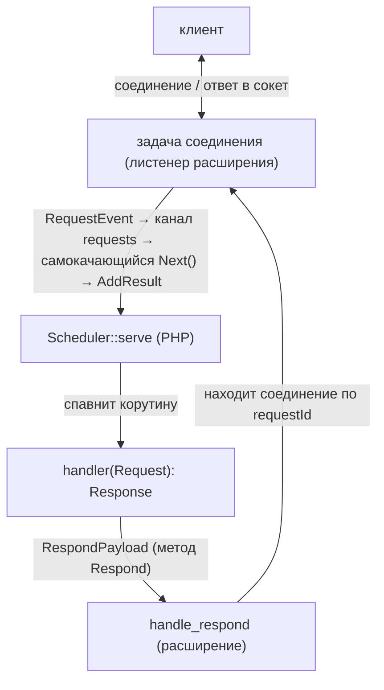

[English](adding-a-server.md) | Русский

# Как добавить новый сервер

Сервер — это особый вид фичи: долгоживущий сетевой листенер, который живёт в
расширении, принимает входящие соединения и стримит каждое событие в PHP, а тот
обрабатывает его в отдельной корутине и отправляет ответ обратно. Это инверсия
обычной фичи: не PHP зовёт расширение и ждёт результат, а расширение отдаёт PHP поток входящих
запросов.

Образец для копирования — `HttpServer` (`src/Features/HttpServer/`,
`ext/src/features/httpserver/`). `SocketServer` построен по тому же паттерну,
а общий для обоих код уже вынесен в трейт; `WsServer` — гибрид: листенер и
рукопожатие от `HttpServer`, push-модель `SocketServer` после апгрейда.

Сначала прочитайте [как добавить обычную фичу](adding-a-feature.ru.md) — сервер
переиспользует её механику (`Method`, payload'ы, реестр состояний и стриминга,
`next()`) и добавляет сверху сетевой слой и цикл обслуживания. См. также доки
[HTTP-сервера](http-server.ru.md) и [мастера воркеров](worker-master.ru.md).

## Модель: два `Method` на сервер

Сервер — это пара методов, которые обслуживает одна фича (по совпадению с
`Method`):

- `<Server>Serve` — поднять листенер и стримить принятые запросы в PHP
  (самокачающийся поток: задача рантайма на стороне расширения публикует каждый запрос очередным
  результатом стрима, без `next()`-перехода на запрос);
- `<Server>Respond` — доставить одну запись ответа (целиком либо head/chunk/end
  стрима) из PHP-обработчика обратно в ждущее соединение.

Образец: `MethodHttpServe` (`hs`) + `MethodHttpRespond` (`hr`), оба →
фичу httpserver. Оба значения зеркалятся в PHP `MethodEnum` и Rust
`ext/src/types/method.rs` и регистрируются в `ext/src/features/mod.rs` одной веткой
на оба:

```rust
Method::HttpServe | Method::HttpRespond => Ok(httpserver::get()),
```


```mermaid
flowchart TB
    client["клиент"]
    serve["задача соединения (листенер расширения)"]
    sched["Scheduler::serve (PHP)"]
    handler["handler(Request): Response"]
    respond["handle_respond (расширение)"]

    client <-->|"соединение / ответ в сокет"| serve
    serve -->|"RequestEvent → канал requests → самокачающийся Next() → AddResult"| sched
    sched -->|"спавнит корутину"| handler
    handler -->|"RespondPayload (метод Respond)"| respond
    respond -->|"находит соединение по requestId"| serve
```

## Обязательные требования

Помимо двух общих требований к фиче (отмена по контексту и предельное время
выполнения), у сервера есть свои:

1. Токен отмены состояния сервера = время жизни сервера. Токен задачи `Serve`
   отдаётся листенеру и каждой задаче соединения, поэтому отмена флоу или
   `stopFlow` сносит листенер и все ждущие соединения. **Ни один запрос не должен
   пережить остановку сервера.**
2. Лимит на запрос, а не только на сервер. Каждый обработчик ограничен
   `handlerTimeoutMs` на стороне расширения (таймер в отдельной задаче рантайма, срабатывает
   независимо от PHP): до первой записи клиент получает `504`, после начала
   стрима ответ обрывается.
3. Graceful shutdown и осиротевшие воркеры. Сервер обязан уметь перестать
   принимать новые соединения, не трогая активные (для бесшовной передачи
   соседям по `SO_REUSEPORT`), и самозавершаться, если умер его мастер
   (`--masterPid`).

## Payload'ы

Пишутся как у обычной фичи (зеркально, теги `msgpack` = короткие ключи,
перекрёстные ссылки). Серверу нужны минимум три:

1. `ServePayload` — адрес листенера плюс тюнинг (таймауты в мс, лимиты в байтах,
   `reusePort`).
2. `RespondPayload` — одна запись ответа. Поле `op` выбирает вид записи; у
   `HttpServer` это `OP_FULL`(0) / `OP_HEAD`(1) / `OP_CHUNK`(2) / `OP_END`(3),
   которые строят фабрики `RespondPayload::full()/head()/chunk()/end()`. Заголовки
   нормализуются к `array<string, list<string>>`.
3. `RequestEvent` — то, что расширение стримит в PHP на каждый запрос (структура
   только на его стороне; PHP декодирует её прямо в объект запроса обработчика). Она несёт
   `requestId`, метод/путь/заголовки, inline-первый чанк тела и ключ потока для
   остатка тела (`BodyKey`).

> `requestId` — сквозной идентификатор: расширение генерирует его при приёме
> (`flowKey:r:<n>`), кладёт в `RequestEvent`, PHP возвращает его в каждом
> `RespondPayload`, и расширение по нему находит ждущее соединение. Он должен быть
> уникален внутри флоу.

## Сторона PHP

Форма запроса и ответа — на ваше усмотрение. HTTP-сервер отдаёт наружу PSR-7
(запрос собирается из `RequestEvent` в `HttpServer::decodeRequest()` через
инъектированную PSR-17 фабрику; тело — `Dto/RequestBodyStream` поверх
`Dto/RequestBody`), а сокет- и WS-серверы используют свои `readonly` DTO —
`Dto/Connection` с `read()`/`write()`/`close()` для push-модели. В обоих случаях
ответ кодируется в `RespondPayload`. Записи стримингового ответа
(head/chunk/end) подтверждаются обратно — это и не даёт обработчику обогнать
клиента; цельный ответ HTTP-сервера — fire-and-forget: `RespondPayload::full()`
выставляет флаг «без результата» (`nr`) и уходит через
`FeatureExecutor::execNoResult()`, так что корутина завершается, не дожидаясь
записи (сокет- и WS-серверы подтверждают каждую команду).

Разбор argv, обработчики сигналов, включение автоматической преемпции, проверка на
сироту и лог жизненного цикла уже вынесены в «лёгкий»
`SConcur\Features\Server\ServerRuntimeSupportTrait`:

- `parseArgs(array $argv): array` — собрать скалярные (`int`/`bool`/`float`/
  `string`) параметры конструктора рефлексией, привести каждую строку
  `--name=value` к типу и бросить `InvalidServerArgumentException` на неизвестном
  аргументе;
- `installSignalHandlers(bool &$stopRequested): Closure` — поставить
  SIGTERM/SIGINT (через `pcntl_async_signals`; без ext-pcntl это no-op) и вернуть
  восстановитель, который вызывается в `finally`;
- `isOrphaned(int $masterPid): bool` — `posix_getppid() !== $masterPid`,
  устойчиво к переиспользованию PID, потому что после смерти мастера ядро меняет
  родителя;
- `applyTelemetryEnvironment(array $overrides): array` — прочитать env телеметрии;
- `withPreemption(int $quantumMs, Closure $callback): mixed` — выполнить колбэк с
  включённой автоматической преемпцией и выключить её после. Сервер вместо этого
  передаёт свой квант в `Scheduler::serve()`, а это нужно только тому, у кого нет
  своего цикла обслуживания;
- `logServerEvent(string $message): void` — одна строка с меткой времени о
  жизненном цикле самого воркера, в stdout.

Новому серверу достаточно подключить трейт, а чтобы запускаться под
`bin/sconcur-server`, он добавляет статический `fromArgs()` по образцу
`HttpServer::fromArgs()`: вызвать `self::parseArgs($argv)`, добавить `onError`,
если он есть, и распаковать в конструктор.

Публичный `serve(Closure $handler)` затем генерирует `flowKey`, ставит обработчики
сигналов (восстанавливая их в `finally`), поднимает листенер через
`Extension::get()->push($flowKey, new ServePayload(...))` — это стриминговая
задача, батчи которой и есть входящие запросы — и передаёт управление общему
`Scheduler::get()->serve(...)`, передав:

- `serverFlowKey`/`serverTaskKey` — ключи потока листенера;
- `maxRequests` — штатно завершиться после N запросов;
- `onRequest(string $payload)` — spawn-на-запрос: декодировать, вызвать
  обработчик, отправить ответ (в образце это `HttpServer::handle()`);
- `shouldStop(): bool` — пришёл сигнал или воркер осиротел;
- `onDrainStart()` — вызывается один раз в начале остановки: заранее перестать
  принимать через `Extension::get()->httpStopAccepting($flowKey)`, чтобы новые
  соединения ушли соседям по `SO_REUSEPORT`;
- `onShutdownStep(string $step)` — каждый шаг штатной остановки словами, чтобы воркер
  их записал;
- `preemptionQuantumMs` — включить автоматическую преемпцию на всё время работы цикла,
  чтобы CPU-bound обработчик не заморил остальных (`0` — выключено), см.
  [переключение корутин](coroutine-switching.ru.md);
- `handlerTimeoutMs` — сколько корутина одного обработчика может работать, прежде чем её
  размотают на месте (`0` — выключено), см. [таймаут корутины](coroutine-timeout.ru.md).
  Именно преемпция даёт этому сроку достать обработчика, который ничего не ждёт.

`Scheduler::serve` сам мультиплексирует входящие запросы и асинхронную работу их
обработчиков в одном цикле ожидания (`waitAnyTimeoutBatch`), а при остановке
штатно гасит флоу (`stopFlow`). Эта механика общая и переписывать её не нужно.

## Сторона расширения

`ext/src/features/<server>/mod.rs` реализует трейт `Feature`, а его `handle`
диспетчеризует по `Method` сообщения в `handle_serve`/`handle_respond`. Сама фича —
unit-структура за `OnceLock`; её состояние живёт в `Registries`, которым владеет
ядро (`ext/src/core.rs`), поэтому форк выбрасывает его вместе со всем остальным.
Две карты: `pending_requests` (`requestId` → канал, из которого задача соединения
читает команды записи, — глобальная, потому что respond приходит на другом потоке,
не на том, где пришёл запрос) и `server_states` (`flowKey` → `ServerState`, чтобы
остановка приёма нашла листенер).

`handle_serve` парсит `ServePayload`, открывает листенер (`listen.rs`, который
ставит `SO_REUSEPORT`, когда просят), регистрирует `ServerState` и запускает две
вещи: задачу accept-цикла и самокачающийся стрим, публикующий каждый принятый
запрос как очередной результат serve-задачи, пока поток не отменят. Accept-стрим
обходит реестр `states` — тот обслуживает только вторичные стримы (тело запроса,
входящие потоки сообщений). Обратное давление многослойное: публикация результата
ждёт общий буфер результатов, канал запросов буферизует приёмы, а дальше ждёт уже
сама задача соединения.

Accept-цикл (`server.rs`) берёт разрешение `maxConcurrency` до чтения тела — чтобы
запрос, ждущий слот, не держал буфер тела, — регистрирует запрос в
`pending_requests`, отправляет `RequestEvent` в канал запросов и ждёт от PHP команд
записи, применяя их к сокету. По таймауту обработчика или при обрыве он снимает
запись, так что поздний ответ не висит вечно, и пишет строку access-лога на стороне
расширения. Отмена токена потока разблокирует все живые задачи соединений разом —
это и есть полный teardown.

`handle_respond` сперва достаёт `requestId` (отдельной мини-структурой, чтобы
маршрутизация работала, даже если остальной payload испорчен), находит ожидающий
запрос и передаёт команду записи, дожидаясь её применения: корутина-обработчик
продолжается только после того, как байты ушли в сокет, или запроса уже нет. Payload
с флагом «без результата» (`nr`, полная запись) передаётся fire-and-forget: результат
не публикуется, и передача не ждёт токен потока, потому что корутины может уже не
быть.

Если тело больше inline-первого чанка, расширение кладёт остаток в отдельное
стриминговое состояние (регистрируется под ключом `<requestId>:body`) и отдаёт этот
ключ в поле `bk` события запроса; PHP читает куски тем же общим механизмом `next()`
с фиксированной гранулярностью 64 KiB. Буфер inline-первого чанка сайзится по
объявленному `Content-Length`, когда тот меньше (горячая точка аллокаций на
запрос); chunked и неизвестная длина используют полные 64 KiB.

## C-экспорт `StopAccepting`

Общие экспорты (`push`, `next`, `stopFlow`, `waitAnyBatch`, `waitAnyTimeoutBatch`)
переиспользуются как есть. Дополнительно серверу нужен собственный экспорт для
раннего прекращения приёма — у каждого сервера своя карта `serverStates`, поэтому
`httpStopAccepting` чужого сервера не переиспользовать (ср. `socketStopAccepting`).
Добавьте `<server>StopAccepting` по той же цепочке:

- `ext/src/lib.rs` — функция `#[unsafe(no_mangle)] pub extern "C"`, зовущая фичу;
- `ext/include/sconcur_core.h` — её объявление, с которым линкуется клей;
- `ext/sconcur.c` — `PHP_FUNCTION`, `arginfo`, регистрация `ZEND_NS_FE` и строка
  заголовка;
- `ext/sconcur.stub.php` — объявление функции;
- `src/Connection/Extension.php` — `use function` плюс PHP-обёртка.

`StopAccepting(flowKey)` находит `serverState` и отменяет его токен
`stopAccepting`: цикл accept завершается, и больше ничего — уже принятые запросы
не трогаются. В пуле `SO_REUSEPORT` ядро
сразу отдаёт новые соединения соседям, пока этот процесс дорабатывает свои.

Это изменение протокола, поэтому действует правило версии расширения (бампить не
чаще одного раза на ветку, см. [.ai/README.md](../.ai/README.md)).

> Минимальный сервер может обойтись без `StopAccepting` и гасить всё через
> `stopFlow`, но тогда он теряет бесшовную передачу трафика соседям по
> `SO_REUSEPORT` — продакшен-серверу под мастером это нужно.

## Интеграция с мастером воркеров

Сервер бесплатно становится «server-agnostic» воркером для `bin/sconcur-server`,
если соблюдает контракт: воркер-скрипт собирает сервер из argv
(`MyServer::fromArgs($_SERVER['argv'])`) и обслуживает; мастер разворачивает блок
`server` JSON-конфига в argv `--key=value` и передаёт свой pid через
`--masterPid`; `reusePort: true` включает `SO_REUSEPORT`, поэтому мастер поднимает
пул процессов, а `reload` делает rolling-рестарт без даунтайма. Детали — в
[мастере воркеров](worker-master.ru.md).

## Статистика

Чтобы сервер собирал и отдавал статистику из коробки, подключите нейтральный модуль
`ext/src/stats/` — сэмплер процессных метрик плюс best-effort `Pusher`,
отправляющий снапшоты коллектору мастера; агрегация и панель — работа мастера
(`src/Telemetry`), см. [статистику сервера](admin-stats.ru.md).

Сторона PHP: `ServePayload` += `telemetrySocket`/`serverName`/`telemetryIntervalMs`
(ключи `ts`/`sn`/`ti`), конструктор += те же три параметра, а `fromArgs()` вызывает
`self::applyTelemetryEnvironment($overrides)`, который читает env, инжектируемый
мастером при включённой телеметрии.

Сторона расширения: добавьте счётчик нагрузки, реализующий
`stats::WorkloadProvider` (`RequestStats` у HTTP, `ConnectionStats` у сокета и
WebSocket), и инкрементируйте его в обработчике соединения/запроса; прокиньте три
поля телеметрии через конфиг сервера; соберите пушер через
`Pusher::start(name, telemetry_socket, interval_ms, start_time, provider)` и
держите его в состоянии сервера. `Pusher::disabled()` покрывает сервер,
запущенный без коллектора, а его цикл останавливается при уничтожении пушера,
так что руками останавливать нечего.

## Тесты (обязательно)

Поднимайте реальный процесс сервера на loopback и бейте по нему `curl` —
инфраструктурный образец: `tests/impl/HttpServer/TestHttpServer.php` (запуск через
`proc_open`, свободный порт, чтение access-лога) плюс
`BaseHttpServerTestCase.php`. Покройте базовый запрос-ответ, стриминг,
`maxConcurrency`, `handlerTimeoutMs` (включая нативно-блокирующий обработчик),
graceful shutdown, `SO_REUSEPORT` (два сервера на одном порту), `maxRequests` и
самозавершение сироты. То, что PHP-сьюты ловят только статистически — гонку шириной
в микросекунды, — уходит в собственные юнит-тесты ядра (`#[cfg(test)] mod tests`
рядом с кодом, запуск `make ext-test`), а сквозной сценарий под мастером —
`tests/feature/Worker/WorkerMasterTest.php`.

## Чек-лист

PHP:

- [ ] `MethodEnum` — два значения (`<Server>Serve`, `<Server>Respond`).
- [ ] Payload'ы: `ServePayload`, `RespondPayload` (+ перекрёстные ссылки
      `Rust: payloads::<Type>`).
- [ ] Форма запроса и ответа: свои `readonly` DTO либо PSR-7 наружу.
- [ ] `use ServerRuntimeSupportTrait;` —
      `parseArgs`/`installSignalHandlers`/`isOrphaned`/`logServerEvent`.
- [ ] `fromArgs()` через `self::parseArgs($argv)`, принимает `--masterPid`.
- [ ] `serve()`: поднять листенер через `push(ServePayload)` плюс
      `Scheduler::serve(...)` с `onRequest`/`shouldStop`/`onDrainStart`/
      `onShutdownStep` и с `preemptionQuantumMs`/`handlerTimeoutMs`, которые принял
      конструктор.
- [ ] Статистика: `ServePayload` += `ts`/`sn`/`ti`, конструктор += 3 параметра,
      `self::applyTelemetryEnvironment()` в `fromArgs()`.
- [ ] Тесты по аналогу `BaseHttpServerTestCase` (реальный процесс + `curl`).

Rust:

- [ ] Те же две константы в `ext/src/types/method.rs`.
- [ ] Структуры payload'ов в `payloads.rs` плюс `RequestEvent`; зеркальны PHP 1:1.
- [ ] Фича: `handle` разбирает метод → `handle_serve` (bind → состояние сервера →
  самокачающаяся задача-поток) и `handle_respond` (передача по `requestId` с
  ожиданием применения записи; `nr` — fire-and-forget).
- [ ] Реестры состояний серверов и ждущих запросов; `stop_accepting(flow_key)`;
      `SO_REUSEPORT` в листенере.
- [ ] Токен отмены флоу учитывается; `handlerTimeout`; access-лог на стороне
      расширения.
- [ ] Статистика: счётчик нагрузки, `stats::Pusher`, запускаемый вместе с
      состоянием сервера и умирающий вместе с ним.
- [ ] Регистрация в `ext/src/features/mod.rs` (одна ветка на оба метода).

Граница / протокол:

- [ ] `<server>StopAccepting` по цепочке `lib.rs` → `sconcur.c` →
      `sconcur.stub.php` → `Extension.php`; учесть версию расширения (бамп раз на
      ветку).

Проверка:
`make ext-build && make ext-test && make php-stan && make cs-fixer-check && make test`.
