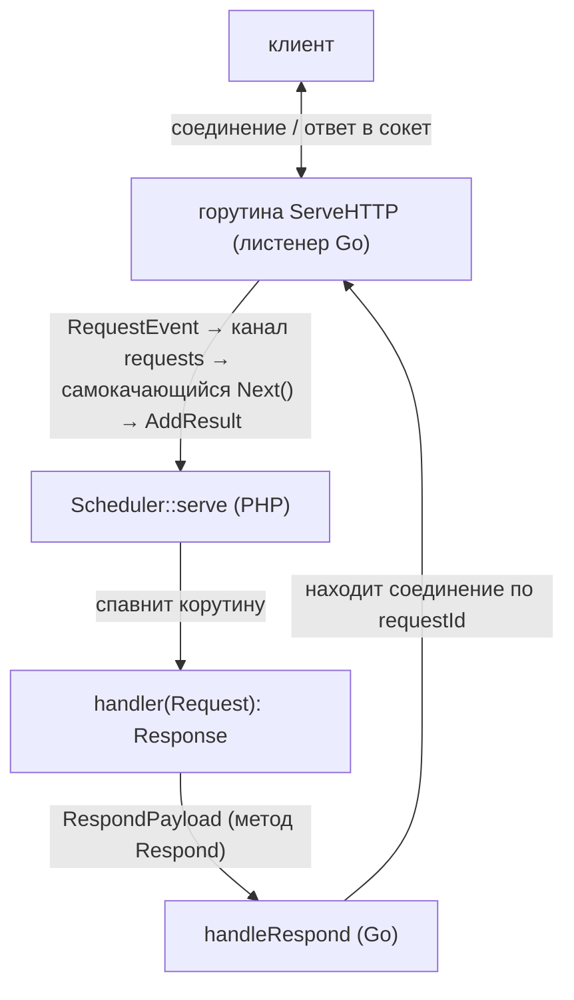

[English](adding-a-server.md) | Русский

# Как добавить новый сервер

Сервер — это особый вид фичи: долгоживущий сетевой листенер, который живёт в
Go-расширении, принимает входящие соединения и стримит каждое событие в PHP, а тот
обрабатывает его в отдельной корутине и отправляет ответ обратно. Это инверсия
обычной фичи: не PHP зовёт Go и ждёт результат, а Go отдаёт PHP поток входящих
запросов.

Образец для копирования — `HttpServer` (`src/Features/HttpServer/`,
`ext/internal/features/httpserver/`). `SocketServer` построен по тому же паттерну,
а общий для обоих код уже вынесен в трейт; `WsServer` — гибрид: листенер и
рукопожатие от `HttpServer`, push-модель `SocketServer` после апгрейда.

Сначала прочитайте [как добавить обычную фичу](adding-a-feature.ru.md) — сервер
переиспользует её механику (`Method`, payload'ы, реестр состояний и стриминга,
`next()`) и добавляет сверху сетевой слой и цикл обслуживания. См. также доки
[HTTP-сервера](http-server.ru.md) и [мастера воркеров](worker-master.ru.md).

## Модель: два `Method` на сервер

Сервер — это пара методов, которые обслуживает одна Go-фича (через `switch` по
`Method`):

- `<Server>Serve` — поднять листенер и стримить принятые запросы в PHP
  (самокачающийся поток: горутина на Go-стороне публикует каждый запрос очередным
  результатом стрима, без `next()`-перехода на запрос);
- `<Server>Respond` — доставить одну запись ответа (целиком либо head/chunk/end
  стрима) из PHP-обработчика обратно в ждущее соединение.

Образец: `MethodHttpServe` (`hs`) + `MethodHttpRespond` (`hr`), оба →
`httpserver_feature`. Оба значения зеркалятся в PHP `MethodEnum` и Go
`types/method.go` и регистрируются в `ext/internal/features/factory.go` одним case
на оба:

```go
case types.MethodHttpServe, types.MethodHttpRespond:
    return httpserver_feature.Get(), nil
```


```mermaid
flowchart TB
    client["клиент"]
    serve["горутина ServeHTTP (листенер Go)"]
    sched["Scheduler::serve (PHP)"]
    handler["handler(Request): Response"]
    respond["handleRespond (Go)"]

    client <-->|"соединение / ответ в сокет"| serve
    serve -->|"RequestEvent → канал requests → самокачающийся Next() → AddResult"| sched
    sched -->|"спавнит корутину"| handler
    handler -->|"RespondPayload (метод Respond)"| respond
    respond -->|"находит соединение по requestId"| serve
```

## Обязательные требования

Помимо двух общих требований к фиче (отмена по контексту и предельное время
выполнения), у сервера есть свои:

1. Контекст состояния сервера = время жизни сервера. Контекст задачи `Serve`
   прокидывается в `http.Server.BaseContext`, поэтому отмена флоу или `stopFlow`
   сносит листенер и все ждущие соединения. **Ни один запрос не должен пережить
   остановку сервера.**
2. Лимит на запрос, а не только на сервер. Каждый обработчик ограничен
   `handlerTimeoutMs` на Go-стороне (таймер в отдельной горутине, срабатывает
   независимо от PHP): до первой записи клиент получает `504`, после начала
   стрима ответ обрывается.
3. Graceful shutdown и осиротевшие воркеры. Сервер обязан уметь перестать
   принимать новые соединения, не трогая активные (для бесшовной передачи
   соседям по `SO_REUSEPORT`), и самозавершаться, если умер его мастер
   (`--masterPid`).

## Payload'ы

Пишутся как у обычной фичи (зеркально, теги `msgpack` = короткие ключи,
перекрёстные ссылки). Серверу нужны минимум три:

1. `ServePayload` — адрес листенера плюс тюнинг (таймауты в мс, лимиты в байтах,
   `reusePort`).
2. `RespondPayload` — одна запись ответа. Поле `op` выбирает вид записи; у
   `HttpServer` это `OP_FULL`(0) / `OP_HEAD`(1) / `OP_CHUNK`(2) / `OP_END`(3),
   которые строят фабрики `RespondPayload::full()/head()/chunk()/end()`. Заголовки
   нормализуются к `array<string, list<string>>`.
3. `RequestEvent` — то, что Go стримит в PHP на каждый запрос (структура только на
   Go; PHP декодирует её прямо в объект запроса обработчика). Она несёт
   `requestId`, метод/путь/заголовки, inline-первый чанк тела и ключ потока для
   остатка тела (`BodyKey`).

> `requestId` — сквозной идентификатор: Go генерирует его при приёме
> (`flowKey:r:<n>`), кладёт в `RequestEvent`, PHP возвращает его в каждом
> `RespondPayload`, и Go по нему находит ждущее соединение. Он должен быть
> уникален внутри флоу.

## Сторона PHP

Форма запроса и ответа — на ваше усмотрение. HTTP-сервер отдаёт наружу PSR-7
(запрос собирается из `RequestEvent` в `HttpServer::decodeRequest()` через
инъектированную PSR-17 фабрику; тело — `Dto/RequestBodyStream` поверх
`Dto/RequestBody`), а сокет- и WS-серверы используют свои `readonly` DTO —
`Dto/Connection` с `read()`/`write()`/`close()` для push-модели. В обоих случаях
ответ кодируется в `RespondPayload`. Записи стримингового ответа
(head/chunk/end) подтверждаются обратно — это и не даёт обработчику обогнать
клиента; цельный ответ HTTP-сервера — fire-and-forget: `RespondPayload::full()`
выставляет флаг «без результата» (`nr`) и уходит через
`FeatureExecutor::execNoResult()`, так что корутина завершается, не дожидаясь
записи (сокет- и WS-серверы подтверждают каждую команду).

Разбор argv, обработчики сигналов, включение автоматической преемпции, проверка на
сироту и лог жизненного цикла уже вынесены в «лёгкий»
`SConcur\Features\Server\ServerRuntimeSupportTrait`:

- `parseArgs(array $argv): array` — собрать скалярные (`int`/`bool`/`float`/
  `string`) параметры конструктора рефлексией, привести каждую строку
  `--name=value` к типу и бросить `InvalidServerArgumentException` на неизвестном
  аргументе;
- `installSignalHandlers(bool &$stopRequested): Closure` — поставить
  SIGTERM/SIGINT (через `pcntl_async_signals`; без ext-pcntl это no-op) и вернуть
  восстановитель, который вызывается в `finally`;
- `isOrphaned(int $masterPid): bool` — `posix_getppid() !== $masterPid`,
  устойчиво к переиспользованию PID, потому что после смерти мастера ядро меняет
  родителя;
- `applyTelemetryEnvironment(array $overrides): array` — прочитать env телеметрии;
- `withPreemption(int $quantumMs, Closure $callback): mixed` — выполнить колбэк с
  включённой автоматической преемпцией и выключить её после. Сервер вместо этого
  передаёт свой квант в `Scheduler::serve()`, а это нужно только тому, у кого нет
  своего цикла обслуживания;
- `logServerEvent(string $message): void` — одна строка с меткой времени о
  жизненном цикле самого воркера, в stdout.

Новому серверу достаточно подключить трейт, а чтобы запускаться под
`bin/sconcur-server`, он добавляет статический `fromArgs()` по образцу
`HttpServer::fromArgs()`: вызвать `self::parseArgs($argv)`, добавить `onError`,
если он есть, и распаковать в конструктор.

Публичный `serve(Closure $handler)` затем генерирует `flowKey`, ставит обработчики
сигналов (восстанавливая их в `finally`), поднимает листенер через
`Extension::get()->push($flowKey, new ServePayload(...))` — это стриминговая
задача, батчи которой и есть входящие запросы — и передаёт управление общему
`Scheduler::get()->serve(...)`, передав:

- `serverFlowKey`/`serverTaskKey` — ключи потока листенера;
- `maxRequests` — штатно завершиться после N запросов;
- `onRequest(string $payload)` — spawn-на-запрос: декодировать, вызвать
  обработчик, отправить ответ (в образце это `HttpServer::handle()`);
- `shouldStop(): bool` — пришёл сигнал или воркер осиротел;
- `onDrainStart()` — вызывается один раз в начале остановки: заранее перестать
  принимать через `Extension::get()->httpStopAccepting($flowKey)`, чтобы новые
  соединения ушли соседям по `SO_REUSEPORT`;
- `onShutdownStep(string $step)` — каждый шаг штатной остановки словами, чтобы воркер
  их записал;
- `preemptionQuantumMs` — включить автоматическую преемпцию на всё время работы цикла,
  чтобы CPU-bound обработчик не заморил остальных (`0` — выключено), см.
  [переключение корутин](coroutine-switching.ru.md);
- `handlerTimeoutMs` — сколько корутина одного обработчика может работать, прежде чем её
  размотают на месте (`0` — выключено), см. [таймаут корутины](coroutine-timeout.ru.md).
  Именно преемпция даёт этому сроку достать обработчика, который ничего не ждёт.

`Scheduler::serve` сам мультиплексирует входящие запросы и асинхронную работу их
обработчиков в одном цикле ожидания (`waitAnyTimeoutBatch`), а при остановке
штатно гасит флоу (`stopFlow`). Эта механика общая и переписывать её не нужно.

## Сторона Go

`ext/internal/features/<server>/feature.go` реализует `contracts.FeatureContract`,
а `Handle` диспетчеризует по `Method` в `handleServe`/`handleRespond`. Фича —
синглтон с двумя глобальными картами: `pendingRequests`
(`requestId → *pendingRequest`, канал команд записи — глобальная, чтобы `Respond`,
приходящий по другому флоу, нашёл соединение) и `serverStates`
(`flowKey → *serverState`, чтобы `StopAccepting` нашёл листенер).

`handleServe` парсит `ServePayload`, открывает TCP-листенер (`listen.go`, который
при необходимости выставляет `SO_REUSEPORT`), строит `serverState` — он поднимает
стандартный `net/http.Server`, чьим `http.Handler` и является, с `BaseContext`,
привязанным к контексту задачи, — кладёт его в `serverStates` и запускает
самокачающуюся горутину: цикл `state.Next()` → `task.AddResult(...)` публикует
каждый принятый запрос очередным результатом стрима до первого результата без
продолжения (сервер остановлен). Accept-стрим обходит реестр `states` — реестр
обслуживает только вторичные стримы (тело запроса, входящие потоки сообщений).
Backpressure слоями: `AddResult` блокируется на общем буфере результатов, канал
`requests` буферизует приёмы, дальше блокируется сам `ServeHTTP`.

Внутри `serverState` (`server.go`) `ServeHTTP` захватывает семафор
`maxConcurrency` до чтения тела (чтобы ждущий слот запрос не держал буфер тела),
регистрирует `pendingRequest`, отправляет `RequestEvent` в буферизованный канал
`requests` и ждёт команды записи от PHP, применяя их к сокету; по
`handlerTimeout` или обрыву он закрывает `abandoned`, чтобы запоздавший ответ не
висел вечно, и сам же пишет строку access-лога на Go-стороне. `Next()` отдаёт
следующий `RequestEvent` с флагом «будет продолжение» (по `ctx.Done()` —
финальный результат без флага, завершающий PHP-цикл). Листенер закрывает
`stopAccepting()` (остановка зовёт его через экспорт `StopAccepting`), а отмена
контекста флоу разблокирует все выполняющиеся запросы через `BaseContext`;
`Close()` — полный teardown: остановка `http.Server` плюс `pusher.Stop()` на
свежем контексте.

`handleRespond` декодирует `requestId` (отдельной мини-структурой, чтобы
маршрутизация работала даже при битом остальном payload'е), находит
`pendingRequest` и диспетчеризует команду записи, дожидаясь её применения —
корутина обработчика продолжается только когда байты ушли в сокет либо пришли
`abandoned`/отмена контекста. Payload с флагом «без результата» (`nr`, цельная
запись) диспетчеризуется fire-and-forget: результат не публикуется, а передача не
слушает контекст флоу — корутины может уже не быть.

Если тело больше inline-первого чанка, Go кладёт остаток в отдельное стриминговое
состояние (`bodyState`, регистрируется под ключом `<requestId>:body`) и отдаёт этот
ключ в `RequestEvent.BodyKey`; PHP читает куски тем же общим механизмом `next()` с
фиксированной гранулярностью 64 KiB. Буфер inline-первого чанка сайзится по
объявленному `Content-Length`, когда тот меньше (горячая точка аллокаций на
запрос); chunked и неизвестная длина используют полные 64 KiB.

## cgo-экспорт `StopAccepting`

Общие экспорты (`push`, `next`, `stopFlow`, `waitAnyBatch`, `waitAnyTimeoutBatch`)
переиспользуются как есть. Дополнительно серверу нужен собственный экспорт для
раннего прекращения приёма — у каждого сервера своя карта `serverStates`, поэтому
`httpStopAccepting` чужого сервера не переиспользовать (ср. `socketStopAccepting`).
Добавьте `<server>StopAccepting` по той же цепочке:

- `ext/main.go` — `//export <server>StopAccepting` →
  `<server>_feature.StopAccepting(...)`;
- `ext/sconcur.c` — `PHP_FUNCTION`, `arginfo`, регистрация `ZEND_NS_FE` и строка
  заголовка;
- `ext/sconcur.stub.php` — объявление функции;
- `src/Connection/Extension.php` — `use function` плюс PHP-обёртка.

`StopAccepting(flowKey)` находит `serverState` и вызывает его `stopAccepting()`,
который закрывает только листенер (`http.Server.Shutdown` в отдельной горутине
на фоновом контексте), не отменяя активные запросы. В пуле `SO_REUSEPORT` ядро
сразу отдаёт новые соединения соседям, пока этот процесс дорабатывает свои.

Это изменение протокола, поэтому действует правило версии расширения (бампить не
чаще одного раза на ветку, см. [.ai/README.md](../.ai/README.md)).

> Минимальный сервер может обойтись без `StopAccepting` и гасить всё через
> `stopFlow`, но тогда он теряет бесшовную передачу трафика соседям по
> `SO_REUSEPORT` — продакшен-серверу под мастером это нужно.

## Интеграция с мастером воркеров

Сервер бесплатно становится «server-agnostic» воркером для `bin/sconcur-server`,
если соблюдает контракт: воркер-скрипт собирает сервер из argv
(`MyServer::fromArgs($_SERVER['argv'])`) и обслуживает; мастер разворачивает блок
`server` JSON-конфига в argv `--key=value` и передаёт свой pid через
`--masterPid`; `reusePort: true` включает `SO_REUSEPORT`, поэтому мастер поднимает
пул процессов, а `reload` делает rolling-рестарт без даунтайма. Детали — в
[мастере воркеров](worker-master.ru.md).

## Статистика

Чтобы сервер собирал и отдавал статистику из коробки, подключите нейтральный пакет
`ext/internal/stats` — сэмплер процессных метрик плюс best-effort `Pusher`,
отправляющий снапшоты коллектору мастера; агрегация и панель — работа мастера
(`src/Telemetry`), см. [статистику сервера](admin-stats.ru.md).

Сторона PHP: `ServePayload` += `telemetrySocket`/`serverName`/`telemetryIntervalMs`
(ключи `ts`/`sn`/`ti`), конструктор += те же три параметра, а `fromArgs()` вызывает
`self::applyTelemetryEnvironment($overrides)`, который читает env, инжектируемый
мастером при включённой телеметрии.

Сторона Go: добавьте счётчик нагрузки, реализующий `stats.WorkloadProvider`
(`requestStats` у HTTP, `connectionStats` у сокета), и инкрементируйте его в
обработчике соединения/запроса; прокиньте три поля телеметрии через
`serverConfig`; в `newServerState` создайте
`pusher := stats.NewPusher(name, telemetrySocket, intervalMs, startTime, provider)`
и вызовите `pusher.Start()`; в `Close()` вызовите `pusher.Stop()` (безопасно при
выключенной конфигурации).

## Тесты (обязательно)

Поднимайте реальный процесс сервера на loopback и бейте по нему `curl` —
инфраструктурный образец: `tests/impl/HttpServer/TestHttpServer.php` (запуск через
`proc_open`, свободный порт, чтение access-лога) плюс
`BaseHttpServerTestCase.php`. Покройте базовый запрос-ответ, стриминг,
`maxConcurrency`, `handlerTimeoutMs` (включая нативно-блокирующий обработчик),
graceful shutdown, `SO_REUSEPORT` (два сервера на одном порту), `maxRequests` и
самозавершение сироты. Go-логика листенера и состояния уходит в Go-тесты
(`ext/internal/features/httpserver/server_test.go`), а сквозной сценарий под
мастером — `tests/feature/Worker/WorkerMasterTest.php`.

## Чек-лист

PHP:

- [ ] `MethodEnum` — два значения (`<Server>Serve`, `<Server>Respond`).
- [ ] Payload'ы: `ServePayload`, `RespondPayload` (+ перекрёстные ссылки
      `Go: payloads.<Type>`).
- [ ] Форма запроса и ответа: свои `readonly` DTO либо PSR-7 наружу.
- [ ] `use ServerRuntimeSupportTrait;` —
      `parseArgs`/`installSignalHandlers`/`isOrphaned`/`logServerEvent`.
- [ ] `fromArgs()` через `self::parseArgs($argv)`, принимает `--masterPid`.
- [ ] `serve()`: поднять листенер через `push(ServePayload)` плюс
      `Scheduler::serve(...)` с `onRequest`/`shouldStop`/`onDrainStart`/
      `onShutdownStep` и с `preemptionQuantumMs`/`handlerTimeoutMs`, которые принял
      конструктор.
- [ ] Статистика: `ServePayload` += `ts`/`sn`/`ti`, конструктор += 3 параметра,
      `self::applyTelemetryEnvironment()` в `fromArgs()`.
- [ ] Тесты по аналогу `BaseHttpServerTestCase` (реальный процесс + `curl`).

Go:

- [ ] Те же две константы в `types/method.go`.
- [ ] Структуры payload'ов в `payloads.go` плюс `RequestEvent`; зеркальны PHP 1:1.
- [ ] Фича: switch в `Handle` → `handleServe` (listen → `serverState` →
  самокачающаяся горутина `Next()`/`AddResult`) и `handleRespond` (рандеву по
  `requestId` с ожиданием применения записи; `nr` — fire-and-forget).
- [ ] Карты `serverStates`/`pendingRequests`; `StopAccepting(flowKey)`;
      `SO_REUSEPORT` в `listen`.
- [ ] `BaseContext` = контекст задачи; `handlerTimeout`; access-лог на Go-стороне.
- [ ] Статистика: счётчик `stats.WorkloadProvider`, `stats.NewPusher` + `Start` в
      `newServerState`, `pusher.Stop()` в `Close`.
- [ ] Регистрация в `features/factory.go` (один case на оба метода).

cgo / протокол:

- [ ] `<server>StopAccepting` по цепочке `main.go` → `sconcur.c` →
      `sconcur.stub.php` → `Extension.php`; учесть версию расширения (бамп раз на
      ветку).

Проверка:
`make ext-build && make ext-test && make php-stan && make cs-fixer-check && make test`.
