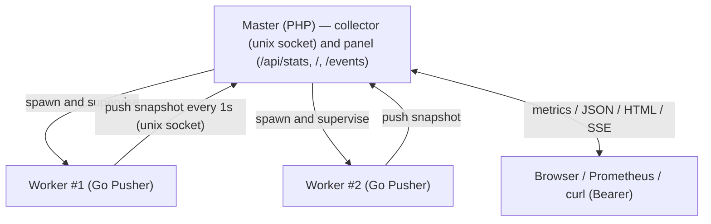

English | [Русский](admin-stats.ru.md)

# Server statistics

Aggregated statistics across the whole server pool (HTTP or socket) brought up via
[`SO_REUSEPORT`](http-server.md) under the [master](worker-master.md). Every worker
pushes its snapshot over a unix socket to the master once a second; the master keeps
the pool state in memory and serves it on its own port — through the `GET /api/stats`
endpoint, a live HTML panel, and an SSE stream. Sampling and push happen on the Go
side of the worker's extension; the collector and panel are pure PHP in the master
(the extension is not loaded there).

## Contents

- [How it works](#how-it-works)
- [Quick start](#quick-start)
- [Endpoint and panel](#endpoint-and-panel)
- [Configuration](#configuration)
- [Metrics](#metrics)
- [Response format](#response-format)
- [Push-protocol contract](#push-protocol-contract)
- [Limits](#limits)

---

## How it works

With `SO_REUSEPORT` each worker is a separate process with its own Go runtime and its
own counters, and the kernel balances connections. A request to the shared port lands
in exactly one random worker — which knows only its own slice. So statistics cannot be
collected by polling a single socket.

The solution: at startup each worker connects to the collector's unix socket (brought
up by the master in `runtimeDir`) and once a second sends its snapshot there as a
length-prefix frame. The master is the sole consumer: it holds the last snapshot of
each worker in memory (keyed by connection) and serves the pool sum on its own separate
port. Push is best-effort: no collector (master not up / restarting) — the worker drops
the frame and keeps serving traffic. Closing the connection = the worker is gone (the
master immediately removes it from the live pool — no files, no liveness probes).

A separate port keeps admin traffic away from application traffic (it can be
firewalled) and gives a statistics endpoint to a socket server that has no HTTP routes.
The master's supervision loop is not blocked on the panel's I/O: it multiplexes the
telemetry sockets through `stream_select` with a timeout equal to its own tick, and
under a flood or a stuck client it degrades the panel, not supervision.



## Quick start

Statistics turn on when both master settings are set: `panelPort` (the panel port) and
`adminToken` (the token). The [master](worker-master.md) brings up the collector and
panel itself and injects the socket path into the workers — nothing to configure on the
worker.

```json
{
  "workerScript": "/app/worker.php",
  "workerCount": 8,
  "runtimeDir": "/run/sconcur",
  "name": "sconcur-http-server",
  "panelPort": 8081,
  "adminToken": "23c30b40...9894c3ec",
  "server": {
    "address": "0.0.0.0:8080",
    "reusePort": true
  }
}
```

The worker script stays the same — `HttpServer::fromArgs($_SERVER['argv'])` (or
`SocketServer::fromArgs(...)`) picks up the env injected by the master on its own. A
request to the panel port:

```sh
curl -H "Authorization: Bearer 23c30b40...9894c3ec" \
  http://localhost:8081/api/stats
```

Same for the [socket server](socket-server.md) — it serves stats through the same
`GET /api/stats`, only with a `connections` section instead of `requests`.

## Endpoint and panel

Everything is on the master's `panelPort`.

- `GET /api/stats` — the pool aggregate. Format follows the `Accept` header:
  `application/json` → JSON, `text/html` → HTML, anything else (no header, `*/*`,
  `text/plain`) → Prometheus metrics.
- `GET /` — the live HTML panel (meta-refresh every 2s; the link carries the token).
- `GET /events` — an SSE stream: one JSON aggregate per tick (every 1s).
- Authorization — `Authorization: Bearer <token>`, compared in constant time. For the
  browser the token is also accepted as `?token=<token>` (to open the panel and SSE by
  URL).
- A wrong or missing token — `404` (not `401`, to avoid revealing the endpoint). Any
  path other than the listed ones — also `404`. A non-`GET` method with a valid token —
  `405`.
- A bind error on the panel port or the unix socket is logged and does not take the
  master down — telemetry simply turns off.

## Configuration

Under the master two keys in the JSON config are enough; the rest the master derives
from `runtimeDir`/`name`.

| Master config key | Purpose | Default |
|---|---|---|
| `panelPort` | panel/endpoint port; needed together with the token | `0` (off) |
| `adminToken` | endpoint token; needed together with the port | empty (off) |

The worker reads its part from env (the master injects it; by hand — for running
without a master):

| Worker variable | Purpose | Default |
|---|---|---|
| `SCONCUR_TELEMETRY_SOCKET` | collector unix socket; empty = push off | empty |
| `SCONCUR_SERVER_NAME` | pool name (snapshot label) | `sconcur-server` |
| `SCONCUR_TELEMETRY_INTERVAL_MS` | snapshot sample/push cadence | `1000` |

Under the master the socket is `<runtimeDir>/<name>.telemetry.sock`; it is injected
into the workers only when telemetry is enabled (otherwise the workers do not poke a
dead socket). The same values can be set programmatically: on the worker — the
`HttpServer`/`SocketServer` constructor (`telemetrySocket`, `serverName`,
`telemetryIntervalMs`); on the master — the `WorkerMaster` constructor (`panelPort`,
`adminToken`).

If there are several pools on one machine, they must have different `panelPort`, `name`
and `runtimeDir` (different sockets and ports).

## Metrics

The source of the worker numbers is the Go side of the worker (`/proc`, `runtime`, its
own counters). The process metrics are shared by both servers; the workload section is
per-server: HTTP has `requests`, socket has `connections`. The `master` section
(metrics of the master process itself) is sampled by the PHP side of the master from
its own `/proc`.

| Field | What it is | Source |
|---|---|---|
| `memory.rssBytes` | RSS of the whole process (with the extension) | `/proc/self/status` `VmRSS` |
| `memory.goRuntimeBytes` | Go-runtime memory | `runtime/metrics` (`/memory/classes/total:bytes`) |
| `memory.nonExtensionBytes` | remainder without the extension (PHP + interpreter) | `rssBytes − goRuntimeBytes` |
| `cpuPercent` | CPU usage by the process over the interval | diff of `/proc/self/stat` |
| `goroutines` | goroutine count of the process | `runtime.NumGoroutine()` |
| `startedAt` | date-time the worker's serve loop started (UTC) | serve-loop start |
| `uptimeSeconds` | serve-loop lifetime | serve-loop start |
| `requests.completed` | requests served (HTTP) | counter |
| `requests.avgMs` | average request duration | sum / count |
| `requests.inFlight` | in progress right now | in-flight registry |
| `requests.inFlight1to5s` / `inFlight5to15s` / `inFlightOver15s` | of those, by age [1s,5s) / [5s,15s) / ≥15s | in-flight age |
| `connections.active` | connections open right now (socket) | counter |
| `connections.totalAccepted` | connections accepted over all time (socket) | counter |
| `master.pid` | pid of the master process | master |
| `master.startedAt` | date-time the master started (UTC) | master `run()` start |
| `master.uptimeSeconds` | master lifetime | master start |
| `master.memory.rssBytes` | RSS of the master process | `/proc/self/status` `VmRSS` |
| `master.cpuPercent` | CPU usage by the master over the interval (~1s) | diff of `/proc/self/stat` |

All date-time fields (`generatedAt`, `startedAt`, …) are in UTC (ISO-8601 with a
`+00:00` offset).

The duration buckets are exclusive: a request in flight for 7s lands only in
`inFlight5to15s`. In `totals`, `requests.avgMs` is weighted by workers' `completed`,
while `cpuPercent` is the sum of per-process values (can exceed 100%). The snapshot age
(`snapshotAgeMs`) the master computes by its own clock — from the moment the frame is
received, not by the worker's stamp, so it does not depend on clock skew. If there is
no fresh snapshot for a live connection longer than the threshold (15s), the worker is
flagged `hung`. This catches a wedged worker runtime (the pusher goroutine itself has
stalled), not a stuck request handler: the pusher is independent and keeps sending
snapshots as long as the Go runtime is alive.

## Response format

The same data in three representations; the choice is by `Accept`.

The HTTP pool's JSON response (with a `requests` section):

```json
{
  "generatedAt": "2026-06-24T12:00:00+00:00",
  "name": "sconcur-http-server",
  "workersTotal": 8,
  "workersHung": 0,
  "master": {
    "pid": 12340,
    "startedAt": "2026-06-24T11:00:00+00:00",
    "uptimeSeconds": 3600.0,
    "memory": { "rssBytes": 16777216 },
    "cpuPercent": 0.6
  },
  "totals": {
    "memory": { "rssBytes": 335544320, "goRuntimeBytes": 100663296, "nonExtensionBytes": 234881024 },
    "cpuPercent": 28.4,
    "goroutines": 192,
    "requests": { "completed": 843210, "avgMs": 2.6, "inFlight": 41, "inFlight1to5s": 12, "inFlight5to15s": 4, "inFlightOver15s": 1 }
  },
  "workers": [
    {
      "pid": 12346,
      "hung": false,
      "snapshotAgeMs": 600,
      "startedAt": "2026-06-24T11:54:47+00:00",
      "uptimeSeconds": 312.5,
      "memory": { "rssBytes": 41943040, "goRuntimeBytes": 12582912, "nonExtensionBytes": 29360128 },
      "cpuPercent": 3.7,
      "goroutines": 24,
      "requests": { "completed": 105432, "avgMs": 2.4, "inFlight": 7, "inFlight1to5s": 2, "inFlight5to15s": 1, "inFlightOver15s": 0 }
    }
  ]
}
```

In the socket pool, in place of `requests` (both in `totals` and on each worker) sits
`connections`:

```json
"connections": { "active": 12, "totalAccepted": 34567 }
```

In the Prometheus format (the default) — the summed `sconcur_pool_*`, the master
metrics `sconcur_master_*`, and the per-worker `sconcur_worker_*` (with a `pid` label);
in the socket pool, `connections` metrics go in place of the `requests` metrics. The
start date-time is served as unix seconds (`*_start_time_seconds`) — Prometheus carries
no strings:

```text
# HELP sconcur_pool_requests_completed_total Requests completed across the pool.
# TYPE sconcur_pool_requests_completed_total counter
sconcur_pool_requests_completed_total{name="sconcur-http-server"} 843210
sconcur_master_start_time_seconds{name="sconcur-http-server"} 1750762800
sconcur_master_memory_rss_bytes{name="sconcur-http-server"} 16777216
sconcur_worker_start_time_seconds{name="sconcur-http-server",pid="12346"} 1750766087
sconcur_worker_requests_completed_total{name="sconcur-http-server",pid="12346"} 105432
```

## Push-protocol contract

The worker→collector channel is an open contract, so the collector can also be a
third-party supervisor (not only our master):

- transport: unix socket (`SOCK_STREAM`), path — `SCONCUR_TELEMETRY_SOCKET`;
- framing: 4-byte big-endian length-prefix + body (the same codec as the
  [socket server](socket-server.md));
- body: UTF-8 JSON, envelope `{"t":"snapshot","s":<snapshot>}`; the `snapshot` schema
  is the [metrics](#metrics) table;
- semantics: best-effort, at-most-once, no ack; the collector holds last-value per
  connection, closing the connection = the worker is gone.

## Limits

- Observability is master-only: without the master there are no statistics (previously
  `/api/stats` ran on the worker's reuse-port). A master restart is a blackout of up to
  one interval (≤1s), until the workers re-push.
- `requests.avgMs` is the average over the worker's whole lifetime; it smooths spikes
  (percentiles are a possible future improvement).
- The whole snapshot is sampled once a second; no source does a stop-the-world (RSS/CPU
  from `/proc`, Go-runtime memory via `runtime/metrics`).

---

See also: [HTTP server](http-server.md), [Socket server](socket-server.md),
[worker master](worker-master.md).
