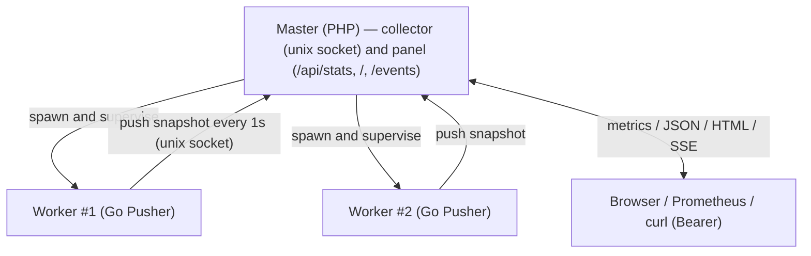

English | [Русский](admin-stats.ru.md)

# Server statistics

Aggregated statistics across a whole server pool (HTTP, socket or WebSocket)
brought up via [`SO_REUSEPORT`](http-server.md) under the
[master](worker-master.md). Every worker pushes its snapshot over a unix socket to
the master once a second; the master keeps the pool state in memory and serves it
on its own port — `GET /api/stats`, a live HTML panel and an SSE stream. Sampling
and push happen on the Go side of the worker; the collector and panel are pure PHP
in the master, which does not load the extension.

## Contents

- [How it works](#how-it-works)
- [Quick start](#quick-start)
- [Endpoint and panel](#endpoint-and-panel)
- [Configuration](#configuration)
- [Metrics](#metrics)
- [Response format](#response-format)
- [Push-protocol contract](#push-protocol-contract)
- [Limits](#limits)

## How it works

With `SO_REUSEPORT` each worker is a separate process with its own counters, and a
request to the shared port lands in exactly one random worker — so statistics
cannot be collected by polling a single socket. Instead each worker connects at
startup to the collector's unix socket (brought up by the master in `runtimeDir`)
and sends its snapshot there once a second as a length-prefix frame. The master is
the sole consumer: it holds the last snapshot of each worker in memory (keyed by
connection) and serves the pool sum on a separate port.

Push is best-effort — with no collector (master not up or restarting) the worker
drops the frame and keeps serving traffic. Closing the connection means the worker
is gone, so the master removes it from the live pool immediately: no files, no
liveness probes. A separate port keeps admin traffic away from application traffic
and gives a statistics endpoint to a socket server that has no HTTP routes; the
master's supervision loop multiplexes the telemetry sockets through
`stream_select` with a timeout equal to its own tick, so under a flood or a stuck
client it degrades the panel, not supervision.


```mermaid
flowchart TB
    master["Master (PHP) — collector (unix socket) and panel (/api/stats, /, /events)"]
    worker1["Worker #1 (Go Pusher)"]
    worker2["Worker #2 (Go Pusher)"]
    client["Browser / Prometheus / curl (Bearer)"]

    master -->|"spawn and supervise"| worker1
    master -->|"spawn and supervise"| worker2
    worker1 -->|"push snapshot every 1s (unix socket)"| master
    worker2 -->|"push snapshot"| master
    master <-->|"metrics / JSON / HTML / SSE"| client
```

## Quick start

Statistics turn on when both master settings are set: `panelPort` and `adminToken`.
The master brings up the collector and panel itself and injects the socket path
into the workers — nothing to configure on the worker side.

```json
{
  "workerScript": "/app/worker.php",
  "workerCount": 8,
  "runtimeDir": "/run/sconcur",
  "name": "sconcur-http-server",
  "panelPort": 8081,
  "adminToken": "23c30b40...9894c3ec",
  "server": {
    "address": "0.0.0.0:8080",
    "reusePort": true
  }
}
```

```sh
curl -H "Authorization: Bearer 23c30b40...9894c3ec" \
  http://localhost:8081/api/stats
```

The worker script stays as it is — `HttpServer::fromArgs(...)` (or
`SocketServer`/`WsServer`) picks up the env injected by the master on its own. The
socket and WebSocket pools serve the same endpoint, only with a `connections`
section instead of `requests`.

## Endpoint and panel

Everything is on the master's `panelPort`.

- `GET /api/stats` — the pool aggregate. The format follows `Accept`:
  `application/json` → JSON, `text/html` → HTML, anything else (no header, `*/*`,
  `text/plain`) → Prometheus metrics.
- `GET /` — the live HTML panel (meta-refresh every 2 s; the link carries the
  token).
- `GET /events` — an SSE stream: one JSON aggregate per tick.
- Authorization — `Authorization: Bearer <token>`, compared in constant time; for
  the browser `?token=<token>` is also accepted.
- A wrong or missing token gives `404` (not `401`, to avoid revealing the
  endpoint), as does any other path; a non-`GET` method with a valid token gives
  `405`.
- A bind error on the panel port or the unix socket is logged and does not take the
  master down — telemetry simply turns off.

## Configuration

Under the master two keys are enough; the rest is derived from `runtimeDir`/`name`.

| Master config key | Purpose | Default |
|---|---|---|
| `panelPort` | panel/endpoint port; needed together with the token | `0` (off) |
| `adminToken` | endpoint token; needed together with the port | empty (off) |

The worker reads its part from env (the master injects it; set it by hand only when
running without a master):

| Worker variable | Purpose | Default |
|---|---|---|
| `SCONCUR_TELEMETRY_SOCKET` | collector unix socket; empty = push off | empty |
| `SCONCUR_SERVER_NAME` | pool name (snapshot label) | `sconcur-server` |
| `SCONCUR_TELEMETRY_INTERVAL_MS` | snapshot sample/push cadence | `1000` |

Under the master the socket is `<runtimeDir>/<name>.telemetry.sock`, injected only
when telemetry is enabled. The same values can be set programmatically: on the
worker via the server constructor (`telemetrySocket`, `serverName`,
`telemetryIntervalMs`), on the master via the `WorkerMaster` constructor
(`panelPort`, `adminToken`). Several pools on one machine need different
`panelPort`, `name` and `runtimeDir`.

## Metrics

Worker numbers come from the Go side (`/proc`, `runtime`, its own counters); the
`master` section is sampled by the PHP master from its own `/proc`. Process metrics
are shared by all servers, the workload section is per-server: HTTP has `requests`,
socket and WebSocket have `connections`.

| Field | What it is | Source |
|---|---|---|
| `memory.rssBytes` | RSS of the whole process (with the extension) | `/proc/self/status` `VmRSS` |
| `memory.goRuntimeBytes` | Go-runtime memory | `runtime/metrics` |
| `memory.nonExtensionBytes` | remainder without the extension (PHP + interpreter) | `rssBytes − goRuntimeBytes` |
| `cpuPercent` | CPU usage by the process over the interval | diff of `/proc/self/stat` |
| `goroutines` | goroutine count | `runtime.NumGoroutine()` |
| `startedAt` / `uptimeSeconds` | when the worker's serve loop started (UTC) and its lifetime | serve-loop start |
| `requests.completed` | requests served (HTTP) | counter |
| `requests.avgMs` | average request duration | sum / count |
| `requests.inFlight` | in progress right now | in-flight registry |
| `requests.inFlight1to5s` / `inFlight5to15s` / `inFlightOver15s` | of those, by age [1s,5s) / [5s,15s) / ≥15s | in-flight age |
| `connections.active` / `totalAccepted` | connections open now / accepted over all time | counter |
| `master.pid` / `startedAt` / `uptimeSeconds` | the master process itself | master |
| `master.memory.rssBytes` / `master.cpuPercent` | RSS and CPU of the master | `/proc/self/*` |

All date-time fields are UTC (ISO-8601 with a `+00:00` offset). The duration
buckets are exclusive: a request that has been running for 7 s lands only in
`inFlight5to15s`. In `totals`, `requests.avgMs` is weighted by workers'
`completed`, while `cpuPercent` is the sum of per-process values and can exceed
100%.

`snapshotAgeMs` is computed by the master's own clock from the moment the frame
was received, so it does not depend on clock skew; a live connection with no fresh
snapshot for longer than 15 s flags the worker `hung`. That catches a wedged worker
runtime (the pusher goroutine itself stalled), not a stuck request handler — the
pusher is independent and keeps sending snapshots as long as the Go runtime is
alive.

## Response format

The same data in three representations, chosen by `Accept`. The HTTP pool's JSON:

```json
{
  "generatedAt": "2026-06-24T12:00:00+00:00",
  "name": "sconcur-http-server",
  "workersTotal": 8,
  "workersHung": 0,
  "master": {
    "pid": 12340,
    "startedAt": "2026-06-24T11:00:00+00:00",
    "uptimeSeconds": 3600.0,
    "memory": { "rssBytes": 16777216 },
    "cpuPercent": 0.6
  },
  "totals": {
    "memory": { "rssBytes": 335544320, "goRuntimeBytes": 100663296, "nonExtensionBytes": 234881024 },
    "cpuPercent": 28.4,
    "goroutines": 192,
    "requests": { "completed": 843210, "avgMs": 2.6, "inFlight": 41, "inFlight1to5s": 12, "inFlight5to15s": 4, "inFlightOver15s": 1 }
  },
  "workers": [
    {
      "pid": 12346,
      "hung": false,
      "snapshotAgeMs": 600,
      "startedAt": "2026-06-24T11:54:47+00:00",
      "uptimeSeconds": 312.5,
      "memory": { "rssBytes": 41943040, "goRuntimeBytes": 12582912, "nonExtensionBytes": 29360128 },
      "cpuPercent": 3.7,
      "goroutines": 24,
      "requests": { "completed": 105432, "avgMs": 2.4, "inFlight": 7, "inFlight1to5s": 2, "inFlight5to15s": 1, "inFlightOver15s": 0 }
    }
  ]
}
```

In a socket or WebSocket pool `connections` takes the place of `requests`, both in
`totals` and on each worker:

```json
"connections": { "active": 12, "totalAccepted": 34567 }
```

The Prometheus format (the default) carries the summed `sconcur_pool_*`, the master
metrics `sconcur_master_*` and the per-worker `sconcur_worker_*` (with a `pid`
label). Start date-times are served as unix seconds (`*_start_time_seconds`) —
Prometheus carries no strings:

```text
# HELP sconcur_pool_requests_completed_total Requests completed across the pool.
# TYPE sconcur_pool_requests_completed_total counter
sconcur_pool_requests_completed_total{name="sconcur-http-server"} 843210
sconcur_master_start_time_seconds{name="sconcur-http-server"} 1750762800
sconcur_master_memory_rss_bytes{name="sconcur-http-server"} 16777216
sconcur_worker_start_time_seconds{name="sconcur-http-server",pid="12346"} 1750766087
sconcur_worker_requests_completed_total{name="sconcur-http-server",pid="12346"} 105432
```

## Push-protocol contract

The worker→collector channel is an open contract, so the collector can be a
third-party supervisor too:

- transport: unix socket (`SOCK_STREAM`), path — `SCONCUR_TELEMETRY_SOCKET`;
- framing: 4-byte big-endian length prefix + body (the same codec as the
  [socket server](socket-server.md));
- body: UTF-8 JSON, envelope `{"t":"snapshot","s":<snapshot>}`; the snapshot schema
  is the [metrics](#metrics) table;
- semantics: best-effort, at-most-once, no ack; the collector holds last-value per
  connection, and closing the connection means the worker is gone.

## Limits

- Observability is master-only: without the master there are no statistics. A
  master restart is a blackout of up to one interval (≤1 s), until the workers
  re-push.
- `requests.avgMs` is the average over the worker's whole lifetime, so it smooths
  spikes (percentiles are a possible future improvement).
- The whole snapshot is sampled once a second, and no source does a
  stop-the-world.

---

See also: [HTTP server](http-server.md), [Socket server](socket-server.md),
[Worker master](worker-master.md).
