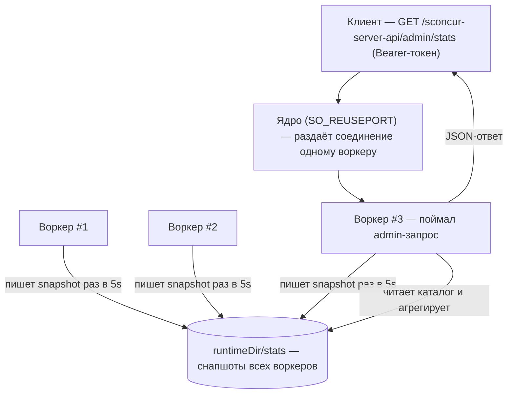

# Админ-статистика сервера

Агрегированная статистика по всему пулу HTTP-серверов, поднятому через
[`SO_REUSEPORT`](http-server.ru.md) (с [мастером](worker-master.ru.md) или без).
Отдаётся одной HTTP-ручкой. Вся работа — на стороне Go-расширения: PHP не
участвует ни при запросе, ни при сборе статистики.

## Оглавление

- [Зачем так](#зачем-так)
- [Быстрый старт](#быстрый-старт)
- [Ручка](#ручка)
- [Как это устроено](#как-это-устроено)
- [Конфигурация](#конфигурация)
- [Метрики](#метрики)
- [Формат ответа](#формат-ответа)
- [Файл снапшота воркера](#файл-снапшота-воркера)
- [Ограничения](#ограничения)

---

## Зачем так

При `SO_REUSEPORT` каждый воркер — отдельный процесс со своим Go-рантаймом и
своими счётчиками, а ядро балансирует соединения. Запрос на общий порт попадает
ровно в один случайный воркер — он знает только свой срез. Поэтому статистику
нельзя отдавать через сам reuse-port-сокет.

Решение: каждый воркер раз в 5 секунд пишет свой снапшот в общий каталог отдельным
файлом по pid; admin-запрос обслуживает тот воркер, что его поймал, читая и
суммируя файлы всех воркеров. Раз агрегация идёт через файлы, а не через сокеты
соседей, любой воркер отдаёт полную картину пула.



## Быстрый старт

Ручка регистрируется, только если задан токен в переменной окружения
`SCONCUR_ADMIN_TOKEN`. Под [мастером](worker-master.ru.md) токен задаётся в блоке
`env` конфига (мастер наследует его воркерам):

```json
{
  "workerScript": "/app/worker.php",
  "workerCount": 8,
  "runtimeDir": "/run/sconcur",
  "name": "sconcur-http-server",
  "env": {
    "SCONCUR_ADMIN_TOKEN": "23c30b40...9894c3ec"
  },
  "server": {
    "address": "0.0.0.0:8080",
    "reusePort": true
  }
}
```

Запрос:

```sh
curl -H "Authorization: Bearer 23c30b40...9894c3ec" \
  http://localhost:8080/sconcur-server-api/admin/stats
```

Без мастера — экспортируйте переменную перед запуском воркер-скрипта; токен
подхватывает `HttpServer::fromArgs()`:

```sh
SCONCUR_ADMIN_TOKEN=... php -d extension=ext/build/sconcur.so worker.php
```

## Ручка

`GET /sconcur-server-api/admin/stats` — путь зарезервирован: его перехватывает
Go-сторона до перехода в PHP, поэтому потребительский роутер этот путь не видит.

- Авторизация — заголовок `Authorization: Bearer <token>`, сравнение
  константное по времени. Токен передаётся только в заголовке, не в URL, поэтому
  не попадает в access-лог.
- Нет токена в окружении — ручка не регистрируется, путь идёт в обычный
  PHP-хендлер (fail-closed).
- Неверный или отсутствующий токен при заданном — `404` (не `401`, чтобы не
  раскрывать существование ручки).
- Метод не `GET` при верном токене — `405`.
- Успех — `200 application/json` (см. [формат ответа](#формат-ответа)).

## Как это устроено

Каждый воркер при старте сервера запускает фоновую горутину-писатель: раз в
5 секунд (хардкод) она собирает метрики процесса и атомарно (temp-файл + rename)
переписывает свой снапшот в `<statsDir>/<serverName>-stats-<pid>.json`. На штатном
завершении воркер удаляет свой файл; после краха файл остаётся и будет вычищен
читателем.

Агрегатор (тот воркер, что поймал admin-запрос) читает все файлы своего
`serverName`, для каждого определяет состояние процесса:

- pid мёртв (`kill(pid, 0)` → нет процесса) — файл-сирота от крашнувшегося
  воркера: удаляется (под неблокирующим `flock` на `stats/.prune.lock`, чтобы два
  параллельных агрегатора не гонялись) и в сумму не входит;
- pid жив, но снапшот не обновлялся дольше 15 секунд (3 пропущенных тика) — воркер
  помечается `hung` (живой, но завис — см. [зависший воркер](worker-master.ru.md#зависший-воркер)),
  файл не удаляется;
- иначе — обычный живой воркер.

## Конфигурация

Три переменные окружения; под мастером первую задаёт оператор, остальные
подставляет сам мастер из своих `runtimeDir`/`name`.

| Переменная | Назначение | По умолчанию |
|---|---|---|
| `SCONCUR_ADMIN_TOKEN` | токен ручки; пусто — ручка выключена | пусто |
| `SCONCUR_STATS_DIR` | каталог снапшотов | `sys_get_temp_dir()/sconcur/stats` |
| `SCONCUR_SERVER_NAME` | префикс файлов и область агрегации | `sconcur-server` |

`SCONCUR_SERVER_NAME` задаёт область агрегации: суммируются только файлы с этим
именем, поэтому разные пулы в одном `statsDir` не смешиваются. Воркеры одного
reuse-port-пула должны делить `SCONCUR_STATS_DIR` и `SCONCUR_SERVER_NAME`, чтобы
попасть в одну сумму — под мастером это так по построению; в standalone несколько
воркеров на одном порту совпадают по дефолтам.

Мастер форвардит `SCONCUR_STATS_DIR=<runtimeDir>/stats` и
`SCONCUR_SERVER_NAME=<name>` через env, а не через argv: так server-agnostic мастер
не передаёт неизвестный флаг не-HTTP-воркеру. Те же значения можно задать
программно через конструктор `HttpServer` (`adminToken`, `statsDir`,
`serverName`).

## Метрики

Источник всех чисел — Go-сторона (`/proc`, `runtime`, собственные счётчики).

| Поле | Что это | Источник |
|---|---|---|
| `memory.rssBytes` | RSS всего процесса (с расширением) | `/proc/self/status` `VmRSS` |
| `memory.goRuntimeBytes` | память Go-рантайма | `runtime.MemStats.Sys` |
| `memory.nonExtensionBytes` | остаток без расширения (PHP + интерпретатор) | `rssBytes − goRuntimeBytes` |
| `cpuPercent` | загрузка CPU процессом, катящаяся за интервал | диф `/proc/self/stat` |
| `goroutines` | число горутин | `runtime.NumGoroutine()` |
| `uptimeSeconds` | время жизни сервера | старт serve-цикла |
| `requests.completed` | обслужено запросов | счётчик |
| `requests.avgMs` | средняя длительность запроса | сумма / число |
| `requests.inFlight` | выполняется сейчас | реестр in-flight |
| `requests.inFlight1to5s` | из них в работе [1с, 5с) | возраст in-flight |
| `requests.inFlight5to15s` | из них в работе [5с, 15с) | возраст in-flight |
| `requests.inFlightOver15s` | из них в работе ≥ 15с | возраст in-flight |

Бакеты длительности эксклюзивны: запрос в работе 7 секунд попадает только в
`inFlight5to15s`. В `totals` `avgMs` взвешен по `completed` воркеров, а
`cpuPercent` — сумма per-process значений (может быть больше 100%, если воркеров
несколько). `cpuPercent` первого снапшота воркера равен 0 (нужна вторая выборка).

## Формат ответа

```json
{
  "generatedAt": "2026-06-24T12:00:00+00:00",
  "name": "sconcur-http-server",
  "workersTotal": 8,
  "workersHung": 1,
  "totals": {
    "memory": { "rssBytes": 335544320, "goRuntimeBytes": 100663296, "nonExtensionBytes": 234881024 },
    "cpuPercent": 28.4,
    "goroutines": 192,
    "requests": {
      "completed": 843210,
      "avgMs": 2.6,
      "inFlight": 41,
      "inFlight1to5s": 12,
      "inFlight5to15s": 4,
      "inFlightOver15s": 1
    }
  },
  "workers": [
    {
      "pid": 12346,
      "hung": false,
      "snapshotAgeMs": 1200,
      "uptimeSeconds": 312.5,
      "memory": { "rssBytes": 41943040, "goRuntimeBytes": 12582912, "nonExtensionBytes": 29360128 },
      "cpuPercent": 3.7,
      "goroutines": 24,
      "requests": { "completed": 105432, "avgMs": 2.4, "inFlight": 7, "inFlight1to5s": 2, "inFlight5to15s": 1, "inFlightOver15s": 0 }
    }
  ]
}
```

`generatedAt` — момент сборки ответа (RFC3339). `snapshotAgeMs` — насколько устарел
снапшот воркера на этот момент; `hung` ставится при превышении 15 секунд.

## Файл снапшота воркера

`<statsDir>/<serverName>-stats-<pid>.json` — то, что воркер пишет о себе. Поле
`updatedAtMs` (epoch-ms) — по нему агрегатор считает `snapshotAgeMs` и `hung`.

```json
{
  "name": "sconcur-http-server",
  "pid": 12346,
  "updatedAtMs": 1750000000123,
  "uptimeSeconds": 312.5,
  "memory": { "rssBytes": 41943040, "goRuntimeBytes": 12582912, "nonExtensionBytes": 29360128 },
  "cpuPercent": 3.7,
  "goroutines": 24,
  "requests": { "completed": 105432, "avgMs": 2.4, "inFlight": 7, "inFlight1to5s": 2, "inFlight5to15s": 1, "inFlightOver15s": 0 }
}
```

## Ограничения

- Ручка только у HTTP-сервера. [Сокет-сервер](socket-server.ru.md) не отдаёт её
  (нет понятия маршрута), хотя по тому же принципу позже сможет писать снапшоты.
- Период сбора фиксирован — 5 секунд, не настраивается. Числа в ответе — это
  последние снапшоты, то есть запаздывают до 5 секунд.
- `avgMs` — среднее за всё время жизни воркера; недавние всплески оно сглаживает
  (перцентили — возможное будущее улучшение).
- Разбивка корутин по фичам пока не входит в снапшот.

---

См. также: [HTTP-сервер](http-server.ru.md), [мастер воркеров](worker-master.ru.md).
