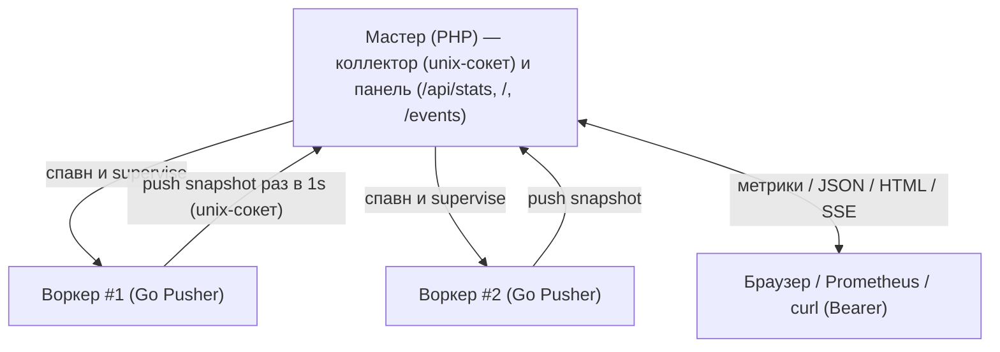

# Статистика сервера

Агрегированная статистика по всему пулу серверов (HTTP или socket), поднятому через
[`SO_REUSEPORT`](http-server.ru.md) под [мастером](worker-master.ru.md). Каждый
воркер раз в секунду пушит свой снапшот по unix-сокету в мастер; мастер держит
состояние пула в памяти и отдаёт его на своём порту — ручкой `GET /api/stats`,
живой HTML-панелью и SSE-потоком. Сбор и push — на стороне Go-расширения воркера;
коллектор и панель — на чистом PHP в мастере (расширение там не грузится).

## Оглавление

- [Как это устроено](#как-это-устроено)
- [Быстрый старт](#быстрый-старт)
- [Ручка и панель](#ручка-и-панель)
- [Конфигурация](#конфигурация)
- [Метрики](#метрики)
- [Формат ответа](#формат-ответа)
- [Контракт push-протокола](#контракт-push-протокола)
- [Ограничения](#ограничения)

---

## Как это устроено

При `SO_REUSEPORT` каждый воркер — отдельный процесс со своим Go-рантаймом и своими
счётчиками, а ядро балансирует соединения. Запрос на общий порт попадает ровно в
один случайный воркер — он знает только свой срез. Поэтому статистику нельзя собрать,
опросив один сокет.

Решение: каждый воркер при старте подключается к unix-сокету коллектора (его поднял
мастер в `runtimeDir`) и раз в секунду шлёт туда свой снапшот length-prefix кадром.
Мастер — единственный потребитель: он держит последний снапшот каждого воркера в
памяти (ключ — соединение) и на своём отдельном порту отдаёт сумму по пулу. Push —
best-effort: нет коллектора (мастер не поднят/перезапускается) — воркер дропает кадр
и продолжает обслуживать трафик. Закрытие соединения = воркер ушёл (мастер тут же
убирает его из живого пула — без файлов и проб живости).

Отдельный порт держит admin-трафик в стороне от прикладного (его можно
зафайрволить) и даёт ручку статистики socket-серверу, у которого нет HTTP-маршрутов.
Цикл супервизии мастера не блокируется на I/O панели: он мультиплексирует сокеты
телеметрии через `stream_select` с таймаутом, равным своему тику, и при флуде/залипшем
клиенте деградирует панель, а не супервизию.



## Быстрый старт

Статистика включается, когда у [мастера](worker-master.ru.md) заданы обе настройки:
`panelPort` (порт панели) и `adminToken` (токен). Мастер сам поднимает коллектор и
панель и инжектит воркерам путь сокета — настраивать на воркере ничего не нужно.

```json
{
  "workerScript": "/app/worker.php",
  "workerCount": 8,
  "runtimeDir": "/run/sconcur",
  "name": "sconcur-http-server",
  "panelPort": 8081,
  "adminToken": "23c30b40...9894c3ec",
  "server": {
    "address": "0.0.0.0:8080",
    "reusePort": true
  }
}
```

Воркер-скрипт остаётся прежним — `HttpServer::fromArgs($_SERVER['argv'])` (или
`SocketServer::fromArgs(...)`) сам подхватит инжектируемые мастером env. Запрос на
порт панели:

```sh
curl -H "Authorization: Bearer 23c30b40...9894c3ec" \
  http://localhost:8081/api/stats
```

То же для [socket-сервера](socket-server.ru.md) — он отдаёт стату через тот же
`GET /api/stats`, только с секцией `connections` вместо `requests`.

## Ручка и панель

Всё на порту `panelPort` мастера.

- `GET /api/stats` — агрегат пула. Формат по заголовку `Accept`: `application/json`
  → JSON, `text/html` → HTML, всё остальное (нет заголовка, `*/*`, `text/plain`) →
  метрики Prometheus.
- `GET /` — живая HTML-панель (мета-обновление раз в 2с; ссылка несёт токен).
- `GET /events` — SSE-поток: один JSON-агрегат на каждом тике (раз в 1с).
- Авторизация — `Authorization: Bearer <token>`, сравнение константное по времени.
  Для браузера токен также принимается как `?token=<token>` (чтобы открыть панель и
  SSE по URL).
- Неверный или отсутствующий токен — `404` (не `401`, чтобы не раскрывать ручку).
  Любой путь кроме перечисленных — тоже `404`. Метод не `GET` при верном токене — `405`.
- Ошибка бинда порта панели или unix-сокета логируется и не роняет мастер —
  телеметрия просто выключается.

## Конфигурация

Под мастером достаточно двух ключей в JSON-конфиге; остальное мастер выводит сам из
`runtimeDir`/`name`.

| Ключ конфига мастера | Назначение | По умолчанию |
|---|---|---|
| `panelPort` | порт панели/ручки; нужен вместе с токеном | `0` (выкл.) |
| `adminToken` | токен ручки; нужен вместе с портом | пусто (выкл.) |

Воркер читает свою часть из env (мастер их инжектит; вручную — для запуска без
мастера):

| Переменная воркера | Назначение | По умолчанию |
|---|---|---|
| `SCONCUR_TELEMETRY_SOCKET` | unix-сокет коллектора; пусто = push выкл. | пусто |
| `SCONCUR_SERVER_NAME` | имя пула (метка снапшота) | `sconcur-server` |
| `SCONCUR_TELEMETRY_INTERVAL_MS` | каденция сэмпла/пуша снапшота | `1000` |

Под мастером сокет — `<runtimeDir>/<name>.telemetry.sock`; он инжектится воркерам
только когда телеметрия включена (иначе воркеры не дёргают мёртвый сокет). Те же
значения можно задать программно: на воркере — конструктор `HttpServer`/`SocketServer`
(`telemetrySocket`, `serverName`, `telemetryIntervalMs`, `telemetryProcessIntervalMs`);
на мастере — конструктор `WorkerMaster` (`panelPort`, `adminToken`).

Если на одной машине несколько пулов — у них должны быть разные `panelPort`, `name` и
`runtimeDir` (разные сокеты и порты).

## Метрики

Источник всех чисел — Go-сторона воркера (`/proc`, `runtime`, собственные счётчики).
Процессные метрики общие для обоих серверов; workload-секция своя: у HTTP —
`requests`, у socket — `connections`.

| Поле | Что это | Источник |
|---|---|---|
| `memory.rssBytes` | RSS всего процесса (с расширением) | `/proc/self/status` `VmRSS` |
| `memory.goRuntimeBytes` | память Go-рантайма | `runtime.MemStats.Sys` |
| `memory.nonExtensionBytes` | остаток без расширения (PHP + интерпретатор) | `rssBytes − goRuntimeBytes` |
| `cpuPercent` | загрузка CPU процессом за интервал | диф `/proc/self/stat` |
| `goroutines` | число горутин процесса | `runtime.NumGoroutine()` |
| `uptimeSeconds` | время жизни serve-цикла | старт serve-цикла |
| `requests.completed` | обслужено запросов (HTTP) | счётчик |
| `requests.avgMs` | средняя длительность запроса | сумма / число |
| `requests.inFlight` | выполняется сейчас | реестр in-flight |
| `requests.inFlight1to5s` / `inFlight5to15s` / `inFlightOver15s` | из них по возрасту [1с,5с) / [5с,15с) / ≥15с | возраст in-flight |
| `connections.active` | открытых соединений сейчас (socket) | счётчик |
| `connections.totalAccepted` | принято соединений за всё время (socket) | счётчик |

Бакеты длительности эксклюзивны: запрос в работе 7с попадает только в `inFlight5to15s`.
В `totals` `requests.avgMs` взвешен по `completed` воркеров, а `cpuPercent` — сумма
per-process значений (может быть больше 100%). Воркер старше порога (15с без свежего
снапшота при живом соединении) помечается `hung`.

## Формат ответа

Те же данные в трёх представлениях; выбор — по `Accept`.

JSON-ответ HTTP-пула (с секцией `requests`):

```json
{
  "generatedAt": "2026-06-24T12:00:00+00:00",
  "name": "sconcur-http-server",
  "workersTotal": 8,
  "workersHung": 0,
  "totals": {
    "memory": { "rssBytes": 335544320, "goRuntimeBytes": 100663296, "nonExtensionBytes": 234881024 },
    "cpuPercent": 28.4,
    "goroutines": 192,
    "requests": { "completed": 843210, "avgMs": 2.6, "inFlight": 41, "inFlight1to5s": 12, "inFlight5to15s": 4, "inFlightOver15s": 1 }
  },
  "workers": [
    {
      "pid": 12346,
      "hung": false,
      "snapshotAgeMs": 600,
      "uptimeSeconds": 312.5,
      "memory": { "rssBytes": 41943040, "goRuntimeBytes": 12582912, "nonExtensionBytes": 29360128 },
      "cpuPercent": 3.7,
      "goroutines": 24,
      "requests": { "completed": 105432, "avgMs": 2.4, "inFlight": 7, "inFlight1to5s": 2, "inFlight5to15s": 1, "inFlightOver15s": 0 }
    }
  ]
}
```

У socket-пула на месте `requests` (и в `totals`, и у каждого воркера) стоит
`connections`:

```json
"connections": { "active": 12, "totalAccepted": 34567 }
```

В формате Prometheus (формат по умолчанию) — суммарные `sconcur_pool_*` и
по-воркерные `sconcur_worker_*` (с label `pid`); у socket-пула вместо `requests`-метрик
идут `connections`-метрики:

```text
# HELP sconcur_pool_requests_completed_total Requests completed across the pool.
# TYPE sconcur_pool_requests_completed_total counter
sconcur_pool_requests_completed_total{name="sconcur-http-server"} 843210
sconcur_worker_requests_completed_total{name="sconcur-http-server",pid="12346"} 105432
```

## Контракт push-протокола

Канал воркер→коллектор — открытый контракт, чтобы коллектором мог быть и сторонний
супервизор (не только наш мастер):

- транспорт: unix-сокет (`SOCK_STREAM`), путь — `SCONCUR_TELEMETRY_SOCKET`;
- кадрирование: 4-байтный big-endian length-prefix + тело (тот же кодек, что у
  [socket-сервера](socket-server.ru.md));
- тело: UTF-8 JSON, конверт `{"t":"snapshot","s":<snapshot>}`; схема `snapshot` —
  таблица [метрик](#метрики);
- семантика: best-effort, at-most-once, без ack; коллектор держит last-value по
  соединению, закрытие соединения = воркер ушёл.

## Ограничения

- Наблюдаемость master-only: без мастера статистики нет (раньше `/api/stats` работал
  на reuse-порту воркера). Рестарт мастера — блэкаут до одного интервала (≤1с), пока
  воркеры не перепушат.
- `requests.avgMs` — среднее за всё время жизни воркера; всплески сглаживает
  (перцентили — возможное будущее улучшение).
- Снапшот целиком сэмплится раз в секунду; ни один источник не делает stop-the-world
  (RSS/CPU из `/proc`, память Go-рантайма через `runtime/metrics`).

---

См. также: [HTTP-сервер](http-server.ru.md), [Сокет-сервер](socket-server.ru.md),
[мастер воркеров](worker-master.ru.md).
