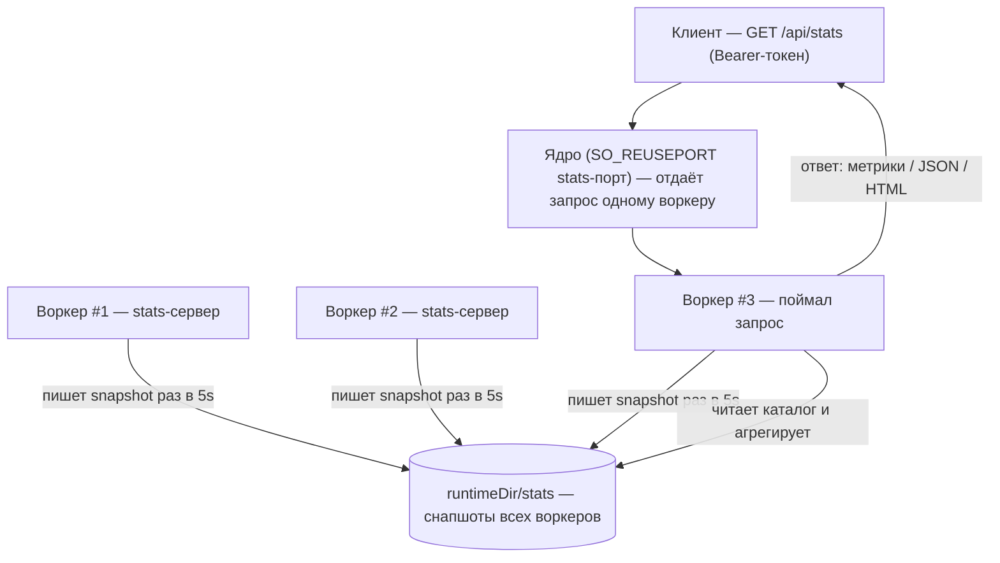

# Статистика сервера

Агрегированная статистика по всему пулу серверов (HTTP или socket), поднятому
через [`SO_REUSEPORT`](http-server.ru.md) с [мастером](worker-master.ru.md) или
без. Отдаётся отдельным HTTP-сервером на своём порту, ручкой `GET /api/stats`.
Вся работа — на стороне Go-расширения: PHP не участвует ни при запросе, ни при
сборе статистики.

## Оглавление

- [Зачем так](#зачем-так)
- [Быстрый старт](#быстрый-старт)
- [Ручка](#ручка)
- [Как это устроено](#как-это-устроено)
- [Конфигурация](#конфигурация)
- [Метрики](#метрики)
- [Формат ответа](#формат-ответа)
- [Файл снапшота воркера](#файл-снапшота-воркера)
- [Ограничения](#ограничения)

---

## Зачем так

При `SO_REUSEPORT` каждый воркер — отдельный процесс со своим Go-рантаймом и
своими счётчиками, а ядро балансирует соединения. Запрос на общий порт попадает
ровно в один случайный воркер — он знает только свой срез. Поэтому статистику
нельзя собрать, опросив один сокет.

Решение: каждый воркер раз в 5 секунд пишет свой снапшот в общий каталог отдельным
файлом по pid. Параллельно каждый воркер поднимает небольшой stats-сервер на
выделенном порту (тоже `SO_REUSEPORT` — все воркеры пула делят этот порт). Запрос
на `/api/stats` ловит один воркер, читает файлы всех воркеров своего `name` и
отдаёт сумму. Раз агрегация идёт через файлы, любой воркер отдаёт полную картину
пула.

Отдельный порт держит admin-трафик в стороне от прикладного (его можно
зафайрволить) и даёт ручку статистики socket-серверу, у которого нет HTTP-маршрутов.



## Быстрый старт

Stats-сервер поднимается, только если заданы обе переменные окружения:
`SCONCUR_ADMIN_TOKEN` (токен) и `SCONCUR_STATS_PORT` (порт). Под
[мастером](worker-master.ru.md) их задают в блоке `env` конфига (мастер наследует
env воркерам):

```json
{
  "workerScript": "/app/worker.php",
  "workerCount": 8,
  "runtimeDir": "/run/sconcur",
  "name": "sconcur-http-server",
  "env": {
    "SCONCUR_ADMIN_TOKEN": "23c30b40...9894c3ec",
    "SCONCUR_STATS_PORT": "8081"
  },
  "server": {
    "address": "0.0.0.0:8080",
    "reusePort": true
  }
}
```

Запрос (на stats-порт, не на прикладной):

```sh
curl -H "Authorization: Bearer 23c30b40...9894c3ec" \
  http://localhost:8081/api/stats
```

Без мастера — экспортируйте переменные перед запуском воркер-скрипта; их подхватит
`HttpServer::fromArgs()` (и `SocketServer::fromArgs()`):

```sh
SCONCUR_ADMIN_TOKEN=... SCONCUR_STATS_PORT=8081 \
  php -d extension=ext/build/sconcur.so worker.php
```

То же самое работает для [socket-сервера](socket-server.ru.md): он отдаёт стату
через тот же HTTP `GET /api/stats`, только с секцией `connections` вместо
`requests`.

## Ручка

`GET /api/stats` на порту `SCONCUR_STATS_PORT`.

- Авторизация — заголовок `Authorization: Bearer <token>`, сравнение константное
  по времени. Токен только в заголовке, не в URL.
- Не заданы порт или токен — stats-сервер не поднимается.
- Неверный или отсутствующий токен — `404` (не `401`, чтобы не раскрывать
  существование ручки). Любой путь кроме `/api/stats` — тоже `404`.
- Метод не `GET` при верном токене — `405`.
- Успех — `200`. Формат выбирается по заголовку `Accept` (см.
  [формат ответа](#формат-ответа)): `application/json` → JSON, `text/html` →
  компактная HTML-страница, всё остальное (нет заголовка, `*/*`, `text/plain`) →
  метрики в формате Prometheus.
- Ошибка бинда stats-порта логируется и не роняет основной сервер.

## Как это устроено

Каждый воркер при старте запускает фоновую горутину-писатель: раз в 5 секунд
(хардкод) она собирает метрики процесса и атомарно (temp-файл + rename)
переписывает свой снапшот в `<statsDir>/<serverName>-stats-<pid>.json`. На штатном
завершении воркер удаляет свой файл; после краха файл остаётся и будет вычищен
читателем.

Параллельно, если заданы порт и токен, воркер поднимает stats-сервер на этом порту
(`SO_REUSEPORT`). Агрегатор (тот воркер, что поймал запрос) читает все файлы своего
`serverName` и для каждого определяет состояние процесса:

- pid мёртв (`kill(pid, 0)` → нет процесса) — файл-сирота от крашнувшегося
  воркера: удаляется (под неблокирующим `flock` на `stats/.prune.lock`) и в сумму
  не входит;
- pid жив, но снапшот не обновлялся дольше 15 секунд (3 пропущенных тика) — воркер
  помечается `hung` (живой, но завис — см.
  [зависший воркер](worker-master.ru.md#зависший-воркер)), файл не удаляется;
- иначе — обычный живой воркер.

## Конфигурация

Четыре переменные окружения; под мастером первые две задаёт оператор, остальные
подставляет сам мастер из своих `runtimeDir`/`name`.

| Переменная | Назначение | По умолчанию |
|---|---|---|
| `SCONCUR_ADMIN_TOKEN` | токен ручки; нужен вместе с портом | пусто (выкл.) |
| `SCONCUR_STATS_PORT` | порт stats-сервера; нужен вместе с токеном | пусто (выкл.) |
| `SCONCUR_STATS_DIR` | каталог снапшотов | `sys_get_temp_dir()/sconcur/stats` (только когда стата включена) |
| `SCONCUR_SERVER_NAME` | префикс файлов и область агрегации | `sconcur-server` |

`SCONCUR_SERVER_NAME` задаёт область агрегации: суммируются только файлы с этим
именем, поэтому разные пулы в одном `statsDir` не смешиваются. Снапшот-писатель
запускается, только если стата реально включена (заданы токен и порт) **или** явно
задан `SCONCUR_STATS_DIR`; иначе сервер не пишет снапшот-файлы вовсе. Это важно
потому, что чистка осиротевших файлов выполняется лишь при обслуживании запроса к
ручке — без ручки удалять оставшийся после краха файл было бы некому. Те же
значения можно задать программно через конструктор `HttpServer` / `SocketServer`
(`adminToken`, `statsDir`, `serverName`, `statsPort`).

Если на одной машине поднято несколько пулов (например HTTP и socket), им нужны
**разные** `SCONCUR_STATS_PORT` и `SCONCUR_SERVER_NAME` — иначе общий
reuse-port-сокет отдаст запрос случайному воркеру чужого пула.

## Метрики

Источник всех чисел — Go-сторона (`/proc`, `runtime`, собственные счётчики).
Процессные метрики общие для обоих серверов; workload-секция своя: у HTTP —
`requests`, у socket — `connections`.

| Поле | Что это | Источник |
|---|---|---|
| `memory.rssBytes` | RSS всего процесса (с расширением) | `/proc/self/status` `VmRSS` |
| `memory.goRuntimeBytes` | память Go-рантайма | `runtime.MemStats.Sys` |
| `memory.nonExtensionBytes` | остаток без расширения (PHP + интерпретатор) | `rssBytes − goRuntimeBytes` |
| `cpuPercent` | загрузка CPU процессом, катящаяся за интервал | диф `/proc/self/stat` |
| `goroutines` | число горутин | `runtime.NumGoroutine()` |
| `uptimeSeconds` | время жизни сервера | старт serve-цикла |
| `requests.completed` | обслужено запросов (HTTP) | счётчик |
| `requests.avgMs` | средняя длительность запроса | сумма / число |
| `requests.inFlight` | выполняется сейчас | реестр in-flight |
| `requests.inFlight1to5s` | из них в работе [1с, 5с) | возраст in-flight |
| `requests.inFlight5to15s` | из них в работе [5с, 15с) | возраст in-flight |
| `requests.inFlightOver15s` | из них в работе ≥ 15с | возраст in-flight |
| `connections.active` | открытых соединений сейчас (socket) | счётчик |
| `connections.totalAccepted` | принято соединений за всё время (socket) | счётчик |

Бакеты длительности эксклюзивны: запрос в работе 7 секунд попадает только в
`inFlight5to15s`. В `totals` `requests.avgMs` взвешен по `completed` воркеров, а
`cpuPercent` — сумма per-process значений (может быть больше 100%). `cpuPercent`
первого снапшота воркера равен 0 (нужна вторая выборка).

## Формат ответа

Ручка отдаёт одни и те же данные в одном из трёх представлений; выбор — по
заголовку `Accept` (см. [ручку](#ручка)):

- **Метрики Prometheus** — по умолчанию (`text/plain`). Экспозиция с суммами по
  пулу (`sconcur_pool_*`) и сериями по воркерам (`sconcur_worker_*`, label `pid`).
- **JSON** — `Accept: application/json`. Машинный формат, описан ниже.
- **HTML** — `Accept: text/html`. Компактная страница с теми же таблицами для
  просмотра в браузере.

JSON-ответ HTTP-пула (с секцией `requests`):

```json
{
  "generatedAt": "2026-06-24T12:00:00+00:00",
  "name": "sconcur-http-server",
  "workersTotal": 8,
  "workersHung": 1,
  "totals": {
    "memory": { "rssBytes": 335544320, "goRuntimeBytes": 100663296, "nonExtensionBytes": 234881024 },
    "cpuPercent": 28.4,
    "goroutines": 192,
    "requests": {
      "completed": 843210,
      "avgMs": 2.6,
      "inFlight": 41,
      "inFlight1to5s": 12,
      "inFlight5to15s": 4,
      "inFlightOver15s": 1
    }
  },
  "workers": [
    {
      "pid": 12346,
      "hung": false,
      "snapshotAgeMs": 1200,
      "uptimeSeconds": 312.5,
      "memory": { "rssBytes": 41943040, "goRuntimeBytes": 12582912, "nonExtensionBytes": 29360128 },
      "cpuPercent": 3.7,
      "goroutines": 24,
      "requests": { "completed": 105432, "avgMs": 2.4, "inFlight": 7, "inFlight1to5s": 2, "inFlight5to15s": 1, "inFlightOver15s": 0 }
    }
  ]
}
```

У socket-пула на месте `requests` (и в `totals`, и у каждого воркера) стоит
`connections`:

```json
"connections": { "active": 12, "totalAccepted": 34567 }
```

`generatedAt` — момент сборки ответа (RFC3339). `snapshotAgeMs` — насколько устарел
снапшот воркера; `hung` ставится при превышении 15 секунд.

Те же данные в формате Prometheus (формат по умолчанию) — суммарные
`sconcur_pool_*` и по-воркерные `sconcur_worker_*` (с label `pid`); у socket-пула
вместо `requests`-метрик идут `connections`-метрики:

```text
# HELP sconcur_pool_workers Live workers in the pool.
# TYPE sconcur_pool_workers gauge
sconcur_pool_workers{name="sconcur-http-server"} 8
# HELP sconcur_pool_requests_completed_total Requests completed across the pool.
# TYPE sconcur_pool_requests_completed_total counter
sconcur_pool_requests_completed_total{name="sconcur-http-server"} 843210
sconcur_worker_requests_completed_total{name="sconcur-http-server",pid="12346"} 105432
```

## Файл снапшота воркера

`<statsDir>/<serverName>-stats-<pid>.json` — то, что воркер пишет о себе. Поле
`updatedAtMs` (epoch-ms) — по нему агрегатор считает `snapshotAgeMs` и `hung`. У
HTTP-сервера присутствует секция `requests`, у socket — `connections`.

```json
{
  "name": "sconcur-http-server",
  "pid": 12346,
  "updatedAtMs": 1750000000123,
  "uptimeSeconds": 312.5,
  "memory": { "rssBytes": 41943040, "goRuntimeBytes": 12582912, "nonExtensionBytes": 29360128 },
  "cpuPercent": 3.7,
  "goroutines": 24,
  "requests": { "completed": 105432, "avgMs": 2.4, "inFlight": 7, "inFlight1to5s": 2, "inFlight5to15s": 1, "inFlightOver15s": 0 }
}
```

## Ограничения

- Период сбора фиксирован — 5 секунд, не настраивается. Числа в ответе — это
  последние снапшоты, то есть запаздывают до 5 секунд.
- `requests.avgMs` — среднее за всё время жизни воркера; недавние всплески оно
  сглаживает (перцентили — возможное будущее улучшение).
- Разбивка корутин по фичам пока не входит в снапшот.

---

См. также: [HTTP-сервер](http-server.ru.md), [Сокет-сервер](socket-server.ru.md),
[мастер воркеров](worker-master.ru.md).
