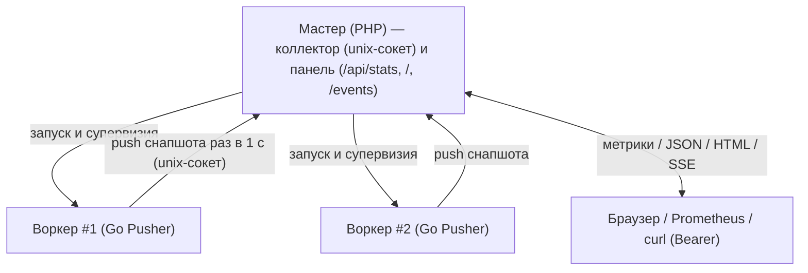

[English](admin-stats.md) | Русский

# Статистика сервера

Агрегированная статистика по всему пулу серверов (HTTP, socket или WebSocket),
поднятому через [`SO_REUSEPORT`](http-server.ru.md) под
[мастером](worker-master.ru.md). Каждый воркер раз в секунду отправляет свой
снапшот мастеру по unix-сокету; мастер держит состояние пула в памяти и отдаёт
его на своём порту — `GET /api/stats`, живая HTML-панель и SSE-поток.
Сэмплирование и отправка живут на Go-стороне воркера; коллектор и панель —
чистый PHP в мастере, который расширение не загружает.

## Содержание

- [Как это работает](#как-это-работает)
- [Быстрый старт](#быстрый-старт)
- [Эндпоинт и панель](#эндпоинт-и-панель)
- [Конфигурация](#конфигурация)
- [Метрики](#метрики)
- [Формат ответа](#формат-ответа)
- [Контракт push-протокола](#контракт-push-протокола)
- [Ограничения](#ограничения)

## Как это работает

При `SO_REUSEPORT` каждый воркер — отдельный процесс со своими счётчиками, а
запрос на общий порт попадает ровно в один случайный воркер, поэтому статистику
нельзя собрать опросом одного сокета. Вместо этого каждый воркер на старте
подключается к unix-сокету коллектора (поднимает мастер в `runtimeDir`) и раз в
секунду шлёт туда снапшот length-prefix-кадром. Мастер — единственный
потребитель: он держит последний снапшот каждого воркера в памяти (ключ —
соединение) и отдаёт сумму по пулу на отдельном порту.

Отправка best-effort: нет коллектора (мастер не поднят или перезапускается) —
воркер отбрасывает кадр и продолжает обслуживать трафик. Закрытие соединения
означает, что воркер ушёл, и мастер сразу убирает его из живого пула: никаких
файлов и liveness-проб. Отдельный порт уводит админ-трафик от прикладного и даёт
эндпоинт статистики сокет-серверу, у которого HTTP-маршрутов нет; цикл
супервизии мастера мультиплексирует телеметрийные сокеты через `stream_select` с
таймаутом, равным собственному тику, поэтому под флудом или на застрявшем
клиенте деградирует панель, а не супервизия.


```mermaid
flowchart TB
    master["Мастер (PHP) — коллектор (unix-сокет) и панель (/api/stats, /, /events)"]
    worker1["Воркер #1 (Go Pusher)"]
    worker2["Воркер #2 (Go Pusher)"]
    client["Браузер / Prometheus / curl (Bearer)"]

    master -->|"запуск и супервизия"| worker1
    master -->|"запуск и супервизия"| worker2
    worker1 -->|"push снапшота раз в 1 c (unix-сокет)"| master
    worker2 -->|"push снапшота"| master
    master <-->|"метрики / JSON / HTML / SSE"| client
```

## Быстрый старт

Статистика включается, когда заданы обе настройки мастера: `panelPort` и
`adminToken`. Мастер сам поднимает коллектор и панель и инжектит путь сокета в
воркеры — на стороне воркера настраивать нечего.

```json
{
  "runtimeDir": "/run/sconcur",
  "name": "sconcur-servers",
  "panelPort": 8081,
  "adminToken": "23c30b40...9894c3ec",
  "groups": [
    {
      "name": "http",
      "workerScript": "/app/worker.php",
      "workerCount": 8,
      "server": {
        "address": "0.0.0.0:8080",
        "reusePort": true
      }
    }
  ]
}
```

```sh
curl -H "Authorization: Bearer 23c30b40...9894c3ec" \
  http://localhost:8081/api/stats
```

Воркер-скрипт остаётся прежним — `HttpServer::fromArgs(...)` (или
`SocketServer`/`WsServer`) сам подхватывает env, инжектированный мастером. Пулы
сокет- и WebSocket-серверов отдают тот же эндпоинт, только с секцией
`connections` вместо `requests`.

## Эндпоинт и панель

Всё живёт на `panelPort` мастера.

- `GET /api/stats` — агрегат по пулу. Формат выбирается по `Accept`:
  `application/json` → JSON, `text/html` → HTML, всё остальное (без заголовка,
  `*/*`, `text/plain`) → метрики Prometheus.
- `GET /` — живая HTML-панель (meta-refresh раз в 2 c; ссылка несёт токен).
- `GET /events` — SSE-поток: по одному JSON-агрегату на тик.
- Авторизация — `Authorization: Bearer <token>`, сравнение за константное время;
  для браузера принимается и `?token=<token>`.
- Неверный или отсутствующий токен даёт `404` (а не `401`, чтобы не выдавать
  эндпоинт), как и любой другой путь; не-`GET` метод с валидным токеном — `405`.
- Ошибка бинда порта панели или unix-сокета логируется и не роняет мастер —
  телеметрия просто выключается.

## Конфигурация

Под мастером хватает двух ключей; остальное выводится из `runtimeDir`/`name`.

| Ключ конфига мастера | Назначение | Дефолт |
|---|---|---|
| `panelPort` | порт панели и эндпоинта; нужен вместе с токеном | `0` (выкл.) |
| `adminToken` | токен эндпоинта; нужен вместе с портом | пусто (выкл.) |

Свою часть воркер читает из env (мастер её инжектит; вручную — только при запуске
без мастера):

| Переменная воркера | Назначение | Дефолт |
|---|---|---|
| `SCONCUR_TELEMETRY_SOCKET` | unix-сокет коллектора; пусто = отправка выключена | пусто |
| `SCONCUR_SERVER_NAME` | имя пула (метка снапшота) | `sconcur-server` |
| `SCONCUR_TELEMETRY_INTERVAL_MS` | период сэмплирования и отправки снапшота | `1000` |

Под мастером сокет — `<runtimeDir>/<name>.telemetry.sock`, инжектится только при
включённой телеметрии. Те же значения задаются программно: на сервере — через
его конструктор (`telemetrySocket`, `serverName`, `telemetryIntervalMs`), на
мастере — через конструктор `WorkerMaster` (`panelPort`, `adminToken`). У
консьюмера очереди таких параметров нет: расширение берёт сокет и имя пула из
окружения и помечает снапшоты как `<группа>:<слот>` тем, что поставил мастер.
Нескольким пулам на одной машине нужны разные `panelPort`, `name` и `runtimeDir`.

## Метрики

Числа воркера приходят с Go-стороны (`/proc`, `runtime`, собственные счётчики);
секцию `master` PHP-мастер сэмплит из своего `/proc`. Процессные метрики общие для
всех видов воркеров, а секция нагрузки говорит, кто отчитался: у HTTP это
`requests`, у сокета и WebSocket — `connections`, у консьюмера очереди —
`consumers`. Секции, которую никто не прислал, в ответе нет вовсе, она не
обнуляется, — поэтому мастер с разнородными пулами показывает их рядом.

| Поле | Что это | Источник |
|---|---|---|
| `memory.rssBytes` | RSS всего процесса (вместе с расширением) | `/proc/self/status` `VmRSS` |
| `memory.goRuntimeBytes` | память Go-рантайма | `runtime/metrics` |
| `memory.nonExtensionBytes` | остаток без расширения (PHP + интерпретатор) | `rssBytes − goRuntimeBytes` |
| `cpuPercent` | загрузка CPU процессом за интервал | разница `/proc/self/stat` |
| `goroutines` | число горутин | `runtime.NumGoroutine()` |
| `startedAt` / `uptimeSeconds` | когда стартовал serve-цикл воркера (UTC) и сколько живёт | старт serve-цикла |
| `requests.completed` | обслужено запросов (HTTP) | счётчик |
| `requests.avgMs` | средняя длительность запроса | сумма / количество |
| `requests.inFlight` | в обработке прямо сейчас | реестр in-flight |
| `requests.inFlight1to5s` / `inFlight5to15s` / `inFlightOver15s` | из них по возрасту [1c,5c) / [5c,15c) / ≥15c | возраст in-flight |
| `connections.active` / `totalAccepted` | открыто сейчас / принято за всё время | счётчик |
| `consumers.coroutines` | открытых консьюмеров — по одному на корутину, то есть текущая ёмкость | реестр консьюмеров |
| `consumers.delivered` | доставок отдано в PHP (консьюмер очереди) | счётчик |
| `consumers.acked` / `refused` | доставок подтверждено / отклонено (nack или reject) — именно доставок, а не команд: один multiple-ack на сотню считается сотней | сами команды `ack`, `nack` и `reject` |
| `consumers.timed` | из них у скольких было измеримое время обработчика (у авто-подтверждённой его нет) | реестр в работе |
| `consumers.avgMs` | среднее время доставки в обработчике | от доставки до её подтверждения |
| `consumers.inFlight` | отдано и ещё не рассчитано | реестр в работе |
| `consumers.inFlight1to5s` / `inFlight5to15s` / `inFlightOver15s` | из них по возрасту [1с,5с) / [5с,15с) / ≥15с | возраст в работе |
| `master.pid` / `startedAt` / `uptimeSeconds` | сам процесс мастера | мастер |
| `master.memory.rssBytes` / `master.cpuPercent` | RSS и CPU мастера | `/proc/self/*` |

Все поля даты-времени — в UTC (ISO-8601 со смещением `+00:00`). Корзины
длительностей не пересекаются: запрос, который идёт уже 7 c, попадает только в
`inFlight5to15s`. В `totals` `requests.avgMs` взвешен по `completed` воркеров, а
`consumers.avgMs` — по `consumers.timed`; `cpuPercent` — сумма по
процессам и может превышать 100%.

Счётчики консьюмера не стоят ничего лишнего на проводе: доставка считается там, где
уходит в PHP, и рассчитывается тем самым `basic.ack` или `basic.nack`, который PHP и
так собирался отправить. Они принадлежат процессу воркера — воркер, который
завершился и был заменён, начинает счёт заново, ровно как `completed` у сервера.

`snapshotAgeMs` мастер считает по своим часам от момента приёма кадра, поэтому
он не зависит от расхождения часов; живое соединение без свежего снапшота дольше
15 c помечает воркер как `hung`. Это ловит заклинивший рантайм воркера (застряла
сама горутина-отправитель), а не зависший обработчик запроса — отправитель
независим и шлёт снапшоты, пока жив Go-рантайм.

## Формат ответа

Одни и те же данные в трёх представлениях, выбор по `Accept`. JSON HTTP-пула:

```json
{
  "generatedAt": "2026-06-24T12:00:00+00:00",
  "name": "sconcur-servers",
  "workersTotal": 8,
  "workersHung": 0,
  "master": {
    "pid": 12340,
    "startedAt": "2026-06-24T11:00:00+00:00",
    "uptimeSeconds": 3600.0,
    "memory": { "rssBytes": 16777216 },
    "cpuPercent": 0.6
  },
  "totals": {
    "memory": { "rssBytes": 335544320, "goRuntimeBytes": 100663296, "nonExtensionBytes": 234881024 },
    "cpuPercent": 28.4,
    "goroutines": 192,
    "requests": { "completed": 843210, "avgMs": 2.6, "inFlight": 41, "inFlight1to5s": 12, "inFlight5to15s": 4, "inFlightOver15s": 1 }
  },
  "groups": [
    {
      "name": "http",
      "workersTotal": 3,
      "workersHung": 0,
      "totals": {
        "memory": { "rssBytes": 125829120, "goRuntimeBytes": 37748736, "nonExtensionBytes": 88080384 },
        "cpuPercent": 10.6,
        "goroutines": 72,
        "requests": { "completed": 843210, "avgMs": 2.6, "inFlight": 41, "inFlight1to5s": 12, "inFlight5to15s": 4, "inFlightOver15s": 1 }
      }
    }
  ],
  "workers": [
    {
      "pid": 12346,
      "group": "http",
      "hung": false,
      "snapshotAgeMs": 600,
      "startedAt": "2026-06-24T11:54:47+00:00",
      "uptimeSeconds": 312.5,
      "memory": { "rssBytes": 41943040, "goRuntimeBytes": 12582912, "nonExtensionBytes": 29360128 },
      "cpuPercent": 3.7,
      "goroutines": 24,
      "requests": { "completed": 105432, "avgMs": 2.4, "inFlight": 7, "inFlight1to5s": 2, "inFlight5to15s": 1, "inFlightOver15s": 0 }
    }
  ]
}
```

В сокет- и WebSocket-пуле место `requests` занимает `connections` — и в `totals`, и
у каждого воркера:

```json
"connections": { "active": 12, "totalAccepted": 34567 }
```

Формат Prometheus (дефолтный) несёт суммарные `sconcur_pool_*`, метрики мастера
`sconcur_master_*` и по-воркерные `sconcur_worker_*` (с меткой `pid`). Даты старта
отдаются в unix-секундах (`*_start_time_seconds`) — строк Prometheus не носит:

```text
# HELP sconcur_pool_requests_completed_total Requests completed across the pool.
# TYPE sconcur_pool_requests_completed_total counter
sconcur_pool_requests_completed_total{name="sconcur-servers"} 843210
sconcur_pool_deliveries_total{name="sconcur-servers"} 51204
sconcur_master_start_time_seconds{name="sconcur-servers"} 1750762800
sconcur_master_memory_rss_bytes{name="sconcur-servers"} 16777216
sconcur_group_workers{name="sconcur-servers",group="http"} 3
sconcur_group_memory_rss_bytes{name="sconcur-servers",group="http"} 125829120
sconcur_worker_start_time_seconds{name="sconcur-servers",pid="12346",group="http"} 1750766087
sconcur_worker_requests_completed_total{name="sconcur-servers",pid="12346",group="http"} 105432
```

Четыре области, различаемые префиксом и метками:

| Семейство | Область | Метки |
| --- | --- | --- |
| `sconcur_pool_*` | все воркеры мастера вместе — `requests`, `connections` и `deliveries` (нагрузка очередей) | `name` |
| `sconcur_group_*` | один пул: число воркеров, зависших, CPU, RSS и горутины | `name`, `group` |
| `sconcur_master_*` | сам процесс мастера | `name` |
| `sconcur_worker_*` | один воркер | `name`, `pid`, `group` |

Нагрузка пула есть только в `sconcur_pool_*`: `sconcur_group_*` несёт метрики
процессов, потому что складывать запросы и доставки по группам потребовало бы своего
семейства на каждый вид пула. Чтобы прочитать нагрузку одного пула отдельно, суммируйте
серии `sconcur_worker_*` по `group`.

JSON-представление делит так же: `groups` — итог по каждому пулу мастера отдельно, а
`totals` суммирует всех его воркеров. Складывать нагрузку разнородных пулов смысла нет,
поэтому цифры нагрузки читают по `groups`; в `totals` осмысленны память, CPU и горутины.
Воркер сообщает, чей он, полем `group` — оно берётся из метки `<группа>:<слот>`, которой
он помечает свои снапшоты.

## Контракт push-протокола

Канал воркер→коллектор — открытый контракт, поэтому коллектором может быть и
сторонний супервизор:

- транспорт: unix-сокет (`SOCK_STREAM`), путь — `SCONCUR_TELEMETRY_SOCKET`;
- фрейминг: 4-байтовый big-endian префикс длины + тело (тот же кодек, что у
  [сокет-сервера](socket-server.ru.md));
- тело: UTF-8 JSON, конверт `{"t":"snapshot","s":<snapshot>}`; схема снапшота —
  таблица [метрик](#метрики);
- семантика: best-effort, at-most-once, без ack; коллектор держит last-value на
  соединение, а закрытие соединения означает, что воркер ушёл.

## Ограничения

- Наблюдаемость только через мастер: без мастера статистики нет. Перезапуск
  мастера — слепое пятно длиной до одного интервала (≤1 c), пока воркеры не
  отправят снова.
- `requests.avgMs` — среднее за всю жизнь воркера, поэтому оно сглаживает всплески
  (перцентили — возможное будущее улучшение).
- Весь снапшот сэмплится раз в секунду, и ни один источник не делает
  stop-the-world.

---

См. также: [HTTP-сервер](http-server.ru.md),
[Сокет-сервер](socket-server.ru.md), [Мастер воркеров](worker-master.ru.md).
