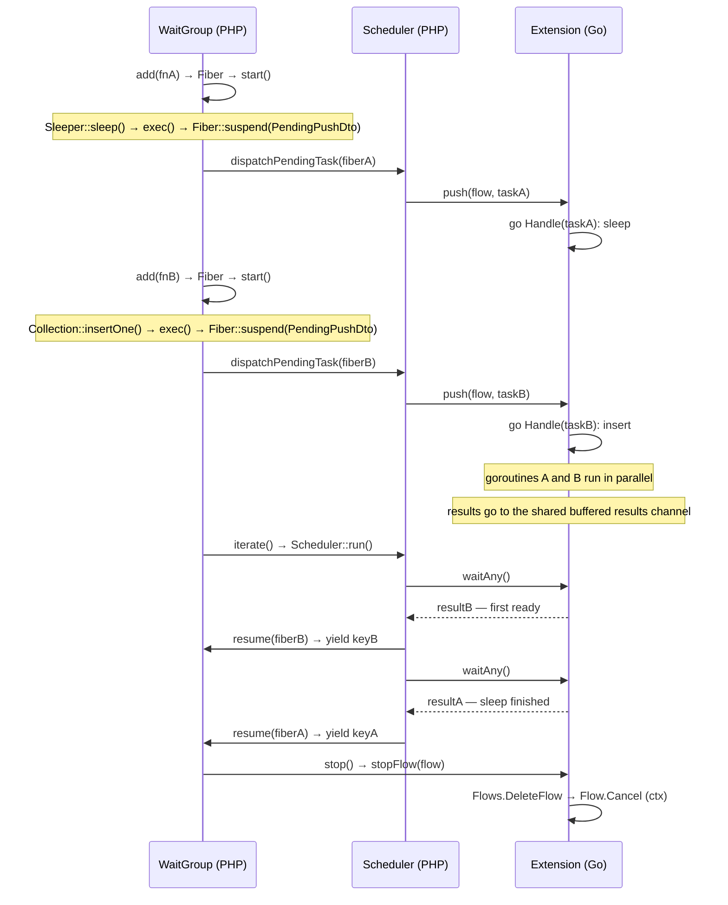
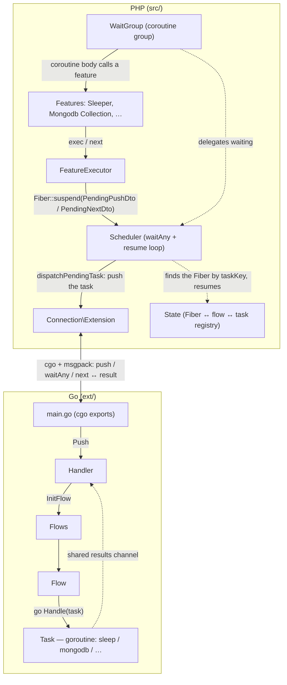

English | [Русский](architecture.ru.md)

# Architecture

How SConcur works inside: the PHP Fiber ↔ Go goroutine pairing, the scheduler,
the layers and the lifecycle of a single task.

See also [README](../README.md) — overview and usage.

## How it works

`WaitGroup` is the public API of a coroutine group built on top of PHP Fibers.
Each task closure is wrapped in a `Fiber`; when an async feature is called
inside a coroutine, the coroutine suspends, handing out a deferred task
(`Fiber::suspend(PendingPushDto)`). The push to Go is performed by the side that
takes over control — `WaitGroup::launch` or the scheduler — through
`Scheduler::dispatchPendingTask()` from its own stack, and the task runs in a
separate goroutine. cgo is never called from a coroutine's stack: a fan-out of N
live fibers, each having crossed the PHP↔Go boundary, degraded quadratically.

Waiting and resumption are managed by a single process-wide `Scheduler`
(singleton, `Scheduler::get()`) — the only place that waits on the extension and
resumes coroutines. It spins `Extension::waitAny()` and receives the first ready
result of any flow: all goroutines push their results into one shared buffered
channel on the Go side. By `taskKey` the scheduler finds the right coroutine and
resumes it.

Because every resumption comes from the scheduler, coroutines do not nest on
each other's call stack. Thanks to this, a nested `WaitGroup` inside a coroutine
does not block the outer flow: it cooperatively suspends
(`Scheduler::awaitGroup()`) until its group finishes, while the outer coroutines
keep running the whole time.

The synchronous path — calling a feature outside a Fiber — waits for its flow
through `Extension::wait(flowKey)`; there is no concurrency there.

## Diagram: PHP Fiber ↔ Go goroutine

Results arrive in task-completion order, not in `add()` order.

## Layers and call flow

How to read it: solid arrows are the task's outbound path (from the coroutine
body to the goroutine in Go), the dashed ones are the separate machinery for
waiting on and resuming coroutines (`Scheduler` + `State`), which runs beside the
dispatch path.

Key entities:

- `WaitGroup` — public API: `add()`, `iterate()`, `waitAll()`,
  `waitResults()`. Each instance owns a unique `flowKey`. A thin scheduler
  client: it keeps its own coroutines and hands out their results as they become
  ready. The optional `maxConcurrency` (`create(maxConcurrency: N)`, 0 = no
  limit, the default) caps the number of simultaneously live coroutines —
  backpressure on memory and connection pools; extra `add()`s wait in a queue and
  start as slots free up.
- `Scheduler` (`src/Scheduler/`) — the single process-wide scheduler
  (singleton): the shared coroutine registry (`Coroutine`), one `waitAny` loop,
  resuming coroutines by `taskKey`, waking those waiting for a nested group to
  finish (`awaitGroup`), and dispatching deferred tasks to Go
  (`dispatchPendingTask`) — cgo is not called from a coroutine's stack.
- `State` (`src/State.php`) — the static registry of `Fiber ↔ flow ↔ task`
  links.
- `FeatureExecutor` — the entry point for features; it determines the async
  context via `State::getCurrentFlow()` and suspends the coroutine, handing the
  deferred task (`PendingPushDto`/`PendingNextDto`) to the resumer — on the async
  path it does not go to Go itself.
- `Connection\Extension` — a singleton wrapper over the exported C functions of
  the Go extension (`push`, `waitAny`, `wait`, `next`, `stopFlow`, `destroy`,
  etc.).
- Go: `Handler → Flows → Flow → Task` — each task runs in its own goroutine;
  the results of all flows go into one shared buffered channel, from which
  `Handler.WaitAny()` hands out the first ready one (`Wait(flowKey)` remains for
  the synchronous path). A stopped flow's result still left in the buffer is
  dropped on receipt.

## Lifecycle of a single task

1. `WaitGroup::add($callback)` wraps the closure in a `Fiber`, registers the
   `fiber → flow` link in `State`, creates a coroutine in the `Scheduler` and
   calls `$fiber->start()`.
2. The coroutine runs synchronously up to the first async call. Inside a feature
   (`Sleeper::sleep`, `Collection::insertOne`, …) `FeatureExecutor::exec($payload)`
   is called:
   - `State::getCurrentFlow()` determines that we are inside a registered
     coroutine (`isAsync = true`);
   - the coroutine suspends, handing the deferred task out:
     `Fiber::suspend(new PendingPushDto(flowKey, payload))` — control returns to
     wherever it was started (`WaitGroup::launch` or the scheduler);
   - the receiving side calls `Scheduler::dispatchPendingTask()`:
     `Extension::push()` forms `taskKey = flowKey:counter`, sends the task to Go
     over cgo and stores the `task → fiber` link in `State`. cgo is thereby not
     called from a coroutine's stack (a fan-out of many live boundary-crossing
     fibers degraded quadratically); a push error is thrown back into the
     coroutine at the suspend point;
   - from then on only the `Scheduler` resumes this coroutine.
3. If the coroutine finished without suspending (a synchronous task), its result
   goes straight into the group's ready-results queue. Otherwise it stays a live
   coroutine (in the group and in the `Scheduler` registry).
4. On the Go side `push → Handler.Push → Flows.InitFlow → Flow.HandleMessage`
   creates a `Task` and starts a goroutine with the feature handler. The result
   goes into the shared buffered results channel, and the goroutine finishes
   without waiting for PHP to pick it up.
5. `WaitGroup::iterate()` (a generator) hands out ready results, and while there
   are unfinished coroutines it delegates waiting to the scheduler:
   - at the top level (outside a Fiber) it spins `Scheduler::run()` — the
     `Extension::waitAny()` loop (the first ready result of any flow);
   - a nested `iterate()` (inside a coroutine) cooperatively suspends
     (`Scheduler::awaitGroup()`), not blocking the outer flow.
6. By `taskKey` the scheduler finds the coroutine (`State::pullFiberByTask`) and
   `$fiber->resume($taskResult)` resumes it: `Fiber::suspend()` inside
   `FeatureExecutor` returns `TaskResultDto`, and the coroutine continues.
7. If the coroutine finished — `iterate()` hands out `callbackKey ⇒ <return value>`.
   If it suspended again (for example, a cursor requested the next batch via
   `next`), the loop continues. On completion `finally → stop()` unwinds the
   remaining coroutines and clears `State` and the Go flow.

`waitAll()` is `iterator_count(iterate())`; `waitResults()` collects the results
into an array keyed by `callbackKey`.
