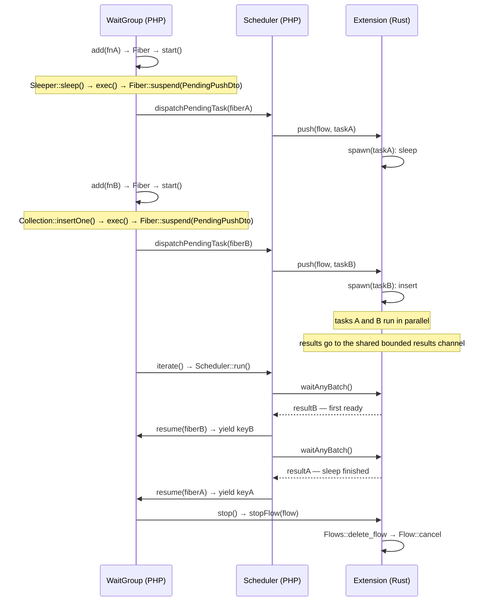
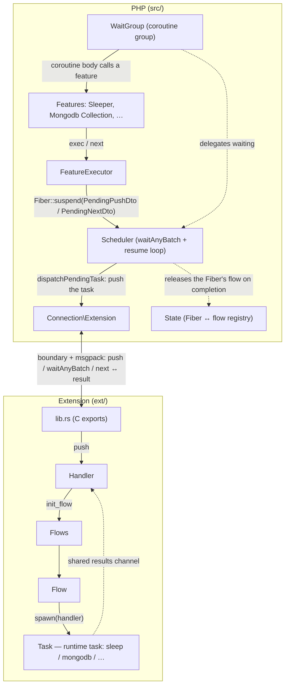

English | [Русский](architecture.ru.md)

# Architecture

The PHP Fiber ↔ runtime task pairing, the scheduler, the layers and the lifecycle
of one task. See also the [README](../README.md).

## How it works

`WaitGroup` is the public API of a coroutine group built on PHP Fibers. Each
task closure is wrapped in a `Fiber`; when an async feature is called inside a
coroutine, the coroutine suspends and hands out a deferred task
(`Fiber::suspend(PendingPushDto)`). The push to the extension is done by whoever took over
control — `WaitGroup::launch` or the scheduler — through
`Scheduler::dispatchPendingTask()` from its own stack, and the task runs in a
separate task on its runtime. The suspend is the point: a coroutine never crosses
the boundary for its own task, because when N live fibers had each crossed the
boundary from its own stack, the cost grew quadratically with N. The crossing
itself runs on whichever stack took control — the main one, or a parent
coroutine's when a nested group starts a member.

Every `WaitGroup` owns one flow — the group of its tasks inside the extension; flows
are what the extension cancels, waits on and routes results by.

Waiting and resumption belong to a single process-wide `Scheduler` (singleton,
`Scheduler::get()`) — the only place that waits on the extension and resumes
coroutines. Every task pushes its result into one shared bounded channel inside
the extension; `Extension::waitAnyBatch()` blocks until the first result of any
flow is ready and reads every other already-ready result in the same
crossing (up to 64). The scheduler consumes the batch one result per step: the
result frame names the coroutine that awaits it, and the scheduler resumes that
one.

Because every resumption comes from the scheduler, coroutines do not nest on each
other's call stack. So a nested `WaitGroup` inside a coroutine does not block the
outer flow: it cooperatively suspends (`Scheduler::awaitGroup()`) until its group
has a result to hand over or has finished, while the outer coroutines keep
running. A ready result wakes it as soon as it lands, so a nested `iterate()`
streams the way the top-level one does — it does not hold the first result until
the slowest member is done.

The synchronous path — a feature called outside a Fiber — waits for its flow
through `Extension::wait(flowKey)`; there is no concurrency there.

A coroutine can also be given a deadline, past which the scheduler unwinds it where it
stands — see [coroutine timeout](coroutine-timeout.md).

## Diagram: PHP Fiber ↔ runtime task

```mermaid
sequenceDiagram
    participant WG as WaitGroup (PHP)
    participant S as Scheduler (PHP)
    participant EXT as Extension (Rust)

    WG->>WG: add(fnA) → Fiber → start()
    Note over WG: Sleeper::sleep() → exec() → Fiber::suspend(PendingPushDto)
    WG->>S: dispatchPendingTask(fiberA)
    S->>EXT: push(flow, taskA)
    EXT->>EXT: spawn(taskA): sleep

    WG->>WG: add(fnB) → Fiber → start()
    Note over WG: Collection::insertOne() → exec() → Fiber::suspend(PendingPushDto)
    WG->>S: dispatchPendingTask(fiberB)
    S->>EXT: push(flow, taskB)
    EXT->>EXT: spawn(taskB): insert
    Note over EXT: tasks A and B run in parallel
    Note over EXT: results go to the shared bounded results channel

    WG->>S: iterate() → Scheduler::run()
    S->>EXT: waitAnyBatch()
    EXT-->>S: resultB — first ready
    S->>WG: resume(fiberB) → yield keyB
    S->>EXT: waitAnyBatch()
    EXT-->>S: resultA — sleep finished
    S->>WG: resume(fiberA) → yield keyA

    WG->>EXT: stop() → stopFlow(flow)
    EXT->>EXT: Flows::delete_flow → Flow::cancel
```

Results arrive in task-completion order, not in `add()` order.

## Layers and call flow

Solid arrows are the task's outbound path (from the coroutine body to the
runtime task in the extension); dashed ones are the waiting/resumption machinery
(`Scheduler` + `State`) running beside it.

```mermaid
flowchart TB
    subgraph PHP["PHP (src/)"]
        direction TB
        WG["WaitGroup (coroutine group)"]
        F["Features: Sleeper, Mongodb Collection, …"]
        FE[FeatureExecutor]
        EXT["Connection\Extension"]
        SCH["Scheduler (waitAnyBatch + resume loop)"]
        ST["State (Fiber ↔ flow registry)"]

        WG -->|"coroutine body calls a feature"| F
        F -->|"exec / next"| FE
        FE -->|"Fiber::suspend(PendingPushDto / PendingNextDto)"| SCH
        SCH -->|"dispatchPendingTask: push the task"| EXT
        WG -.->|"delegates waiting"| SCH
        SCH -.->|"releases the Fiber's flow on completion"| ST
    end

    EXT <-->|"boundary + msgpack: push / waitAnyBatch / next ↔ result"| LIB

    subgraph EXTENSION["Extension (ext/)"]
        direction TB
        LIB["lib.rs (C exports)"]
        H[Handler]
        FLOWS[Flows]
        FLOW[Flow]
        TASK["Task — runtime task: sleep / mongodb / …"]

        LIB -->|"push"| H
        H -->|"init_flow"| FLOWS
        FLOWS --> FLOW
        FLOW -->|"spawn(handler)"| TASK
        TASK -.->|"shared results channel"| H
    end
```

Key entities:

- `WaitGroup` — `add()`, `iterate()`, `waitAll()`, `waitResults()`. Each instance
  owns a unique `flowKey` and hands out its coroutines' results as they become
  ready. `create(maxConcurrency: N)` caps the number of simultaneously live
  coroutines (0 = no limit, the default); extra `add()`s wait in a queue.
- `Scheduler` (`src/Scheduler/`) — the process-wide singleton: the coroutine
  registry (`Coroutine`), one `waitAnyBatch` loop, resuming by the result's owner id,
  waking nested-group waiters (`awaitGroup`), dispatching deferred tasks to the
  extension (`dispatchPendingTask`). Spawned coroutines (`spawn` — one per server request)
  run on recycled fibers from `FiberPool`: the fiber's callback is an infinite
  worker loop that parks on `Fiber::suspend()` between jobs instead of
  terminating, so the fiber stack is mapped once, not per request.
- `State` (`src/State.php`) — the static registry of `Fiber ↔ flow` links (result
  routing needs no task map: the owner travels in the frame).
- `FeatureExecutor` — the features' entry point: detects the async context via
  `State::getCurrentFlow()` and suspends the coroutine, handing the deferred
  task to the side that will send it across. On the async path it never crosses
  the boundary itself.
- `Connection\Extension` — a singleton over the extension's exported C functions
  (`push`, `waitAnyBatch`, `wait`, `next`, `stopFlow`, `destroy`, …).
- Extension: `Handler → Flows → Flow → Task`. Each task runs on the runtime;
  results of all flows go into one shared bounded channel, from which
  `Handler::wait_any()` hands out the first ready one (`wait(flow_key)` remains
  for the synchronous path). A stopped flow's result still in the buffer is
  dropped on receipt.

## Lifecycle of a single task

1. `WaitGroup::add($callback)` wraps the closure in a `Fiber`, registers the
   `fiber → flow` link in `State`, creates a coroutine in the `Scheduler` and
   calls `$fiber->start()`.
2. The coroutine runs synchronously up to the first async call, where
   `FeatureExecutor::exec($payload)` suspends it with
   `PendingPushDto(flowKey, payload)`. The receiving side calls
   `Scheduler::dispatchPendingTask()`: `Extension::push()` forms
   `taskKey = flowKey:counter` and sends the task across the boundary together with
   the coroutine's id; the awaited flow/task keys are recorded on the
   `Coroutine`. A push error is thrown back into the coroutine at the suspend
   point. From then on only the `Scheduler` resumes it.
3. A coroutine that finished without suspending puts its result straight into the
   group's ready queue; otherwise it stays live in the group and the scheduler
   registry.
4. Inside the extension `push → Handler::push → Flows::init_flow →
   Flow::handle_message` creates a `Task` and spawns it with the feature handler.
   The result goes into the shared bounded channel, and the task finishes without
   waiting for PHP to pick it up.
5. `WaitGroup::iterate()` hands out ready results and delegates waiting: at the
   top level it spins `Scheduler::run()` (the `waitAnyBatch` loop), while a
   nested `iterate()` cooperatively suspends via `Scheduler::awaitGroup()`.
6. The result frame carries the owner id back; the scheduler checks the
   coroutine still awaits exactly this flow/task (ids are reused once a fiber is
   freed) and `resume($taskResult)` returns `TaskResultDto` out of
   `Fiber::suspend()` inside `FeatureExecutor`.
7. A finished coroutine yields `callbackKey ⇒ <return value>`; one that suspended
   again (a cursor requesting the next batch via `next`) stays in the loop. On
   completion `finally → stop()` unwinds the rest and clears `State` and the flow
   inside the extension.

`waitAll()` is `iterator_count(iterate())`; `waitResults()` collects the results
into an array keyed by `callbackKey`.
