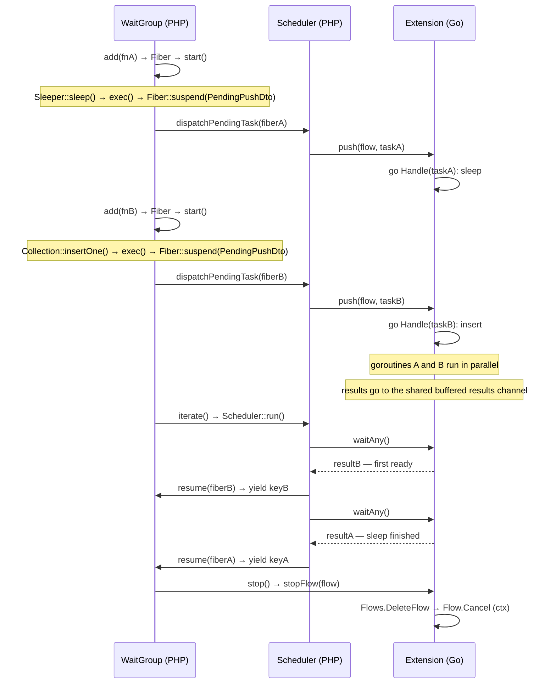
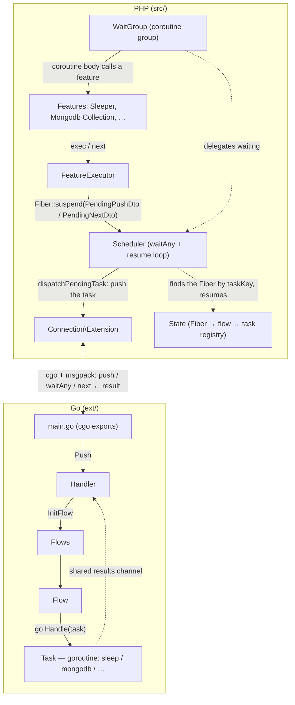

English | [Русский](architecture.ru.md)

# Architecture

The PHP Fiber ↔ Go goroutine pairing, the scheduler, the layers and the lifecycle
of one task. See also the [README](../README.md).

## How it works

`WaitGroup` is the public API of a coroutine group built on PHP Fibers. Each task
closure is wrapped in a `Fiber`; when an async feature is called inside a
coroutine, the coroutine suspends and hands out a deferred task
(`Fiber::suspend(PendingPushDto)`). The push to Go is done by whoever took over
control — `WaitGroup::launch` or the scheduler — through
`Scheduler::dispatchPendingTask()` from its own stack, and the task runs in a
separate goroutine. cgo is never called from a coroutine's stack: a fan-out of N
live fibers, each having crossed the PHP↔Go boundary, degraded quadratically.

Waiting and resumption belong to a single process-wide `Scheduler` (singleton,
`Scheduler::get()`) — the only place that waits on the extension and resumes
coroutines. All goroutines push their results into one shared buffered channel on
the Go side; `Extension::waitAnyBatch()` blocks for the first ready result of any
flow and drains every further already-ready result in the same cgo crossing (up
to 64). The scheduler consumes the batch one result per step: by `taskKey` it
finds the coroutine and resumes it.

Because every resumption comes from the scheduler, coroutines do not nest on each
other's call stack. So a nested `WaitGroup` inside a coroutine does not block the
outer flow: it cooperatively suspends (`Scheduler::awaitGroup()`) until its group
finishes, while the outer coroutines keep running.

The synchronous path — a feature called outside a Fiber — waits for its flow
through `Extension::wait(flowKey)`; there is no concurrency there.

## Diagram: PHP Fiber ↔ Go goroutine

```mermaid
sequenceDiagram
    participant WG as WaitGroup (PHP)
    participant S as Scheduler (PHP)
    participant Go as Extension (Go)

    WG->>WG: add(fnA) → Fiber → start()
    Note over WG: Sleeper::sleep() → exec() → Fiber::suspend(PendingPushDto)
    WG->>S: dispatchPendingTask(fiberA)
    S->>Go: push(flow, taskA)
    Go->>Go: go Handle(taskA): sleep

    WG->>WG: add(fnB) → Fiber → start()
    Note over WG: Collection::insertOne() → exec() → Fiber::suspend(PendingPushDto)
    WG->>S: dispatchPendingTask(fiberB)
    S->>Go: push(flow, taskB)
    Go->>Go: go Handle(taskB): insert
    Note over Go: goroutines A and B run in parallel
    Note over Go: results go to the shared buffered results channel

    WG->>S: iterate() → Scheduler::run()
    S->>Go: waitAny()
    Go-->>S: resultB — first ready
    S->>WG: resume(fiberB) → yield keyB
    S->>Go: waitAny()
    Go-->>S: resultA — sleep finished
    S->>WG: resume(fiberA) → yield keyA

    WG->>Go: stop() → stopFlow(flow)
    Go->>Go: Flows.DeleteFlow → Flow.Cancel (ctx)
```

Results arrive in task-completion order, not in `add()` order.

## Layers and call flow

Solid arrows are the task's outbound path (from the coroutine body to the
goroutine in Go); dashed ones are the waiting/resumption machinery
(`Scheduler` + `State`) running beside it.

```mermaid
flowchart TB
    subgraph PHP["PHP (src/)"]
        direction TB
        WG["WaitGroup (coroutine group)"]
        F["Features: Sleeper, Mongodb Collection, …"]
        FE[FeatureExecutor]
        EXT["Connection\Extension"]
        SCH["Scheduler (waitAny + resume loop)"]
        ST["State (Fiber ↔ flow ↔ task registry)"]

        WG -->|"coroutine body calls a feature"| F
        F -->|"exec / next"| FE
        FE -->|"Fiber::suspend(PendingPushDto / PendingNextDto)"| SCH
        SCH -->|"dispatchPendingTask: push the task"| EXT
        WG -.->|"delegates waiting"| SCH
        SCH -.->|"finds the Fiber by taskKey, resumes"| ST
    end

    EXT <-->|"cgo + msgpack: push / waitAny / next ↔ result"| MAIN

    subgraph GO["Go (ext/)"]
        direction TB
        MAIN["main.go (cgo exports)"]
        H[Handler]
        FLOWS[Flows]
        FLOW[Flow]
        TASK["Task — goroutine: sleep / mongodb / …"]

        MAIN -->|"Push"| H
        H -->|"InitFlow"| FLOWS
        FLOWS --> FLOW
        FLOW -->|"go Handle(task)"| TASK
        TASK -.->|"shared results channel"| H
    end
```

Key entities:

- `WaitGroup` — `add()`, `iterate()`, `waitAll()`, `waitResults()`. Each instance
  owns a unique `flowKey` and hands out its coroutines' results as they become
  ready. `create(maxConcurrency: N)` caps the number of simultaneously live
  coroutines (0 = no limit, the default); extra `add()`s wait in a queue.
- `Scheduler` (`src/Scheduler/`) — the process-wide singleton: the coroutine
  registry (`Coroutine`), one `waitAny` loop, resuming by `taskKey`, waking
  nested-group waiters (`awaitGroup`), dispatching deferred tasks to Go
  (`dispatchPendingTask`).
- `State` (`src/State.php`) — the static registry of `Fiber ↔ flow ↔ task` links.
- `FeatureExecutor` — the features' entry point: detects the async context via
  `State::getCurrentFlow()` and suspends the coroutine, handing the deferred task
  to the resumer. On the async path it never goes into Go itself.
- `Connection\Extension` — a singleton over the extension's exported C functions
  (`push`, `waitAny`, `wait`, `next`, `stopFlow`, `destroy`, …).
- Go: `Handler → Flows → Flow → Task`. Each task runs in its own goroutine;
  results of all flows go into one shared buffered channel, from which
  `Handler.WaitAny()` hands out the first ready one (`Wait(flowKey)` remains for
  the synchronous path). A stopped flow's result still in the buffer is dropped
  on receipt.

## Lifecycle of a single task

1. `WaitGroup::add($callback)` wraps the closure in a `Fiber`, registers the
   `fiber → flow` link in `State`, creates a coroutine in the `Scheduler` and
   calls `$fiber->start()`.
2. The coroutine runs synchronously up to the first async call, where
   `FeatureExecutor::exec($payload)` suspends it with
   `PendingPushDto(flowKey, payload)`. The receiving side calls
   `Scheduler::dispatchPendingTask()`: `Extension::push()` forms
   `taskKey = flowKey:counter`, sends the task to Go over cgo and stores the
   `task → fiber` link in `State`. A push error is thrown back into the coroutine
   at the suspend point. From then on only the `Scheduler` resumes it.
3. A coroutine that finished without suspending puts its result straight into the
   group's ready queue; otherwise it stays live in the group and the scheduler
   registry.
4. On the Go side `push → Handler.Push → Flows.InitFlow → Flow.HandleMessage`
   creates a `Task` and starts a goroutine with the feature handler. The result
   goes into the shared buffered channel, and the goroutine finishes without
   waiting for PHP to pick it up.
5. `WaitGroup::iterate()` hands out ready results and delegates waiting: at the
   top level it spins `Scheduler::run()` (the `waitAnyBatch` loop), while a
   nested `iterate()` cooperatively suspends via `Scheduler::awaitGroup()`.
6. By `taskKey` the scheduler finds the coroutine (`State::pullFiberByTask`) and
   `resume($taskResult)` returns `TaskResultDto` out of `Fiber::suspend()` inside
   `FeatureExecutor`.
7. A finished coroutine yields `callbackKey ⇒ <return value>`; one that suspended
   again (a cursor requesting the next batch via `next`) stays in the loop. On
   completion `finally → stop()` unwinds the rest and clears `State` and the Go
   flow.

`waitAll()` is `iterator_count(iterate())`; `waitResults()` collects the results
into an array keyed by `callbackKey`.
