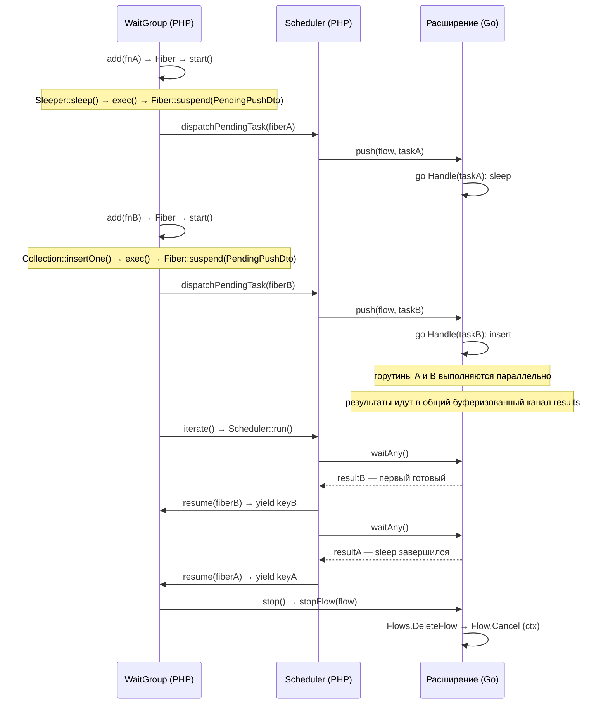
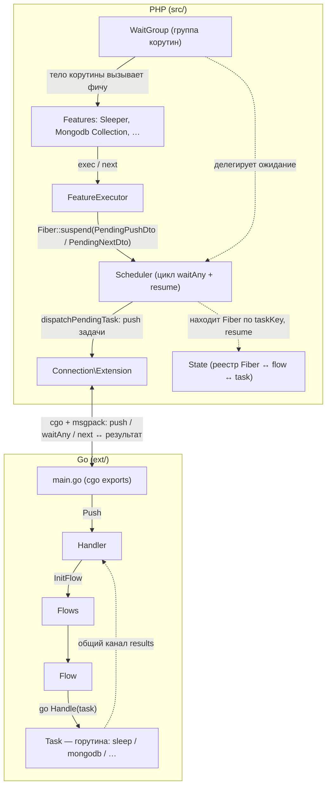

[English](architecture.md) | Русский

# Архитектура

Как устроен SConcur изнутри: связка PHP Fiber ↔ Go goroutine, планировщик,
слои и жизненный цикл одной задачи.

См. также [README](../README.ru.md) — обзор и применение.

## Принцип работы

`WaitGroup` — публичный API группы корутин поверх PHP Fibers. Каждое
замыкание-таск оборачивается в `Fiber`; когда внутри корутины вызывается
асинхронная фича, корутина приостанавливается, передавая наружу отложенную
задачу (`Fiber::suspend(PendingPushDto)`). Отправку в Go выполняет принявшая
управление сторона — `WaitGroup::launch` или планировщик — через
`Scheduler::dispatchPendingTask()` со своего стека, и задача выполняется в
отдельной горутине. cgo никогда не вызывается со стека корутины: веер из N
живых фиберов, каждый из которых пересёк границу PHP↔Go, деградировал
квадратично.

Ожиданием и возобновлением управляет единый процессный `Scheduler` (синглтон,
`Scheduler::get()`) — единственное место, которое ждёт расширение и возобновляет
корутины. Он крутит `Extension::waitAny()` и получает первый готовый результат
любого флоу: все горутины пушат результаты в один общий буферизованный канал на
стороне Go. По `taskKey` планировщик находит нужную корутину и возобновляет её.

Поскольку все возобновления идут из планировщика, корутины не вкладываются друг
в друга по стеку вызовов. Благодаря этому вложенный `WaitGroup` внутри корутины
не блокирует внешний флоу: он кооперативно приостанавливается
(`Scheduler::awaitGroup()`), пока его группа не завершится, а внешние корутины
всё это время продолжают исполняться.

Синхронный путь — вызов фичи вне Fiber — дожидается своего флоу через
`Extension::wait(flowKey)`; конкуренции там нет.

## Схема: PHP Fiber ↔ Go goroutine

Результаты приходят в порядке завершения задач, а не в порядке `add()`.

## Слои и поток вызовов

Как читать: сплошные стрелки — путь задачи «туда» (от тела корутины до горутины в
Go), пунктир — отдельная машинерия ожидания и возобновления корутин
(`Scheduler` + `State`), которая работает сбоку от пути отправки.

Ключевые сущности:

- `WaitGroup` — публичный API: `add()`, `iterate()`, `waitAll()`,
  `waitResults()`. Каждый экземпляр владеет уникальным `flowKey`. Тонкий клиент
  планировщика: хранит свои корутины и отдаёт их результаты по мере готовности.
  Опциональный `maxConcurrency` (`create(maxConcurrency: N)`, 0 = без лимита,
  дефолт) ограничивает число одновременно живых корутин — backpressure по памяти
  и пулам соединений; лишние `add()` ждут в очереди и запускаются по мере
  освобождения слотов.
- `Scheduler` (`src/Scheduler/`) — единый процессный планировщик (синглтон):
  общий реестр корутин (`Coroutine`), один цикл `waitAny`, возобновление корутин
  по `taskKey`, пробуждение тех, кто ждёт завершения вложенной группы
  (`awaitGroup`), и отправка отложенных задач в Go (`dispatchPendingTask`) — cgo
  не вызывается со стека корутины.
- `State` (`src/State.php`) — статический реестр связей `Fiber ↔ flow ↔ task`.
- `FeatureExecutor` — точка входа для фич; определяет async-контекст через
  `State::getCurrentFlow()` и приостанавливает корутину, передавая отложенную
  задачу (`PendingPushDto`/`PendingNextDto`) резюмеру — на async-пути сам в Go
  не ходит.
- `Connection\Extension` — синглтон-обёртка над экспортированными C-функциями
  Go-расширения (`push`, `waitAny`, `wait`, `next`, `stopFlow`, `destroy` и др.).
- Go: `Handler → Flows → Flow → Task` — каждая задача исполняется в своей
  горутине; результаты всех флоу идут в один общий буферизованный канал, откуда
  `Handler.WaitAny()` отдаёт первый готовый (`Wait(flowKey)` остаётся для
  синхронного пути). Результат остановленного флоу, оставшийся в буфере,
  дропается на приёме.

## Жизненный цикл одной задачи

1. `WaitGroup::add($callback)` оборачивает замыкание в `Fiber`, регистрирует
   связь `fiber → flow` в `State`, заводит корутину в `Scheduler` и вызывает
   `$fiber->start()`.
2. Корутина выполняется синхронно до первого асинхронного вызова. Внутри фичи
   (`Sleeper::sleep`, `Collection::insertOne`, …) вызывается
   `FeatureExecutor::exec($payload)`:
   - `State::getCurrentFlow()` определяет, что мы внутри зарегистрированной
     корутины (`isAsync = true`);
   - корутина приостанавливается, передавая отложенную задачу наружу:
     `Fiber::suspend(new PendingPushDto(flowKey, payload))` — управление
     возвращается туда, откуда её запустили (`WaitGroup::launch` или
     планировщик);
   - принявшая сторона вызывает `Scheduler::dispatchPendingTask()`:
     `Extension::push()` формирует `taskKey = flowKey:counter`, через cgo
     отправляет задачу в Go и сохраняет связь `task → fiber` в `State`. cgo
     при этом не вызывается со стека корутины (веер из множества живых
     пересёкших границу фиберов деградировал квадратично); ошибка отправки
     бросается обратно в корутину в точку suspend;
   - дальше эту корутину возобновляет только `Scheduler`.
3. Если корутина завершилась не приостановившись (синхронный таск), её результат
   сразу попадает в очередь готовых результатов группы. Иначе она остаётся живой
   корутиной (в группе и в реестре `Scheduler`).
4. На стороне Go `push → Handler.Push → Flows.InitFlow → Flow.HandleMessage`
   создаёт `Task` и запускает горутину с обработчиком фичи. Результат уходит в
   общий буферизованный канал результатов, и горутина завершается, не дожидаясь,
   пока PHP его заберёт.
5. `WaitGroup::iterate()` (генератор) отдаёт готовые результаты, а пока есть
   незавершённые корутины — делегирует ожидание планировщику:
   - на верхнем уровне (вне Fiber) крутит `Scheduler::run()` — цикл
     `Extension::waitAny()` (первый готовый результат любого флоу);
   - вложенный `iterate()` (внутри корутины) кооперативно приостанавливается
     (`Scheduler::awaitGroup()`), не блокируя внешний флоу.
6. По `taskKey` планировщик находит корутину (`State::pullFiberByTask`) и
   `$fiber->resume($taskResult)` возобновляет её: `Fiber::suspend()` внутри
   `FeatureExecutor` возвращает `TaskResultDto`, корутина продолжается.
7. Если корутина завершилась — `iterate()` отдаёт `callbackKey ⇒ <return value>`.
   Если снова приостановилась (например, курсор запросил следующий батч через
   `next`), цикл продолжается. По завершении `finally → stop()` размывает
   оставшиеся корутины и очищает `State` и Go-флоу.

`waitAll()` — это `iterator_count(iterate())`; `waitResults()` собирает
результаты в массив по `callbackKey`.
