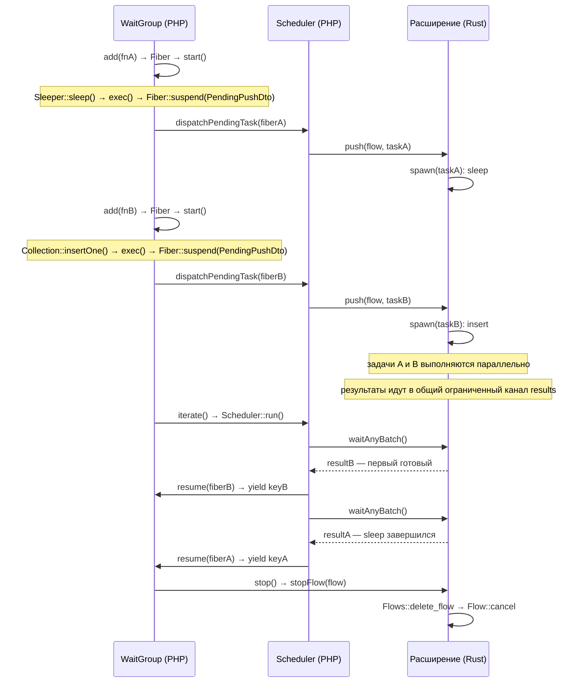
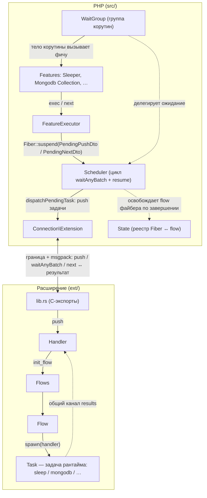

[English](architecture.md) | Русский

# Архитектура

Связка PHP Fiber ↔ задача рантайма, планировщик, слои и жизненный цикл одной
задачи. См. также [README](../README.ru.md).

## Принцип работы

`WaitGroup` — публичный API группы корутин поверх PHP Fibers. Каждое
замыкание-таск оборачивается в `Fiber`; когда внутри корутины вызывается
асинхронная фича, корутина приостанавливается, передавая наружу отложенную
задачу (`Fiber::suspend(PendingPushDto)`). Отправку в расширение выполняет принявшая
управление сторона — `WaitGroup::launch` или планировщик — через
`Scheduler::dispatchPendingTask()` со своего стека, и задача выполняется в
отдельной задачей рантайма. Смысл приостановки в этом: корутина никогда не
пересекает границу ради собственной задачи — когда N живых фиберов пересекали границу
каждый со своего стека, затраты росли квадратично от N. Само пересечение
выполняется на том стеке, который принял управление: на главном или на стеке
родительской корутины, если вложенная группа запускает участника.

Каждый `WaitGroup` владеет одним флоу — так называется группа его задач на
стороне расширения; именно по флоу оно отменяет задачи, ждёт их и маршрутизирует
результаты.

Ожиданием и возобновлением управляет единый процессный `Scheduler` (синглтон,
`Scheduler::get()`) — единственное место, которое ждёт расширение и возобновляет
корутины. Все задачи складывают результаты в один общий ограниченный канал
внутри расширения; `Extension::waitAnyBatch()` блокируется, пока не будет готов
первый результат любого флоу, и в том же переходе через границу дочитывает все остальные
уже готовые (до 64). Планировщик разбирает пачку по одному результату за шаг:
кадр результата сам называет ожидающую его корутину, её планировщик и
возобновляет.

Поскольку все возобновления идут из планировщика, корутины не вкладываются друг в
друга по стеку вызовов. Поэтому вложенный `WaitGroup` внутри корутины не
блокирует внешний флоу: он кооперативно приостанавливается
(`Scheduler::awaitGroup()`), пока у его группы не появится результат или пока она
не завершится, а внешние корутины продолжают исполняться. Готовый результат будит
ждущего сразу, так что вложенный `iterate()` отдаёт результаты потоком, как и
верхнеуровневый, — он не держит первый до конца самого медленного участника.

Синхронный путь — вызов фичи вне Fiber — дожидается своего флоу через
`Extension::wait(flowKey)`; конкуренции там нет.

Корутине можно задать срок, по истечении которого планировщик размотает её там, где она
стоит, — см. [таймаут корутины](coroutine-timeout.ru.md).

## Схема: PHP Fiber ↔ задача рантайма

```mermaid
sequenceDiagram
    participant WG as WaitGroup (PHP)
    participant S as Scheduler (PHP)
    participant EXT as Расширение (Rust)

    WG->>WG: add(fnA) → Fiber → start()
    Note over WG: Sleeper::sleep() → exec() → Fiber::suspend(PendingPushDto)
    WG->>S: dispatchPendingTask(fiberA)
    S->>EXT: push(flow, taskA)
    EXT->>EXT: spawn(taskA): sleep

    WG->>WG: add(fnB) → Fiber → start()
    Note over WG: Collection::insertOne() → exec() → Fiber::suspend(PendingPushDto)
    WG->>S: dispatchPendingTask(fiberB)
    S->>EXT: push(flow, taskB)
    EXT->>EXT: spawn(taskB): insert
    Note over EXT: задачи A и B выполняются параллельно
    Note over EXT: результаты идут в общий ограниченный канал results

    WG->>S: iterate() → Scheduler::run()
    S->>EXT: waitAnyBatch()
    EXT-->>S: resultB — первый готовый
    S->>WG: resume(fiberB) → yield keyB
    S->>EXT: waitAnyBatch()
    EXT-->>S: resultA — sleep завершился
    S->>WG: resume(fiberA) → yield keyA

    WG->>EXT: stop() → stopFlow(flow)
    EXT->>EXT: Flows::delete_flow → Flow::cancel
```

Результаты приходят в порядке завершения задач, а не в порядке `add()`.

## Слои и поток вызовов

Сплошные стрелки — путь задачи «туда» (от тела корутины до задачи рантайма в расширении),
пунктир — машинерия ожидания и возобновления корутин (`Scheduler` + `State`),
работающая сбоку.

```mermaid
flowchart TB
    subgraph PHP["PHP (src/)"]
        direction TB
        WG["WaitGroup (группа корутин)"]
        F["Features: Sleeper, Mongodb Collection, …"]
        FE[FeatureExecutor]
        EXT["Connection\Extension"]
        SCH["Scheduler (цикл waitAnyBatch + resume)"]
        ST["State (реестр Fiber ↔ flow)"]

        WG -->|"тело корутины вызывает фичу"| F
        F -->|"exec / next"| FE
        FE -->|"Fiber::suspend(PendingPushDto / PendingNextDto)"| SCH
        SCH -->|"dispatchPendingTask: push задачи"| EXT
        WG -.->|"делегирует ожидание"| SCH
        SCH -.->|"освобождает flow файбера по завершении"| ST
    end

    EXT <-->|"граница + msgpack: push / waitAnyBatch / next ↔ результат"| LIB

    subgraph EXTENSION["Расширение (ext/)"]
        direction TB
        LIB["lib.rs (C-экспорты)"]
        H[Handler]
        FLOWS[Flows]
        FLOW[Flow]
        TASK["Task — задача рантайма: sleep / mongodb / …"]

        LIB -->|"push"| H
        H -->|"init_flow"| FLOWS
        FLOWS --> FLOW
        FLOW -->|"spawn(handler)"| TASK
        TASK -.->|"общий канал results"| H
    end
```

Ключевые сущности:

- `WaitGroup` — `add()`, `iterate()`, `waitAll()`, `waitResults()`. Каждый
  экземпляр владеет уникальным `flowKey` и отдаёт результаты своих корутин по
  мере готовности. `create(maxConcurrency: N)` ограничивает число одновременно
  живых корутин (0 = без лимита, дефолт); лишние `add()` ждут в очереди.
- `Scheduler` (`src/Scheduler/`) — процессный синглтон: реестр корутин
  (`Coroutine`), один цикл `waitAnyBatch`, возобновление по id владельца из
  результата, пробуждение
  ждущих вложенную группу (`awaitGroup`), отправка отложенных задач в расширение
  (`dispatchPendingTask`). Spawned-корутины (`spawn` — по одной на запрос
  сервера) работают на переиспользуемых файберах из `FiberPool`: колбэк файбера
  — вечный рабочий цикл, который между заданиями паркуется на `Fiber::suspend()`
  вместо завершения, так что стек файбера отображается один раз, а не на каждый
  запрос.
- `State` (`src/State.php`) — статический реестр связей `Fiber ↔ flow`
  (маршрутизации результатов карта задач не нужна: владелец едет в кадре).
- `FeatureExecutor` — точка входа для фич: определяет async-контекст через
  `State::getCurrentFlow()` и приостанавливает корутину, передавая отложенную
  задачу той стороне, которая отправит её через границу. На async-пути сам границу
  не пересекает.
- `Connection\Extension` — синглтон над экспортированными C-функциями расширения
  (`push`, `waitAnyBatch`, `wait`, `next`, `stopFlow`, `destroy` и др.).
- Расширение: `Handler → Flows → Flow → Task`. Каждая задача исполняется на
  рантайме; результаты всех флоу идут в один общий ограниченный канал, откуда
  `Handler::wait_any()` отдаёт первый готовый (`wait(flow_key)` остаётся для
  синхронного пути). Результат остановленного флоу, оставшийся в буфере,
  отбрасывается при получении.

## Жизненный цикл одной задачи

1. `WaitGroup::add($callback)` оборачивает замыкание в `Fiber`, регистрирует
   связь `fiber → flow` в `State`, заводит корутину в `Scheduler` и вызывает
   `$fiber->start()`.
2. Корутина выполняется синхронно до первого асинхронного вызова, где
   `FeatureExecutor::exec($payload)` приостанавливает её с
   `PendingPushDto(flowKey, payload)`. Принявшая сторона вызывает
   `Scheduler::dispatchPendingTask()`: `Extension::push()` формирует
   `taskKey = flowKey:counter` и отправляет задачу через границу вместе с id
   корутины-владельца; ожидаемые ключи flow/task записываются на `Coroutine`.
   Ошибка отправки бросается обратно в корутину в точку suspend. Дальше её
   возобновляет только `Scheduler`.
3. Корутина, завершившаяся не приостановившись, кладёт результат сразу в очередь
   готовых результатов группы; иначе остаётся живой в группе и реестре
   планировщика.
4. Внутри расширения `push → Handler::push → Flows::init_flow →
   Flow::handle_message` создаёт `Task` и запускает её с обработчиком фичи.
   Результат уходит в общий ограниченный канал, и задача завершается, не дожидаясь, пока PHP его
   заберёт.
5. `WaitGroup::iterate()` отдаёт готовые результаты и делегирует ожидание: на
   верхнем уровне крутит `Scheduler::run()` (цикл `waitAnyBatch`), а вложенный
   `iterate()` кооперативно приостанавливается через `Scheduler::awaitGroup()`.
6. Кадр результата несёт id владельца обратно; планировщик проверяет, что
   корутина всё ещё ждёт именно эту пару flow/task (id переиспользуются после
   освобождения файбера), и `resume($taskResult)` возвращает `TaskResultDto` из
   `Fiber::suspend()` внутри `FeatureExecutor`.
7. Завершившаяся корутина отдаёт `callbackKey ⇒ <return value>`; снова
   приостановившаяся (курсор запросил следующий батч через `next`) остаётся в
   цикле. По завершении `finally → stop()` разматывает остальные и очищает
   `State` и флоу внутри расширения.

`waitAll()` — это `iterator_count(iterate())`; `waitResults()` собирает
результаты в массив по `callbackKey`.
