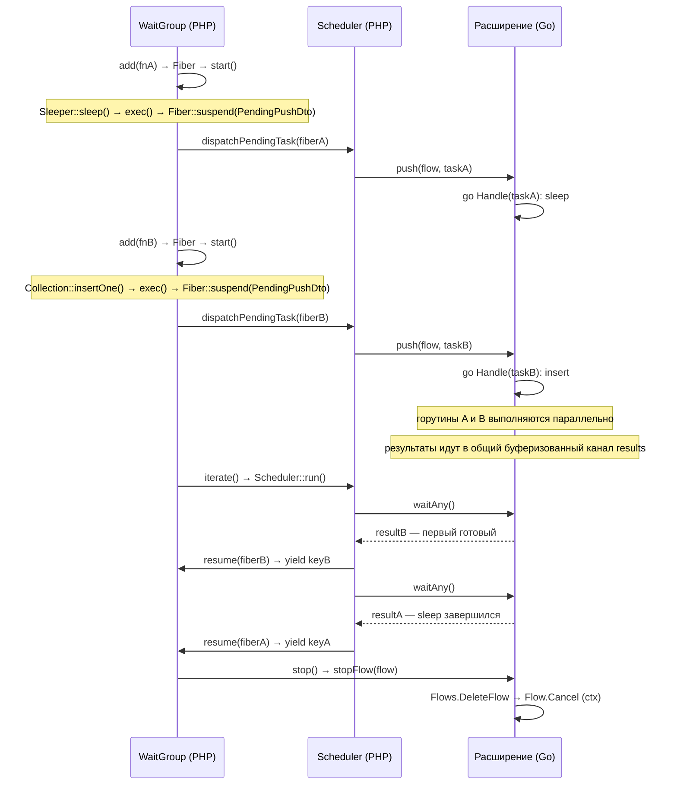
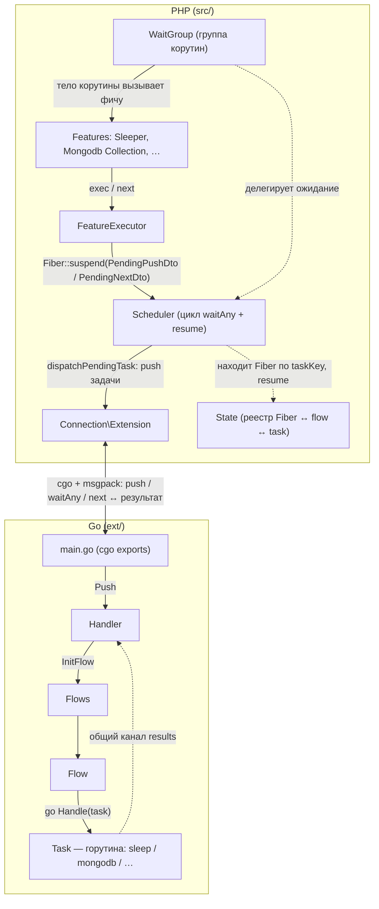

[English](architecture.md) | Русский

# Архитектура

Связка PHP Fiber ↔ Go goroutine, планировщик, слои и жизненный цикл одной
задачи. См. также [README](../README.ru.md).

## Принцип работы

`WaitGroup` — публичный API группы корутин поверх PHP Fibers. Каждое
замыкание-таск оборачивается в `Fiber`; когда внутри корутины вызывается
асинхронная фича, корутина приостанавливается, передавая наружу отложенную задачу
(`Fiber::suspend(PendingPushDto)`). Отправку в Go выполняет принявшая управление
сторона — `WaitGroup::launch` или планировщик — через
`Scheduler::dispatchPendingTask()` со своего стека, и задача выполняется в
отдельной горутине. cgo никогда не вызывается со стека корутины: веер из N живых
фиберов, каждый из которых пересёк границу PHP↔Go, деградировал квадратично.

Ожиданием и возобновлением управляет единый процессный `Scheduler` (синглтон,
`Scheduler::get()`) — единственное место, которое ждёт расширение и возобновляет
корутины. Все горутины пушат результаты в один общий буферизованный канал на
стороне Go; `Extension::waitAnyBatch()` блокируется до первого готового
результата любого флоу и в том же cgo-переходе дочитывает все остальные уже
готовые (до 64). Планировщик разбирает пачку по одному результату за шаг: по
`taskKey` находит корутину и возобновляет её.

Поскольку все возобновления идут из планировщика, корутины не вкладываются друг в
друга по стеку вызовов. Поэтому вложенный `WaitGroup` внутри корутины не
блокирует внешний флоу: он кооперативно приостанавливается
(`Scheduler::awaitGroup()`), пока его группа не завершится, а внешние корутины
продолжают исполняться.

Синхронный путь — вызов фичи вне Fiber — дожидается своего флоу через
`Extension::wait(flowKey)`; конкуренции там нет.

## Схема: PHP Fiber ↔ Go goroutine

```mermaid
sequenceDiagram
    participant WG as WaitGroup (PHP)
    participant S as Scheduler (PHP)
    participant Go as Расширение (Go)

    WG->>WG: add(fnA) → Fiber → start()
    Note over WG: Sleeper::sleep() → exec() → Fiber::suspend(PendingPushDto)
    WG->>S: dispatchPendingTask(fiberA)
    S->>Go: push(flow, taskA)
    Go->>Go: go Handle(taskA): sleep

    WG->>WG: add(fnB) → Fiber → start()
    Note over WG: Collection::insertOne() → exec() → Fiber::suspend(PendingPushDto)
    WG->>S: dispatchPendingTask(fiberB)
    S->>Go: push(flow, taskB)
    Go->>Go: go Handle(taskB): insert
    Note over Go: горутины A и B выполняются параллельно
    Note over Go: результаты идут в общий буферизованный канал results

    WG->>S: iterate() → Scheduler::run()
    S->>Go: waitAny()
    Go-->>S: resultB — первый готовый
    S->>WG: resume(fiberB) → yield keyB
    S->>Go: waitAny()
    Go-->>S: resultA — sleep завершился
    S->>WG: resume(fiberA) → yield keyA

    WG->>Go: stop() → stopFlow(flow)
    Go->>Go: Flows.DeleteFlow → Flow.Cancel (ctx)
```

Результаты приходят в порядке завершения задач, а не в порядке `add()`.

## Слои и поток вызовов

Сплошные стрелки — путь задачи «туда» (от тела корутины до горутины в Go),
пунктир — машинерия ожидания и возобновления корутин (`Scheduler` + `State`),
работающая сбоку.

```mermaid
flowchart TB
    subgraph PHP["PHP (src/)"]
        direction TB
        WG["WaitGroup (группа корутин)"]
        F["Features: Sleeper, Mongodb Collection, …"]
        FE[FeatureExecutor]
        EXT["Connection\Extension"]
        SCH["Scheduler (цикл waitAny + resume)"]
        ST["State (реестр Fiber ↔ flow ↔ task)"]

        WG -->|"тело корутины вызывает фичу"| F
        F -->|"exec / next"| FE
        FE -->|"Fiber::suspend(PendingPushDto / PendingNextDto)"| SCH
        SCH -->|"dispatchPendingTask: push задачи"| EXT
        WG -.->|"делегирует ожидание"| SCH
        SCH -.->|"находит Fiber по taskKey, resume"| ST
    end

    EXT <-->|"cgo + msgpack: push / waitAny / next ↔ результат"| MAIN

    subgraph GO["Go (ext/)"]
        direction TB
        MAIN["main.go (cgo exports)"]
        H[Handler]
        FLOWS[Flows]
        FLOW[Flow]
        TASK["Task — горутина: sleep / mongodb / …"]

        MAIN -->|"Push"| H
        H -->|"InitFlow"| FLOWS
        FLOWS --> FLOW
        FLOW -->|"go Handle(task)"| TASK
        TASK -.->|"общий канал results"| H
    end
```

Ключевые сущности:

- `WaitGroup` — `add()`, `iterate()`, `waitAll()`, `waitResults()`. Каждый
  экземпляр владеет уникальным `flowKey` и отдаёт результаты своих корутин по
  мере готовности. `create(maxConcurrency: N)` ограничивает число одновременно
  живых корутин (0 = без лимита, дефолт); лишние `add()` ждут в очереди.
- `Scheduler` (`src/Scheduler/`) — процессный синглтон: реестр корутин
  (`Coroutine`), один цикл `waitAny`, возобновление по `taskKey`, пробуждение
  ждущих вложенную группу (`awaitGroup`), отправка отложенных задач в Go
  (`dispatchPendingTask`). Spawned-корутины (`spawn` — по одной на запрос
  сервера) работают на переиспользуемых файберах из `FiberPool`: колбэк файбера
  — вечный рабочий цикл, который между заданиями паркуется на `Fiber::suspend()`
  вместо завершения, так что стек файбера отображается один раз, а не на каждый
  запрос.
- `State` (`src/State.php`) — статический реестр связей `Fiber ↔ flow ↔ task`.
- `FeatureExecutor` — точка входа для фич: определяет async-контекст через
  `State::getCurrentFlow()` и приостанавливает корутину, передавая отложенную
  задачу резюмеру. На async-пути сам в Go не ходит.
- `Connection\Extension` — синглтон над экспортированными C-функциями расширения
  (`push`, `waitAny`, `wait`, `next`, `stopFlow`, `destroy` и др.).
- Go: `Handler → Flows → Flow → Task`. Каждая задача исполняется в своей
  горутине; результаты всех флоу идут в один общий буферизованный канал, откуда
  `Handler.WaitAny()` отдаёт первый готовый (`Wait(flowKey)` остаётся для
  синхронного пути). Результат остановленного флоу, оставшийся в буфере,
  дропается на приёме.

## Жизненный цикл одной задачи

1. `WaitGroup::add($callback)` оборачивает замыкание в `Fiber`, регистрирует
   связь `fiber → flow` в `State`, заводит корутину в `Scheduler` и вызывает
   `$fiber->start()`.
2. Корутина выполняется синхронно до первого асинхронного вызова, где
   `FeatureExecutor::exec($payload)` приостанавливает её с
   `PendingPushDto(flowKey, payload)`. Принявшая сторона вызывает
   `Scheduler::dispatchPendingTask()`: `Extension::push()` формирует
   `taskKey = flowKey:counter` и через cgo отправляет задачу в Go вместе с id
   корутины-владельца; ожидаемые ключи flow/task записываются на `Coroutine`.
   Ошибка отправки бросается обратно в корутину в точку suspend. Дальше её
   возобновляет только `Scheduler`.
3. Корутина, завершившаяся не приостановившись, кладёт результат сразу в очередь
   готовых результатов группы; иначе остаётся живой в группе и реестре
   планировщика.
4. На стороне Go `push → Handler.Push → Flows.InitFlow → Flow.HandleMessage`
   создаёт `Task` и запускает горутину с обработчиком фичи. Результат уходит в
   общий буферизованный канал, и горутина завершается, не дожидаясь, пока PHP его
   заберёт.
5. `WaitGroup::iterate()` отдаёт готовые результаты и делегирует ожидание: на
   верхнем уровне крутит `Scheduler::run()` (цикл `waitAnyBatch`), а вложенный
   `iterate()` кооперативно приостанавливается через `Scheduler::awaitGroup()`.
6. Кадр результата несёт id владельца обратно; планировщик проверяет, что
   корутина всё ещё ждёт именно эту пару flow/task (id переиспользуются после
   освобождения файбера), и `resume($taskResult)` возвращает `TaskResultDto` из
   `Fiber::suspend()` внутри `FeatureExecutor`.
7. Завершившаяся корутина отдаёт `callbackKey ⇒ <return value>`; снова
   приостановившаяся (курсор запросил следующий батч через `next`) остаётся в
   цикле. По завершении `finally → stop()` разматывает остальные и очищает
   `State` и Go-флоу.

`waitAll()` — это `iterator_count(iterate())`; `waitResults()` собирает
результаты в массив по `callbackKey`.
