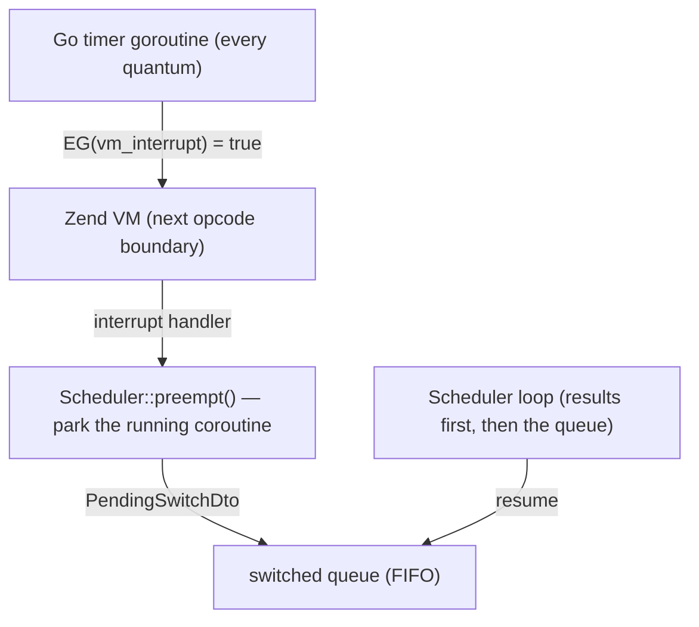

English | [Русский](coroutine-switching.ru.md)

# Coroutine switching: `Scheduler::switch()` and automatic preemption

The PHP thread is one, and coroutines switch cooperatively — normally at feature
calls, where a fiber suspends while Go does the I/O. CPU-bound code has no such
points: a handler busy with computation blocks every other coroutine of its
process until it finishes. Switching addresses that in two forms:
`Scheduler::switch()` — an explicit switch point you put into your own hot loops
— and automatic preemption, where the extension interrupts the VM on a timer and
performs the same switch for you (on by default in the servers).

Switching is a latency tool, not a throughput tool. The total CPU work does not
change and the PHP thread stays single: a heavy handler still takes its
milliseconds. What changes is who waits for it — without switching, one
CPU-bound request freezes every other request the process is serving for its
whole runtime; with switching their delay is bounded by the quantum. Throughput
for CPU-bound load still comes from the per-core process pool, so the
[positioning verdict](positioning.md#is-sconcur-for-you) stands.

## `Scheduler::switch()` — the explicit switch point

```php
use SConcur\Scheduler\Scheduler;

$scheduler = Scheduler::get();

foreach ($rows as $row) {
    $scheduler->switch();

    heavyTransform($row);
}
```

`switch(int $quantumMs = 5): bool` parks the current coroutine and lets everything
that is ready make progress — delivered results resume their coroutines, the server
loop keeps accepting requests — then resumes it and returns `true`.

The call is designed to sit inside a hot loop, so almost every invocation is a
cheap no-op (`false`) costing one `hrtime()` comparison: outside a fiber (the
synchronous path) or from a fiber the scheduler does not track, and while the
quantum has not elapsed. The first call only starts the quantum; a later call
yields once the coroutine has run for `$quantumMs` since it was last resumed, and
time spent parked does not count against the next quantum, so identical CPU loops
share the thread evenly. `quantumMs <= 0` forces a yield on every call (explicit
switch points, tests).

Mechanics: the coroutine suspends with a `PendingSwitchDto` marker, and the
scheduler appends it to a FIFO queue of parked coroutines — those waiting for
the thread rather than for a result. Ready results always take priority — a
parked coroutine is resumed only when nothing is deliverable right now. Two CPU
loops therefore round-robin each other, and I/O completions are never delayed by
parked crunchers.

## Automatic preemption

The three servers (`HttpServer`, `SocketServer`, `WsServer`) arm automatic
preemption while serving, so even code that never calls `switch()` — including
third-party libraries — cannot freeze the process:

1. On startup the extension hooks the engine's interrupt entry point
   (`zend_interrupt_function`), chaining the previous handler, so pcntl signal
   dispatch keeps working.
2. A serving server arms a timer on the Go side; every quantum the timer
   atomically requests a VM interrupt (`EG(vm_interrupt)`), which the engine
   notices at the next opcode boundary — function calls, loop back-edges, and the
   same checks opcache JIT inserts into compiled loops.
3. The extension's handler, called on the PHP thread, invokes the scheduler's
   preempt hook, which force-parks the running coroutine exactly like a `switch()`
   with the quantum elapsed. When serving ends the timer is disarmed.
4. While the PHP thread is parked inside a blocking wait call (an idle server
   waiting for the next request), the timer pauses: no PHP code is running, so
   an interrupt could not be serviced anyway. It resumes as soon as the wait
   returns, so an idle worker costs no timer wakeups.



Configuration is the `preemptionQuantumMs` server option (default `5`, `0`
disables), overridable like any other launch option:

```php
$server = new HttpServer(
    serverRequestFactory: $requestFactory,
    responseFactory: $responseFactory,
    preemptionQuantumMs: 10,
);
```

```console
php server.php --preemptionQuantumMs=0   # disable preemption for this worker
```

CLI scripts and library code outside the servers never arm the timer, so there
`Scheduler::switch()` is the only switch point — unless the same machinery is armed
manually:

```php
Scheduler::get()->enablePreemption();   // quantum 5 ms by default

try {
    // CPU-bound coroutines are preemptible here even without switch() calls
} finally {
    Scheduler::get()->disablePreemption();
}
```

`enablePreemption(int $quantumMs = 5)` registers the scheduler's preempt hook with
the extension's interrupt timer — the same wiring the servers use, with the same
guards. Re-enabling replaces the previous timer. Always disable in `finally`: the
timer keeps firing until `disablePreemption()` or process shutdown.

## The cost under load

Preemption lets cheap requests overtake, and the heavy ones pay for it: a
CPU-bound handler's own latency grows roughly by the number of such handlers the
worker is serving at the same time. On a single thread that is arithmetic, not a
setting.

Measured on 8 workers and 256 connections, with 90% of requests hitting an empty
endpoint and 10% a handler worth ~49 ms of CPU:

| `preemptionQuantumMs` | p50 | p90 | p99 |
| ---: | ---: | ---: | ---: |
| 5 (default) | 29.8 ms | 2.02 s | 2.86 s |
| 20 | 79.1 ms | 1.82 s | 2.91 s |
| 50 | 147.5 ms | 1.56 s | 2.85 s |
| 100 | 180.2 ms | 1.66 s | 4.33 s |
| 0 (off) | 227.9 ms | 381.0 ms | 539.0 ms |

Nothing but switching preemption off moves the tail: with any quantum the
coroutines interleave and all of them stretch at once, without it they run to
completion in turn. An intermediate quantum only costs p50 and buys no p99, so
there is usually no reason to change the 5 ms default.

The other setting is the HTTP server's `maxConcurrency`, which bounds not the
quantum but the number of handlers served at once — that is, how many of them
share the thread.

| `maxConcurrency` | p50 | p90 | p99 |
| ---: | ---: | ---: | ---: |
| 0 (no limit) | 29.8 ms | 2.02 s | 2.86 s |
| 16 | 152.7 ms | 1.02 s | 1.42 s |
| 8 | 201.3 ms | 586.0 ms | 914.5 ms |
| 4 | 244.3 ms | 441.9 ms | 659.5 ms |

Both settings move along one curve: a low p50 for the cheap requests and a short
tail for the heavy ones are not available together. Pick the end that matches
your workload — the defaults are tuned for the cheap requests.

Two things move the curve itself rather than the point on it: more processes in
the pool, and keeping heavy computation out of the handler.

## Safety guards

The interrupt handler refuses to park a coroutine in states where an invisible
switch would corrupt engine or scheduler bookkeeping:

- while an autoload is in progress (`EG(in_autoload)` non-empty) — parking there
  would make every other coroutine requesting the same class fail with "class
  not found";
- while an exception is being handled (`EG(exception)`) or the execution timeout
  fired;
- inside a suspend transition — between announcing a suspend (registering a
  nested-group waiter, handing a task to the scheduler) and the `Fiber::suspend`
  itself, where parking would desynchronize result routing;
- outside tracked coroutines: the scheduler loop and synchronous code are never
  interrupted.

## Semantics to be aware of

With preemption on, switch points become invisible: code that assumed nothing runs
between two statements — a non-atomic read-modify-write of a static or a shared
array — can now interleave with other handlers, exactly as it already could across
any feature call. Handlers that need such sections atomic should avoid feature
calls and `switch()` inside them, or run the worker with
`preemptionQuantumMs: 0`.

Single monolithic internal calls stay non-preemptible either way — a `preg_match`
on a huge subject, a `json_decode` of a huge blob — because they run between opcode
boundaries. The quantum bounds the delay between opcodes, not inside one internal
call.

## See also

- [HTTP server](http-server.md), [Socket server](socket-server.md),
  [WebSocket server](websocket-server.md) — the servers arming preemption.
- [Architecture](architecture.md) — the scheduler, fibers and flows.
- [Positioning](positioning.md#is-sconcur-for-you) — the CPU-bound verdict this
  feature softens (latency, not throughput).
