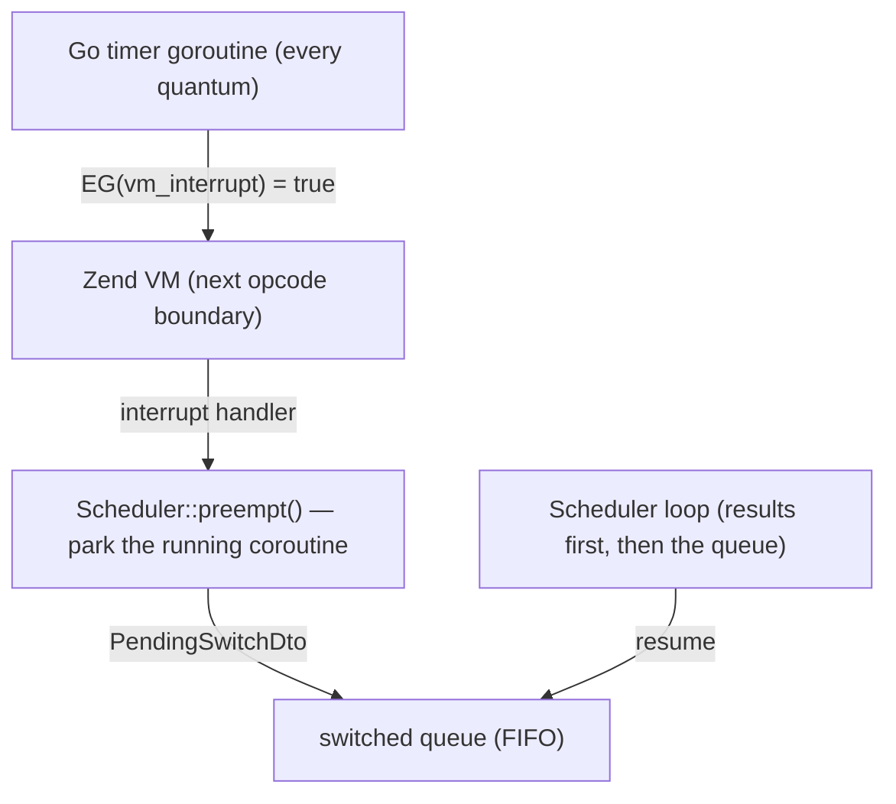

English | [Русский](coroutine-switching.ru.md)

# Coroutine switching: `Scheduler::switch()` and automatic preemption

The PHP thread is one, and coroutines switch cooperatively — normally at feature
calls, where a fiber suspends while Go does the I/O. CPU-bound code has no such
points: a handler crunching data blocks every other in-flight coroutine of its
process until it finishes. Switching addresses exactly that, in two forms:

- `Scheduler::switch()` — an explicit switch point you put into your own hot loops;
- automatic preemption — the extension interrupts the VM on a timer and performs
  the same switch for you; on by default in the servers.

## What it solves — and what it does not

Switching is a latency tool, not a throughput tool. The total CPU work does not
change and the PHP thread stays single: a heavy handler still takes its
milliseconds of processor time. What changes is who waits for it. Without
switching, one CPU-bound request freezes all in-flight neighbours for its whole
runtime; with switching their delay is bounded by the quantum. Throughput for
CPU-bound load still comes from the per-core process pool (`SO_REUSEPORT`, see
[worker master](worker-master.md)) — the
[positioning verdict](positioning.md#is-sconcur-for-you) on CPU-bound
workloads stands.

## `Scheduler::switch()` — the explicit switch point

```php
use SConcur\Scheduler\Scheduler;

$scheduler = Scheduler::get();

foreach ($rows as $row) {
    $scheduler->switch();

    heavyTransform($row);
}
```

`switch(int $quantumMs = 5): bool` parks the current coroutine and lets everything
that is ready make progress: delivered results resume their coroutines, the server
loop keeps accepting new requests. Then the coroutine is resumed and `switch()`
returns `true`.

The call is designed to sit inside a hot loop, so almost every invocation is a
cheap no-op (`false`) costing one `hrtime()` comparison:

- outside a fiber (the synchronous path) — no-op, callers need no guards;
- from a fiber the scheduler does not track — no-op;
- while the quantum has not elapsed — no-op. The first call only starts the
  quantum; a later call yields once the coroutine has run for `$quantumMs`
  milliseconds since it was last resumed. Time spent parked in the queue does
  not count against the next quantum, so identical CPU loops share the thread
  evenly.

`quantumMs <= 0` forces a yield on every call (explicit switch points, tests).

Mechanics: the coroutine suspends with a `PendingSwitchDto` marker; the scheduler
appends it to a FIFO queue of parked coroutines. Ready results always take
priority — a parked coroutine is resumed only when nothing is deliverable right
now (the poll comes back empty). Two CPU loops therefore round-robin each other,
and I/O completions are never delayed by parked crunchers.

### Arming automatic preemption manually

The servers arm the preemption timer themselves (see the next section). In CLI
scripts and library code nothing arms it, but a long-running script can enable
the same machinery with one call:

```php
use SConcur\Scheduler\Scheduler;

Scheduler::get()->enablePreemption();   // quantum 5 ms by default

try {
    // CPU-bound coroutines are preemptible here even without switch() calls
} finally {
    Scheduler::get()->disablePreemption();
}
```

`enablePreemption(int $quantumMs = 5)` registers the scheduler's preempt hook
with the extension's interrupt timer — the same wiring the servers use: it
parks only scheduler-tracked coroutines and respects every safety guard listed
below, so the scheduler loop and synchronous code are never interrupted.
Re-enabling replaces the previous timer. Always disable in `finally`: the timer
keeps firing until `disablePreemption()` or process shutdown.

## Automatic preemption — the servers' default

The three servers (`HttpServer`, `SocketServer`, `WsServer`) arm automatic
preemption while serving, so even code that never calls `switch()` — including
third-party libraries — cannot freeze the process:

1. On startup the extension hooks the engine's interrupt entry point
   (`zend_interrupt_function`), chaining the previous handler — pcntl signal
   dispatch keeps working.
2. When a server starts serving, it arms a timer on the Go side. Every quantum
   the timer atomically requests a VM interrupt (`EG(vm_interrupt)`).
3. The engine notices the flag at the next opcode boundary — function calls,
   loop back-edges; opcache JIT inserts the same checks into compiled loops — and
   calls the extension's handler on the PHP thread.
4. The handler invokes the scheduler's preempt hook, which force-parks the
   currently running coroutine, exactly like a `switch()` with the quantum
   elapsed. The scheduler's own loop and the synchronous path are never parked:
   preemption only ever lands on tracked handler coroutines.
5. When serving ends the timer is disarmed.



Configuration — the `preemptionQuantumMs` server option (default `5`, `0`
disables), overridable like any other launch option:

```php
$server = new HttpServer(
    serverRequestFactory: $requestFactory,
    responseFactory: $responseFactory,
    preemptionQuantumMs: 10,
);
```

```console
php server.php --preemptionQuantumMs=0   # disable preemption for this worker
```

By itself preemption exists only under `Scheduler::serve()`: CLI scripts and
library usage outside the servers never arm the timer — there
`Scheduler::switch()` remains the only switch point, unless the timer is armed
manually (see "Arming automatic preemption manually" above).

## Safety guards

The interrupt handler refuses to park a coroutine in states where an invisible
switch would corrupt engine or scheduler bookkeeping:

- while an autoload is in flight (`EG(in_autoload)` non-empty): the engine tracks
  the class being loaded, and parking mid-autoload would make every other
  coroutine requesting the same class fail with "class not found";
- while an exception is being handled (`EG(exception)`) or the execution timeout
  fired;
- inside a suspend transition — between announcing a suspend (registering a
  nested-group waiter, handing a task over to the scheduler) and the
  `Fiber::suspend` itself; parking there desynchronizes the result routing. The
  window is marked by the scheduler internals and checked by the preempt hook;
- outside tracked coroutines: the scheduler loop and synchronous code are never
  interrupted.

## Semantics to be aware of

With preemption on, switch points become invisible: code that assumed nothing
runs between two statements — a non-atomic read-modify-write of a static or a
shared array — can now interleave with other handlers, exactly as it already
could across any feature call. Handlers that need such sections atomic should
avoid feature calls and `switch()` inside them, or the worker can run with
`preemptionQuantumMs: 0` and rely on explicit `switch()` placement only.

What stays non-preemptible either way: single monolithic internal calls — a
`preg_match` on a huge subject, a `json_decode` of a huge blob, one giant
`hash()` — run between opcode boundaries, so no interrupt fires inside them. The
quantum bounds the delay between opcodes, not inside one internal call.

## See also

- [HTTP server](http-server.md), [Socket server](socket-server.md),
  [WebSocket server](websocket-server.md) — the servers arming preemption.
- [Architecture](architecture.md) — the scheduler, fibers and flows.
- [Positioning](positioning.md#is-sconcur-for-you) — the CPU-bound verdict this
  feature softens (latency, not throughput).
