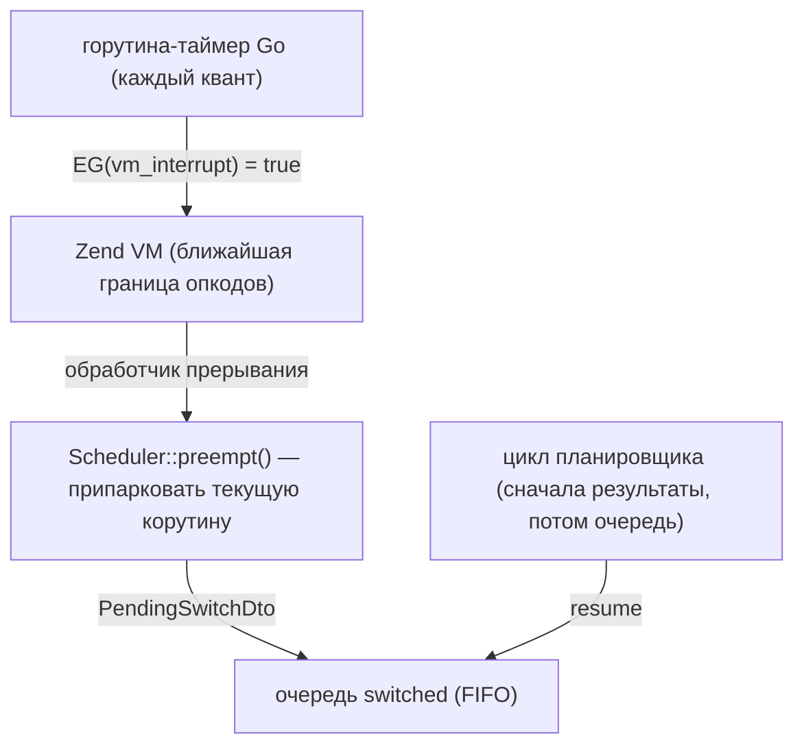

[English](coroutine-switching.md) | Русский

# Переключение корутин: `Scheduler::switch()` и автоматическая преемпция

PHP-поток один, и корутины переключаются кооперативно — обычно на вызовах фич,
где фибер приостанавливается, пока Go делает I/O. У CPU-bound кода таких точек
нет: обработчик, занятый вычислениями, блокирует все остальные корутины
процесса, пока не закончит. Переключение закрывает это в двух видах:
`Scheduler::switch()` — явная точка переключения, которую вы ставите в свои
горячие циклы, — и автоматическая преемпция, когда расширение прерывает VM по
таймеру и делает то же самое за вас (в серверах включена по умолчанию).

Переключение — инструмент латентности, а не пропускной способности. Общий объём
работы CPU не меняется, и PHP-поток остаётся один: тяжёлый обработчик всё равно
съест свои миллисекунды. Меняется то, кто его ждёт: без переключения один
CPU-bound запрос замораживает на всё своё время все остальные запросы, которые
обслуживает процесс; с переключением их задержка ограничена квантом. Пропускную
способность на CPU-нагрузке по-прежнему даёт пул процессов по одному на ядро,
поэтому [вердикт позиционирования](positioning.ru.md#нужен-ли-вам-sconcur)
остаётся в силе.

## `Scheduler::switch()` — явная точка переключения

```php
use SConcur\Scheduler\Scheduler;

$scheduler = Scheduler::get();

foreach ($rows as $row) {
    $scheduler->switch();

    heavyTransform($row);
}
```

`switch(int $quantumMs = 5): bool` паркует текущую корутину и даёт продвинуться
всему, что готово (доставленные результаты возобновляют свои корутины, серверный
цикл продолжает принимать запросы), затем возобновляет её и возвращает `true`.

Вызов рассчитан на горячий цикл, поэтому почти каждое обращение — дешёвый no-op
(`false`) ценой одного сравнения `hrtime()`: вне фибера (синхронный путь), из
фибера, который планировщик не отслеживает, и пока не истёк квант. Первый вызов
только запускает квант; последующий уступает, когда корутина отработала
`$quantumMs` с момента последнего возобновления, а время в очереди в следующий
квант не засчитывается, поэтому одинаковые CPU-циклы делят поток поровну.
`quantumMs <= 0` заставляет уступать на каждом вызове (явные точки переключения,
тесты).

Механика: корутина приостанавливается с маркером `PendingSwitchDto`, а
планировщик добавляет её в FIFO-очередь припаркованных — тех, кто ждёт не
результата, а очереди на поток. Готовые результаты всегда в приоритете:
припаркованная корутина возобновляется, только когда доставлять больше нечего.
Поэтому два CPU-цикла работают по кругу друг за другом, а завершения I/O никогда
не задерживаются из-за припаркованных вычислительных корутин.

## Автоматическая преемпция

Три сервера (`HttpServer`, `SocketServer`, `WsServer`) на время обслуживания
включают автоматическую преемпцию, поэтому даже код, который никогда не вызывает
`switch()` — включая сторонние библиотеки, — не может заморозить процесс:

1. На старте расширение подцепляет точку входа прерываний движка
   (`zend_interrupt_function`), сохраняя цепочку с прежним обработчиком, поэтому
   диспетчеризация pcntl-сигналов продолжает работать.
2. Обслуживающий сервер взводит таймер на Go-стороне; каждый квант таймер
   атомарно запрашивает прерывание VM (`EG(vm_interrupt)`), а движок замечает флаг
   на ближайшей границе опкодов — вызовы функций, обратные дуги циклов и те же
   проверки, которые opcache JIT вставляет в скомпилированные циклы.
3. Обработчик расширения, вызванный в PHP-потоке, дёргает preempt-хук
   планировщика, который принудительно паркует текущую корутину — ровно как
   `switch()` с истёкшим квантом. По окончании обслуживания таймер снимается.
4. Пока PHP-поток запаркован внутри блокирующего wait-вызова (простаивающий
   сервер ждёт следующий запрос), таймер ставится на паузу: PHP-код не
   исполняется, и прерывание всё равно не могло бы быть обслужено. Он
   возобновляется, как только wait возвращается, поэтому простаивающий воркер
   не платит за пробуждения таймера.



Настройка — опция сервера `preemptionQuantumMs` (дефолт `5`, `0` выключает),
переопределяется как любая другая опция запуска:

```php
$server = new HttpServer(
    serverRequestFactory: $requestFactory,
    responseFactory: $responseFactory,
    preemptionQuantumMs: 10,
);
```

```console
php server.php --preemptionQuantumMs=0   # выключить преемпцию для этого воркера
```

CLI-скрипты и использование библиотеки вне серверов таймер не взводят, поэтому там
`Scheduler::switch()` — единственная точка переключения, если только не взвести ту
же машинерию вручную:

```php
Scheduler::get()->enablePreemption();   // квант по умолчанию 5 мс

try {
    // CPU-bound корутины здесь вытесняемы даже без вызовов switch()
} finally {
    Scheduler::get()->disablePreemption();
}
```

`enablePreemption(int $quantumMs = 5)` регистрирует preempt-хук планировщика в
таймере прерываний расширения — та же обвязка, что у серверов, с теми же
предохранителями. Повторное включение заменяет прежний таймер. Всегда выключайте в
`finally`: таймер продолжает срабатывать до `disablePreemption()` или завершения
процесса.

Преемпция же позволяет [таймауту корутины](coroutine-timeout.ru.md) достать до
кода, который никогда не подвешивается: срок доставляется тем же хуком, так что без
взведённого таймера CPU-bound корутина разматывается только на ближайшем ожидании.

## Цена под нагрузкой

Преемпция пропускает дешёвые запросы вперёд, и платят за это тяжёлые: время
самого CPU-обработчика растёт примерно во столько раз, сколько таких же
обработчиков воркер обслуживает одновременно. На одном треде это арифметика, а
не настройка.

Замер на 8 воркерах и 256 соединениях, где 90% запросов идут на пустой эндпоинт,
а 10% — на обработчик ценой ~49 мс CPU:

| `preemptionQuantumMs` | p50 | p90 | p99 |
| ---: | ---: | ---: | ---: |
| 5 (дефолт) | 29.8 мс | 2.02 с | 2.86 с |
| 20 | 79.1 мс | 1.82 с | 2.91 с |
| 50 | 147.5 мс | 1.56 с | 2.85 с |
| 100 | 180.2 мс | 1.66 с | 4.33 с |
| 0 (выключена) | 227.9 мс | 381.0 мс | 539.0 мс |

Хвост не двигается ничем, кроме полного выключения: с любым квантом корутины
чередуются и растягиваются все разом, без него выполняются до конца по очереди.
Промежуточный квант только ухудшает p50, не давая ничего p99, поэтому менять
дефолтные 5 мс обычно незачем.

Вторая настройка — `maxConcurrency` HTTP-сервера: она ограничивает не квант, а
число одновременно обслуживаемых обработчиков, то есть сколько их делит поток.

| `maxConcurrency` | p50 | p90 | p99 |
| ---: | ---: | ---: | ---: |
| 0 (без предела) | 29.8 мс | 2.02 с | 2.86 с |
| 16 | 152.7 мс | 1.02 с | 1.42 с |
| 8 | 201.3 мс | 586.0 мс | 914.5 мс |
| 4 | 244.3 мс | 441.9 мс | 659.5 мс |

Обе настройки двигают систему вдоль одной кривой: низкий p50 для дешёвых
запросов и короткий хвост для тяжёлых одновременно недостижимы. Выбирайте конец
под свою нагрузку — дефолты настроены на дешёвые запросы.

Саму кривую, а не точку на ней, сдвигают две вещи: больше процессов в пуле и
вынос тяжёлых вычислений из обработчика.

## Предохранители

Обработчик прерывания отказывается парковать корутину в состояниях, где
невидимое переключение сломало бы учёт движка или планировщика:

- пока идёт автозагрузка (`EG(in_autoload)` не пуст) — парковка там привела бы к
  «class not found» у всех остальных корутин, запросивших тот же класс;
- пока обрабатывается исключение (`EG(exception)`) или сработал таймаут
  выполнения;
- внутри перехода к suspend — между объявлением приостановки (регистрацией
  ожидающего вложенную группу, передачей задачи планировщику) и самим
  `Fiber::suspend`, где парковка рассинхронизировала бы маршрутизацию результатов;
- вне отслеживаемых корутин: цикл планировщика и синхронный код не прерываются
  никогда.

## О чём стоит помнить

При включённой преемпции точки переключения становятся невидимыми: код, который
рассчитывал, что между двумя выражениями ничего не выполняется (неатомарное
read-modify-write статика или общего массива), теперь может перемежаться с другими
обработчиками — ровно как это уже могло происходить на любом вызове фичи.
Обработчикам, которым такие участки нужны атомарными, стоит не делать внутри них
вызовов фич и `switch()` либо запускать воркер с `preemptionQuantumMs: 0`.

Одиночные монолитные внутренние вызовы остаются невытесняемыми в любом случае —
`preg_match` по огромной строке, `json_decode` огромного блоба, — потому что
исполняются между границами опкодов. Квант ограничивает задержку между опкодами, а
не внутри одного внутреннего вызова.

## См. также

- [HTTP-сервер](http-server.ru.md), [Сокет-сервер](socket-server.ru.md),
  [WebSocket-сервер](websocket-server.ru.md) — серверы, включающие преемпцию.
- [Архитектура](architecture.ru.md) — планировщик, фиберы и флоу.
- [Позиционирование](positioning.ru.md#нужен-ли-вам-sconcur) — вердикт по
  CPU-bound, который эта фича смягчает (латентность, а не пропускная
  способность).
