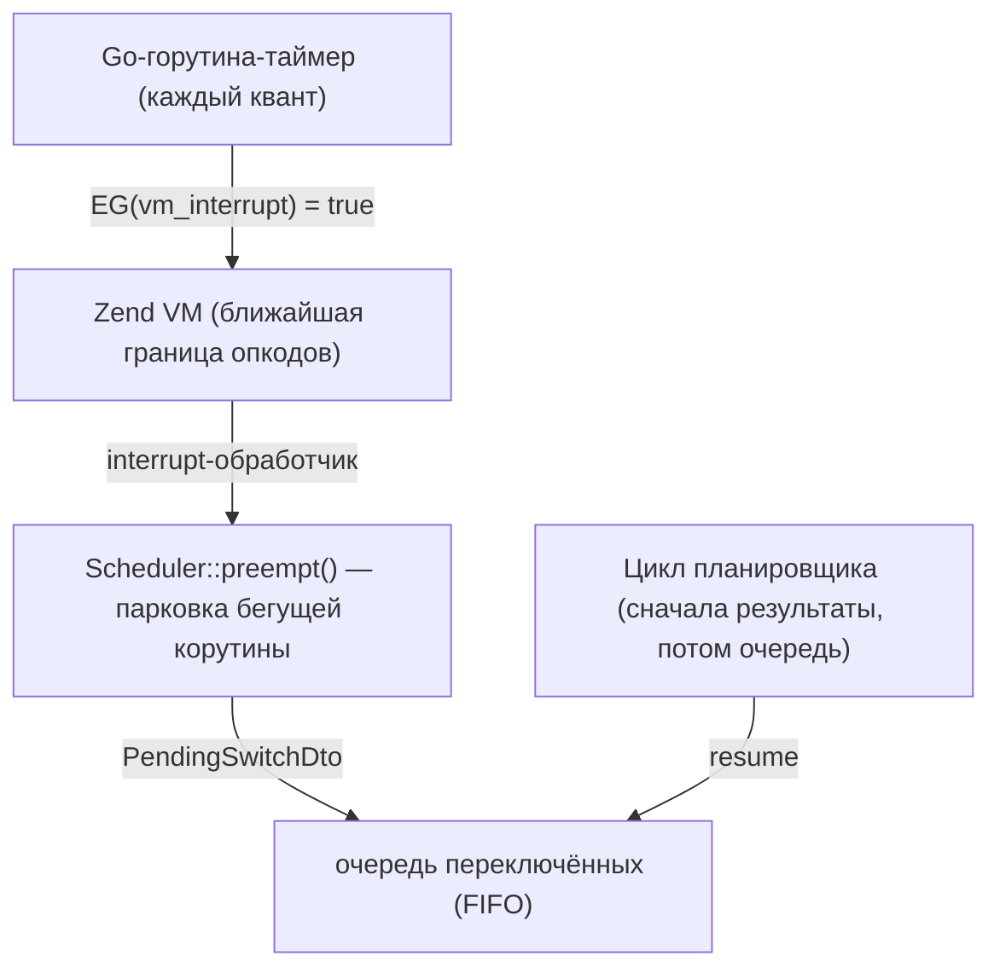

[English](coroutine-switching.md) | Русский

# Переключение корутин: `Scheduler::switch()` и автоматическая преемпция

Поток PHP один, и корутины переключаются кооперативно — обычно на вызовах фич,
где файбер подвешивается, пока Go делает I/O. У CPU-bound кода таких точек нет:
обработчик, молотящий данные, блокирует все остальные in-flight корутины своего
процесса, пока не закончит. Переключение решает ровно это, в двух видах:

- `Scheduler::switch()` — явная точка переключения, которую вы ставите в свои
  горячие циклы;
- автоматическая преемпция — расширение по таймеру прерывает VM и делает то же
  переключение за вас; в серверах включена по умолчанию.

## Что это решает — и чего не решает

Переключение — инструмент латентности, не throughput. Суммарная работа CPU не
меняется, поток PHP остаётся один: тяжёлый обработчик всё равно съест свои
миллисекунды процессора. Меняется то, кто его ждёт. Без переключения один
CPU-bound запрос замораживает всех in-flight соседей на всё время своей работы;
с переключением их задержка ограничена квантом. Throughput для CPU-bound
нагрузки по-прежнему даёт per-core пул процессов (`SO_REUSEPORT`, см.
[мастер воркеров](worker-master.ru.md)) — вердикт дока бенчмарков по CPU-bound
нагрузке остаётся в силе.

## `Scheduler::switch()` — явная точка переключения

```php
use SConcur\Scheduler\Scheduler;

$scheduler = Scheduler::get();

foreach ($rows as $row) {
    $scheduler->switch();

    heavyTransform($row);
}
```

`switch(int $quantumMs = 5): bool` паркует текущую корутину и даёт продвинуться
всему, что готово: доставленные результаты резюмят свои корутины, серверный цикл
продолжает принимать новые запросы. Затем корутина резюмится, и `switch()`
возвращает `true`.

Вызов рассчитан на горячий цикл, поэтому почти каждое обращение — дешёвый no-op
(`false`) ценой одного сравнения `hrtime()`:

- вне файбера (синхронный путь) — no-op, вызывающему коду не нужны проверки;
- из файбера, который планировщик не отслеживает, — no-op;
- пока не истёк квант — no-op. Первый вызов только запускает квант; последующий
  уступает, когда корутина проработала `$quantumMs` миллисекунд с момента своего
  последнего резюма. Время, проведённое в очереди припаркованных, в следующий
  квант не засчитывается, поэтому одинаковые CPU-циклы делят поток поровну.

`quantumMs <= 0` — принудительная уступка на каждом вызове (явные точки
переключения, тесты).

Механика: корутина подвешивается с маркером `PendingSwitchDto`; планировщик
кладёт её в FIFO-очередь припаркованных. Готовые результаты всегда в приоритете —
припаркованная корутина резюмится, только когда доставлять сейчас нечего (опрос
вернулся пустым). Поэтому два CPU-цикла ходят по кругу друг за другом, а
I/O-завершения никогда не задерживаются припаркованными числодробилками.

### Ручное включение автоматической преемпции

Серверы взводят таймер преемпции сами (см. следующий раздел). В CLI-скриптах и
библиотечном коде его никто не взводит, но та же машинерия доступна напрямую,
когда долгоживущему скрипту нужна преемпция без сервера:

```php
use SConcur\Connection\Extension;
use SConcur\Scheduler\Scheduler;

Extension::get()->armPreemption(
    quantumMs: 5,
    preemptCallback: Scheduler::get()->preempt(...),
);

try {
    // CPU-bound корутины здесь преемптируемы даже без вызовов switch()
} finally {
    Extension::get()->disarmPreemption();
}
```

`Scheduler::preempt()` — тот же хук, который регистрируют серверы: он паркует
только корутины, отслеживаемые планировщиком, и уважает все предохранители,
перечисленные ниже, поэтому цикл планировщика и синхронный код никогда не
прерываются. Повторное взведение заменяет предыдущие таймер и коллбэк. Всегда
развзводите в `finally`: таймер продолжает срабатывать до `disarmPreemption()`
или завершения процесса.

## Автоматическая преемпция — дефолт серверов

Три сервера (`HttpServer`, `SocketServer`, `WsServer`) взводят автоматическую
преемпцию на время обслуживания, так что даже код, никогда не зовущий
`switch()`, — включая сторонние библиотеки — не может заморозить процесс:

1. На старте расширение цепляет точку прерываний движка
   (`zend_interrupt_function`) с чейнингом предыдущего обработчика —
   диспетчеризация сигналов pcntl продолжает работать.
2. Когда сервер начинает обслуживание, он взводит таймер на Go-стороне. Каждый
   квант таймер атомарно запрашивает VM-прерывание (`EG(vm_interrupt)`).
3. Движок замечает флаг на ближайшей границе опкодов — вызовы функций, рёбра
   циклов; opcache JIT вставляет те же проверки в скомпилированные циклы — и
   зовёт обработчик расширения на PHP-потоке.
4. Обработчик вызывает preempt-хук планировщика, который принудительно паркует
   текущую бегущую корутину — ровно как `switch()` с истёкшим квантом.
   Собственный цикл планировщика и синхронный путь не паркуются никогда:
   преемпция попадает только по отслеживаемым корутинам обработчиков.
5. По окончании обслуживания таймер снимается.



Настройка — серверная опция `preemptionQuantumMs` (по умолчанию `5`, `0`
выключает), переопределяется как любая другая опция запуска:

```php
$server = new HttpServer(
    serverRequestFactory: $requestFactory,
    responseFactory: $responseFactory,
    preemptionQuantumMs: 10,
);
```

```console
php server.php --preemptionQuantumMs=0   # выключить преемпцию у этого воркера
```

Сама по себе преемпция существует только под `Scheduler::serve()`: CLI-скрипты
и библиотечное использование вне серверов таймер не взводят — там единственной
точкой переключения остаётся `Scheduler::switch()`, если не взвести таймер
вручную (см. «Ручное включение автоматической преемпции» выше).

## Предохранители

Interrupt-обработчик отказывается парковать корутину в состояниях, где
невидимое переключение сломало бы учёт движка или планировщика:

- пока идёт автолоад (`EG(in_autoload)` непуст): движок отслеживает загружаемый
  класс, и парковка посреди автолоада заставила бы любую другую корутину,
  запросившую тот же класс, упасть с «class not found»;
- пока обрабатывается исключение (`EG(exception)`) или сработал таймаут
  исполнения;
- внутри перехода подвеса — между объявлением подвеса (регистрация waiter'а
  вложенной группы, передача задачи планировщику) и самим `Fiber::suspend`;
  парковка там рассинхронизирует маршрутизацию результатов. Окно помечается
  внутренностями планировщика и проверяется preempt-хуком;
- вне отслеживаемых корутин: цикл планировщика и синхронный код не прерываются.

## О чём помнить

С включённой преемпцией точки переключения становятся невидимыми: код,
рассчитывавший, что между двумя операторами ничего не выполняется, —
неатомарный read-modify-write статики или общего массива — теперь может
интерливиться с другими обработчиками, ровно как уже мог на любом вызове фичи.
Обработчикам, которым нужны такие секции атомарными, стоит избегать в них
вызовов фич и `switch()`, либо запускать воркер с `preemptionQuantumMs: 0` и
полагаться только на явную расстановку `switch()`.

Что остаётся непреемптимым в любом случае: одиночные монолитные внутренние
вызовы — `preg_match` по огромной строке, `json_decode` гигантского блоба, один
громадный `hash()` — исполняются между границами опкодов, и внутри них
прерывание не срабатывает. Квант ограничивает задержку между опкодами, а не
внутри одного внутреннего вызова.

## См. также

- [HTTP-сервер](http-server.ru.md), [Socket-сервер](socket-server.ru.md),
  [WebSocket-сервер](websocket-server.ru.md) — серверы, взводящие преемпцию.
- [Архитектура](architecture.ru.md) — планировщик, файберы и флоу.
- [Бенчмарки фич](benchmarks.ru.md) — вердикт по CPU-bound, который эта фича
  смягчает (латентность, не throughput).
