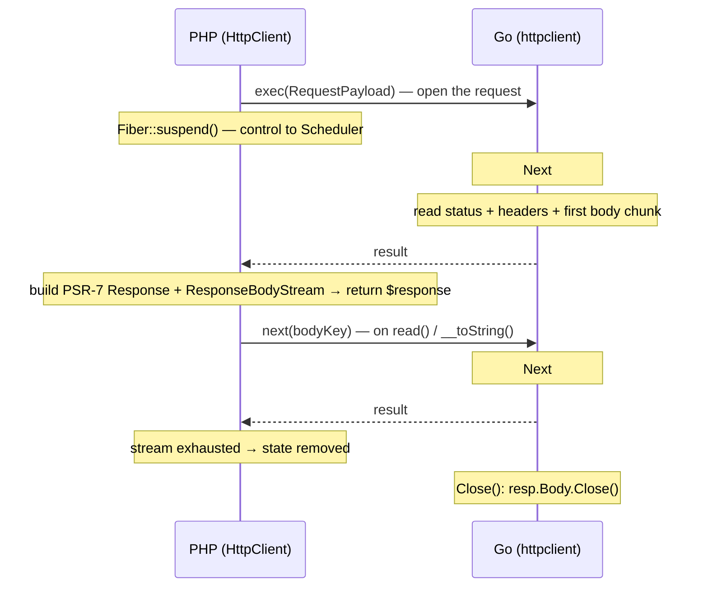

English | [Русский](http-client.ru.md)

# HTTP client (PSR-18) with streaming

SConcur's asynchronous HTTP client. PHP stays a thin orchestration layer, while all
network I/O (DNS, connection, TLS, sending the request, reading the response) lives
in the Go extension on top of the standard `net/http.Client`. The request goes into
a goroutine, the coroutine (Fiber) suspends — dozens of requests fan out, like the
other SConcur features. Outside a `WaitGroup` the same API works synchronously (see
[README → Usage](../README.md)).

The client implements `Psr\Http\Client\ClientInterface` (PSR-18) and works with any
HTTP server. The response body is returned as a PSR-7 `StreamInterface`
(`ResponseBodyStream`): it lazily pulls chunks from Go (like a Mongo cursor) and does
not buffer the whole response in memory.

## Table of contents

- [Idea and model](#idea-and-model)
- [Quick start](#quick-start)
- [Dependencies](#dependencies)
- [Examples](#examples)
- [Client options and timeouts](#client-options-and-timeouts)
- [Response streaming](#response-streaming)
- [Downloading to a file](#downloading-to-a-file)
- [Error handling (PSR-18)](#error-handling-psr-18)
- [Internals](#internals)
- [Not in v1](#not-in-v1)
- [Testing](#testing)

## Idea and model



A request is a streaming state. The first result carries the response metadata
(status, headers, first body chunk, `Content-Length`); the following ones are raw
body chunks. `ResponseBodyStream` pulls them on demand.

- `sendRequest()` inside a coroutine suspends it without blocking the other
  requests (the same `Scheduler`, the same `waitAny`);
- outside a Fiber it works synchronously (`Extension::wait`) — a single API;
- an unfinished response (early `break`, object destruction) is cleaned up by the
  streaming-state machinery: context cancellation → `Close()` → `resp.Body.Close`.

## Quick start

```php
use Nyholm\Psr7\Factory\Psr17Factory;
use SConcur\Features\HttpClient\HttpClient;

$factory = new Psr17Factory();              // any PSR-17 implementation
$client  = new HttpClient($factory);

$response = $client->sendRequest($factory->createRequest('GET', 'https://example.com/'));

$status = $response->getStatusCode();        // int
$body   = (string) $response->getBody();     // reads the stream to the end
```

`ResponseFactoryInterface` (PSR-17) is a mandatory constructor argument: the core is
not tied to a specific PSR-7 implementation, the user supplies the factory.

## Dependencies

In `require`: `psr/http-client`, `psr/http-message`, `psr/http-factory` (interfaces
only). The concrete PSR-7/PSR-17 implementation (`nyholm/psr7`, `guzzlehttp/psr7`,
…) is chosen by the user; the tests use `nyholm/psr7` (`require-dev`).

## Examples

### Concurrency (fan out)

```php
use SConcur\WaitGroup;

$waitGroup = WaitGroup::create();

foreach ($urls as $url) {
    $waitGroup->add(function () use ($client, $factory, $url) {
        return $client->sendRequest($factory->createRequest('GET', $url));
    });
}

/** @var array<int|string, \Psr\Http\Message\ResponseInterface> $responses */
$responses = $waitGroup->waitResults();      // total time ≈ the slowest request
```

PSR-18 is synchronous by contract (`sendRequest(): ResponseInterface`); the Fiber
suspension is transparent to the caller — it gets a ready `ResponseInterface`, its
construction is simply concurrent with other coroutines.

### Response streaming (the body is not buffered whole)

```php
$response = $client->sendRequest($factory->createRequest('GET', $url));

$stream = $response->getBody();

while (!$stream->eof()) {
    $chunk = $stream->read(64 * 1024);       // inside a coroutine it suspends it
    // ...process the chunk...
}
```

> Better to read the body inside the same coroutine as `sendRequest`: once the
> coroutine finishes its flow stops and the unread stream on the Go side is closed.
> Small responses (≤ 64 KiB) arrive inline with the first result and are available
> after `waitResults()` with no caveats.

### Request body

By default the body is read whole and goes into the payload (buffered):

```php
$request = $factory->createRequest('POST', $url)
    ->withHeader('Content-Type', 'application/json')
    ->withBody($factory->createStream(json_encode(['name' => 'example'])));

$response = $client->sendRequest($request);
```

For large bodies enable request-body streaming (`streamRequestBody: true`): the body
is sent in chunks (`chunkSize`) PHP → Go and written to an `io.Pipe` handed over as
`req.Body` — with write-backpressure from Go, without buffering the whole body in
memory.

```php
$client = new HttpClient($factory, new HttpClientOptions(streamRequestBody: true));

$request = $factory->createRequest('POST', $url)->withBody($largeStream);

$response = $client->sendRequest($request); // the body goes in chunks
```

> With `streamRequestBody: true` redirects are not followed (the body is an `io.Pipe`
> without `GetBody`, it cannot be replayed on a 3xx): a redirect response is returned
> as-is. For requests with redirects use the buffered mode.

### With tuning

```php
use SConcur\Features\HttpClient\HttpClientOptions;

$client = new HttpClient($factory, new HttpClientOptions(
    requestTimeoutMs: 5_000,
    maxResponseBody: 8 * 1024 * 1024,        // 8 MiB, OOM protection
    followRedirects: false,
    verifyTls: false,                        // only for self-signed in dev
));
```

## Client options and timeouts

`SConcur\Features\HttpClient\HttpClientOptions` (`readonly`), all timeouts in ms. The
PHP defaults mirror the Go defaults.

| Option | Default | Purpose |
|---|---|---|
| `requestTimeoutMs` | `30000` | Full request deadline (connect + send + reading the whole body). A hard context limit on the Go side. `0` — off (not recommended). |
| `connectTimeoutMs` | `10000` | TCP/TLS connection establishment limit (`net.Dialer.Timeout`). |
| `responseHeaderTimeoutMs` | `15000` | Limit waiting for status + headers (`Transport.ResponseHeaderTimeout`). |
| `maxResponseBody` | `0` (unlimited) | Response body cap in bytes; exceeding it → stream read error. **Warning:** `0` is unlimited — watch for OOM. |
| `followRedirects` | `true` | Whether to follow 3xx redirects. |
| `maxRedirects` | `10` | Redirect hop limit. |
| `chunkSize` | `65536` | Granularity of reading the response body and sending the request body. |
| `verifyTls` | `true` | Whether to verify TLS certificates. |
| `maxIdleConns` | `100` | Total idle keep-alive connections in the pool. |
| `maxIdleConnsPerHost` | `16` | Idle keep-alive connections per host. |
| `idleConnTimeoutMs` | `90000` | How long an idle keep-alive connection is kept before closing. |
| `tlsHandshakeTimeoutMs` | `10000` | TLS handshake limit. |
| `streamRequestBody` | `false` | Stream the request body in chunks (instead of buffering it whole); write-backpressure for large uploads. |
| `throwOnToStringError` | `true` | Whether `ResponseBodyStream::__toString()` may throw on a read error. PSR-7 forbids throwing from `__toString`; when `false` the error is turned into an `E_USER_WARNING` and an empty string. Defaults to `true` — like Guzzle's streams on PHP ≥ 7.4. |

`requestTimeoutMs` is the mandatory execution deadline for the whole operation,
applied on the Go side as `context.WithTimeout(task.GetContext(), …)`.

Connection pool / keep-alive. On the Go side reusable `http.Transport`s are kept
(one per distinct set of transport options: `connectTimeout`/`responseHeaderTimeout`/
`verifyTls` + the pool parameters above), so keep-alive and the connection pool work
between requests within the process. All pool parameters come from
`HttpClientOptions` (the PHP defaults mirror Go). Idle connections are released in
`features.Shutdown()` (`CloseIdleConnections`).

## Response streaming

`SConcur\Features\HttpClient\Dto\ResponseBodyStream` — a PSR-7 `StreamInterface`
implementation:

- One-directional, read-only, not seekable. `isReadable()=true`,
  `isWritable()=false`, `isSeekable()=false`; `seek()/rewind()/write()` throw an
  exception (PSR-7 allows this for non-rewindable streams).
- `read($length)` — returns up to `$length` bytes: first the inline chunk of the
  first result, then it pulls the rest via `next($bodyKey)`. Inside a coroutine
  `next()` suspends it — a slow server does not block the other requests.
- `getContents()` / `__toString()` — read the stream to the end.
- `getSize()` — `Content-Length` if it is known (not chunked), otherwise `null`.
- `eof()`, `tell()`, `getMetadata()`.
- `close()` / `detach()` / `__destruct()` — release the Go flow on an early
  abandonment of the body.

The transport granularity is fixed (64 KiB): a body ≤ that size arrives inline with
the first result without extra round-trips; a larger one comes in pieces per
round-trip, and `read($length)` slices them to the application's size.

## Downloading to a file

`download()` writes the response body straight into a file on the Go side
(`io.CopyBuffer` inside the extension) — the bytes never cross into PHP. Memory is
constant for any size, there are no per-chunk round-trips, and inside a `WaitGroup`
several downloads fan out. Unlike a manual "`sendRequest()` → read the body →
`fwrite`", the body is not run through PHP twice.

```php
use SConcur\Features\HttpClient\DownloadFileMode;

$result = $httpClient->download(
    request: $factory->createRequest('GET', 'https://example.com/big.iso'),
    path: '/var/data/big.iso',
    mode: DownloadFileMode::Replace,   // default
    bufferSizeBytes: 1 << 20,           // opt., default 64 KiB — the io.CopyBuffer buffer
    perm: 0644,                          // opt., create permissions
);

$result->statusCode;          // always 2xx (otherwise an exception)
$result->headers;             // response headers as the server returned them
$result->filesizeBytes;       // how many bytes were written to the file (exact size from io.Copy)
$result->executionMs;         // download time
```

Modes (`DownloadFileMode`): `Replace` — create or overwrite
(`O_CREATE|O_TRUNC`); `Create` — create, error if the file exists
(`O_CREATE|O_EXCL`); `Append` — create or append to the end (`O_CREATE|O_APPEND`).
Human-readable names; the `os.O_*` flags are mapped on the Go side.

Behaviour and errors. The file is written only on 2xx. A non-2xx, transport or file
error → `SConcur\Exceptions\HttpClient\DownloadException` (`getStatusCode()` carries
the status for a non-2xx, `null` for the rest; the cause is in `getPrevious()`). On a
non-2xx the file is not touched (not created or truncated — the status is checked
before opening the file). On a copy interruption the partial file is removed for
`Replace`/`Create`; for `Append` it stays (an append cannot be rolled back).

Size. `filesizeBytes` is the exact number of bytes written (measured by
`io.CopyBuffer` on the Go side), always available, including for chunked responses
without a `Content-Length`. The headers (`headers`) are passed through as-is — what
the server returned.

Timeout. The whole operation (connect + download) is bounded by `requestTimeoutMs`
(see options) — raise it for large files. A flow stop or deadline aborts
`io.CopyBuffer` and closes the file.

Limitation. `download()` is incompatible with request-body streaming
(`streamRequestBody`) — a rare case; a normal download is a GET/small POST.

## Error handling (PSR-18)

`4xx`/`5xx` are not client errors — they are a normal `ResponseInterface` with the
corresponding status. Exceptions are thrown only on a send or connection failure:

| Case | SConcur exception | PSR-18 interface |
|---|---|---|
| Network unreachable (refused, DNS-fail, timeout, dropped, redirect limit) | `Exceptions\HttpClient\NetworkException` | `NetworkExceptionInterface` |
| Malformed request (bad URL/method, not sent) | `Exceptions\HttpClient\RequestException` | `RequestExceptionInterface` |
| Other client error | `Exceptions\HttpClient\HttpClientException` | `ClientExceptionInterface` |

`NetworkException`/`RequestException` carry `getRequest(): RequestInterface` (the
original request). The Go side marks the error class with a prefix (`net: `/`req: `)
in the payload, PHP maps it across the whole `getPrevious()` chain → the right class.

```php
use Psr\Http\Client\NetworkExceptionInterface;

try {
    $response = $client->sendRequest($request);
} catch (NetworkExceptionInterface $exception) {
    $failedRequest = $exception->getRequest();
    // retry / logging
}
```

## Internals

PHP (`src/Features/HttpClient/`):

- `HttpClient` — `ClientInterface`: assembles the `RequestPayload`, sends the request
  via `FeatureExecutor::exec()`, decodes the first result's metadata, builds the
  response (status + headers) and attaches `ResponseBodyStream`. `download()`, which
  returns a `Dto/DownloadResult`, lives here too.
- `HttpClientOptions` — the `readonly` options DTO.
- `DownloadFileMode` — the file-write mode enum (`Replace`/`Create`/`Append`).
- `HttpClientCommandEnum` — sub-operations in the payload envelope (`Request`,
  `UploadChunk`, `UploadEnd`).
- `Payloads/RequestPayload` (+ `RequestPayloadParameters`) — the request payload, a
  mirror of the Go struct; `UploadChunkPayload`/`UploadEndPayload` — the chunks and
  the final marker of a streamed body.
- `Dto/ResponseBodyStream` — the streaming response body; `Dto/DownloadResult` — the
  result of `download()`.
- `Exceptions/HttpClient/*` — the PSR-18 exceptions (+ `DownloadException`).

Go (`ext/internal/features/httpclient/`):

- `payloads/payloads.go` — `RequestParams` (1:1 with PHP), `UploadParams`, `Envelope`
  and `ResponseMeta` (the first result: `st`, `hd`, `b`, `cl`).
- `client.go` — the registry of reusable `*http.Transport`s (pool, keep-alive,
  TLS mode, redirect policy), `CloseIdleConnections()`.
- `response_state.go` — `responseState` (`contracts.StateContract`): the first
  `Next()` runs the request and returns the metadata + first chunk, the following
  ones are raw body chunks; `Close()` closes `resp.Body`. `maxBytesReader` (the
  `maxResponseBody` limit) is here too.
- `feature.go` — `HttpClientFeature` (`contracts.FeatureContract`): builds the
  `*http.Request`, applies `context.WithTimeout` (the execution-deadline
  requirement), starts the state; routes the commands (Request/UploadChunk/UploadEnd)
  and download.
- `download.go` — download to a file (`handleDownload`, `io.CopyBuffer`,
  `downloadModeToFlags`).
- `upload.go` — request-body streaming: `uploadSession` (pipe + the result of the
  background `client.Do`), `pendingUploads` keyed by `requestId`, handling of the
  upload commands (chunk/end).

The shared helper `internal/helpers.ReadChunk` slices the body into fixed pieces
(used by both the server and the client).

## Not in v1

| What | Comment |
|---|---|
| HTTP/2, h2c | `net/http` HTTP/1.1; h2 — later. |
| Cookie jar | On the application side / PSR-7 middleware. |
| Proxy, custom CA bundle | Later, via options. |
| PSR-18 async (`sendAsyncRequest`) | Concurrency — via `WaitGroup`, not promises. |

## Testing

- PHP feature tests — `tests/feature/Features/HttpClient/`: edge cases
  (`HttpClientTest`), download to a file (`DownloadTest`) and the concurrency
  contract on `BaseAsyncTestCase` (`HttpClientConcurrencyTest`); the shared base is
  `BaseHttpClientTestCase`. Requests target the real SConcur HTTP server
  (`tests/servers/http/http-server.php`), started via
  `SConcur\Tests\Impl\HttpServer\TestHttpServer`.
- Go tests (`ext/internal/features/httpclient/*_test.go`) on an `httptest.Server`:
  `response_state_test.go` — the first result's metadata, body streaming, the
  `maxResponseBody` limit, error classification, `Close`; `feature_test.go` — request
  assembly and command routing; `download_test.go` — download to a file.

- Benchmark — `tests/benchmarks/http-client.php` (`make bench-http-client`):
  N requests to the demo server's I/O endpoint (`/msleep`); the async run via
  `WaitGroup` shows the fan-out (total time ≈ one request) against the sequential
  native/sync ones.

Run: `make test c="--filter=HttpClient"`, `make ext-test`,
`make bench-http-client c=20`.

```
make ext-build && make ext-test && make php-stan && make cs-fixer-check && make test
```
