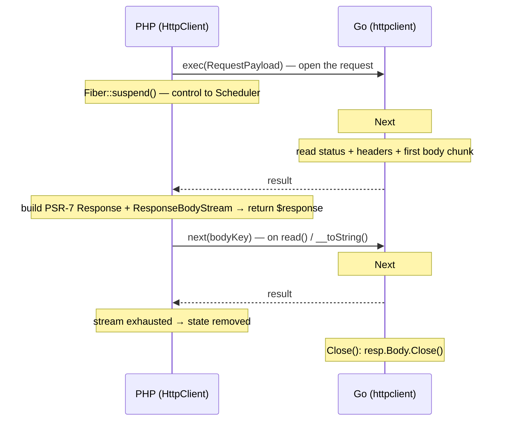

English | [Русский](http-client.ru.md)

# HTTP client (PSR-18) with streaming

An asynchronous PSR-18 HTTP client. All network I/O (DNS, connection, TLS,
sending the request, reading the response) lives in the Go extension on top of
`net/http.Client`: the request goes into a goroutine, the coroutine suspends,
and dozens of requests can be in progress at once. Outside a `WaitGroup` the
same API works synchronously.

The response body is a PSR-7 `StreamInterface` (`ResponseBodyStream`) that lazily
pulls chunks from Go, like a Mongo cursor, so a response is never buffered whole.

## Quick start

```php
use Nyholm\Psr7\Factory\Psr17Factory;
use SConcur\Features\HttpClient\HttpClient;

$factory = new Psr17Factory();              // any PSR-17 implementation
$client  = new HttpClient($factory);

$response = $client->sendRequest($factory->createRequest('GET', 'https://example.com/'));

$status = $response->getStatusCode();        // int
$body   = (string) $response->getBody();     // reads the stream to the end
```

`ResponseFactoryInterface` (PSR-17) is a mandatory constructor argument — the core
is not tied to a specific PSR-7 implementation. In `require` there are only the
interfaces (`psr/http-client`, `psr/http-message`, `psr/http-factory`); the tests
use `nyholm/psr7`.

## Model

A request is a streaming state: the first result carries the response metadata
(status, headers, first body chunk, `Content-Length`), the following ones are raw
body chunks, which `ResponseBodyStream` pulls on demand.


```mermaid
sequenceDiagram
    participant PHP as PHP (HttpClient)
    participant Go as Go (httpclient)

    PHP->>Go: exec(RequestPayload) — open the request
    Note over PHP: Fiber::suspend() — control to Scheduler
    Note over Go: Next#1: http.Client.Do(ctx) — connect, send
    Note over Go: read status + headers + first body chunk
    Go-->>PHP: result#1 {st, hd, b: firstChunk, cl} (WithNext / Success)
    Note over PHP: build PSR-7 Response + ResponseBodyStream → return $response

    PHP->>Go: next(bodyKey) — on read() / __toString()
    Note over Go: Next#2..N: the next chunk of resp.Body
    Go-->>PHP: result#k — raw chunk (WithNext, last → Success)
    Note over PHP: stream exhausted → state removed
    Note over Go: Close(): resp.Body.Close()
```

`sendRequest()` inside a coroutine suspends it without blocking other requests;
outside a Fiber it works synchronously (`Extension::wait`). An unfinished response
(an early `break`, object destruction) is cleaned up by the streaming-state
machinery: context cancellation → `Close()` → `resp.Body.Close`.

## Running requests concurrently

```php
use SConcur\WaitGroup;

$waitGroup = WaitGroup::create();

foreach ($urls as $url) {
    $waitGroup->add(fn () => $client->sendRequest($factory->createRequest('GET', $url)));
}

/** @var array<int|string, \Psr\Http\Message\ResponseInterface> $responses */
$responses = $waitGroup->waitResults();      // total time ≈ the slowest request
```

PSR-18 is synchronous by contract (`sendRequest(): ResponseInterface`); the Fiber
suspension is transparent to the caller — it gets a ready `ResponseInterface`,
whose construction is simply concurrent with other coroutines.

## Response streaming

`Dto/ResponseBodyStream` is a PSR-7 `StreamInterface`: one-directional, read-only,
not seekable (`seek`/`rewind`/`write` throw, which PSR-7 allows for non-rewindable
streams). `read($length)` returns up to `$length` bytes — first the inline chunk of
the first result, then the rest via `next($bodyKey)`, which suspends the coroutine
so a slow server does not block other requests. `getSize()` is `Content-Length` if
known (not chunked), otherwise `null`; `close()`/`detach()`/`__destruct()` release
the Go flow on early abandonment.

```php
$response = $client->sendRequest($factory->createRequest('GET', $url));

$stream = $response->getBody();

while (!$stream->eof()) {
    $chunk = $stream->read(64 * 1024);       // inside a coroutine it suspends it
    // ...process the chunk...
}
```

The transport granularity is the `chunkSize` option (default 64 KiB): a body up to
that size arrives inline with the first result without extra round-trips, a larger
one comes in pieces per round-trip.

> Better to read the body inside the same coroutine as `sendRequest`: once the
> coroutine finishes its flow stops and the unread stream on the Go side is closed.
> Small responses (≤ 64 KiB) arrive inline with the first result and are available
> after `waitResults()` with no caveats.

## Request body

By default the request body is read whole and goes into the payload. For large
bodies enable `streamRequestBody: true`: the body is sent in `chunkSize` pieces
PHP → Go and written to an `io.Pipe` handed over as `req.Body`; Go dictates the
pace of the writes, and the body is never buffered whole.

```php
$client = new HttpClient($factory, new HttpClientOptions(streamRequestBody: true));

$response = $client->sendRequest(
    $factory->createRequest('POST', $url)->withBody($largeStream)
);
```

> With `streamRequestBody: true` redirects are not followed (the body is an
> `io.Pipe` without `GetBody`, so it cannot be replayed on a 3xx): a redirect
> response is returned as-is. For requests with redirects use the buffered mode.

## Options and timeouts

`SConcur\Features\HttpClient\HttpClientOptions` (`readonly`), all timeouts in ms;
the PHP defaults mirror Go.

| Option | Default | Purpose |
|---|---|---|
| `requestTimeoutMs` | `30000` | Full request deadline (connect + send + reading the whole body), a hard context limit on the Go side. `0` — off (not recommended). |
| `connectTimeoutMs` | `10000` | TCP/TLS connection establishment limit (`net.Dialer.Timeout`). |
| `responseHeaderTimeoutMs` | `15000` | Limit waiting for status + headers. |
| `maxResponseBody` | `0` (unlimited) | Response body cap in bytes; exceeding it → stream read error. **Warning:** `0` is unlimited — watch for OOM. |
| `followRedirects` | `true` | Whether to follow 3xx redirects. |
| `maxRedirects` | `10` | Redirect hop limit. |
| `chunkSize` | `65536` | Granularity of reading the response body and sending the request body. |
| `verifyTls` | `true` | Whether to verify TLS certificates. |
| `maxIdleConns` | `100` | Total idle keep-alive connections in the pool. |
| `maxIdleConnsPerHost` | `16` | Idle keep-alive connections per host. |
| `idleConnTimeoutMs` | `90000` | How long an idle keep-alive connection is kept. |
| `tlsHandshakeTimeoutMs` | `10000` | TLS handshake limit. |
| `streamRequestBody` | `false` | Stream the request body in chunks instead of buffering it whole. |
| `throwOnToStringError` | `true` | Whether `ResponseBodyStream::__toString()` may throw on a read error. PSR-7 forbids throwing from `__toString`; when `false` the error becomes an `E_USER_WARNING` and an empty string. |

```php
$client = new HttpClient($factory, new HttpClientOptions(
    requestTimeoutMs: 5_000,
    maxResponseBody: 8 * 1024 * 1024,        // 8 MiB, OOM protection
    followRedirects: false,
    verifyTls: false,                        // only for self-signed in dev
));
```

Connection pool / keep-alive: the Go side keeps reusable `http.Transport`s, one per
distinct set of transport options (`connectTimeout`/`responseHeaderTimeout`/
`verifyTls` plus the pool parameters), so keep-alive works between requests within
the process. Idle connections are released in `features.Shutdown()`.

## Downloading to a file

`download()` writes the response body straight into a file on the Go side
(`io.CopyBuffer` inside the extension) — the bytes never cross into PHP. Memory
is constant for any size, there are no per-chunk round-trips, and inside a
`WaitGroup` several downloads run at the same time.

```php
use SConcur\Features\HttpClient\DownloadFileMode;

$result = $httpClient->download(
    request: $factory->createRequest('GET', 'https://example.com/big.iso'),
    path: '/var/data/big.iso',
    mode: DownloadFileMode::Replace,   // default
    bufferSizeBytes: 1 << 20,          // opt., default 64 KiB — the io.CopyBuffer buffer
    perm: 0644,                        // opt., create permissions
);

$result->statusCode;          // always 2xx (otherwise an exception)
$result->headers;             // response headers as the server returned them
$result->filesizeBytes;       // exact bytes written, measured by io.CopyBuffer
$result->executionMs;         // download time
```

Modes: `Replace` — create or overwrite (`O_CREATE|O_TRUNC`); `Create` — create,
error if the file exists (`O_CREATE|O_EXCL`); `Append` — create or append
(`O_CREATE|O_APPEND`).

The file is written only on 2xx. A non-2xx, transport or file error →
`SConcur\Exceptions\HttpClient\DownloadException` (`getStatusCode()` carries the
status for a non-2xx, `null` for the rest; the cause is in `getPrevious()`). On a
non-2xx the file is not touched — the status is checked before opening it. On a
copy interruption the partial file is removed for `Replace`/`Create`; for `Append`
it stays, since an append cannot be rolled back. `filesizeBytes` is always
available, including for chunked responses without a `Content-Length`. The whole
operation is bounded by `requestTimeoutMs` — raise it for large files.
`download()` ignores `streamRequestBody` (the body is buffered).

## Error handling (PSR-18)

`4xx`/`5xx` are not client errors — they are a normal `ResponseInterface`.
Exceptions are thrown only on a send or connection failure:

| Case | SConcur exception | PSR-18 interface |
|---|---|---|
| Network unreachable (refused, DNS-fail, timeout, dropped, redirect limit) | `Exceptions\HttpClient\NetworkException` | `NetworkExceptionInterface` |
| Malformed request (bad URL/method, not sent) | `Exceptions\HttpClient\RequestException` | `RequestExceptionInterface` |
| Other client error | `Exceptions\HttpClient\HttpClientException` | `ClientExceptionInterface` |

`NetworkException`/`RequestException` carry `getRequest(): RequestInterface`. The
Go side marks the error class with a prefix (`net: `/`req: `) in the payload, and
PHP maps it across the whole `getPrevious()` chain to the right class.

```php
try {
    $response = $client->sendRequest($request);
} catch (NetworkExceptionInterface $exception) {
    $failedRequest = $exception->getRequest();  // retry / logging
}
```

## Internals

PHP (`src/Features/HttpClient/`): `HttpClient` assembles the `RequestPayload`,
sends it via `FeatureExecutor::exec()`, decodes the first result's metadata, builds
the response and attaches `ResponseBodyStream`; `download()` lives here too.
Alongside it: `HttpClientOptions`, `DownloadFileMode`, `HttpClientCommandEnum` (the
envelope's sub-operations `Request`/`UploadChunk`/`UploadEnd`), `Payloads/*`
(mirrors of the Go structs), `Dto/ResponseBodyStream` and `Dto/DownloadResult`.

Go (`ext-go-legacy/internal/features/httpclient/`): `feature.go` builds the `*http.Request`,
applies `context.WithTimeout`, starts the state and routes the commands;
`response_state.go` is the streaming state (the first `Next()` runs the request and
returns metadata plus first chunk, the rest are raw body chunks, `Close()` closes
`resp.Body`) and also holds the `maxResponseBody` limit; `client.go` is the
registry of reusable `*http.Transport`s; `download.go` and `upload.go` are the file
sink and the request-body pipe. The shared helper `internal/helpers.ReadChunk`
slices bodies for both the server and the client.

## Not in v1

HTTP/2 and h2c (`net/http` HTTP/1.1 for now), a cookie jar (application side or
PSR-7 middleware), proxy and a custom CA bundle (later, via options), PSR-18 async
(`sendAsyncRequest`) — concurrency goes through `WaitGroup`, not promises.

## Testing

PHP feature tests are in `tests/feature/Features/HttpClient/` — edge cases,
download to a file and the concurrency contract on `BaseAsyncTestCase`, with
requests targeting the real SConcur HTTP server started via `TestHttpServer`.
The Go tests run against an `httptest.Server` and cover the first-result
metadata, body streaming, the `maxResponseBody` limit, error classification,
request assembly and download. The benchmark (`make bench-http-client c=20`)
sends N requests to `/msleep`, concurrent async against sequential native/sync.

Run: `make test c="--filter=HttpClient"`, `make ext-test`.
