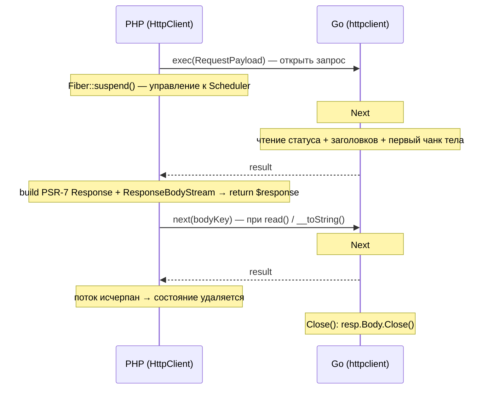

# HTTP-клиент (PSR-18) со стримингом

Асинхронный HTTP-клиент SConcur. PHP остаётся тонким слоем-оркестратором, а весь
сетевой I/O (DNS, соединение, TLS, отправка запроса, чтение ответа) живёт в
Go-расширении на стандартном `net/http.Client`. Запрос уходит в горутину, корутина
(Fiber) приостанавливается — десятки запросов идут «веером», как и прочие фичи
SConcur. Вне `WaitGroup` тот же API работает синхронно (см.
[README → Применение](../README.md)).

Клиент реализует `Psr\Http\Client\ClientInterface` (PSR-18) и работает с любым
HTTP-сервером. Тело ответа отдаётся PSR-7 `StreamInterface`-ом
(`ResponseBodyStream`): он лениво подтягивает чанки из Go (как курсор Mongo) и не
буферизует весь ответ в памяти.

## Оглавление

- [Идея и модель](#идея-и-модель)
- [Быстрый старт](#быстрый-старт)
- [Зависимости](#зависимости)
- [Примеры](#примеры)
- [Параметры клиента и таймауты](#параметры-клиента-и-таймауты)
- [Стриминг ответа](#стриминг-ответа)
- [Скачивание в файл](#скачивание-в-файл)
- [Обработка ошибок (PSR-18)](#обработка-ошибок-psr-18)
- [Внутреннее устройство](#внутреннее-устройство)
- [Чего нет в v1](#чего-нет-в-v1)
- [Тестирование](#тестирование)

## Идея и модель



Запрос — это стриминговое состояние. Первый результат несёт метаданные ответа
(статус, заголовки, первый кусок тела, `Content-Length`); последующие — сырые чанки
тела. `ResponseBodyStream` тянет их по требованию.

- `sendRequest()` внутри корутины приостанавливает её, не блокируя остальные
  запросы (тот же `Scheduler`, тот же `waitAny`);
- вне Fiber работает синхронно (`Extension::wait`) — единый API;
- незавершённый ответ (ранний `break`, разрушение объекта) очищает машинерия
  стриминговых состояний: отмена контекста → `Close()` → `resp.Body.Close`.

## Быстрый старт

```php
use Nyholm\Psr7\Factory\Psr17Factory;
use SConcur\Features\HttpClient\HttpClient;

$factory = new Psr17Factory();              // любая PSR-17 реализация
$client  = new HttpClient($factory);

$response = $client->sendRequest($factory->createRequest('GET', 'https://example.com/'));

$status = $response->getStatusCode();        // int
$body   = (string) $response->getBody();     // дочитает поток целиком
```

`ResponseFactoryInterface` (PSR-17) — обязательный аргумент конструктора: ядро не
завязано на конкретную PSR-7 реализацию, фабрику передаёт пользователь.

## Зависимости

В `require`: `psr/http-client`, `psr/http-message`, `psr/http-factory` (только
интерфейсы). Конкретную PSR-7/PSR-17 реализацию (`nyholm/psr7`, `guzzlehttp/psr7`,
…) выбирает пользователь; в тестах используется `nyholm/psr7` (`require-dev`).

## Примеры

### Конкурентность («веер»)

```php
use SConcur\WaitGroup;

$waitGroup = WaitGroup::create();

foreach ($urls as $url) {
    $waitGroup->add(function () use ($client, $factory, $url) {
        return $client->sendRequest($factory->createRequest('GET', $url));
    });
}

/** @var array<int|string, \Psr\Http\Message\ResponseInterface> $responses */
$responses = $waitGroup->waitResults();      // общее время ≈ самого медленного запроса
```

PSR-18 синхронен по контракту (`sendRequest(): ResponseInterface`); приостановка
Fiber'а прозрачна для вызывающего — он получает готовый `ResponseInterface`, просто
его построение конкурентно с другими корутинами.

### Стриминг ответа (тело не буферизуется целиком)

```php
$response = $client->sendRequest($factory->createRequest('GET', $url));

$stream = $response->getBody();

while (!$stream->eof()) {
    $chunk = $stream->read(64 * 1024);       // внутри корутины приостанавливает её
    // ...обработать чанк...
}
```

> Тело лучше читать внутри той же корутины, что и `sendRequest`: после завершения
> корутины её флоу останавливается и недочитанный поток на Go-стороне закрывается.
> Небольшие ответы (≤ 64 KiB) приходят инлайн с первым результатом и доступны после
> `waitResults()` без оговорок.

### Тело запроса

По умолчанию тело читается целиком и уходит в payload (буферизованно):

```php
$request = $factory->createRequest('POST', $url)
    ->withHeader('Content-Type', 'application/json')
    ->withBody($factory->createStream(json_encode(['name' => 'example'])));

$response = $client->sendRequest($request);
```

Для больших тел включите стриминг тела запроса (`streamRequestBody: true`): тело
досылается чанками (`chunkSize`) PHP → Go и пишется в `io.Pipe`, отданный как
`req.Body`, — с write-backpressure от Go, без буферизации всего тела в памяти.

```php
$client = new HttpClient($factory, new HttpClientOptions(streamRequestBody: true));

$request = $factory->createRequest('POST', $url)->withBody($largeStream);

$response = $client->sendRequest($request); // тело уходит чанками
```

> При `streamRequestBody: true` редиректы не отслеживаются (тело — `io.Pipe` без
> `GetBody`, его нельзя переиграть на 3xx): ответ-редирект возвращается как есть.
> Для запросов с редиректами используйте буферизованный режим.

### С тюнингом

```php
use SConcur\Features\HttpClient\HttpClientOptions;

$client = new HttpClient($factory, new HttpClientOptions(
    requestTimeoutMs: 5_000,
    maxResponseBody: 8 * 1024 * 1024,        // 8 MiB, защита от OOM
    followRedirects: false,
    verifyTls: false,                        // только для self-signed в dev
));
```

## Параметры клиента и таймауты

`SConcur\Features\HttpClient\HttpClientOptions` (`readonly`), все таймауты в мс.
Дефолты PHP зеркалят дефолты Go.

| Параметр | Дефолт | Назначение |
|---|---|---|
| `requestTimeoutMs` | `30000` | Полный предел запроса (соединение + отправка + чтение всего тела). Жёсткий лимит контекста на Go-стороне. `0` — выкл (не рекомендуется). |
| `connectTimeoutMs` | `10000` | Предел установки TCP/TLS-соединения (`net.Dialer.Timeout`). |
| `responseHeaderTimeoutMs` | `15000` | Предел ожидания статуса+заголовков (`Transport.ResponseHeaderTimeout`). |
| `maxResponseBody` | `0` (без лимита) | Лимит тела ответа в байтах; превышение → ошибка чтения потока. **Внимание:** `0` без лимита — следите за OOM. |
| `followRedirects` | `true` | Следовать ли 3xx-редиректам. |
| `maxRedirects` | `10` | Предел числа редиректов. |
| `chunkSize` | `65536` | Гранулярность чтения тела ответа и отправки тела запроса. |
| `verifyTls` | `true` | Проверять ли TLS-сертификаты. |
| `maxIdleConns` | `100` | Всего idle keep-alive соединений в пуле. |
| `maxIdleConnsPerHost` | `16` | Idle keep-alive соединений на хост. |
| `idleConnTimeoutMs` | `90000` | Сколько держать idle keep-alive соединение перед закрытием. |
| `tlsHandshakeTimeoutMs` | `10000` | Предел TLS-рукопожатия. |
| `streamRequestBody` | `false` | Стримить тело запроса чанками (вместо буферизации целиком); write-backpressure для больших загрузок. |
| `throwOnToStringError` | `true` | Может ли `ResponseBodyStream::__toString()` бросить при ошибке чтения. PSR-7 запрещает бросать из `__toString`; при `false` ошибка превращается в `E_USER_WARNING` и пустую строку. По умолчанию `true` — как у потоков Guzzle на PHP ≥ 7.4. |

`requestTimeoutMs` — обязательное предельное время выполнения всей операции,
применяется на Go-стороне как `context.WithTimeout(task.GetContext(), …)`.

Пул соединений / keep-alive. На Go-стороне держатся переиспользуемые
`http.Transport` (по одному на различимый набор транспортных опций:
`connectTimeout`/`responseHeaderTimeout`/`verifyTls` + параметры пула выше), так
что keep-alive и пул соединений работают между запросами в рамках процесса. Все
параметры пула приходят из `HttpClientOptions` (дефолты PHP зеркалят Go).
Idle-соединения освобождаются в `features.Shutdown()` (`CloseIdleConnections`).

## Стриминг ответа

`SConcur\Features\HttpClient\Dto\ResponseBodyStream` — реализация PSR-7
`StreamInterface`:

- Однонаправленный, read-only, не seekable. `isReadable()=true`,
  `isWritable()=false`, `isSeekable()=false`; `seek()/rewind()/write()` бросают
  исключение (PSR-7 это допускает для неперематываемых потоков).
- `read($length)` — отдаёт до `$length` байт: сначала инлайн-чанк первого
  результата, потом подтягивает остаток через `next($bodyKey)`. Внутри корутины
  `next()` приостанавливает её — медленный сервер не блокирует другие запросы.
- `getContents()` / `__toString()` — дочитывают поток до конца.
- `getSize()` — `Content-Length`, если он известен (не chunked), иначе `null`.
- `eof()`, `tell()`, `getMetadata()`.
- `close()` / `detach()` / `__destruct()` — освобождают Go-флоу при раннем отказе
  от тела.

Транспортная гранулярность фиксирована (64 KiB): тело ≤ этого размера приходит
инлайн с первым результатом без лишних round-trip'ов; большее — кусками за
round-trip, а `read($length)` нарезает их под размер приложения.

## Скачивание в файл

`download()` пишет тело ответа сразу в файл на Go-стороне (`io.CopyBuffer` внутри
расширения) — байты не выходят в PHP. Память константна для любого размера, нет
round-trip'ов за чанки, а в `WaitGroup` несколько скачиваний идут «веером». В
отличие от ручного «`sendRequest()` → читать тело → `fwrite`», тело не гоняется
через PHP дважды.

```php
use SConcur\Features\HttpClient\DownloadFileMode;

$result = $httpClient->download(
    request: $factory->createRequest('GET', 'https://example.com/big.iso'),
    path: '/var/data/big.iso',
    mode: DownloadFileMode::Replace,   // дефолт
    bufferSizeBytes: 1 << 20,           // опц., дефолт 64 KiB — буфер io.CopyBuffer
    perm: 0644,                          // опц., права создания
);

$result->statusCode;          // всегда 2xx (иначе исключение)
$result->headers;             // заголовки ответа, как их отдал сервер
$result->filesizeBytes;       // сколько байт записано в файл (точный размер из io.Copy)
$result->executionMs;         // время скачивания
```

Режимы (`DownloadFileMode`): `Replace` — создать или перезаписать
(`O_CREATE|O_TRUNC`); `Create` — создать, ошибка если файл есть
(`O_CREATE|O_EXCL`); `Append` — создать или дописать в конец (`O_CREATE|O_APPEND`).
Человекопонятные имена; флаги `os.O_*` маппятся на Go-стороне.

Поведение и ошибки. Файл пишется только при 2xx. Не-2xx, транспортная или файловая
ошибка → `SConcur\Exceptions\HttpClient\DownloadException` (`getStatusCode()` несёт
статус для не-2xx, `null` для прочих; причина — в `getPrevious()`). При не-2xx файл
не трогается (не создаётся и не усекается — статус проверяется до открытия файла).
При обрыве копирования частичный файл удаляется для `Replace`/`Create`; для
`Append` остаётся (откатить дозапись нельзя).

Размер. `filesizeBytes` — точное число записанных байт (меряется `io.CopyBuffer` на
Go-стороне), доступно всегда, в т.ч. для chunked-ответов без `Content-Length`.
Заголовки (`headers`) проброшены как есть — что отдал сервер.

Таймаут. Всю операцию (соединение + скачивание) ограничивает `requestTimeoutMs`
(см. параметры) — для больших файлов поднимите его. Стоп флоу или дедлайн прерывают
`io.CopyBuffer` и закрывают файл.

Ограничение. `download()` несовместим со стриминговым телом запроса
(`streamRequestBody`) — редкий кейс; обычная загрузка это GET/небольшой POST.

## Обработка ошибок (PSR-18)

`4xx`/`5xx` не являются ошибками клиента — это нормальный `ResponseInterface` с
соответствующим статусом. Исключения бросаются только при сбое отправки или
соединения:

| Случай | Исключение SConcur | Интерфейс PSR-18 |
|---|---|---|
| Сеть недоступна (refused, DNS-fail, таймаут, оборвано, лимит редиректов) | `Exceptions\HttpClient\NetworkException` | `NetworkExceptionInterface` |
| Запрос некорректен (битый URL/метод, не отправлен) | `Exceptions\HttpClient\RequestException` | `RequestExceptionInterface` |
| Прочая ошибка клиента | `Exceptions\HttpClient\HttpClientException` | `ClientExceptionInterface` |

`NetworkException`/`RequestException` несут `getRequest(): RequestInterface`
(исходный запрос). Go-сторона помечает класс ошибки префиксом (`net: `/`req: `) в
payload, PHP мапит его по всей цепочке `getPrevious()` → нужный класс.

```php
use Psr\Http\Client\NetworkExceptionInterface;

try {
    $response = $client->sendRequest($request);
} catch (NetworkExceptionInterface $exception) {
    $failedRequest = $exception->getRequest();
    // ретрай / логирование
}
```

## Внутреннее устройство

PHP (`src/Features/HttpClient/`):

- `HttpClient` — `ClientInterface`: собирает `RequestPayload`, через
  `FeatureExecutor::exec()` отправляет запрос, декодирует метаданные первого
  результата, строит ответ (статус + заголовки) и навешивает `ResponseBodyStream`.
  Здесь же `download()`, возвращающий `Dto/DownloadResult`.
- `HttpClientOptions` — `readonly` DTO опций.
- `DownloadFileMode` — enum режима записи файла (`Replace`/`Create`/`Append`).
- `HttpClientCommandEnum` — суб-операции в конверте payload'а (`Request`,
  `UploadChunk`, `UploadEnd`).
- `Payloads/RequestPayload` (+ `RequestPayloadParameters`) — payload запроса,
  зеркало Go-структуры; `UploadChunkPayload`/`UploadEndPayload` — чанки и финал
  стримингового тела.
- `Dto/ResponseBodyStream` — стриминговое тело ответа; `Dto/DownloadResult` —
  результат `download()`.
- `Exceptions/HttpClient/*` — PSR-18 исключения (+ `DownloadException`).

Go (`ext/internal/features/httpclient/`):

- `payloads/payloads.go` — `RequestParams` (1:1 с PHP), `UploadParams`, `Envelope`
  и `ResponseMeta` (первый результат: `st`, `hd`, `b`, `cl`).
- `client.go` — реестр переиспользуемых `*http.Transport` (пул, keep-alive,
  TLS-режим, политика редиректов), `CloseIdleConnections()`.
- `response_state.go` — `responseState` (`contracts.StateContract`): первый
  `Next()` выполняет запрос и отдаёт метаданные + первый чанк, последующие — сырые
  чанки тела; `Close()` закрывает `resp.Body`. Здесь же `maxBytesReader` (лимит
  `maxResponseBody`).
- `feature.go` — `HttpClientFeature` (`contracts.FeatureContract`): строит
  `*http.Request`, применяет `context.WithTimeout` (требование предельного времени),
  стартует состояние; роутит команды (Request/UploadChunk/UploadEnd) и download.
- `download.go` — скачивание в файл (`handleDownload`, `io.CopyBuffer`,
  `downloadModeToFlags`).
- `upload.go` — стриминг тела запроса: `uploadSession` (pipe + результат фонового
  `client.Do`), `pendingUploads` по `requestId`, обработка upload-команд (chunk/end).

Общий хелпер `internal/helpers.ReadChunk` нарезает тело фиксированными кусками
(используется и сервером, и клиентом).

## Чего нет в v1

| Что | Комментарий |
|---|---|
| HTTP/2, h2c | `net/http` HTTP/1.1; h2 — позже. |
| Cookie-jar | На стороне приложения / PSR-7 middleware. |
| Прокси, кастомный CA-bundle | Позже опциями. |
| PSR-18 async (`sendAsyncRequest`) | Конкурентность — через `WaitGroup`, не через промисы. |

## Тестирование

- PHP feature-тесты — `tests/feature/Features/HttpClient/`: краевые случаи
  (`HttpClientTest`), скачивание в файл (`DownloadTest`) и контракт конкурентности
  на `BaseAsyncTestCase` (`HttpClientConcurrencyTest`); общая база —
  `BaseHttpClientTestCase`. Цель запросов — реальный HTTP-сервер SConcur
  (`tests/servers/http/http-server.php`), поднимаемый через
  `SConcur\Tests\Impl\HttpServer\TestHttpServer`.
- Go-тесты (`ext/internal/features/httpclient/*_test.go`) на `httptest.Server`:
  `response_state_test.go` — метаданные первого результата, стриминг тела, лимит
  `maxResponseBody`, классификация ошибок, `Close`; `feature_test.go` — сборка
  запроса и роутинг команд; `download_test.go` — скачивание в файл.

- Бенчмарк — `tests/benchmarks/http-client.php` (`make bench-http-client`):
  N запросов к I/O-эндпоинту (`/msleep`) демо-сервера; async-прогон через
  `WaitGroup` показывает «веер» (общее время ≈ одного запроса) против
  последовательных native/sync.

Запуск: `make test c="--filter=HttpClient"`, `make ext-test`,
`make bench-http-client c=20`.
```
make ext-build && make ext-test && make php-stan && make cs-fixer-check && make test
```
