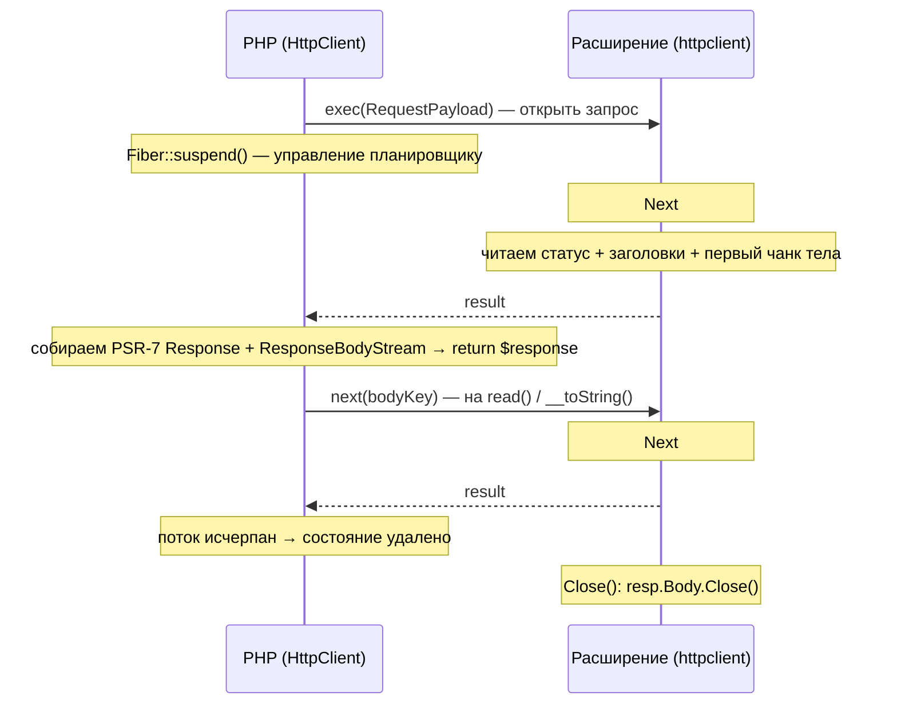

[English](http-client.md) | Русский

# HTTP-клиент (PSR-18) со стримингом

Асинхронный PSR-18 HTTP-клиент. Весь сетевой I/O (DNS, соединение, TLS, отправка
запроса, чтение ответа) живёт в расширении поверх reqwest: запрос
уходит в задачу рантайма, корутина приостанавливается, и десятки запросов могут
выполняться одновременно. Вне `WaitGroup` тот же API работает синхронно.

Тело ответа — PSR-7 `StreamInterface` (`ResponseBodyStream`), который лениво тянет
чанки из расширения, как курсор Mongo, поэтому ответ никогда не буферизуется целиком.

## Быстрый старт

```php
use Nyholm\Psr7\Factory\Psr17Factory;
use SConcur\Features\HttpClient\HttpClient;

$factory = new Psr17Factory();              // любая реализация PSR-17
$client  = new HttpClient($factory);

$response = $client->sendRequest($factory->createRequest('GET', 'https://example.com/'));

$status = $response->getStatusCode();        // int
$body   = (string) $response->getBody();     // читает поток до конца
```

`ResponseFactoryInterface` (PSR-17) — обязательный аргумент конструктора: ядро не
привязано к конкретной реализации PSR-7. В `require` лежат только интерфейсы
(`psr/http-client`, `psr/http-message`, `psr/http-factory`); в тестах используется
`nyholm/psr7`.

## Модель

Запрос — это стриминговое состояние: первый результат несёт метаданные ответа
(статус, заголовки, первый чанк тела, `Content-Length`), последующие — сырые чанки
тела, которые `ResponseBodyStream` тянет по требованию.


```mermaid
sequenceDiagram
    participant PHP as PHP (HttpClient)
    participant EXT as Расширение (httpclient)

    PHP->>EXT: exec(RequestPayload) — открыть запрос
    Note over PHP: Fiber::suspend() — управление планировщику
    Note over EXT: Next#1: http.Client.Do(ctx) — соединение, отправка
    Note over EXT: читаем статус + заголовки + первый чанк тела
    EXT-->>PHP: result#1 {st, hd, b: firstChunk, cl} (WithNext / Success)
    Note over PHP: собираем PSR-7 Response + ResponseBodyStream → return $response

    PHP->>EXT: next(bodyKey) — на read() / __toString()
    Note over EXT: Next#2..N: следующий чанк resp.Body
    EXT-->>PHP: result#k — сырой чанк (WithNext, последний → Success)
    Note over PHP: поток исчерпан → состояние удалено
    Note over EXT: Close(): resp.Body.Close()
```

`sendRequest()` внутри корутины приостанавливает её, не блокируя другие запросы;
вне Fiber работает синхронно (`Extension::wait`). Недочитанный ответ (ранний
`break`, разрушение объекта) убирает машинерия стриминговых состояний: состояние
закрывается, а вместе с ним отбрасывается и поток тела ответа.

## Параллельное выполнение запросов

```php
use SConcur\WaitGroup;

$waitGroup = WaitGroup::create();

foreach ($urls as $url) {
    $waitGroup->add(fn () => $client->sendRequest($factory->createRequest('GET', $url)));
}

/** @var array<int|string, \Psr\Http\Message\ResponseInterface> $responses */
$responses = $waitGroup->waitResults();      // суммарное время ≈ самому медленному запросу
```

PSR-18 синхронен по контракту (`sendRequest(): ResponseInterface`); приостановка
Fiber прозрачна для вызывающего — он получает готовый `ResponseInterface`, просто
его построение идёт конкурентно с другими корутинами.

## Стриминг ответа

`Dto/ResponseBodyStream` — PSR-7 `StreamInterface`: однонаправленный, только на
чтение, неперематываемый (`seek`/`rewind`/`write` бросают исключение, что PSR-7
разрешает для неперематываемых потоков). `read($length)` возвращает до `$length`
байт — сначала inline-чанк первого результата, затем остаток через
`next($bodyKey)`, который приостанавливает корутину, поэтому медленный сервер не
блокирует другие запросы. `getSize()` — это `Content-Length`, если он известен (не
chunked), иначе `null`; `close()`/`detach()`/`__destruct()` освобождают флоу при
раннем отказе от тела.

```php
$response = $client->sendRequest($factory->createRequest('GET', $url));

$stream = $response->getBody();

while (!$stream->eof()) {
    $chunk = $stream->read(64 * 1024);       // внутри корутины приостанавливает её
    // ...обрабатываем чанк...
}
```

Транспортная гранулярность — опция `chunkSize` (дефолт 64 KiB): тело до этого
размера приходит inline с первым результатом без лишних round-trip'ов, большее
идёт кусками по round-trip'у.

> Тело лучше читать в той же корутине, что и `sendRequest`: когда корутина
> завершается, её флоу останавливается и недочитанный поток на стороне расширения
> закрывается. Небольшие ответы (≤ 64 KiB) приходят inline с первым результатом и
> доступны после `waitResults()` без оговорок.

## Тело запроса

По умолчанию тело запроса читается целиком и уходит в payload. Для крупных тел
включите `streamRequestBody: true`: тело отправляется кусками по `chunkSize` PHP
→ расширение и пишется в исходящее тело: темп записи задаёт
Расширение, и тело нигде не буферизуется целиком.

```php
$client = new HttpClient($factory, new HttpClientOptions(streamRequestBody: true));

$response = $client->sendRequest(
    $factory->createRequest('POST', $url)->withBody($largeStream)
);
```

> При `streamRequestBody: true` редиректы не следуются: стримящееся тело читается
> один раз и повторить его на 3xx нельзя, поэтому ответ-редирект возвращается как
> есть. Для запросов с редиректами используйте буферизованный режим.

## Параметры и таймауты

`SConcur\Features\HttpClient\HttpClientOptions` (`readonly`), все таймауты в мс;
дефолты PHP зеркалят транспортные.

| Параметр | Дефолт | Назначение |
|---|---|---|
| `requestTimeoutMs` | `30000` | Полный дедлайн запроса (соединение + отправка + чтение всего тела), жёсткий лимит контекста на стороне расширения. `0` — выкл. (не рекомендуется). |
| `connectTimeoutMs` | `10000` | Предел установления соединения, включая TLS-рукопожатие. |
| `responseHeaderTimeoutMs` | `15000` | Предел ожидания статуса и заголовков. |
| `maxResponseBody` | `0` (без лимита) | Кап тела ответа в байтах; превышение → ошибка чтения потока. **Внимание:** `0` — без лимита, следите за OOM. |
| `followRedirects` | `true` | Следовать ли редиректам 3xx. |
| `maxRedirects` | `10` | Лимит переходов по редиректам. |
| `chunkSize` | `65536` | Гранулярность чтения тела ответа и отправки тела запроса. |
| `verifyTls` | `true` | Проверять ли TLS-сертификаты. |
| `maxIdleConns` | `100` | Принимается и не применяется: пул считается по хостам, и процессному итогу нечего задавать. Работает `maxIdleConnsPerHost`. |
| `maxIdleConnsPerHost` | `16` | Простаивающих keep-alive соединений на хост. |
| `idleConnTimeoutMs` | `90000` | Сколько держать простаивающее keep-alive соединение. |
| `tlsHandshakeTimeoutMs` | `10000` | Принимается и не применяется: отдельного предела на рукопожатие нет, его вместе с соединением ограничивает `connectTimeoutMs`. |
| `streamRequestBody` | `false` | Стримить тело запроса кусками вместо буферизации целиком. |
| `throwOnToStringError` | `true` | Может ли `ResponseBodyStream::__toString()` бросить на ошибке чтения. PSR-7 запрещает бросать из `__toString`; при `false` ошибка превращается в `E_USER_WARNING` и пустую строку. |

```php
$client = new HttpClient($factory, new HttpClientOptions(
    requestTimeoutMs: 5_000,
    maxResponseBody: 8 * 1024 * 1024,        // 8 MiB, защита от OOM
    followRedirects: false,
    verifyTls: false,                        // только для self-signed в dev
));
```

Пул соединений и keep-alive: расширение держит переиспользуемые
`reqwest::Client`ы — по одному на различающийся набор транспортных опций
(редиректы, `connectTimeoutMs`, `verifyTls` плюс параметры пула), поэтому
keep-alive работает между запросами внутри процесса. Освобождение расширения
отбрасывает клиентов, а вместе с ними и простаивающие соединения.

## Скачивание в файл

`download()` пишет тело ответа прямо в файл на стороне расширения — байты вообще
не переходят в PHP. Тело разбирается потоком чанков, и каждый пишется по мере
поступления, поэтому память постоянна при любом размере, round-trip'ов на чанк
нет, а внутри `WaitGroup` несколько скачиваний идут одновременно.

```php
use SConcur\Features\HttpClient\DownloadFileMode;

$result = $httpClient->download(
    request: $factory->createRequest('GET', 'https://example.com/big.iso'),
    path: '/var/data/big.iso',
    mode: DownloadFileMode::Replace,   // дефолт
    bufferSizeBytes: 1 << 20,          // опц., принимается и не применяется — см. ниже
    perm: 0644,                        // опц., права при создании
);

$result->statusCode;          // всегда 2xx (иначе исключение)
$result->headers;             // заголовки ответа как их отдал сервер
$result->filesizeBytes;       // точное число записанных байт, посчитанных при записи
$result->executionMs;         // время скачивания
```

Режимы: `Replace` — создать или обрезать; `Create` — создать, ошибка если файл
существует; `Append` — создать или дописать в конец.

`bufferSizeBytes` принимается и не применяется: тело приходит буферами, размер
которых уже выбрал транспорт, и задавать здесь нечего.

Файл пишется только на 2xx. Не-2xx, транспортная или файловая ошибка →
`SConcur\Exceptions\HttpClient\DownloadException` (`getStatusCode()` несёт статус
для не-2xx и `null` для остальных; причина — в `getPrevious()`). На не-2xx файл не
трогается — статус проверяется до открытия. При обрыве копирования частичный файл
удаляется для `Replace`/`Create`; для `Append` остаётся, поскольку дозапись не
откатить. `filesizeBytes` доступен всегда, включая chunked-ответы без
`Content-Length`. Вся операция ограничена `requestTimeoutMs` — поднимайте его для
крупных файлов. `download()` игнорирует `streamRequestBody` (тело буферизуется).

## Обработка ошибок (PSR-18)

`4xx`/`5xx` — не ошибки клиента, а обычный `ResponseInterface`. Исключения
бросаются только при сбое отправки или соединения:

| Случай | Исключение SConcur | Интерфейс PSR-18 |
|---|---|---|
| Сеть недоступна (refused, DNS-fail, таймаут, обрыв, лимит редиректов) | `Exceptions\HttpClient\NetworkException` | `NetworkExceptionInterface` |
| Некорректный запрос (плохой URL/метод, не отправлен) | `Exceptions\HttpClient\RequestException` | `RequestExceptionInterface` |
| Прочая ошибка клиента | `Exceptions\HttpClient\HttpClientException` | `ClientExceptionInterface` |

`NetworkException`/`RequestException` несут `getRequest(): RequestInterface`.
Расширение помечает класс ошибки префиксом (`net: `/`req: `) в payload, а PHP
раскладывает его по всей цепочке `getPrevious()` в нужный класс.

```php
try {
    $response = $client->sendRequest($request);
} catch (NetworkExceptionInterface $exception) {
    $failedRequest = $exception->getRequest();  // ретрай / логирование
}
```

## Внутреннее устройство

PHP (`src/Features/HttpClient/`): `HttpClient` собирает `RequestPayload`,
отправляет через `FeatureExecutor::exec()`, декодирует метаданные первого
результата, строит ответ и подвешивает `ResponseBodyStream`; здесь же `download()`.
Рядом — `HttpClientOptions`, `DownloadFileMode`, `HttpClientCommandEnum`
(под-операции конверта `Request`/`UploadChunk`/`UploadEnd`), `Payloads/*` (зеркала
структур расширения), `Dto/ResponseBodyStream` и `Dto/DownloadResult`.

Rust (`ext/src/features/httpclient/`): `mod.rs` собирает запрос, применяет
дедлайн запроса, запускает состояние и маршрутизирует команды;
`response_state.rs` — стриминговое состояние (первый шаг выполняет запрос и
возвращает метаданные плюс первый чанк, дальше идут сырые чанки тела, а закрытие
отбрасывает поток тела ответа), там же лимит `maxResponseBody`; `client.rs` —
реестр переиспользуемых `reqwest::Client`; обработчики команд `download` и
`upload` — файловый приёмник и pipe тела запроса. Общий хелпер
`ext/src/helpers/` нарезает тела и для сервера, и для клиента.

## Ограничения

HTTP/2 согласовывается поверх TLS, если сервер его предлагает; поверх обычного
HTTP соединение остаётся HTTP/1.1, h2c по prior knowledge нет. Версия протокола
в PHP не отдаётся.

Не поддерживаются: cookie jar (делается на стороне приложения или в PSR-7
middleware), прокси и собственный CA-бандл, PSR-18 async (`sendAsyncRequest`) —
конкурентность идёт через `WaitGroup`, а не промисы.

## Тестирование

PHP feature-тесты лежат в `tests/feature/Features/HttpClient/` — edge-случаи,
скачивание в файл и контракт конкурентности на `BaseAsyncTestCase`, причём
запросы идут в реальный HTTP-сервер SConcur, поднятый через `TestHttpServer`.
Собственные тесты ядра покрывают метаданные первого
результата, стриминг тела, лимит `maxResponseBody`, классификацию ошибок, сборку
запроса и скачивание. Бенчмарк (`make bench-http-client c=20`) шлёт N запросов к
`/msleep`: одновременный async против последовательных native/sync.

Запуск: `make test c="--filter=HttpClient"`, `make ext-test`.
