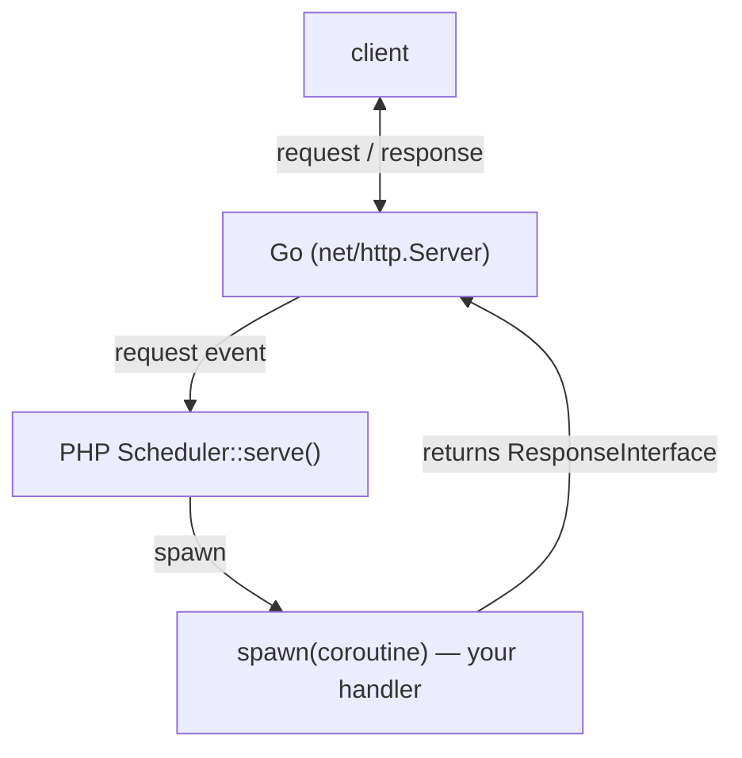
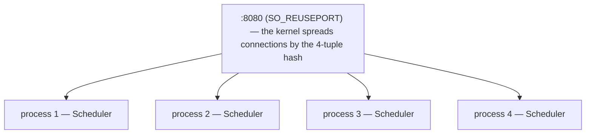
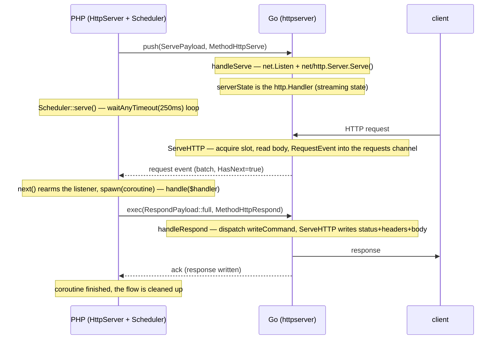

English | [Русский](http-server.ru.md)

# HTTP server

A long-lived PHP daemon that accepts HTTP requests and handles each one in its own
coroutine (Fiber), concurrently with the rest. The network I/O lives in the Go
extension; PHP stays a thin orchestration layer. The implementation is in
`src/Features/HttpServer/` (PHP) and `ext/internal/features/httpserver/` (Go).

> ⚠️ Before using it, read [«What's missing compared to typical
> servers»](#whats-missing-compared-to-typical-servers) — the model is cooperative and
> single-threaded, which puts real constraints on handler code.

## Table of contents

- [Idea and model](#idea-and-model)
- [Quick start](#quick-start)
- [Examples](#examples)
- [Server parameters](#server-parameters)
- [API: request and response (PSR-7)](#api-request-and-response-psr-7)
- [Response streaming (chunked / SSE)](#response-streaming-chunked--sse)
- [Error handling](#error-handling)
- [Access log](#access-log)
- [Startup and shutdown log](#startup-and-shutdown-log)
- [Concurrency and limits](#concurrency-and-limits)
- [Scaling across cores (SO_REUSEPORT)](#scaling-across-cores-so_reuseport)
- [Stopping after N requests](#stopping-after-n-requests)
- [Graceful shutdown](#graceful-shutdown)
- [Internals](#internals)
- [What's missing compared to typical servers](#whats-missing-compared-to-typical-servers)
- [Caveats and pitfalls](#caveats-and-pitfalls)
- [Running in Docker](#running-in-docker)
- [Testing](#testing)

---

## Idea and model

The network stack (accepting connections, HTTP parsing, keep-alive, timeouts, writing
the response) runs in Go on a standard `net/http.Server`. Each accepted request
becomes an ordinary "result" and reaches PHP through the same single `waitAny` channel
as the results of all other tasks (Mongo, Sleeper). Because of that the server reuses
the existing scheduler (`Scheduler`) and does not introduce a second event loop.

The base model is spawn-on-request: for each request event a new handler coroutine is
created. Inside a handler you can make ordinary asynchronous SConcur calls (MongoDB,
Sleeper, …) — they run concurrently with the handling of other requests.



The public handler contract is PSR-7: it takes a `Psr\Http\Message\ServerRequestInterface`
and returns a `Psr\Http\Message\ResponseInterface`. The library itself does not depend
on any concrete PSR-7 implementation — the objects are created by your PSR-17 factory
(in the examples `nyholm/psr7`), which you pass to the constructor. This mirrors the
[HTTP client (PSR-18)](http-client.md).

## Quick start

```php
use Nyholm\Psr7\Factory\Psr17Factory;
use Psr\Http\Message\ResponseInterface;
use Psr\Http\Message\ServerRequestInterface;
use SConcur\Features\HttpServer\HttpServer;

require __DIR__ . '/vendor/autoload.php';

$factory = new Psr17Factory(); // one factory plays both required PSR-17 roles

$server = new HttpServer(
    serverRequestFactory: $factory,
    responseFactory:      $factory,
    address:              '0.0.0.0:8080',
);

$server->serve(static function (ServerRequestInterface $request) use ($factory): ResponseInterface {
    return match ($request->getUri()->getPath()) {
        '/'      => $factory->createResponse(200)->withBody($factory->createStream('ok')),
        '/ping'  => $factory->createResponse(200)->withBody($factory->createStream('pong')),
        default  => $factory->createResponse(404)->withBody($factory->createStream('not found')),
    };
});
```

`nyholm/psr7` is only an example; any PSR-7/PSR-17 implementation works
(`guzzlehttp/psr7`, `laminas/laminas-diactoros`, …). The constructor needs two PSR-17
factories: `ServerRequestFactoryInterface` (to build the request) and
`ResponseFactoryInterface` (to build the fallback `413`/`500` responses); `Psr17Factory`
implements both.

Running it (requires the built extension `ext/build/sconcur.so`):

```shell
php -d extension=./ext/build/sconcur.so server.php
```

`serve()` blocks forever — until a `SIGTERM`/`SIGINT` signal or the flow is stopped.

## Examples

### Concurrent async work in a handler

The handler runs in its own coroutine, so async SConcur features inside it do not
block other requests:

```php
use SConcur\Features\Sleeper\Sleeper;

$server->serve(static function (ServerRequestInterface $request) use ($factory): ResponseInterface {
    if ($request->getUri()->getPath() === '/slow') {
        Sleeper::usleep(microseconds: 500_000); // the coroutine suspends,
                                                 // other requests keep being served
        return $factory->createResponse(200)->withBody($factory->createStream('done'));
    }

    return $factory->createResponse(200)->withBody($factory->createStream('ok'));
});
```

### Reading the method, path, query, headers and body

All via the standard PSR-7 `ServerRequestInterface` methods:

```php
$server->serve(static function (ServerRequestInterface $request) use ($factory): ResponseInterface {
    // $request->getMethod()            — "GET" / "POST" / ...
    // $request->getUri()->getPath()    — "/users"
    // $request->getUri()->getQuery()   — raw string "a=1&b=2"
    // $request->getQueryParams()       — already-parsed query (['a'=>'1','b'=>'2'])
    // $request->getHeaders()           — array<string, array<int, string>>
    // $request->getHeaderLine('X-Id')  — header values joined by ", "
    // $request->getBody()              — StreamInterface: getContents() (all) / read() (chunk)
    // $request->getServerParams()      — REMOTE_ADDR / REMOTE_PORT / SERVER_PROTOCOL / ...

    $payload = json_encode([
        'method' => $request->getMethod(),
        'query'  => $request->getQueryParams(),
    ]);

    return $factory->createResponse(200)
        ->withHeader('Content-Type', 'application/json')
        ->withBody($factory->createStream((string) $payload));
});
```

### Multiple values of one header (e.g. Set-Cookie)

`withHeader()` accepts a list of values — each one goes out as a separate header line:

```php
return $factory->createResponse(200)
    ->withHeader('Set-Cookie', ['a=1; Path=/', 'b=2; Path=/']) // list of values
    ->withHeader('Content-Type', 'text/plain')                 // a single string works too
    ->withBody($factory->createStream('ok'));
```

### Files: upload to disk, download, serve an image

The request body is a `StreamInterface`, so an upload is written to disk in pieces
without holding the file in memory. A file response is built from a `StreamInterface`
over the file (`createStreamFromFile()` on the PSR-17 factory): the size is known, the
response goes out in a single write, and an explicit `Content-Length` avoids needless
chunked encoding for large files.

```php
// Upload: stream the request body into a file in pieces.
$handle = fopen($target, 'wb');
$body   = $request->getBody();

while (($chunk = $body->read(8192)) !== '') {
    fwrite($handle, $chunk);
}

fclose($handle);

// Download / serve an image: the body is a file stream, length known.
$stream = $factory->createStreamFromFile($path, 'rb');

return $factory->createResponse(200)
    ->withHeader('Content-Type', 'image/png')      // image/* → the browser shows it inline
    ->withHeader('Content-Disposition', 'inline')  // attachment; filename="..." — to download
    ->withHeader('Content-Length', (string) $stream->getSize())
    ->withBody($stream);
```

Ready-made routes are in the demo server (`tests/servers/http/http-server.php`):
`POST /files/upload?name=` streams the body into a temporary file and returns JSON
`{saved,bytes,sha256}`; `GET /files/download?name=` returns a previously uploaded file
as an attachment (`attachment`); `GET /image?name=` returns an image from
`tests/storage/images` inline (default `sample.png`), so it is visible right in the
browser.

### A tuned server

```php
$server = new HttpServer(
    serverRequestFactory: $factory,
    responseFactory:      $factory,
    address:              '0.0.0.0:8080',
    maxConcurrency:       256,     // no more than 256 requests in flight at once
    maxRequestBody:       1 << 20, // 1 MiB request body limit
    handlerTimeoutMs:     5_000,   // override the 60s default: request ≤ 5s, else abort/504
    onError: static function (\Throwable $e, ServerRequestInterface $r): void {
        error_log(sprintf('[http] %s %s: %s', $r->getMethod(), $r->getUri()->getPath(), $e->getMessage()));
    },
);
```

## Server parameters

The `HttpServer` constructor (`src/Features/HttpServer/HttpServer.php`). All timeouts
are in milliseconds. The PHP defaults mirror the Go defaults.

| Parameter | Default | Purpose |
|---|---|---|
| `serverRequestFactory` | — (required) | PSR-17 `ServerRequestFactoryInterface` — builds the `ServerRequestInterface` for the handler. |
| `responseFactory` | — (required) | PSR-17 `ResponseFactoryInterface` — builds the fallback `413`/`500` responses. |
| `address` | `0.0.0.0:7832` | Listen address, e.g. `0.0.0.0:8080` or `127.0.0.1:9000`. |
| `readHeaderTimeoutMs` | `10000` | Deadline for reading request headers (`net/http` `ReadHeaderTimeout`). |
| `readTimeoutMs` | `30000` | Deadline for reading the whole request (`ReadTimeout`). |
| `writeTimeoutMs` | `30000` | Deadline for writing the response (`WriteTimeout`). |
| `idleTimeoutMs` | `60000` | Idle deadline for a keep-alive connection (`IdleTimeout`). |
| `shutdownTimeoutMs` | `5000` | How long to wait for active connections to drain on the Go side at shutdown. |
| `maxRequestBody` | `10485760` (10 MiB) | Request body limit in bytes. Exceeding it → `413`. |
| `maxConcurrency` | `0` (no limit) | Maximum number of requests handled at once. See [limits](#concurrency-and-limits). |
| `handlerTimeoutMs` | `60000` (60s) | Max total request handling time (including streaming), otherwise `504`/abort. `0` — off. See [handler timeout](#handler-timeout). |
| `maxRequests` | `0` (no limit) | Stop the server after handling this many requests — a guard against memory leaks. `0` — off. See [Stopping after N requests](#stopping-after-n-requests). |
| `reusePort` | `false` | Enable `SO_REUSEPORT` — several processes on one port. See [scaling across cores](#scaling-across-cores-so_reuseport). |
| `onError` | `null` | `Closure(Throwable, ServerRequestInterface): ?ResponseInterface` — observer of handler errors. |
| `masterPid` | `null` | If set, the server gracefully stops itself as soon as it stops being a child of this pid (its [master](worker-master.md) died). Under `WorkerMaster` this is set automatically from the `--masterPid` flag via `HttpServer::fromArgs()`; `null` — off. |

A value of `0` for `maxConcurrency`/`handlerTimeoutMs` means "off". For the other
timeouts `0` means "take the Go default".

Every handled request is written as an access-log line to `STDOUT`
(`<ISO-time> <method> <path> <status> <ms>ms`) — built in and unconditionally. The
write is asynchronous: the line is formatted and written by Go from a background
goroutine, so the single-threaded loop is not blocked on I/O. See [Access log](#access-log).

### `HttpServer::fromArgs()`

A factory that assembles the server from `argv` (`$_SERVER['argv']`): every
`--name=value` is matched to the constructor's scalar parameter of the same name (with
a type check — `int`/`bool`/`float`/`string`), an unknown flag → exception. PSR-17
factories cannot be passed via `argv` (only scalars there), so they are passed as
arguments. Used by the worker script under a [master](worker-master.md), which passes
the server parameters and `--masterPid` via `argv`:

```php
$factory = new Psr17Factory();

$server = HttpServer::fromArgs(
    argv:                 $_SERVER['argv'],
    serverRequestFactory: $factory,
    responseFactory:      $factory,
);
$server->serve(static fn (ServerRequestInterface $request): ResponseInterface =>
    $factory->createResponse(200)->withBody($factory->createStream('ok')));
```

## API: request and response (PSR-7)

### Request — `ServerRequestInterface`

The handler receives an ordinary `Psr\Http\Message\ServerRequestInterface`, assembled
from the Go event by your `ServerRequestFactoryInterface`. Access is via the standard
PSR-7 methods:

| What you need | PSR-7 method |
|---|---|
| Method | `$request->getMethod()` — `"GET"`, `"POST"`, … |
| Path | `$request->getUri()->getPath()` — `"/users/42"` (without query) |
| Raw query string | `$request->getUri()->getQuery()` — `"a=1&b=2"` |
| Parsed query | `$request->getQueryParams()` — `['a' => '1', 'b' => '2']` |
| All headers | `$request->getHeaders()` — `array<string, array<int, string>>` |
| One header | `$request->getHeaderLine('X-Echo')` (values joined by `", "`) / `getHeader()` |
| Protocol version | `$request->getProtocolVersion()` — `"1.1"` (without the `HTTP/` prefix) |
| Host | `$request->getHeaderLine('Host')` or `$request->getUri()->getHost()` |
| Client address, etc. | `$request->getServerParams()` — `REMOTE_ADDR`, `REMOTE_PORT`, `SERVER_PROTOCOL`, `REQUEST_URI`, `QUERY_STRING`, `HTTP_HOST` |
| Body | `$request->getBody()` — `StreamInterface`, see below |

Cookies, the parsed body and uploaded files (`getCookieParams()`, `getParsedBody()`,
`getUploadedFiles()`) are, by PSR-7 convention, not populated — that is the job of your
middleware on top of the raw body/headers.

#### Request body (`StreamInterface`)

`$request->getBody()` is a PSR-7 `StreamInterface` (the `Dto/RequestBodyStream.php`
implementation over the streaming `RequestBody`). The body is never buffered whole in
the extension: the first chunk arrives with the request, the rest is pulled on demand.
The stream is one-shot and not rewindable (`isSeekable()` → `false`;
`seek`/`rewind`/`write` throw) — read it in one way per request:

```php
// 1) Fully (handy for small bodies — JSON, a form). Memoized.
$raw  = $request->getBody()->getContents(); // or (string) $request->getBody()
$data = json_decode($raw, true);

// 2) Streaming (for large uploads — do not hold the body in memory):
$body = $request->getBody();
$hash = hash_init('sha256');
while (($chunk = $body->read(8192)) !== '') { // read() returns '' at end of stream (PSR-7)
    hash_update($hash, $chunk);               // process chunk by chunk
}
```

- The transport granularity is fixed (64 KiB): a body ≤ this size arrives whole with
  the request — `getContents()`/the first `read()` make no extra round-trips; a larger
  body is pulled in 64 KiB pieces per round-trip, and `read($length)` slices them down
  to the size the application asked for.
- `read()` suspends the coroutine until data arrives — a slow uploader does not block
  other requests.
- `getSize()` → `null` (the length is not known in advance — the body is streamed).
- Exceeding `maxRequestBody` while reading throws
  `SConcur\Exceptions\HttpServer\RequestBodyTooLargeException` out of `read()`/
  `getContents()`; let it bubble up — if the response has not started, the framework
  answers `413`.

### Response — `ResponseInterface`

The handler returns any `Psr\Http\Message\ResponseInterface` created by your PSR-17
factory:

```php
$response = $factory->createResponse(200)         // status
    ->withHeader('Content-Type', 'text/plain')    // header: a string or a list of strings
    ->withBody($factory->createStream('hello'));  // body
```

- A body of known size (`getBody()->getSize() !== null`) goes to the client in a single
  write. A body of unknown size (`getSize() === null`) is a stream: the framework reads
  it in chunks (chunked transfer), see [Streaming](#response-streaming-chunked--sse).
- If `Content-Type` is not set — Go detects it automatically from the body
  (`http.DetectContentType`).
- A header can be a string (one value) or a list of strings (several values, e.g.
  several `Set-Cookie`).

Returning a non-`ResponseInterface` is a contract error (`InvalidHandlerResponseException`):
the framework answers `500` and reports it to `onError`.

## Response streaming (chunked / SSE)

There is no separate DTO for a stream — that is covered by PSR-7 itself: return a
`ResponseInterface` whose body (`getBody()`) is a lazy `StreamInterface` of unknown size
(`getSize()` → `null`). Then the framework does not write the body in a single write but
reads it in chunks (`read()`), sending each one to the client and waiting for the flush
(chunked transfer, Server-Sent Events). Because the reading happens in the request
coroutine, your stream's `read()` can suspend on SConcur async features and lazily
produce the next chunk — that is how both backpressure and "sleep between chunks" are
expressed.

Example — a generator-based body (a ready-made class is in the tests:
`tests/impl/HttpServer/GeneratorStream.php`, implements `StreamInterface` over a
`Generator`):

```php
use SConcur\Features\Sleeper\Sleeper;
use SConcur\Tests\Impl\HttpServer\GeneratorStream;

$chunks = (static function (): Generator {
    foreach (range(1, 5) as $i) {
        yield "data: event $i\n\n"; // one yield — one chunk flushed to the client
        Sleeper::sleep(seconds: 1); // between chunks you can do async work
    }
})();

return $factory->createResponse(200)
    ->withHeader('Content-Type', 'text/event-stream')
    ->withBody(new GeneratorStream($chunks));
```

Key properties:

- Write backpressure. Each chunk read from the body is sent as a command and
  acknowledged only after Go has actually written and flushed it to the client. A fast
  producer does not outrun a slow client.
- No `Content-Length`. Size `null` → a header without a length is sent, then chunked
  transfer encoding.
- Between chunks the coroutine can suspend on asynchronous calls without blocking other
  requests.
- The status cannot be changed after the first chunk — the headers are already on the
  wire. An exception while reading the body therefore is not turned into a `500` (it has
  already been sent), it is only reported to `onError`, after which the stream is closed
  cleanly.

## Error handling

- An exception in the handler → the client gets `500 Internal Server Error`, the
  `serve()` loop does not crash (error isolation).
- A wrong return type (not `ResponseInterface`) → also `500`.
- Observability. By default the error is swallowed (only `500`). Pass `onError` to see
  it — log it, send it to tracing, or return your own response:

```php
onError: static function (\Throwable $e, ServerRequestInterface $request) use ($factory): ?ResponseInterface {
    error_log((string) $e);

    // return your own response instead of the default 500 (or null → default 500)
    return $factory->createResponse(500)->withBody($factory->createStream('oops'));
}
```

An `onError` that itself throws is safely swallowed — the client still gets a `500`.

## Access log

After every request the server built-in writes a single line to `STDOUT` — including
failed ones (`4xx`/`5xx`) and even those the PHP handler never sees: `503` on shutdown,
`504` on timeout, `413` on body overflow, a dropped connection. The log is always on.

The Go side writes it, not PHP. The line is formatted and handed to the logger by the
same Go goroutine that writes the response into the connection — so no crossing of the
PHP↔Go boundary is done per request for the log (a cgo call is the most expensive part
of handling a tiny request; moving the log to the Go side nearly doubles per-core
throughput on hello-world). The output itself is asynchronous: a background logger
goroutine writes to `STDOUT` from a buffer with a timer-driven flush (~100 ms), so the
server loop is not blocked on I/O and does not depend on a reader being ready (a broken
pipe does not kill the process). When the queue overflows the extra lines are dropped
with a counter (acceptable for an access log).

Line format:

```
<ISO-start-time> <method> <path> <status> <ms>ms
```

Example output:

```
2026-06-14T17:36:26.123456 GET / 200 2.59ms
2026-06-14T17:36:26.456789 GET /msleep/30 200 34.77ms
```

The time is the moment the request was accepted (with microseconds); the last field is
the total request handling time in milliseconds (from accept to writing the response;
for a stream — the whole stream duration). Under a [worker master](worker-master.md) the
worker's `STDOUT` is captured by the master and rewritten into the shared log.

Log-forgery protection. The method and path are escaped before writing: control bytes
(including `CR`/`LF`, which could have come from a URL-encoded path like `/foo%0A...`)
are written as `\xNN`. So a request cannot insert a newline and forge a second
access-log line — each request stays exactly one line.

## Startup and shutdown log

Besides the access log the server writes lifecycle lines to `STDOUT`. At startup — one
line, as soon as the listener is up:

```
2026-06-28T12:00:00.000000 sconcur http server listening on 0.0.0.0:8080 pid=12345 version=0.5.1 maxConcurrency=0 maxRequests=0 reusePort=0
```

It carries the address, the process pid, the extension version and the key limits. On
graceful shutdown — one line per step:

```
2026-06-28T12:00:01.000000 sconcur http server shutdown: stop accepting (reason=signal), draining 2 in-flight
2026-06-28T12:00:01.050000 sconcur http server shutdown: drained all in-flight
2026-06-28T12:00:01.060000 sconcur http server shutdown: stopped
```

`reason=signal` — stop on `SIGTERM`/`SIGINT` (or losing the master); `reason=limit` —
on reaching the [`maxRequests`](#stopping-after-n-requests) limit. These lines are
written by the PHP side (unlike the access log) and flushed immediately. Under a
[worker master](worker-master.md) they, like the access log, land in the shared log.

## Concurrency and limits

### One process = one thread

The PHP part is single-threaded and cooperative: a single `Scheduler` runs the
`waitAny` loop and resumes coroutines. Control passes to another coroutine only when the
current one suspends on an SConcur async feature (`Fiber::suspend()`).

Which leads to the main rule:

> **Handlers must be I/O-bound through SConcur features.** Any blocking or CPU-heavy
> work in a handler (native `sleep()`, synchronous PDO/`curl`, a heavy computation,
> reading a file) freezes the whole server — all other requests wait. Only async
> SConcur calls yield control.

### `maxConcurrency`

Limits the number of requests handled at once. Implemented as a semaphore in Go,
acquired before the body is read, so it bounds at once:

- the number of goroutines,
- memory (bodies are read only for requests that got a slot),
- the number of PHP coroutines (a coroutine lives no longer than the slot is held).

Excess connections wait for a free slot (natural backpressure). `0` — no limit; under
load with large bodies that is an OOM risk, so set a limit for public servers.

### Handler timeout

`handlerTimeoutMs` bounds the total request handling time — including a streamed
response: the whole request (and the stream) must fit within this limit, otherwise it is
cut off and the slot freed. Default 60s; `0` — off (a request may run unbounded). If
nothing was written by the deadline → the client gets a `504 Gateway Timeout`; if the
stream has already started (status on the wire) → the response is simply aborted
mid-way.

The deadline and the `504` response live on the Go side (a timer in `consumeCommands`),
so it fires independently of PHP — the client gets a `504` even if the handler hung on a
native blocking call (`sleep()`, synchronous PDO/`curl`) or in a CPU-bound loop. But
this only saves the client (a correct code + freeing the connection and the
`maxConcurrency` slot), not the server: there is no preemption in a cooperative model,
so a stuck handler keeps holding the single PHP thread — all other requests are not
served the whole time (and also get a `504` by the deadline). Runaway handlers are
guarded at the process level: a worker pool (`SO_REUSEPORT`) + `maxRequests` for
recycling — see [Scaling across cores](#scaling-across-cores-so_reuseport) and
[docs/worker-master.md](worker-master.md).

## Scaling across cores (SO_REUSEPORT)

A single process effectively uses one core for the PHP logic (see
[Concurrency](#concurrency-and-limits)). To load all cores, you run several independent
processes. The problem: normally only one process can `bind()` to a given `ip:port` —
the second gets `EADDRINUSE`.

`SO_REUSEPORT` (a socket option in Linux, kernel 3.9+) removes this restriction:
several processes `bind()`+`listen()` on the very same address at once, and the kernel
itself load-balances incoming connections across them. This gives process-per-core
without an external balancer and without a shared accept socket — like nginx workers.



Each process is its own Go runtime, its own `Scheduler`, its own coroutines.

### How to enable it

Pass `reusePort: true` to every process that listens on the shared port:

```php
$server = new HttpServer(
    serverRequestFactory: $factory,
    responseFactory:      $factory,
    address:              '0.0.0.0:8080',
    reusePort:            true,
    maxConcurrency:       256, // the limit is PER process
);

$server->serve($handler);
```

On the Go side this sets `SO_REUSEPORT` on the listening socket via `net.ListenConfig`
with a `Control` callback (`ext/internal/features/httpserver/listen.go`).

### How to run N processes

Run them as separate processes — via a supervisor (systemd, supervisord, docker
`--scale`) or a simple loop. Not via `pcntl_fork`: forking after the extension is loaded
is forbidden (the Go runtime does not survive a `fork`).

```bash
# Example: one process per core
for i in $(seq 1 "$(nproc)"); do
    php -d extension=./ext/build/sconcur.so server.php &
done
wait
```

With systemd it is more convenient to run them as a template unit (`server@1`,
`server@2`, …) — each with its own PID and independent graceful shutdown.

### Caveats and limits

- The processes are independent. There is no shared memory — each has its own Go
  runtime, scheduler and coroutines. Keep any shared state (sessions, cache, counters)
  in external storage (MongoDB/Redis).
- Every process must set `reusePort: true`. If even one process did not and started
  first, the rest get `EADDRINUSE`.
- Balancing is by connections, not by requests. The kernel distributes connections by
  the 4-tuple hash (src ip:port → dst ip:port). With keep-alive all requests of one
  connection go to the same process. With a small number of long-lived connections the
  distribution may be uneven; for even load, many short connections or a client with a
  pool help.
- Limits are per process. `maxConcurrency`, `maxRequestBody`, etc. apply to each process
  separately; the total limit = value × number of processes.
- Graceful shutdown is per process, without losing traffic. Send the signal to each PID;
  each drains its own in-flight independently. On the signal a process immediately
  closes the listening socket (leaves the reuseport group), so the kernel stops sending
  it new connections and hands them to its neighbors while this one finishes the
  requests already accepted. New connections do not reach a terminating worker — no
  `503`s from a rolling restart (see [Graceful shutdown](#graceful-shutdown)).
- Security. `SO_REUSEPORT` lets another process with the same UID bind the same port and
  intercept part of the connections. Keep that in mind in a multi-tenant environment.
- Linux only. The option is Linux-specific (the extension is targeted at Linux/NTS
  anyway).

## Stopping after N requests

`maxRequests` limits the number of handled requests: as soon as the server has served
the specified count, it initiates a graceful stop itself and terminates the process.
This is a guard against memory leaks in a long-lived daemon — instead of the process
growing without end, it periodically restarts from a clean slate. An external supervisor
(systemd, supervisord, docker `restart: unless-stopped`) or a [worker master](worker-master.md)
must bring up a new process — a pair to `SO_REUSEPORT`: while one worker is being
recreated, the rest keep accepting traffic.

```php
$server = new HttpServer(
    serverRequestFactory: $factory,
    responseFactory:      $factory,
    address:              '0.0.0.0:8080',
    maxRequests:          10_000, // after 10,000 requests — graceful stop and exit
);

$server->serve($handler);
```

The mechanics reuse the [graceful shutdown](#graceful-shutdown): on reaching the limit,
the server

1. immediately closes the listening socket (stops accepting new connections — in a
   `SO_REUSEPORT` group they go to neighbors);
2. waits for the already-accepted in-flight requests to finish (including the limit
   request itself — it is not aborted);
3. exits with code `0`.

So already-accepted requests are not bounced: by the time the server begins to stop, the
socket is already closed, and new connections do not reach the terminating process (they
are not dropped/`503`ed).

- The limit is per process. With `reusePort: true` each worker counts its own requests
  independently; the total budget until restart = `maxRequests` × number of workers.
- `0` (default) — no limit, the server lives until a signal/flow stop.
- Dispatched requests are counted (those that reached the handler); requests rejected
  during the drain (a narrow window) do not count.

## Graceful shutdown

On receiving `SIGTERM`/`SIGINT` the server:

1. immediately closes the listening socket — stops accepting new connections (on the Go
   side `http.Server.Shutdown`, without cancelling in-flight);
2. waits for the already-running handlers to finish (in-flight);
3. exits.

Each step is written as a line to `STDOUT` — see [Startup and shutdown log](#startup-and-shutdown-log).

Closing the socket early in step 1 is important for [`SO_REUSEPORT`](#scaling-across-cores-so_reuseport):
the terminating worker leaves the reuseport group, and the kernel routes new connections
to the other processes rather than to this one (which would not serve them). This is how
a rolling restart avoids lost requests.

A request accepted but not yet answered by the time of shutdown (the narrow window
between the signal and closing the socket) gets a `503 Service Unavailable` (rather than
a dropped connection).

Details:

- The signal handlers are installed before the listener starts and restored on exit (the
  previous `SIGTERM`/`SIGINT` handlers and the `pcntl_async_signals` mode are not hijacked
  forever).
- `ext-pcntl` is required. Without it graceful shutdown does not work — the process is
  killed hard (which breaks the "do not abort active tasks" rule). In the project's
  Docker images `pcntl` is enabled.
- On an idle server shutdown fires quickly: the `serve()` loop polls `waitAny` at a
  250 ms interval and notices the signal even without traffic.

## Internals

### The flow of a single request



### Key entities

**PHP** (`src/`):

- `Features/HttpServer/HttpServer` — the public API: `serve($handler)`. Generates a
  `flowKey`, installs the signal handlers, pushes the listener task, starts the
  scheduler's server loop.
- `Scheduler/Scheduler::serve()` — the server loop on top of `waitAnyTimeout()`:
  dispatches three kinds of result — a request event (→ `spawn` a handler in a new
  per-request flow), a task result (→ resume a coroutine by `taskKey`) and the
  completion/error of the server flow. Draining and `stopFlow` at shutdown.
- `Scheduler::spawn()` — a fire-and-forget coroutine outside the `WaitGroup`, with its
  own flow; its result is not collected, it must handle errors itself (which is exactly
  what `HttpServer::handle` does, turning them into a `500`).
- The PSR-7 contract: input `ServerRequestInterface` (assembled in
  `HttpServer::decodeRequest` from the Go event via `ServerRequestFactoryInterface`; the
  body is `Dto/RequestBodyStream` over `Dto/RequestBody`), output `ResponseInterface`.
  Payloads `ServePayload`/`RespondPayload`.

**Go** (`ext/internal/features/httpserver/`):

- `feature.go` — the methods `MethodHttpServe` (bring up the listener) and
  `MethodHttpRespond` (write a command into the connection). The global registries
  `pendingRequests` (`requestId → {command channel, abandoned signal}`) and
  `serverStates` (`flowKey → serverState` for `StopAccepting`).
- `server.go` — `serverState` as an `http.Handler` over `net/http.Server`. Each request:
  `ServeHTTP` hands a `RequestEvent` to PHP and waits for the write commands
  (`consumeCommands`). The commands: `full` (one-shot response), `head`/`chunk`/`end`
  (streaming). Concurrency semaphore, handler timeout, 503/504, graceful `Shutdown`.
- `listen.go` — `listen()`: a TCP listener, with `reusePort` it sets `SO_REUSEPORT` via
  `net.ListenConfig` with a `Control` callback.

### Why the listener is a "streaming task"

Emitting a request event with an arbitrary `taskKey` directly into the shared channel is
not allowed — it would break task accounting (`Flow.OnDelivered`). So the listener is
modeled as a streaming state: each accepted request arrives as the next batch
(`HasNext=true`), and PHP rearms the stream with a `next()` call. The `requestId` for
routing the response sits in the event payload.

### Per-request flow

`serverFlowKey` is the flow of the listener itself. Each request is handled in its own
flow, so a handler's sub-tasks (Mongo/Sleeper) are isolated and cleaned up correctly,
and stopping one request does not take down the whole server.

### The response protocol (write commands)

A response is a sequence of commands passed from PHP via `MethodHttpRespond`:

- `full` — a one-shot response: status + headers + body, then finish.
- `head` — start a stream: status + headers, flushed to the client.
- `chunk` — a body piece, flushed.
- `end` — finish the stream.

Each command is acknowledged back (ack) only after it is applied — that is what gives
write backpressure. If the connection has dropped by the time of the write or a timeout
fired, the handler gets an error (`abandoned`) and unwinds cleanly instead of hanging.

## What's missing compared to typical servers

| What | Status | Comment |
|---|---|---|
| PHP-FPM / mod_php | ❌ no | CLI-only, long-lived. The extension holds the Go runtime at process level; the FPM model contradicts this. |
| `pcntl_fork` after loading the extension | ❌ no | The Go runtime does not survive a `fork`. Fork before the first use of the extension, or run separate processes (`exec`). |
| A ZTS build of PHP | ❌ no | NTS (non-thread-safe) only. |
| TLS / HTTPS | ❌ not yet | Plain TCP only. Terminate TLS in front (nginx/HAProxy/a balancer). |
| HTTP/2, WebSocket | ❌ no | `net/http` without TLS is HTTP/1.1; h2c and WebSocket are not enabled. |
| Multi-core parallelism in one process | ❌ no | One process = one PHP thread. Scale with several processes via [`SO_REUSEPORT`](#scaling-across-cores-so_reuseport). |
| CPU-bound handlers | ⚠️ dangerous | They block the whole server: no preemption. I/O-bound only, through SConcur features. |
| Synchronous I/O in a handler | ⚠️ dangerous | Native `sleep`/PDO/`curl`/files freeze the loop. Use the async SConcur features. |
| Streaming the request body | ✅ yes | `$request->getBody()->read()` pulls chunks; the body is not buffered whole (see [Request body](#request-body-streaminterface)). |
| Router / middleware | ❌ no | A low-level `(ServerRequestInterface): ResponseInterface` (PSR-7) contract. A ready PSR-15 middleware stack can be layered on top yourself. |
| `exit()`/`die()` with active tasks | ❌ no | Behavior is undefined. Finish/stop the tasks first. |

What, on the contrary, does work (and sometimes surprises): keep-alive, the timeout
pipeline, chunked/SSE streaming, multiple values of one header (e.g. several
`Set-Cookie`), binary bodies, the concurrency limit, `413`/`503`/`504`, graceful
shutdown.

## Caveats and pitfalls

- One handler — one thread of execution. Parallelism is achieved by handlers yielding on
  async calls. Design handlers so that any long work goes through SConcur features.
- The query is available both raw (`$request->getUri()->getQuery()`) and parsed
  (`$request->getQueryParams()` — filled via `parse_str()`).
- The request headers are available via `getHeaders()`/`getHeaderLine()`; PSR-7 treats
  names case-insensitively, and there may be several values.
- 204/304 — the response body is discarded by `net/http` (as it should be).
- The body limit is checked via `MaxBytesReader`: exceeding it → `413`, without silent
  truncation.
- Memory. Without `maxConcurrency` the number of concurrent handlers and buffered bodies
  is unbounded — under a flood of large bodies OOM is possible. Set a limit.
- Idle shutdown fires within ~250 ms (the `waitAny` polling interval).

## Running in Docker

`docker-compose.yml` has a `servers` service: under supervisor it brings up both
masters — HTTP and socket (`tests/servers/http/http-server.php` and
`tests/servers/socket/socket-server.php` via `bin/sconcur-server`). The ports are
hard-coded in compose (HTTP — `28080:8080`), since the masters' JSON configs cannot use
environment variables. Rebuild and restart:

```shell
make servers-restart
```

This rebuilds the extension (`make ext-build`) and recreates the `servers` container.
Each master is managed via `make http-server-{status,stop,reload}` (and
`socket-server-*`).

## Testing

The automated tests do not depend on the docker service: they bring up the server as a
separate process via the `SConcur\Tests\Impl\HttpServer\TestHttpServer` harness
(`tests/impl/HttpServer/TestHttpServer.php`). The launch options are named exactly like
the `HttpServer` constructor parameters and passed to the process as `--name=value`:

```php
use SConcur\Tests\Impl\HttpServer\TestHttpServer;

$server = TestHttpServer::start(['maxConcurrency' => 2, 'handlerTimeoutMs' => 200]);

// $server->baseUrl(), $server->signal(SIGTERM), $server->waitForExit(3.0), $server->stop()
```

`BaseHttpServerTestCase` brings up one server per test class; override `serverOptions()`
for the settings you need. The demo server (`tests/servers/http/http-server.php`)
contains routes for every test scenario: `/`, `/pid`, `/method`, `/echo`, `/upload`,
`/files/upload`, `/files/download`, `/image`, `/query`, `/echo-header`, `/meta`,
`/empty`, `/cookies`, `/all`, `/stream`, `/slow-stream`, `/truncated`, `/big/{size}`,
`/redirect/{n}`, `/throw`, `/msleep/{ms}`, `/native-msleep/{ms}`, `/cpu/{n}`,
`/status/{code}`.

Coverage (`tests/feature/Features/HttpServer/`): routing and methods, query and request
headers, a binary body, multi-value response headers, streaming, the concurrency limit,
`413`, the handler timeout (`504`), a graceful drain (`SIGTERM` with in-flight),
stopping after N requests (`maxRequests`).

---

See also: [README → How it works](../README.md#how-it-works),
[Server admin stats](admin-stats.md),
[How to add a new feature](adding-a-feature.md).
