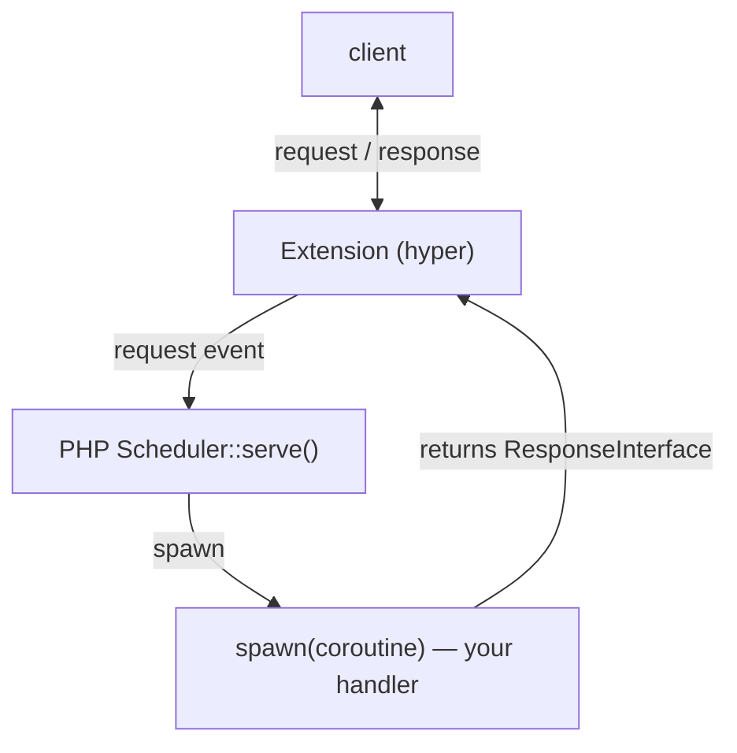
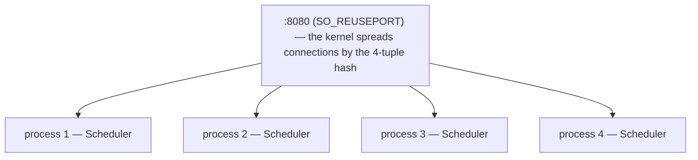

English | [Русский](http-server.ru.md)

# HTTP server

A long-lived PHP daemon that accepts HTTP requests and handles each one in its own
coroutine (Fiber), concurrently with the rest. The network I/O lives in the
extension; PHP stays a thin orchestration layer. Implementation:
`src/Features/HttpServer/` (PHP) and `ext/src/features/httpserver/` (Rust).

> ⚠️ Read [What's missing compared to typical servers](#whats-missing-compared-to-typical-servers)
> first — the model is cooperative and single-threaded, which constrains handler code.

## Table of contents

- [Model](#model)
- [Quick start](#quick-start)
- [Server parameters](#server-parameters)
- [Request and response (PSR-7)](#request-and-response-psr-7)
- [Response streaming (chunked / SSE)](#response-streaming-chunked--sse)
- [Files](#files)
- [Error handling](#error-handling)
- [Logs](#logs)
- [Concurrency and limits](#concurrency-and-limits)
- [Scaling across cores (SO_REUSEPORT)](#scaling-across-cores-so_reuseport)
  - [A proxy in front of the pool](#a-proxy-in-front-of-the-pool)
- [OPcache and JIT](#opcache-and-jit)
- [Stopping after N requests](#stopping-after-n-requests)
- [Graceful shutdown](#graceful-shutdown)
- [Internals](#internals)
- [What's missing compared to typical servers](#whats-missing-compared-to-typical-servers)
- [Running in Docker and testing](#running-in-docker-and-testing)

## Model

The network stack (accepting connections, HTTP parsing, keep-alive, timeouts,
writing the response) runs inside the extension, on hyper. Each accepted
request becomes an ordinary result and reaches PHP through the same shared result
channel as every other task, so the server reuses the existing `Scheduler` and
introduces no second event loop.

The base model is spawn-on-request: each request event creates a new handler
coroutine, and ordinary async SConcur calls inside it run concurrently with the
handling of other requests.

The worker is a long-lived process: everything built before `serve()` — framework
bootstrap, DI container, config, connections — is reused by every request. The
flip side is the usual one: state survives between requests, so keep
request-scoped state in the [coroutine context](coroutine-context.md) or local to
the handler, and let `maxRequests` recycle the process.


```mermaid
flowchart TB
    Client["client"]
    EXT["Extension (hyper)"]
    Sched["PHP Scheduler::serve()"]
    Handler["spawn(coroutine) — your handler"]

    Client <-->|"request / response"| EXT
    EXT -->|"request event"| Sched
    Sched -->|"spawn"| Handler
    Handler -->|"returns ResponseInterface"| EXT
```

The handler contract is PSR-7: in `ServerRequestInterface`, out
`ResponseInterface`. The library depends on no concrete PSR-7 implementation — the
objects come from the PSR-17 factory you pass to the constructor, mirroring the
[HTTP client (PSR-18)](http-client.md).

## Quick start

```php
use Nyholm\Psr7\Factory\Psr17Factory;
use Psr\Http\Message\ResponseInterface;
use Psr\Http\Message\ServerRequestInterface;
use SConcur\Features\HttpServer\HttpServer;

require __DIR__ . '/vendor/autoload.php';

$factory = new Psr17Factory(); // one factory plays both required PSR-17 roles

$server = new HttpServer(
    serverRequestFactory: $factory,
    responseFactory:      $factory,
    address:              '0.0.0.0:8080',
);

$server->serve(static function (ServerRequestInterface $request) use ($factory): ResponseInterface {
    return match ($request->getUri()->getPath()) {
        '/'      => $factory->createResponse(200)->withBody($factory->createStream('ok')),
        '/ping'  => $factory->createResponse(200)->withBody($factory->createStream('pong')),
        default  => $factory->createResponse(404)->withBody($factory->createStream('not found')),
    };
});
```

Any PSR-7/PSR-17 implementation works (`nyholm/psr7`, `guzzlehttp/psr7`,
`laminas/laminas-diactoros`, …). The constructor needs
`ServerRequestFactoryInterface` (to build the request) and `ResponseFactoryInterface`
(for the fallback `413`/`500` responses); `Psr17Factory` implements both.

```shell
php -d extension=./ext/build/sconcur.so server.php
```

`serve()` blocks until `SIGTERM`/`SIGINT` or a flow stop. The handler runs in its
own coroutine, so async features inside it (`Sleeper::usleep()`, MongoDB, SQL, the
HTTP client) do not block other requests.

## Server parameters

The `HttpServer` constructor (`src/Features/HttpServer/HttpServer.php`). All
timeouts are in milliseconds.

| Parameter | Default | Purpose |
|---|---|---|
| `serverRequestFactory` | — (required) | PSR-17 `ServerRequestFactoryInterface` — builds the handler's request. |
| `responseFactory` | — (required) | PSR-17 `ResponseFactoryInterface` — builds the fallback `413`/`500` responses. |
| `address` | `0.0.0.0:7832` | Listen address, e.g. `0.0.0.0:8080`. |
| `readHeaderTimeoutMs` | `10000` | Accepted and not applied — see [Connection timeouts](#connection-timeouts). |
| `readTimeoutMs` | `30000` | Accepted and not applied. |
| `writeTimeoutMs` | `30000` | Accepted and not applied. |
| `idleTimeoutMs` | `60000` | Accepted and not applied. |
| `shutdownTimeoutMs` | `10000` | Accepted and not applied. |
| `maxRequestBody` | `10485760` (10 MiB) | Request body limit; exceeding it → `413`. |
| `maxConcurrency` | `0` (no limit) | Requests handled at once, see [limits](#concurrency-and-limits). |
| `handlerTimeoutMs` | `60000` | Max total handling time including streaming, otherwise `504`/abort. `0` — off. |
| `maxRequests` | `0` (no limit) | Stop the server after this many requests, see [below](#stopping-after-n-requests). |
| `reusePort` | `false` | `SO_REUSEPORT` — several processes on one port. |
| `onError` | `null` | `Closure(Throwable, ServerRequestInterface): ?ResponseInterface`. |
| `masterPid` | `null` | Stop gracefully once this pid is no longer the parent (the [master](worker-master.md) died); set from `--masterPid` by `fromArgs()`. |
| `telemetrySocket` | `''` (off) | Unix socket for stats snapshots, injected by the master ([stats](admin-stats.md)). |
| `serverName` | `'sconcur-server'` | Worker name in the stats snapshots. |
| `telemetryIntervalMs` | `0` | Snapshot cadence; `0` — the default of the component that sends them (1000 ms). |
| `preemptionQuantumMs` | `5` | Automatic-preemption quantum while serving; `0` — off. See [coroutine switching](coroutine-switching.md). |

`0` means "off" for `maxConcurrency`/`handlerTimeoutMs`/`maxRequests`.

### Connection timeouts

The four connection deadlines and `shutdownTimeoutMs` cross the boundary and are
not acted on: the extension bounds a request by `handlerTimeoutMs` and nothing
else. A slow client therefore holds its connection for as long as it likes, and
the shutdown drain waits for the handlers rather than for a clock — bounded in
practice by `handlerTimeoutMs`, which is why leaving it at `0` on a public
listener is what actually costs you. Terminate slow clients in the reverse proxy
in front.

`HttpServer::fromArgs()` assembles the server from `argv`: every `--name=value` is
matched to the constructor's scalar parameter of the same name (type-checked), an
unknown flag throws. PSR-17 factories cannot travel on argv, so they stay
arguments. This is what a worker script under the [master](worker-master.md) uses:

```php
$server = HttpServer::fromArgs(
    argv:                 $_SERVER['argv'],
    serverRequestFactory: $factory,
    responseFactory:      $factory,
);
```

## Request and response (PSR-7)

The handler receives a `ServerRequestInterface` assembled from the event by your
factory:

| What you need | PSR-7 method |
|---|---|
| Method | `$request->getMethod()` |
| Path | `$request->getUri()->getPath()` — without query |
| Raw query string | `$request->getUri()->getQuery()` |
| Parsed query | `$request->getQueryParams()` — filled via `parse_str()` |
| All headers | `$request->getHeaders()` — `array<string, array<int, string>>` |
| One header | `$request->getHeaderLine('X-Echo')` / `getHeader()` |
| Protocol version | `$request->getProtocolVersion()` — `"1.1"`, without the `HTTP/` prefix |
| Client address, etc. | `$request->getServerParams()` — `REMOTE_ADDR`, `REMOTE_PORT`, `SERVER_PROTOCOL`, `REQUEST_URI`, `QUERY_STRING`, `HTTP_HOST` |
| Body | `$request->getBody()` — `StreamInterface`, see below |

Cookies, the parsed body and uploaded files (`getCookieParams()`,
`getParsedBody()`, `getUploadedFiles()`) are not populated — by PSR-7 convention
that is your middleware's job.

### The request is lazy about its headers

The object handed to the handler is `Dto/LazyHeadersRequest`, a
`ServerRequestInterface` wrapping the one your factory built. The headers and the
query string are held aside and applied on first use, because setting seven
headers costs 4.17 us of the 7.75 one decode takes and parsing a query string
another 1.9, while a router reads the method and the path — 0.12 us worth
(`make bench-request`). The deferral survives `withAttribute` and the other
withers, so filing route parameters does not force it.

Nothing about the PSR-7 surface changes: every method answers what the eager
request would have answered, and `getHeaders()` returns the same array in the
same order. Two things do change, and only for code that looks past the
interface:

- a `instanceof Nyholm\Psr7\ServerRequest` (or any other concrete class) is
  false now, because the concrete object is one level in. Type against
  `ServerRequestInterface`, as PSR-7 intends;
- `$request->materialize()` returns the plain request with everything applied,
  for the rare caller that has to hand a concrete object to something else.

A handler that reads one header pays 0.36 us more than it used to. That is the
trade: the deferral is worth it unless more than 91% of requests read a header.

The body is `Dto/RequestBodyStream` over the streaming `Dto/RequestBody` and is
never buffered whole in the extension: the first chunk arrives with the request,
the rest is pulled on demand. The stream is one-shot and not rewindable
(`isSeekable()` → `false`; `seek`/`rewind`/`write` throw), so read it one way per
request:

```php
// 1) Fully (small bodies — JSON, a form). Memoized.
$data = json_decode($request->getBody()->getContents(), true);

// 2) Streaming (large uploads — do not hold the body in memory):
$body = $request->getBody();
while (($chunk = $body->read(8192)) !== '') { // '' at end of stream (PSR-7)
    hash_update($hash, $chunk);
}
```

- Transport granularity is fixed at 64 KiB: a body up to that size arrives whole
  with the request; a larger one is pulled 64 KiB per round-trip, and
  `read($length)` slices it down.
- `read()` suspends the coroutine until data arrives — a slow uploader does not
  block other requests.
- `getSize()` → `null` (the body is streamed).
- Exceeding `maxRequestBody` throws `RequestBodyTooLargeException` out of
  `read()`/`getContents()` (checked via `MaxBytesReader`, no silent truncation);
  let it bubble up and the framework answers `413`.

The handler returns any `ResponseInterface`:

```php
return $factory->createResponse(200)
    ->withHeader('Content-Type', 'text/plain')            // a string or a list of strings
    ->withHeader('Set-Cookie', ['a=1; Path=/', 'b=2'])    // each value — its own header line
    ->withBody($factory->createStream('hello'));
```

- A body of known size goes out in a single write; `getSize() === null` means a
  stream, see below.
- Without `Content-Type` the extension does not guess one.
- 204/304 responses have their body discarded.
- Returning a non-`ResponseInterface` is a contract error
  (`InvalidHandlerResponseException`): the client gets `500`, `onError` is called.

## Response streaming (chunked / SSE)

There is no separate stream DTO — PSR-7 covers it: return a response whose body is
a lazy `StreamInterface` of unknown size (`getSize()` → `null`). The framework then
reads it chunk by chunk (`read()`), sending each to the client and waiting for the
flush (chunked transfer, SSE). The reading happens in the request coroutine, so
your `read()` can suspend on async features and lazily produce the next chunk.

```php
use SConcur\Tests\Impl\HttpServer\GeneratorStream; // StreamInterface over a Generator

$chunks = (static function (): Generator {
    foreach (range(1, 5) as $i) {
        yield "data: event $i\n\n"; // one yield — one chunk flushed to the client
        Sleeper::sleep(seconds: 1); // async work between chunks
    }
})();

return $factory->createResponse(200)
    ->withHeader('Content-Type', 'text/event-stream')
    ->withBody(new GeneratorStream($chunks));
```

- The client sets the pace: each chunk is acknowledged only after the extension has written
  and flushed it, so a fast producer cannot outrun a slow client.
- No `Content-Length` — a header without length, then chunked transfer encoding.
- The status cannot change after the first chunk (headers are on the wire), so an
  exception while reading the body is not turned into a `500` — it is only
  reported to `onError`, after which the stream is closed cleanly.

## Files

An upload is written to disk in pieces; a file response is built from
`createStreamFromFile()`, where the size is known, so the response goes out in a
single write and an explicit `Content-Length` avoids needless chunked encoding.

```php
// Upload: stream the request body into a file.
$handle = fopen($target, 'wb');
$body   = $request->getBody();

while (($chunk = $body->read(8192)) !== '') {
    fwrite($handle, $chunk);
}

fclose($handle);

// Serve a file: the body is a file stream, length known.
$stream = $factory->createStreamFromFile($path, 'rb');

return $factory->createResponse(200)
    ->withHeader('Content-Type', 'image/png')      // image/* → the browser shows it inline
    ->withHeader('Content-Disposition', 'inline')  // attachment; filename="..." — to download
    ->withHeader('Content-Length', (string) $stream->getSize())
    ->withBody($stream);
```

Ready-made routes are in the demo server (`tests/servers/http/http-server.php`):
`POST /files/upload?name=`, `GET /files/download?name=`, `GET /image?name=`.

## Error handling

An exception in the handler, or a wrong return type, gives the client `500` — the
`serve()` loop does not crash. By default the error is swallowed; pass `onError`
to observe it or to return your own response:

```php
onError: static function (\Throwable $e, ServerRequestInterface $request) use ($factory): ?ResponseInterface {
    error_log((string) $e);

    return $factory->createResponse(500)->withBody($factory->createStream('oops'));
}
```

An `onError` that itself throws is safely swallowed — the client still gets `500`.

## Logs

Access log — one line per request to `STDOUT`, always on, including requests the
PHP handler never sees (`503` on shutdown, `504` on timeout, `413` on body
overflow, a dropped connection):

```
2026-06-14T17:36:26.123456 GET / 200 2.59ms
2026-06-14T17:36:26.456789 GET /msleep/30 200 34.77ms
```

The time is the moment the request was accepted; the last field is the total
handling time (for a stream — its whole duration). The line is formatted by the
same runtime task that writes the response, so the log costs no crossing
per request (that crossing is the most expensive part of a tiny request — moving
moving the log out of PHP nearly doubles the throughput of one core on
hello-world). Output
is asynchronous: a background runtime task writes from a buffer with a ~100 ms
timer flush; on overflow the extra lines are discarded and counted. The method
and path are escaped (control bytes, including `CR`/`LF` from a URL-encoded
path, become `\xNN`), so a request cannot forge a second log line.

Lifecycle lines are written by the PHP side and flushed immediately — one at
startup, one per shutdown step:

```
2026-06-28T12:00:00.000000 sconcur http server listening on 0.0.0.0:8080 pid=12345 version=0.12.0 maxConcurrency=0 maxRequests=0 reusePort=0
2026-06-28T12:00:01.000000 sconcur http server shutdown: stop accepting (reason=signal), draining 2 in-flight
2026-06-28T12:00:01.050000 sconcur http server shutdown: drained all in-flight
2026-06-28T12:00:01.060000 sconcur http server shutdown: stopped
```

`reason=signal` — `SIGTERM`/`SIGINT` or a lost master; `reason=limit` —
`maxRequests` reached. Under a [worker master](worker-master.md) the worker's
`STDOUT` is captured and rewritten into the shared log.

## Concurrency and limits

The PHP part is single-threaded and cooperative: one `Scheduler` runs the wait
loop and resumes coroutines, and control passes to another coroutine only when the
current one suspends on an SConcur feature (`Fiber::suspend()`).

> **Handlers must be I/O-bound through SConcur features.** A native blocking call
> (`sleep()`, synchronous PDO/`curl`, reading a file) freezes the whole server.
> CPU-heavy PHP code is the exception: the server preempts it every
> `preemptionQuantumMs` (see [coroutine switching](coroutine-switching.md)), so it
> delays neighbours by at most the quantum — but a single monolithic internal call
> (a huge `preg_match`, `json_decode`) is still not interruptible.

`maxConcurrency` limits requests handled at once. It is a semaphore in the extension
acquired before the body is read, so it bounds runtime tasks, memory (bodies are
read only for requests that got a slot) and PHP coroutines at once. Excess
connections wait for a free slot, so the load throttles itself. `0` is a risk of
OOM under a flood of large bodies; set a limit on public servers.

It has a second use — the latency tail. CPU-heavy handlers share the single PHP
thread, so each one's latency grows with how many are being served at once, and
`maxConcurrency` is what bounds that number. On a profile of 90% empty requests
and 10% handlers worth ~49 ms of CPU, a limit of `4` takes p99 from 2.86 s down
to 659 ms, at the cost of p50 rising from 30 ms to 244 ms. The trade and both
settings are covered in
[coroutine switching](coroutine-switching.md#the-cost-under-load).

`handlerTimeoutMs` bounds the total handling time, streamed response included, and
it bounds two things at once.

The client is answered by the extension: the connection task waits for the
handler's first write with that deadline and answers `504` when it does not
arrive, or aborts a stream that already started. It fires independently of PHP,
so the client is answered even when the handler is stuck in a native call.

The PHP handler is unwound at the same deadline — the request coroutine is given it,
and past it a [coroutine timeout](coroutine-timeout.md) is thrown into the handler
where it stands. Its `finally` blocks run, its transaction rolls back, its
connections go back to their pools, and it stops producing a response nobody will
read. With preemption armed — the default — that reaches a handler busy with pure
computation as well.

What neither of them reaches is a handler already inside a native call: no PHP runs
there, so nothing can be delivered until it returns. Those are bounded by the
feature's own timeouts (a query timeout, an HTTP client deadline) and, at process
level, by a worker pool (`SO_REUSEPORT`) plus `maxRequests` recycling.

## Scaling across cores (SO_REUSEPORT)

One process effectively uses one core for the PHP logic, so all cores are loaded
by running several independent processes. Normally only one process can `bind()` a
given `ip:port`; `SO_REUSEPORT` (Linux, kernel 3.9+) lets several processes
`bind()`+`listen()` on the same address, and the kernel load-balances incoming
connections between them — process-per-core without an external balancer, like
nginx workers.


```mermaid
flowchart TB
    Port[":8080 (SO_REUSEPORT) — the kernel spreads connections by the 4-tuple hash"]
    P1["process 1 — Scheduler"]
    P2["process 2 — Scheduler"]
    P3["process 3 — Scheduler"]
    P4["process 4 — Scheduler"]

    Port --> P1
    Port --> P2
    Port --> P3
    Port --> P4
```

Pass `reusePort: true` to every process on the shared port (inside the extension
it sets `SO_REUSEPORT` on the socket before the bind,
`ext/src/features/httpserver/listen.rs`). Run them as separate processes — a
supervisor (systemd, supervisord, docker `--scale`), the
[worker master](worker-master.md), or a plain loop — never via `pcntl_fork`.

```bash
# one process per core
for i in $(seq 1 "$(nproc)"); do
    php -d extension=./ext/build/sconcur.so server.php &
done
wait
```

Caveats:

- Processes are independent: no shared memory, each has its own runtime,
  scheduler and coroutines. Shared state (sessions, cache, counters) goes to
  external storage.
- Every process must set `reusePort: true` — if one did not and started first, the
  rest get `EADDRINUSE`.
- Balancing is by connections, not requests (4-tuple hash), so with keep-alive all
  requests of one connection land in the same process. Few long-lived connections
  distribute unevenly.
- Limits are per process: the total is value × number of processes.
- Graceful shutdown is per process and loses no traffic — see below.
- `SO_REUSEPORT` lets another process with the same UID bind the port and
  intercept part of the connections; keep that in mind in a multi-tenant
  environment.

### A proxy in front of the pool

In practice the kernel spreads evenly: across 8 workers the request-count spread
was 1.13× at 256 connections and 1.16× at 32, and the per-worker tails are
indistinguishable. A balancer in front of the pool is not needed for evenness.

It does improve the tail on homogeneous load, because it hands out requests
rather than connections and keeps its own keep-alive pool to the workers. Empty
endpoint, 8 workers, 256 connections:

| Setup | rps | p99 |
| --- | ---: | ---: |
| `SO_REUSEPORT` | 90 014 | 38.8 ms |
| nginx round-robin | 90 518 | 70.5 ms |
| nginx `least_conn` | 94 076 | 29.3 ms |
| nginx `random two least_conn` | 93 614 | 18.0 ms |

Total CPU per request did not grow (90.3 against 86.3 µs): the proxy's pool takes
client-connection handling off the workers, and that saving covers its own cost.

Two conditions. Do not take the default round-robin — it hands out blindly and
loses to the kernel; what works is the load-aware choice. And the workers here
run with `reusePort: false` on separate ports, listed in the upstream:

```nginx
upstream workers {
    random two least_conn;
    server 127.0.0.1:8081;
    server 127.0.0.1:8082;
    keepalive 64;
}

server {
    listen 8080;

    location / {
        proxy_pass http://workers;
        proxy_http_version 1.1;   # 1.0 by default — upstream keepalive would not work
        proxy_set_header Connection "";
    }
}
```

On heterogeneous load, where the heavy requests hit the pool's CPU, the proxy
does not help: the limit there is capacity, not request placement.

## OPcache and JIT

A CLI process runs without OPcache by default (`opcache.enable_cli=0`), so a
worker interprets every opcode on every request. Enabling OPcache with the
tracing JIT is a free win for a long-lived worker:

```ini
opcache.enable_cli=1
opcache.jit=tracing
opcache.jit_buffer_size=128M
```

(the same three values work as `php -d` flags). Measured on the demo server: ~8%
less CPU per request on the empty endpoint, 4–9% on the DB endpoints — the JIT
compiles exactly the per-request orchestration code (scheduler loop, PSR-7
building) that dominates the PHP side. Applies equally to the socket and
WebSocket servers and to any long-lived SConcur process.

## Stopping after N requests

`maxRequests` makes the server gracefully stop itself and exit with code `0` after
serving the given number of requests — a guard against memory leaks in a
long-lived daemon. A supervisor (systemd, docker `restart: unless-stopped`) or the
[worker master](worker-master.md) brings up a replacement; together with
`SO_REUSEPORT` the rest of the pool keeps accepting traffic meanwhile.

```php
$server = new HttpServer(
    serverRequestFactory: $factory,
    responseFactory:      $factory,
    maxRequests:          10_000, // then graceful stop and exit
);
```

The limit is per process (the total budget until restart is `maxRequests` × the
number of workers). Dispatched requests are counted — the limit request itself
is not aborted, and requests rejected while the server is stopping do not count.

## Graceful shutdown

On `SIGTERM`/`SIGINT` (or a lost master, or the `maxRequests` limit) the server
closes the listening socket immediately — the accept loop stops, the connections
already accepted are not cancelled — waits for the running handlers, and exits. Each step is logged, see [Logs](#logs).

Closing the socket first matters for `SO_REUSEPORT`: the terminating worker
leaves the reuseport group, so the kernel routes new connections to its
neighbours and a rolling restart loses no requests. A request accepted but not
yet answered in the narrow window between the signal and the socket close gets
`503 Service Unavailable` rather than a dropped connection.

- Signal handlers are installed before the listener starts and restored on exit.
- `ext-pcntl` is required; without it the process is killed hard. The project's
  Docker images enable it.
- On an idle server shutdown fires within ~250 ms — the `serve()` loop polls
  `waitAnyTimeoutBatch` at that interval and notices the signal without traffic.
- The final response write is fire-and-forget: a handler finishes once its
  response is handed to the connection's write loop, and the shutdown then waits
  for the active connections to finish writing, with no deadline of its own.

## Internals

```mermaid
sequenceDiagram
    participant PHP as PHP (HttpServer + Scheduler)
    participant EXT as Extension (httpserver)
    participant Client as client

    PHP->>EXT: push(ServePayload, MethodHttpServe)
    Note over EXT: handle_serve — bind the listener + serve it with hyper
    Note over EXT: the server state is the request handler (self-pumping request stream)
    Note over PHP: Scheduler::serve() — waitAnyTimeoutBatch(250ms) loop
    Client->>EXT: HTTP request
    Note over EXT: serve — acquire slot, read body, request event into the requests channel
    EXT-->>PHP: request event (batch, HasNext=true; the stream pumps itself)
    Note over PHP: spawn(coroutine) — handle($handler)
    PHP->>EXT: execNoResult(RespondPayload::full, MethodHttpRespond)
    Note over EXT: handle_respond — dispatch the write command, the connection writes status+headers+body
    EXT->>Client: response
    Note over PHP: coroutine finished right after the push, the flow is cleaned up
```

PHP: `HttpServer::serve()` generates a `flowKey`, installs signal handlers,
pushes the listener task and starts `Scheduler::serve()` — the server loop over
`waitAnyTimeoutBatch()`, which dispatches request events (→ `spawn` a handler in
its own per-request flow), task results (→ resume by `taskKey`) and the
completion of the server flow, plus finishing the requests already accepted and
`stopFlow`. A spawned coroutine lives outside any `WaitGroup` and must handle
its own errors, which is what `HttpServer::handle` does by turning them into a
`500`.

Rust (`ext/src/features/httpserver/`): `mod.rs` serves both methods and
holds the registries `pendingRequests`
(`requestId → {command channel, abandoned signal}`) and `serverStates`
(`flowKey → serverState`, for `StopAccepting`); `server.rs` is the accept loop and
the per-request service over `hyper`, handling the concurrency semaphore, the
handler timeout, 503/504 and the graceful stop; `listen.rs` is the TCP listener
and `SO_REUSEPORT`.

The listener is a self-pumping stream: an extension-side runtime task publishes every
accepted request as the next batch result (`HasNext=true`), so PHP pays no
`next()` crossing per request. The throttling is layered — the shared results
buffer, the requests channel, and beyond that the connection task waits on the
send. Each
request is handled in its own flow (the group of that request's tasks), so a
handler's sub-tasks are isolated and stopping one request does not take down the
server.

The response is a sequence of write commands over `MethodHttpRespond`: `full` (a
one-shot response), or `head` → `chunk`* → `end` for a stream. Streaming
commands are acknowledged only after they are applied — that is what keeps a
handler from outrunning the client. The one-shot `full` write is
fire-and-forget: the coroutine ends right after handing it over (a failure of
the final write is not observable to the handler), and the handover itself is
bounded by the connection-side guards (`abandoned`, handler timeout). On the
streaming path, if the connection dropped or the timeout fired, the handler gets
an `abandoned` error and unwinds cleanly instead of hanging.

## What's missing compared to typical servers

| What | Status | Comment |
|---|---|---|
| PHP-FPM | ⚠️ not for this | The library runs there ([README](../README.md#use-and-limitations)), but a server listening on a port needs a long-lived process. |
| `pcntl_fork` after loading the extension | ✅ yes | The child rebuilds the runtime on its next call; the parent is unaffected. |
| A ZTS build of PHP | ❌ no | NTS only. |
| TLS / HTTPS | ❌ no | Plain TCP; terminate TLS in front (nginx/HAProxy). |
| HTTP/2, WebSocket | ❌ no | The server is built on HTTP/1.1 only. WebSocket is a [separate server](websocket-server.md). |
| Multi-core parallelism in one process | ❌ no | One process = one PHP thread; scale with [`SO_REUSEPORT`](#scaling-across-cores-so_reuseport). |
| CPU-bound handlers | ⚠️ limited | Neighbours' latency is bounded by [preemption](coroutine-switching.md); throughput comes from the per-core pool. |
| Synchronous I/O in a handler | ⚠️ dangerous | Native `sleep`/PDO/`curl`/files freeze the loop. |
| Router / middleware | ❌ no | A low-level PSR-7 contract; layer a PSR-15 stack on top yourself. |
| `exit()`/`die()` with active tasks | ❌ no | Finish or stop the tasks first. |
| Streaming the request body | ✅ yes | `$request->getBody()->read()`; the body is not buffered whole. |

What does work: keep-alive, the timeout pipeline, chunked/SSE streaming, multiple
values of one header, binary bodies, the concurrency limit, `413`/`503`/`504`,
graceful shutdown.

## Running in Docker and testing

`docker-compose.yml` has a `servers` service: under supervisor it brings up one master
via `bin/sconcur-server`, holding the HTTP, socket and WebSocket pools and the RabbitMQ
consumers as a group each. Ports are hard-coded in compose (HTTP — `28080:8080`), since
the master's JSON config cannot use environment variables. `make servers-restart`
rebuilds the extension and recreates the container.

`make servers-{status,stop,reload}` takes the whole master;
`make http-server-{status,reload}` (and `socket-server-*`, `ws-server-*`,
`rabbitmq-*`) narrows the command to one group with `--group`. There is no per-group
`stop`: one master means one lock and one state file, and stopping half of it is not a
thing.

The tests do not depend on that service: they start the server as a separate
process via `SConcur\Tests\Impl\HttpServer\TestHttpServer`, whose launch options
are named exactly like the constructor parameters and passed as `--name=value`.

```php
$server = TestHttpServer::start(['maxConcurrency' => 2, 'handlerTimeoutMs' => 200]);

// $server->baseUrl(), $server->signal(SIGTERM), $server->waitForExit(3.0), $server->stop()
```

`BaseHttpServerTestCase` brings up one server per test class (override
`serverOptions()` as needed), and the demo server
(`tests/servers/http/http-server.php`) has routes for every scenario. Coverage
(`tests/feature/Features/HttpServer/`): routing and methods, query and headers,
binary bodies, multi-value response headers, streaming, the concurrency limit,
`413`, the handler timeout, a graceful shutdown, `maxRequests`.

---

See also: [Server statistics](admin-stats.md),
[Worker master](worker-master.md),
[How to add a new server](adding-a-server.md).
