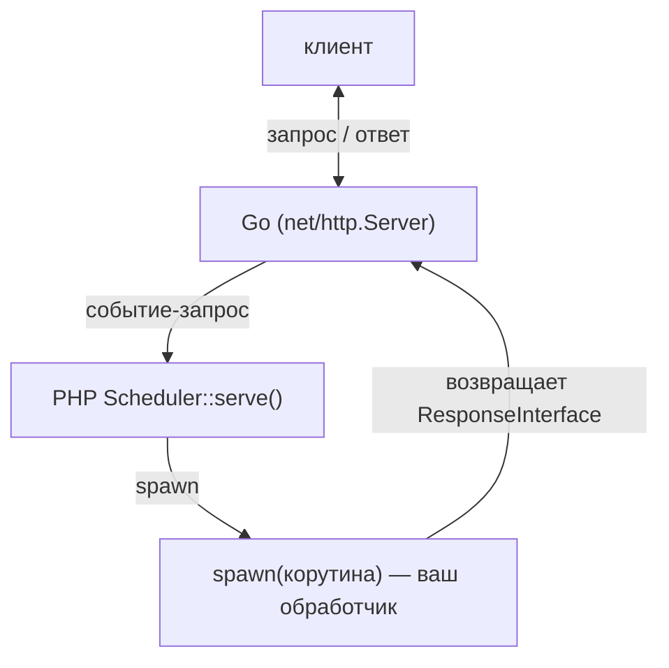
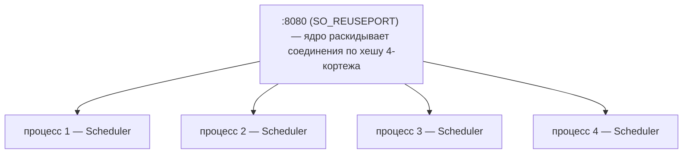
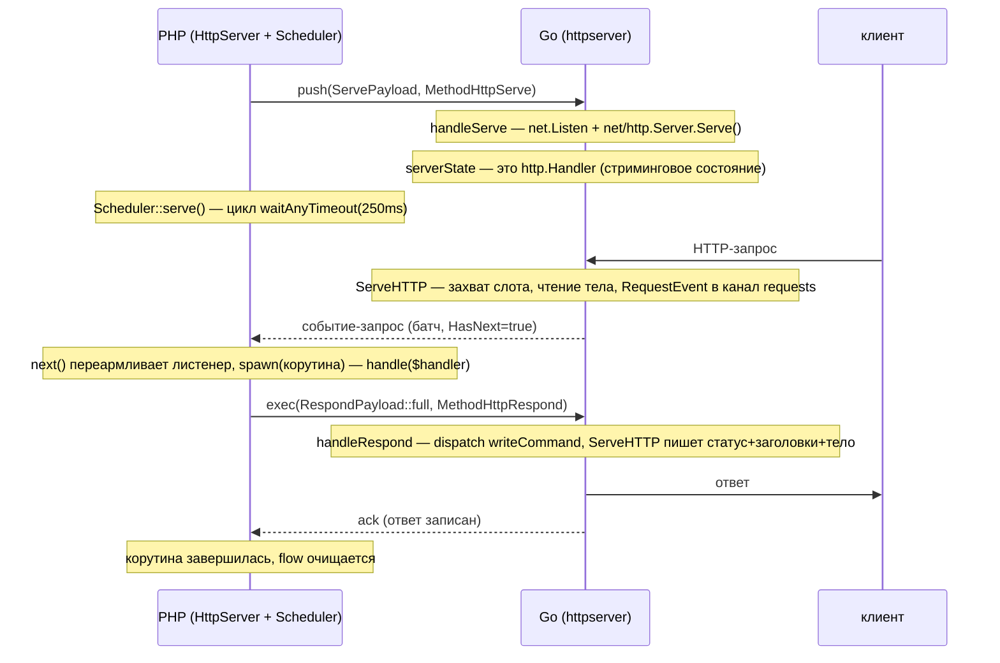

# HTTP-сервер

Долгоживущий PHP-демон, который принимает HTTP-запросы и обрабатывает каждый в
отдельной корутине (Fiber), конкурентно с остальными. Сетевой I/O живёт в
Go-расширении; PHP остаётся тонким слоем-оркестратором. Реализация — в
`src/Features/HttpServer/` (PHP) и `ext/internal/features/httpserver/` (Go).

> ⚠️ Перед использованием прочитайте раздел [«Чего нет в отличие от типовых
> серверов»](#чего-нет-в-отличие-от-типовых-серверов) — модель кооперативная и
> однопоточная, это накладывает реальные ограничения на код обработчиков.

## Оглавление

- [Идея и модель](#идея-и-модель)
- [Быстрый старт](#быстрый-старт)
- [Примеры](#примеры)
- [Параметры сервера](#параметры-сервера)
- [API: запрос и ответ (PSR-7)](#api-запрос-и-ответ-psr-7)
- [Стриминг ответа (chunked / SSE)](#стриминг-ответа-chunked--sse)
- [Обработка ошибок](#обработка-ошибок)
- [Access-лог](#access-лог)
- [Конкурентность и лимиты](#конкурентность-и-лимиты)
- [Масштабирование на ядра (SO_REUSEPORT)](#масштабирование-на-ядра-so_reuseport)
- [Остановка после N запросов](#остановка-после-n-запросов)
- [Graceful shutdown](#graceful-shutdown)
- [Внутреннее устройство](#внутреннее-устройство)
- [Чего нет в отличие от типовых серверов](#чего-нет-в-отличие-от-типовых-серверов)
- [Нюансы и подводные камни](#нюансы-и-подводные-камни)
- [Запуск в Docker](#запуск-в-docker)
- [Тестирование](#тестирование)

---

## Идея и модель

Сетевой стек (приём соединений, парсинг HTTP, keep-alive, таймауты, запись ответа)
работает в Go на стандартном `net/http.Server`. Каждый принятый запрос
превращается в обычный «результат» и приходит в PHP через тот же единый канал
`waitAny`, что и результаты всех остальных задач (Mongo, Sleeper). Благодаря этому
сервер переиспользует существующий планировщик (`Scheduler`) и не вводит второй
event-loop.

Базовая модель — spawn-на-запрос: на каждое событие-запрос создаётся новая
корутина-обработчик. Внутри обработчика можно делать обычные асинхронные вызовы
SConcur (MongoDB, Sleeper, …) — они выполнятся конкурентно с обработкой других
запросов.



Публичный контракт обработчика — PSR-7: на вход `Psr\Http\Message\ServerRequestInterface`,
на выход `Psr\Http\Message\ResponseInterface`. Сама библиотека ни от какой конкретной
PSR-7 реализации не зависит — объекты создаёт ваша PSR-17 фабрика (в примерах
`nyholm/psr7`), которую вы передаёте в конструктор. Это зеркало
[HTTP-клиента (PSR-18)](http-client.ru.md).

## Быстрый старт

```php
use Nyholm\Psr7\Factory\Psr17Factory;
use Psr\Http\Message\ResponseInterface;
use Psr\Http\Message\ServerRequestInterface;
use SConcur\Features\HttpServer\HttpServer;

require __DIR__ . '/vendor/autoload.php';

$factory = new Psr17Factory(); // одна фабрика играет обе нужные роли PSR-17

$server = new HttpServer(
    serverRequestFactory: $factory,
    responseFactory:      $factory,
    address:              '0.0.0.0:8080',
);

$server->serve(static function (ServerRequestInterface $request) use ($factory): ResponseInterface {
    return match ($request->getUri()->getPath()) {
        '/'      => $factory->createResponse(200)->withBody($factory->createStream('ok')),
        '/ping'  => $factory->createResponse(200)->withBody($factory->createStream('pong')),
        default  => $factory->createResponse(404)->withBody($factory->createStream('not found')),
    };
});
```

`nyholm/psr7` — лишь пример; подойдёт любая PSR-7/PSR-17 реализация (`guzzlehttp/psr7`,
`laminas/laminas-diactoros`, …). Конструктору нужны две PSR-17 фабрики:
`ServerRequestFactoryInterface` (создать запрос) и `ResponseFactoryInterface` (создать
запасные ответы `413`/`500`); `Psr17Factory` реализует обе.

Запуск (требуется собранное расширение `ext/build/sconcur.so`):

```shell
php -d extension=./ext/build/sconcur.so server.php
```

`serve()` блокируется навсегда — до сигнала `SIGTERM`/`SIGINT` или остановки потока.

## Примеры

### Конкурентная асинхронная работа в обработчике

Обработчик исполняется в своей корутине, поэтому асинхронные фичи SConcur внутри
него не блокируют другие запросы:

```php
use SConcur\Features\Sleeper\Sleeper;

$server->serve(static function (ServerRequestInterface $request) use ($factory): ResponseInterface {
    if ($request->getUri()->getPath() === '/slow') {
        Sleeper::usleep(microseconds: 500_000); // корутина приостанавливается,
                                                 // другие запросы продолжают обслуживаться
        return $factory->createResponse(200)->withBody($factory->createStream('done'));
    }

    return $factory->createResponse(200)->withBody($factory->createStream('ok'));
});
```

### Чтение метода, пути, query, заголовков и тела

Всё — штатными методами PSR-7 `ServerRequestInterface`:

```php
$server->serve(static function (ServerRequestInterface $request) use ($factory): ResponseInterface {
    // $request->getMethod()            — "GET" / "POST" / ...
    // $request->getUri()->getPath()    — "/users"
    // $request->getUri()->getQuery()   — сырая строка "a=1&b=2"
    // $request->getQueryParams()       — уже распарсенный query (['a'=>'1','b'=>'2'])
    // $request->getHeaders()           — array<string, array<int, string>>
    // $request->getHeaderLine('X-Id')  — значения заголовка через ", "
    // $request->getBody()              — StreamInterface: getContents() (всё) / read() (чанк)
    // $request->getServerParams()      — REMOTE_ADDR / REMOTE_PORT / SERVER_PROTOCOL / ...

    $payload = json_encode([
        'method' => $request->getMethod(),
        'query'  => $request->getQueryParams(),
    ]);

    return $factory->createResponse(200)
        ->withHeader('Content-Type', 'application/json')
        ->withBody($factory->createStream((string) $payload));
});
```

### Несколько значений одного заголовка (например, Set-Cookie)

`withHeader()` принимает список значений — каждое уйдёт отдельной строкой заголовка:

```php
return $factory->createResponse(200)
    ->withHeader('Set-Cookie', ['a=1; Path=/', 'b=2; Path=/']) // список значений
    ->withHeader('Content-Type', 'text/plain')                 // одиночная строка тоже можно
    ->withBody($factory->createStream('ok'));
```

### Файлы: загрузка на диск, скачивание, отдача картинки

Тело запроса — `StreamInterface`, поэтому загрузку пишут на диск кусками, не держа
файл в памяти. Ответ-файл строят из `StreamInterface` поверх файла (`createStreamFromFile()`
у PSR-17 фабрики): размер известен, ответ уходит одной записью, а явный
`Content-Length` избавляет от лишнего chunked для крупных файлов.

```php
// Загрузка: стримим тело запроса в файл кусками.
$handle = fopen($target, 'wb');
$body   = $request->getBody();

while (($chunk = $body->read(8192)) !== '') {
    fwrite($handle, $chunk);
}

fclose($handle);

// Скачивание / отдача картинки: тело — файловый поток, длина известна.
$stream = $factory->createStreamFromFile($path, 'rb');

return $factory->createResponse(200)
    ->withHeader('Content-Type', 'image/png')      // image/* → браузер покажет inline
    ->withHeader('Content-Disposition', 'inline')  // attachment; filename="..." — для скачивания
    ->withHeader('Content-Length', (string) $stream->getSize())
    ->withBody($stream);
```

Готовые маршруты есть в демо-сервере (`tests/servers/http/http-server.php`):
`POST /files/upload?name=` стримит тело во временный файл и отдаёт JSON
`{saved,bytes,sha256}`; `GET /files/download?name=` отдаёт ранее загруженный файл
вложением (`attachment`); `GET /image?name=` отдаёт картинку из `tests/storage/images`
inline (по умолчанию `sample.png`), так что её видно прямо в браузере.

### Сервер с тюнингом

```php
$server = new HttpServer(
    serverRequestFactory: $factory,
    responseFactory:      $factory,
    address:              '0.0.0.0:8080',
    maxConcurrency:       256,     // не больше 256 запросов в обработке одновременно
    maxRequestBody:       1 << 20, // 1 MiB лимит тела запроса
    handlerTimeoutMs:     5_000,   // переопределяем дефолт 60с: запрос ≤ 5 с, иначе обрыв/504
    onError: static function (\Throwable $e, ServerRequestInterface $r): void {
        error_log(sprintf('[http] %s %s: %s', $r->getMethod(), $r->getUri()->getPath(), $e->getMessage()));
    },
);
```

## Параметры сервера

Конструктор `HttpServer` (`src/Features/HttpServer/HttpServer.php`). Все таймауты —
в миллисекундах. Дефолты PHP зеркалят дефолты Go.

| Параметр | Дефолт | Назначение |
|---|---|---|
| `serverRequestFactory` | — (обязателен) | PSR-17 `ServerRequestFactoryInterface` — из неё строится `ServerRequestInterface` для обработчика. |
| `responseFactory` | — (обязателен) | PSR-17 `ResponseFactoryInterface` — из неё строятся запасные ответы `413`/`500`. |
| `address` | `0.0.0.0:7832` | Адрес прослушивания, например `0.0.0.0:8080` или `127.0.0.1:9000`. |
| `readHeaderTimeoutMs` | `10000` | Предел чтения заголовков запроса (`net/http` `ReadHeaderTimeout`). |
| `readTimeoutMs` | `30000` | Предел чтения всего запроса (`ReadTimeout`). |
| `writeTimeoutMs` | `30000` | Предел записи ответа (`WriteTimeout`). |
| `idleTimeoutMs` | `60000` | Предел простоя keep-alive соединения (`IdleTimeout`). |
| `shutdownTimeoutMs` | `5000` | Сколько ждать дренаж активных соединений на стороне Go при остановке. |
| `maxRequestBody` | `10485760` (10 MiB) | Лимит тела запроса в байтах. Превышение → `413`. |
| `maxConcurrency` | `0` (без лимита) | Максимум одновременно обрабатываемых запросов. См. [лимиты](#конкурентность-и-лимиты). |
| `handlerTimeoutMs` | `60000` (60 с) | Макс. полное время обработки запроса (включая стрим), иначе `504`/обрыв. `0` — выкл. См. [таймаут хендлера](#таймаут-хендлера). |
| `maxRequests` | `0` (без лимита) | Остановить сервер после обработки этого числа запросов — мера против утечек памяти. `0` — выкл. См. [Остановка после N запросов](#остановка-после-n-запросов). |
| `reusePort` | `false` | Включить `SO_REUSEPORT` — несколько процессов на одном порту. См. [масштабирование на ядра](#масштабирование-на-ядра-so_reuseport). |
| `onError` | `null` | `Closure(Throwable, ServerRequestInterface): ?ResponseInterface` — наблюдатель ошибок обработчика. |
| `masterPid` | `null` | Если задан — сервер сам штатно останавливается, как только перестаёт быть потомком этого pid (его [мастер](worker-master.ru.md) умер). Под `WorkerMaster` ставится автоматически из флага `--masterPid` через `HttpServer::fromArgs()`; `null` — выключено. |

Значение `0` для `maxConcurrency`/`handlerTimeoutMs` означает «выключено». Для
прочих таймаутов `0` означает «взять Go-дефолт».

Каждый обработанный запрос пишется строкой access-лога в `STDOUT`
(`<ISO-время> <метод> <путь> <статус> <мс>ms`) — встроенно и безусловно. Запись
асинхронная: строку формирует и пишет Go из фоновой горутины, поэтому однопоточный
цикл не блокируется на I/O. См. [Access-лог](#access-лог).

### `HttpServer::fromArgs()`

Фабрика, собирающая сервер из `argv` (`$_SERVER['argv']`): каждый `--имя=значение`
сопоставляется с одноимённым скалярным параметром конструктора (с проверкой типа —
`int`/`bool`/`float`/`string`), неизвестный флаг → исключение. PSR-17 фабрики через
`argv` не передать (там только скаляры), поэтому их передают аргументами. Используется
воркер-скриптом под [мастером](worker-master.ru.md), который передаёт параметры
сервера и `--masterPid` через `argv`:

```php
$factory = new Psr17Factory();

$server = HttpServer::fromArgs(
    argv:                 $_SERVER['argv'],
    serverRequestFactory: $factory,
    responseFactory:      $factory,
);
$server->serve(static fn (ServerRequestInterface $request): ResponseInterface =>
    $factory->createResponse(200)->withBody($factory->createStream('ok')));
```

## API: запрос и ответ (PSR-7)

### Запрос — `ServerRequestInterface`

Обработчик получает обычный `Psr\Http\Message\ServerRequestInterface`, собранный из
события Go вашей `ServerRequestFactoryInterface`. Доступ — штатными методами PSR-7:

| Что нужно | Метод PSR-7 |
|---|---|
| Метод | `$request->getMethod()` — `"GET"`, `"POST"`, … |
| Путь | `$request->getUri()->getPath()` — `"/users/42"` (без query) |
| Сырая query-строка | `$request->getUri()->getQuery()` — `"a=1&b=2"` |
| Распарсенный query | `$request->getQueryParams()` — `['a' => '1', 'b' => '2']` |
| Все заголовки | `$request->getHeaders()` — `array<string, array<int, string>>` |
| Один заголовок | `$request->getHeaderLine('X-Echo')` (значения через `", "`) / `getHeader()` |
| Версия протокола | `$request->getProtocolVersion()` — `"1.1"` (без префикса `HTTP/`) |
| Host | `$request->getHeaderLine('Host')` или `$request->getUri()->getHost()` |
| Адрес клиента и пр. | `$request->getServerParams()` — `REMOTE_ADDR`, `REMOTE_PORT`, `SERVER_PROTOCOL`, `REQUEST_URI`, `QUERY_STRING`, `HTTP_HOST` |
| Тело | `$request->getBody()` — `StreamInterface`, см. ниже |

Куки, разобранное тело и загруженные файлы (`getCookieParams()`, `getParsedBody()`,
`getUploadedFiles()`) по конвенции PSR-7 не заполняются — это работа вашего
middleware поверх сырого тела/заголовков.

#### Тело запроса (`StreamInterface`)

`$request->getBody()` — PSR-7 `StreamInterface` (реализация
`Dto/RequestBodyStream.php` поверх стримингового `RequestBody`). Тело никогда не
буферизуется целиком в расширении: первый чанк приходит вместе с запросом, остаток
подтягивается по требованию. Поток одноразовый, не перематываемый (`isSeekable()` →
`false`; `seek`/`rewind`/`write` бросают исключение) — читайте одним способом на
запрос:

```php
// 1) Полностью (удобно для мелких тел — JSON, форма). Мемоизируется.
$raw  = $request->getBody()->getContents(); // или (string) $request->getBody()
$data = json_decode($raw, true);

// 2) Потоково (для больших загрузок — не держим тело в памяти):
$body = $request->getBody();
$hash = hash_init('sha256');
while (($chunk = $body->read(8192)) !== '') { // read() отдаёт '' по концу потока (PSR-7)
    hash_update($hash, $chunk);               // обрабатываем чанк за чанком
}
```

- Транспортная гранулярность фиксирована (64 KiB): тело ≤ этого размера приходит
  целиком вместе с запросом — `getContents()`/первый `read()` не делают лишних
  round-trip'ов; большее тело тянется кусками по 64 KiB за round-trip, а
  `read($length)` нарезает их до нужного приложению размера.
- `read()` приостанавливает корутину до прихода данных — медленный загрузчик не
  блокирует другие запросы.
- `getSize()` → `null` (длина заранее не известна — тело стримится).
- Превышение `maxRequestBody` при чтении бросает
  `SConcur\Exceptions\HttpServer\RequestBodyTooLargeException` из `read()`/
  `getContents()`; дайте ему всплыть — если ответ ещё не начат, фреймворк ответит
  `413`.

### Ответ — `ResponseInterface`

Обработчик возвращает любой `Psr\Http\Message\ResponseInterface`, созданный вашей
PSR-17 фабрикой:

```php
$response = $factory->createResponse(200)         // статус
    ->withHeader('Content-Type', 'text/plain')    // заголовок: строка или список строк
    ->withBody($factory->createStream('hello'));  // тело
```

- Тело известного размера (`getBody()->getSize() !== null`) уходит клиенту одной
  записью. Тело неизвестного размера (`getSize() === null`) — это стрим: фреймворк
  вычитывает его чанками (chunked transfer), см. [Стриминг](#стриминг-ответа-chunked--sse).
- Если `Content-Type` не задан — Go определит его автоматически по телу
  (`http.DetectContentType`).
- Заголовок может быть строкой (одно значение) или списком строк (несколько значений,
  например несколько `Set-Cookie`).

Возврат не-`ResponseInterface` — ошибка контракта (`InvalidHandlerResponseException`):
фреймворк ответит `500` и сообщит в `onError`.

## Стриминг ответа (chunked / SSE)

Отдельного DTO для стрима нет — это закрыто самим PSR-7: верните `ResponseInterface`,
у которого тело (`getBody()`) — ленивый `StreamInterface` неизвестного размера
(`getSize()` → `null`). Тогда фреймворк не пишет тело одной записью, а вычитывает его
по чанкам (`read()`), отправляя каждый клиенту и дожидаясь сброса (chunked transfer,
Server-Sent Events). Поскольку чтение идёт в корутине запроса, `read()` вашего потока
может приостанавливаться на async-фичах SConcur и лениво производить следующий чанк —
так выражаются и backpressure, и «поспать между чанками».

Пример — тело на основе генератора (готовый класс есть в тестах:
`tests/impl/HttpServer/GeneratorStream.php`, реализует `StreamInterface` поверх
`Generator`):

```php
use SConcur\Features\Sleeper\Sleeper;
use SConcur\Tests\Impl\HttpServer\GeneratorStream;

$chunks = (static function (): Generator {
    foreach (range(1, 5) as $i) {
        yield "data: event $i\n\n"; // один yield — один сброшенный клиенту чанк
        Sleeper::sleep(seconds: 1); // между чанками можно делать async-работу
    }
})();

return $factory->createResponse(200)
    ->withHeader('Content-Type', 'text/event-stream')
    ->withBody(new GeneratorStream($chunks));
```

Ключевые свойства:

- Backpressure записи. Каждый прочитанный из тела чанк отправляется командой и
  подтверждается только после того, как Go фактически записал и сбросил его клиенту.
  Быстрый продюсер не обгоняет медленного клиента.
- Без `Content-Length`. Размер `null` → отправляется заголовок без длины, дальше
  chunked transfer encoding.
- Между чанками корутина может приостанавливаться на асинхронных вызовах, не
  блокируя другие запросы.
- Статус нельзя поменять после первого чанка — заголовки уже на проводе. Исключение
  при чтении тела поэтому не превращается в `500` (он уже отправлен), а лишь сообщается
  в `onError`, после чего поток корректно завершается.

## Обработка ошибок

- Исключение в обработчике → клиент получает `500 Internal Server Error`, петля
  `serve()` не падает (изоляция ошибок).
- Неверный тип возврата (не `ResponseInterface`) → тоже `500`.
- Наблюдаемость. По умолчанию ошибка проглатывается (только `500`). Передайте
  `onError`, чтобы её увидеть — залогировать, отправить в трейсинг или вернуть свой
  ответ:

```php
onError: static function (\Throwable $e, ServerRequestInterface $request) use ($factory): ?ResponseInterface {
    error_log((string) $e);

    // вернуть свой ответ вместо дефолтного 500 (или null → дефолтный 500)
    return $factory->createResponse(500)->withBody($factory->createStream('oops'));
}
```

`onError`, бросивший исключение сам, безопасно проглатывается — клиент всё равно
получит `500`.

## Access-лог

После каждого запроса сервер встроенно пишет одну строку в `STDOUT` — включая
ошибочные (`4xx`/`5xx`) и даже те, что PHP-обработчик не видит: `503` при остановке,
`504` по таймауту, `413` на превышение тела, обрыв соединения. Лог всегда включён.

Пишет сторона Go, не PHP. Строку формирует и отдаёт в логгер та же горутина Go, что
записывает ответ в соединение, — поэтому на каждый запрос не делается ни одного
пересечения границы PHP↔Go ради лога (cgo-вызов — самая дорогая часть обработки
крошечного запроса; вынос лога на Go-сторону почти удваивает per-core throughput на
hello-world). Сам вывод асинхронный: фоновая горутина-логгер пишет в `STDOUT` из
буфера с флашем по таймеру (~100 мс), поэтому цикл сервера не блокируется на I/O и не
зависит от готовности читателя (битый pipe не валит процесс). При переполнении
очереди лишние строки дропаются со счётчиком (для access-лога приемлемо).

Формат строки:

```
<ISO-время-начала> <метод> <путь> <статус> <мс>ms
```

Пример вывода:

```
2026-06-14T17:36:26.123456 GET / 200 2.59ms
2026-06-14T17:36:26.456789 GET /msleep/30 200 34.77ms
```

Время — момент приёма запроса (с микросекундами); последнее поле — полное время
обработки запроса в миллисекундах (от приёма до записи ответа; для стрима — вся
длительность стрима). Под [мастером воркеров](worker-master.ru.md) `STDOUT` воркера
перехватывается мастером и переписывается в общий лог.

Защита от подделки лога. Метод и путь экранируются перед записью: управляющие байты
(в том числе `CR`/`LF`, которые могли прийти из URL-кодированного пути вроде
`/foo%0A...`) выводятся как `\xNN`. Поэтому запрос не может вставить перевод строки и
подделать вторую строку access-лога — каждый запрос остаётся ровно одной строкой.

## Конкурентность и лимиты

### Один процесс = один поток

PHP-часть однопоточная и кооперативная: единый `Scheduler` гоняет цикл `waitAny`
и возобновляет корутины. Управление переходит другой корутине только когда текущая
приостанавливается на асинхронной фиче SConcur (`Fiber::suspend()`).

Из этого следует главное правило:

> **Обработчики обязаны быть I/O-bound через фичи SConcur.** Любая блокирующая или
> CPU-затратная работа в обработчике (нативный `sleep()`, синхронный PDO/`curl`,
> тяжёлый расчёт, чтение файла) замораживает весь сервер — все остальные запросы
> ждут. Уступают управление только асинхронные вызовы SConcur.

### `maxConcurrency`

Ограничивает число одновременно обрабатываемых запросов. Реализован семафором в Go,
захватываемым до чтения тела, поэтому ограничивает разом:

- число горутин,
- объём памяти (тела читаются только у запросов, получивших слот),
- число PHP-корутин (корутина живёт не дольше удержания слота).

Лишние соединения ждут освобождения слота (естественный backpressure). `0` —
без лимита; под нагрузкой с большими телами это риск OOM, поэтому для публичных
серверов задавайте лимит.

### Таймаут хендлера

`handlerTimeoutMs` ограничивает полное время обработки запроса — включая потоковый
ответ: весь запрос (и стрим) должен уложиться в этот лимит, иначе он обрывается, а
слот освобождается. По умолчанию 60 с; `0` — выключить (запрос может выполняться
неограниченно). Если к моменту дедлайна ничего не записано → клиент получает
`504 Gateway Timeout`; если стрим уже начался (статус на проводе) → ответ просто
обрывается на середине.

Дедлайн и ответ `504` живут на Go-стороне (таймер в `consumeCommands`), поэтому он
срабатывает независимо от PHP — клиент получает `504` даже если обработчик завис на
нативном блокирующем вызове (`sleep()`, синхронный PDO/`curl`) или в CPU-bound цикле.
Но это спасает только клиента (корректный код + освобождение соединения и слота
`maxConcurrency`), а не сервер: вытеснения в кооперативной модели нет, поэтому
зависший обработчик продолжает держать единственный PHP-поток — все остальные запросы
всё это время не обслуживаются (и по дедлайну тоже отдадут `504`). От runaway-
обработчиков защищаются на уровне процессов: пул воркеров (`SO_REUSEPORT`) +
`maxRequests` для рециклинга — см. [Масштабирование на ядра](#масштабирование-на-ядра-so_reuseport)
и [docs/worker-master.ru.md](worker-master.ru.md).

## Масштабирование на ядра (SO_REUSEPORT)

Один процесс задействует под PHP-логику фактически одно ядро (см.
[Конкурентность](#конкурентность-и-лимиты)). Чтобы загрузить все ядра, запускают
несколько независимых процессов. Проблема: обычно лишь один процесс может `bind()`
на данный `ip:port` — второй получит `EADDRINUSE`.

`SO_REUSEPORT` (опция сокета в Linux, ядро 3.9+) снимает это ограничение: несколько
процессов одновременно делают `bind()`+`listen()` на один и тот же адрес, а ядро
само балансирует входящие соединения между ними. Получается process-per-core без
внешнего балансировщика и без общего accept-сокета — как воркеры nginx.



Каждый процесс — свой Go-рантайм, свой `Scheduler`, свои корутины.

### Как включить

Передайте `reusePort: true` каждому процессу, который слушает общий порт:

```php
$server = new HttpServer(
    serverRequestFactory: $factory,
    responseFactory:      $factory,
    address:              '0.0.0.0:8080',
    reusePort:            true,
    maxConcurrency:       256, // лимит — на КАЖДЫЙ процесс
);

$server->serve($handler);
```

На Go-стороне это выставляет `SO_REUSEPORT` на слушающем сокете через
`net.ListenConfig` с `Control`-колбэком (`ext/internal/features/httpserver/listen.go`).

### Как запускать N процессов

Запускайте их как отдельные процессы — через супервизор (systemd, supervisord,
docker `--scale`) или простым циклом. Не через `pcntl_fork`: форк после загрузки
расширения запрещён (Go-рантайм не переживает `fork`).

```bash
# Пример: по процессу на ядро
for i in $(seq 1 "$(nproc)"); do
    php -d extension=./ext/build/sconcur.so server.php &
done
wait
```

systemd удобнее запускать как template-юнит (`server@1`, `server@2`, …) — у каждого
свой PID и независимый graceful shutdown.

### Нюансы и ограничения

- Процессы независимы. Общей памяти нет — у каждого свой Go-рантайм, планировщик и
  корутины. Любое общее состояние (сессии, кэш, счётчики) держите во внешнем
  хранилище (MongoDB/Redis).
- Каждый процесс обязан выставить `reusePort: true`. Если хоть один процесс этого не
  сделал и стартовал первым, остальные получат `EADDRINUSE`.
- Балансировка — по соединениям, не по запросам. Ядро распределяет соединения по хешу
  4-кортежа (src ip:port → dst ip:port). При keep-alive все запросы одного соединения
  идут в один и тот же процесс. При малом числе долгоживущих соединений распределение
  может быть неравномерным; для ровной нагрузки полезно много коротких соединений или
  клиент с пулом.
- Лимиты — на процесс. `maxConcurrency`, `maxRequestBody` и т.п. применяются к
  каждому процессу отдельно; суммарный лимит = значение × число процессов.
- Graceful shutdown — на каждый процесс, без потери трафика. Сигнал шлите каждому PID;
  каждый дренажит свои in-flight независимо. По сигналу процесс сразу закрывает
  слушающий сокет (выходит из reuseport-группы), поэтому ядро перестаёт слать ему
  новые соединения и раздаёт их соседям, пока этот доканчивает уже принятые запросы.
  Новые соединения на завершающийся воркер не попадают — никаких `503` из-за
  rolling-рестарта (см. [Graceful shutdown](#graceful-shutdown)).
- Безопасность. `SO_REUSEPORT` позволяет другому процессу с тем же UID забиндиться на
  тот же порт и перехватывать часть соединений. В мультитенантной среде учитывайте это.
- Только Linux. Опция Linux-специфична (расширение в любом случае рассчитано на
  Linux/NTS).

## Остановка после N запросов

`maxRequests` ограничивает число обработанных запросов: как только сервер раздал
указанное количество, он сам инициирует штатную остановку и завершает процесс. Это
профилактика утечек памяти в долгоживущем демоне — вместо того чтобы процесс рос без
конца, он периодически перезапускается с чистого листа. Поднять новый процесс должен
внешний супервизор (systemd, supervisord, docker `restart: unless-stopped`) или
[мастер воркеров](worker-master.ru.md) — пара к `SO_REUSEPORT`: пока один воркер
пересоздаётся, остальные продолжают принимать трафик.

```php
$server = new HttpServer(
    serverRequestFactory: $factory,
    responseFactory:      $factory,
    address:              '0.0.0.0:8080',
    maxRequests:          10_000, // после 10 000 запросов — graceful-остановка и выход
);

$server->serve($handler);
```

Механика переиспользует [graceful shutdown](#graceful-shutdown): достигнув лимита,
сервер

1. сразу закрывает слушающий сокет (перестаёт принимать новые соединения — в
   `SO_REUSEPORT`-группе они уходят соседям);
2. дожидается завершения уже принятых in-flight запросов (включая сам лимитный
   запрос — он не обрывается);
3. выходит с кодом `0`.

Поэтому уже принятые запросы не отфутболиваются: к моменту, когда сервер начинает
останавливаться, сокет уже закрыт, и новые соединения не попадают на завершающийся
процесс (а не получают обрыв/`503`).

- Лимит — на процесс. С `reusePort: true` каждый воркер считает свои запросы
  независимо; общий ресурс до перезапуска = `maxRequests` × число воркеров.
- `0` (по умолчанию) — без лимита, сервер живёт до сигнала/остановки потока.
- Считаются диспетчеризованные запросы (дошедшие до обработчика); запросы,
  отклонённые во время дренажа (узкое окно), в счёт не идут.

## Graceful shutdown

При получении `SIGTERM`/`SIGINT` сервер:

1. сразу закрывает слушающий сокет — перестаёт принимать новые соединения (на стороне
   Go `http.Server.Shutdown`, не отменяя in-flight);
2. дожидается завершения уже запущенных обработчиков (in-flight);
3. выходит.

Раннее закрытие сокета на шаге 1 важно для [`SO_REUSEPORT`](#масштабирование-на-ядра-so_reuseport):
завершающийся воркер выходит из reuseport-группы, и ядро направляет новые соединения
другим процессам, а не на этот (который их не обслужил бы). Так rolling-рестарт
обходится без потерянных запросов.

Запрос, принятый но ещё не отвеченный к моменту остановки (узкое окно между сигналом
и закрытием сокета), получает `503 Service Unavailable` (а не оборванное соединение).

Детали:

- Обработчики сигналов ставятся до старта листенера и восстанавливаются при выходе
  (прежние обработчики `SIGTERM`/`SIGINT` и режим `pcntl_async_signals` не угоняются
  навсегда).
- Требуется `ext-pcntl`. Без него graceful shutdown не работает — процесс завершится
  жёстко (что нарушает правило «не обрывать активные задачи»). В Docker-образах
  проекта `pcntl` включён.
- На idle-сервере shutdown срабатывает быстро: цикл `serve()` поллит `waitAny` с
  интервалом 250 мс и замечает сигнал даже без трафика.

## Внутреннее устройство

### Поток одного запроса



### Ключевые сущности

**PHP** (`src/`):

- `Features/HttpServer/HttpServer` — публичный API: `serve($handler)`. Генерирует
  `flowKey`, ставит обработчики сигналов, пушит задачу-листенер, запускает серверный
  цикл планировщика.
- `Scheduler/Scheduler::serve()` — серверный цикл поверх `waitAnyTimeout()`:
  диспетчеризует три вида результата — событие-запрос (→ `spawn` обработчика в новом
  per-request flow), результат задачи (→ возобновление корутины по `taskKey`) и
  завершение/ошибку серверного потока. Дренаж и `stopFlow` при shutdown.
- `Scheduler::spawn()` — fire-and-forget корутина вне `WaitGroup`, со своим flow;
  её результат не собирается, ошибки она обязана обработать сама (что и делает
  `HttpServer::handle`, превращая их в `500`).
- Контракт PSR-7: вход `ServerRequestInterface` (собирается в `HttpServer::decodeRequest`
  из события Go через `ServerRequestFactoryInterface`; тело — `Dto/RequestBodyStream`
  поверх `Dto/RequestBody`), выход `ResponseInterface`. Payloads
  `ServePayload`/`RespondPayload`.

**Go** (`ext/internal/features/httpserver/`):

- `feature.go` — методы `MethodHttpServe` (поднять листенер) и `MethodHttpRespond`
  (записать команду в соединение). Глобальный реестр `pendingRequests`
  (`requestId → {канал команд, сигнал abandoned}`) и `serverStates`
  (`flowKey → serverState` для `StopAccepting`).
- `server.go` — `serverState` как `http.Handler` поверх `net/http.Server`. Каждый
  запрос: `ServeHTTP` отдаёт `RequestEvent` в PHP и ждёт команды записи
  (`consumeCommands`). Команды: `full` (одноразовый ответ), `head`/`chunk`/`end`
  (стриминг). Семафор конкурентности, таймаут хендлера, 503/504, graceful `Shutdown`.
- `listen.go` — `listen()`: TCP-листенер, с `reusePort` выставляет `SO_REUSEPORT`
  через `net.ListenConfig` с `Control`-колбэком.

### Почему листенер — это «стриминговая задача»

Эмитить событие-запрос с произвольным `taskKey` напрямую в общий канал нельзя —
сломается учёт задач (`Flow.OnDelivered`). Поэтому листенер оформлен как
стриминговое состояние: каждый принятый запрос приходит как очередной батч
(`HasNext=true`), а PHP переармливает поток вызовом `next()`. `requestId` для
маршрутизации ответа лежит в payload события.

### Per-request flow

`serverFlowKey` — это flow самого листенера. Каждый запрос обрабатывается в своём
flow, чтобы под-задачи обработчика (Mongo/Sleeper) изолировались и корректно
очищались, а остановка одного запроса не роняла весь сервер.

### Протокол ответа (команды записи)

Ответ — это последовательность команд, передаваемых из PHP через `MethodHttpRespond`:

- `full` — одноразовый ответ: статус + заголовки + тело, затем завершить.
- `head` — начать стрим: статус + заголовки, сбросить клиенту.
- `chunk` — кусок тела, сбросить.
- `end` — завершить стрим.

Каждая команда подтверждается обратно (ack) только после применения — это и даёт
backpressure записи. Если соединение к моменту записи отвалилось или сработал
таймаут, обработчик получает ошибку (`abandoned`) и корректно разворачивается, а не
зависает.

## Чего нет в отличие от типовых серверов

| Что | Статус | Комментарий |
|---|---|---|
| PHP-FPM / mod_php | ❌ нельзя | Только долгоживущий CLI. Расширение держит Go-рантайм на уровне процесса; модель FPM этому противоречит. |
| `pcntl_fork` после загрузки расширения | ❌ нельзя | Go-рантайм не переживает `fork`. Форкайтесь до первого обращения к расширению или запускайте отдельные процессы (`exec`). |
| ZTS-сборка PHP | ❌ нет | Только NTS (non-thread-safe). |
| TLS / HTTPS | ❌ пока нет | Только plain TCP. Терминируйте TLS впереди (nginx/HAProxy/балансировщик). |
| HTTP/2, WebSocket | ❌ нет | `net/http` без TLS — HTTP/1.1; h2c и WebSocket не включены. |
| Параллелизм на ядра в одном процессе | ❌ нет | Один процесс = один PHP-поток. Масштаб — несколькими процессами через [`SO_REUSEPORT`](#масштабирование-на-ядра-so_reuseport). |
| CPU-bound обработчики | ⚠️ опасно | Блокируют весь сервер: нет вытеснения. Только I/O-bound через фичи SConcur. |
| Синхронный I/O в обработчике | ⚠️ опасно | Нативный `sleep`/PDO/`curl`/файлы замораживают цикл. Используйте async-фичи SConcur. |
| Стриминг тела запроса | ✅ есть | `$request->getBody()->read()` тянет чанки; тело не буферизуется целиком (см. [Тело запроса](#тело-запроса-streaminterface)). |
| Роутер / middleware | ❌ нет | Низкоуровневый контракт `(ServerRequestInterface): ResponseInterface` (PSR-7). Готовый PSR-15 middleware-стек поверх можно навесить самому. |
| `exit()`/`die()` при активных задачах | ❌ нельзя | Поведение не определено. Сначала доведите/остановите задачи. |

Что, наоборот, работает (и иногда удивляет): keep-alive, конвейер таймаутов,
chunked/SSE-стриминг, несколько значений одного заголовка (например, несколько
`Set-Cookie`), бинарные тела, лимит конкурентности, `413`/`503`/`504`, graceful
shutdown.

## Нюансы и подводные камни

- Один обработчик — один поток исполнения. Параллелизм достигается тем, что
  обработчики уступают на async-вызовах. Спроектируйте обработчики так, чтобы любая
  долгая работа шла через фичи SConcur.
- Query доступен и сырым (`$request->getUri()->getQuery()`), и распарсенным
  (`$request->getQueryParams()` — заполняется через `parse_str()`).
- Заголовки запроса доступны через `getHeaders()`/`getHeaderLine()`; имена PSR-7
  трактует регистронезависимо, значений может быть несколько.
- 204/304 — тело в ответе будет отброшено `net/http` (как и положено).
- Лимит тела проверяется через `MaxBytesReader`: превышение → `413`, без тихого
  усечения.
- Память. Без `maxConcurrency` число одновременных обработчиков и буферизованных тел
  не ограничено — под флудом крупными телами возможен OOM. Задавайте лимит.
- Idle-shutdown срабатывает в пределах ~250 мс (интервал поллинга `waitAny`).

## Запуск в Docker

В `docker-compose.yml` есть сервис `servers`: он под supervisor поднимает обоих
мастеров — HTTP и socket (`tests/servers/http/http-server.php` и
`tests/servers/socket/socket-server.php` через `bin/sconcur-server`). Порты
захардкожены в compose (HTTP — `28080:8080`), так как JSON-конфиги мастеров не
умеют переменные окружения. Пересобрать и перезапустить:

```shell
make servers-restart
```

Это пересобирает расширение (`make ext-build`) и пересоздаёт контейнер `servers`.
Управление каждым мастером — `make http-server-{status,stop,reload}` (и
`socket-server-*`).

## Тестирование

Автотесты не зависят от docker-сервиса: они поднимают сервер отдельным процессом
через харнесс `SConcur\Tests\Impl\HttpServer\TestHttpServer`
(`tests/impl/HttpServer/TestHttpServer.php`). Опции запуска именуются точно как
параметры конструктора `HttpServer` и передаются процессу как `--name=value`:

```php
use SConcur\Tests\Impl\HttpServer\TestHttpServer;

$server = TestHttpServer::start(['maxConcurrency' => 2, 'handlerTimeoutMs' => 200]);

// $server->baseUrl(), $server->signal(SIGTERM), $server->waitForExit(3.0), $server->stop()
```

`BaseHttpServerTestCase` поднимает по серверу на тест-класс; переопределите
`serverOptions()` для нужных настроек. Демо-сервер
(`tests/servers/http/http-server.php`) содержит маршруты под все сценарии тестов:
`/`, `/pid`, `/method`, `/echo`, `/upload`, `/files/upload`, `/files/download`,
`/image`, `/query`, `/echo-header`, `/meta`, `/empty`, `/cookies`, `/all`, `/stream`,
`/slow-stream`, `/truncated`, `/big/{size}`, `/redirect/{n}`, `/throw`, `/msleep/{ms}`,
`/native-msleep/{ms}`, `/cpu/{n}`, `/status/{code}`.

Покрытие (`tests/feature/Features/HttpServer/`): маршрутизация и методы, query и
заголовки запроса, бинарное тело, мульти-заголовки ответа, стриминг, лимит
конкурентности, `413`, таймаут хендлера (`504`), graceful drain (`SIGTERM` с
in-flight), остановка после N запросов (`maxRequests`).

---

См. также: [README → Принцип работы](../README.md#принцип-работы),
[Админ-статистика сервера](admin-stats.ru.md),
[Как добавить новую фичу](adding-a-feature.ru.md).
