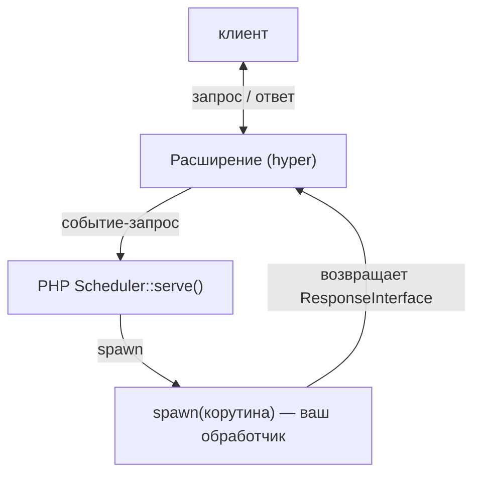
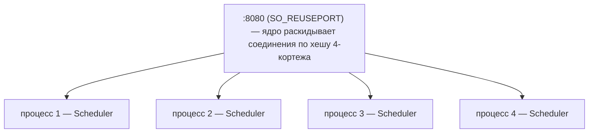

[English](http-server.md) | Русский

# HTTP-сервер

Долгоживущий PHP-демон, который принимает HTTP-запросы и обрабатывает каждый в
отдельной корутине (Fiber), конкурентно с остальными. Сетевой I/O живёт в
расширении; PHP остаётся тонким слоем-оркестратором. Реализация:
`src/Features/HttpServer/` (PHP) и `ext/src/features/httpserver/` (Rust).

> ⚠️ Сначала прочитайте [«Чего нет в отличие от типовых
> серверов»](#чего-нет-в-отличие-от-типовых-серверов) — модель кооперативная и
> однопоточная, это ограничивает код обработчиков.

## Оглавление

- [Модель](#модель)
- [Быстрый старт](#быстрый-старт)
- [Параметры сервера](#параметры-сервера)
- [Запрос и ответ (PSR-7)](#запрос-и-ответ-psr-7)
- [Стриминг ответа (chunked / SSE)](#стриминг-ответа-chunked--sse)
- [Файлы](#файлы)
- [Обработка ошибок](#обработка-ошибок)
- [Логи](#логи)
- [Конкурентность и лимиты](#конкурентность-и-лимиты)
- [Масштабирование на ядра (SO_REUSEPORT)](#масштабирование-на-ядра-so_reuseport)
  - [Прокси перед пулом](#прокси-перед-пулом)
- [OPcache и JIT](#opcache-и-jit)
- [Остановка после N запросов](#остановка-после-n-запросов)
- [Graceful shutdown](#graceful-shutdown)
- [Внутреннее устройство](#внутреннее-устройство)
- [Чего нет в отличие от типовых серверов](#чего-нет-в-отличие-от-типовых-серверов)
- [Запуск в Docker и тестирование](#запуск-в-docker-и-тестирование)

## Модель

Сетевой стек (приём соединений, парсинг HTTP, keep-alive, таймауты, запись
ответа) работает внутри расширения, на hyper. Каждый принятый запрос
превращается в обычный результат и приходит в PHP через тот же общий канал
результатов, что и все прочие задачи, поэтому сервер переиспользует существующий
`Scheduler` и не вводит второй event-loop.

Базовая модель — spawn-на-запрос: на каждое событие-запрос создаётся новая
корутина-обработчик, а обычные асинхронные вызовы SConcur внутри неё выполняются
конкурентно с обработкой других запросов.

Воркер — долгоживущий процесс: всё, что создано до `serve()` (бутстрап
фреймворка, DI-контейнер, конфиг, соединения), переиспользуется каждым запросом.
Обратная сторона обычная: состояние переживает запросы, поэтому request-scoped
данные держите в [контексте корутины](coroutine-context.ru.md) или локально в
обработчике, а процесс рециклит `maxRequests`.


```mermaid
flowchart TB
    Client["клиент"]
    EXT["Расширение (hyper)"]
    Sched["PHP Scheduler::serve()"]
    Handler["spawn(корутина) — ваш обработчик"]

    Client <-->|"запрос / ответ"| EXT
    EXT -->|"событие-запрос"| Sched
    Sched -->|"spawn"| Handler
    Handler -->|"возвращает ResponseInterface"| EXT
```

Контракт обработчика — PSR-7: на вход `ServerRequestInterface`, на выход
`ResponseInterface`. Библиотека не зависит ни от какой конкретной PSR-7
реализации — объекты создаёт PSR-17 фабрика, переданная в конструктор; это
зеркало [HTTP-клиента (PSR-18)](http-client.ru.md).

## Быстрый старт

```php
use Nyholm\Psr7\Factory\Psr17Factory;
use Psr\Http\Message\ResponseInterface;
use Psr\Http\Message\ServerRequestInterface;
use SConcur\Features\HttpServer\HttpServer;

require __DIR__ . '/vendor/autoload.php';

$factory = new Psr17Factory(); // одна фабрика играет обе нужные роли PSR-17

$server = new HttpServer(
    serverRequestFactory: $factory,
    responseFactory:      $factory,
    address:              '0.0.0.0:8080',
);

$server->serve(static function (ServerRequestInterface $request) use ($factory): ResponseInterface {
    return match ($request->getUri()->getPath()) {
        '/'      => $factory->createResponse(200)->withBody($factory->createStream('ok')),
        '/ping'  => $factory->createResponse(200)->withBody($factory->createStream('pong')),
        default  => $factory->createResponse(404)->withBody($factory->createStream('not found')),
    };
});
```

Подойдёт любая PSR-7/PSR-17 реализация (`nyholm/psr7`, `guzzlehttp/psr7`,
`laminas/laminas-diactoros`, …). Конструктору нужны `ServerRequestFactoryInterface`
(создать запрос) и `ResponseFactoryInterface` (запасные ответы `413`/`500`);
`Psr17Factory` реализует обе.

```shell
php -d extension=./ext/build/sconcur.so server.php
```

`serve()` блокируется до `SIGTERM`/`SIGINT` или остановки потока. Обработчик
исполняется в своей корутине, поэтому асинхронные фичи внутри него
(`Sleeper::usleep()`, MongoDB, SQL, HTTP-клиент) не блокируют другие запросы.

## Параметры сервера

Конструктор `HttpServer` (`src/Features/HttpServer/HttpServer.php`). Все таймауты
в миллисекундах.

| Параметр | Дефолт | Назначение |
|---|---|---|
| `serverRequestFactory` | — (обязателен) | PSR-17 `ServerRequestFactoryInterface` — из неё строится запрос обработчика. |
| `responseFactory` | — (обязателен) | PSR-17 `ResponseFactoryInterface` — запасные ответы `413`/`500`. |
| `address` | `0.0.0.0:7832` | Адрес прослушивания, например `0.0.0.0:8080`. |
| `readHeaderTimeoutMs` | `10000` | Предел чтения заголовков запроса (`ReadHeaderTimeout`). |
| `readTimeoutMs` | `30000` | Предел чтения всего запроса (`ReadTimeout`). |
| `writeTimeoutMs` | `30000` | Предел записи ответа (`WriteTimeout`). |
| `idleTimeoutMs` | `60000` | Предел простоя keep-alive соединения (`IdleTimeout`). |
| `shutdownTimeoutMs` | `10000` | Сколько расширение ждёт завершения активных соединений при остановке. |
| `maxRequestBody` | `10485760` (10 MiB) | Лимит тела запроса; превышение → `413`. |
| `maxConcurrency` | `0` (без лимита) | Одновременно обрабатываемых запросов, см. [лимиты](#конкурентность-и-лимиты). |
| `handlerTimeoutMs` | `60000` | Полное время обработки запроса, включая стрим, иначе `504`/обрыв. `0` — выкл. |
| `maxRequests` | `0` (без лимита) | Остановить сервер после N запросов, см. [ниже](#остановка-после-n-запросов). |
| `reusePort` | `false` | `SO_REUSEPORT` — несколько процессов на одном порту. |
| `onError` | `null` | `Closure(Throwable, ServerRequestInterface): ?ResponseInterface`. |
| `masterPid` | `null` | Штатно остановиться, как только этот pid перестал быть родителем ([мастер](worker-master.ru.md) умер); ставится из `--masterPid` через `fromArgs()`. |
| `telemetrySocket` | `''` (выкл.) | Unix-сокет для снапшотов статистики, инжектируется мастером ([статистика](admin-stats.ru.md)). |
| `serverName` | `'sconcur-server'` | Имя воркера в снапшотах статистики. |
| `telemetryIntervalMs` | `0` | Период снапшотов; `0` — значение по умолчанию у отправителя (1000 мс). |
| `preemptionQuantumMs` | `5` | Квант автоматической преемпции во время serve; `0` — выкл. См. [переключение корутин](coroutine-switching.ru.md). |

`0` означает «выключено» для `maxConcurrency`/`handlerTimeoutMs`/`maxRequests` и
«взять дефолт» для прочих таймаутов.

`HttpServer::fromArgs()` собирает сервер из `argv`: каждый `--имя=значение`
сопоставляется с одноимённым скалярным параметром конструктора (с проверкой
типа), неизвестный флаг → исключение. PSR-17 фабрики через argv не передать,
поэтому они остаются аргументами. Так делает воркер-скрипт под
[мастером](worker-master.ru.md):

```php
$server = HttpServer::fromArgs(
    argv:                 $_SERVER['argv'],
    serverRequestFactory: $factory,
    responseFactory:      $factory,
);
```

## Запрос и ответ (PSR-7)

Обработчик получает `ServerRequestInterface`, собранный из события вашей
фабрикой:

| Что нужно | Метод PSR-7 |
|---|---|
| Метод | `$request->getMethod()` |
| Путь | `$request->getUri()->getPath()` — без query |
| Сырая query-строка | `$request->getUri()->getQuery()` |
| Распарсенный query | `$request->getQueryParams()` — заполняется через `parse_str()` |
| Все заголовки | `$request->getHeaders()` — `array<string, array<int, string>>` |
| Один заголовок | `$request->getHeaderLine('X-Echo')` / `getHeader()` |
| Версия протокола | `$request->getProtocolVersion()` — `"1.1"`, без префикса `HTTP/` |
| Адрес клиента и пр. | `$request->getServerParams()` — `REMOTE_ADDR`, `REMOTE_PORT`, `SERVER_PROTOCOL`, `REQUEST_URI`, `QUERY_STRING`, `HTTP_HOST` |
| Тело | `$request->getBody()` — `StreamInterface`, см. ниже |

Куки, разобранное тело и загруженные файлы (`getCookieParams()`,
`getParsedBody()`, `getUploadedFiles()`) не заполняются — по конвенции PSR-7 это
работа вашего middleware.

### Запрос ленив к заголовкам

Обработчику передаётся `Dto/LazyHeadersRequest` — `ServerRequestInterface`,
обёрнутый вокруг того объекта, который построила ваша фабрика. Заголовки и
query-строка держатся в стороне и применяются при первом обращении: установка
семи заголовков стоит 4.17 мкс из 7.75, которые занимает весь декод, разбор
query — ещё 1.9, а роутер читает метод и путь, то есть 0.12 (`make bench-request`).
Лень переживает `withAttribute` и остальные withers, так что запись параметров
маршрута её не срывает.

На поверхности PSR-7 не меняется ничего: каждый метод отвечает то же, что ответил
бы жадно построенный запрос, и `getHeaders()` возвращает тот же массив в том же
порядке. Меняются две вещи, и только для кода, который смотрит мимо интерфейса:

- `instanceof Nyholm\Psr7\ServerRequest` (или любой другой конкретный класс)
  теперь ложь — конкретный объект лежит уровнем внутрь. Типизируйтесь на
  `ServerRequestInterface`, как и предполагает PSR-7;
- `$request->materialize()` возвращает обычный запрос со всем применённым — для
  редкого случая, когда конкретный объект нужно отдать наружу.

Обработчик, который читает хотя бы один заголовок, платит на 0.36 мкс больше, чем
раньше. Это и есть размен: лень оправдана, пока заголовки читаются менее чем в 91%
запросов.

Тело — `Dto/RequestBodyStream` поверх стримингового `Dto/RequestBody`, оно
никогда не буферизуется целиком в расширении: первый чанк приходит вместе с
запросом, остаток подтягивается по требованию. Поток одноразовый и не
перематываемый (`isSeekable()` → `false`; `seek`/`rewind`/`write` бросают
исключение), поэтому читайте одним способом на запрос:

```php
// 1) Полностью (мелкие тела — JSON, форма). Мемоизируется.
$data = json_decode($request->getBody()->getContents(), true);

// 2) Потоково (большие загрузки — не держим тело в памяти):
$body = $request->getBody();
while (($chunk = $body->read(8192)) !== '') { // '' по концу потока (PSR-7)
    hash_update($hash, $chunk);
}
```

- Транспортная гранулярность фиксирована на 64 KiB: тело до этого размера
  приходит целиком с запросом; большее тянется по 64 KiB за round-trip, а
  `read($length)` нарезает его до нужного размера.
- `read()` приостанавливает корутину до прихода данных — медленный загрузчик не
  блокирует другие запросы.
- `getSize()` → `null` (тело стримится).
- Превышение `maxRequestBody` бросает `RequestBodyTooLargeException` из
  `read()`/`getContents()` (проверка через `MaxBytesReader`, без тихого
  усечения); дайте ему всплыть — фреймворк ответит `413`.

Обработчик возвращает любой `ResponseInterface`:

```php
return $factory->createResponse(200)
    ->withHeader('Content-Type', 'text/plain')            // строка или список строк
    ->withHeader('Set-Cookie', ['a=1; Path=/', 'b=2'])    // каждое значение — своя строка заголовка
    ->withBody($factory->createStream('hello'));
```

- Тело известного размера уходит одной записью; `getSize() === null` — это стрим,
  см. ниже.
- Без `Content-Type` расширение его не угадывает.
- У ответов 204/304 тело отбрасывается `net/http`.
- Возврат не-`ResponseInterface` — ошибка контракта
  (`InvalidHandlerResponseException`): клиент получает `500`, вызывается
  `onError`.

## Стриминг ответа (chunked / SSE)

Отдельного DTO для стрима нет — это закрыто самим PSR-7: верните ответ, тело
которого — ленивый `StreamInterface` неизвестного размера (`getSize()` → `null`).
Тогда фреймворк вычитывает его по чанкам (`read()`), отправляя каждый клиенту и
дожидаясь сброса (chunked transfer, SSE). Чтение идёт в корутине запроса, поэтому
ваш `read()` может приостанавливаться на async-фичах и лениво производить
следующий чанк.

```php
use SConcur\Tests\Impl\HttpServer\GeneratorStream; // StreamInterface поверх Generator

$chunks = (static function (): Generator {
    foreach (range(1, 5) as $i) {
        yield "data: event $i\n\n"; // один yield — один сброшенный клиенту чанк
        Sleeper::sleep(seconds: 1); // между чанками можно делать async-работу
    }
})();

return $factory->createResponse(200)
    ->withHeader('Content-Type', 'text/event-stream')
    ->withBody(new GeneratorStream($chunks));
```

- Темп задаёт клиент: чанк подтверждается только после того, как расширение фактически
  записал и сбросил его, поэтому быстрый производитель данных не обгоняет
  медленного клиента.
- Без `Content-Length` — заголовок без длины, дальше chunked transfer encoding.
- Статус нельзя поменять после первого чанка (заголовки уже на проводе), поэтому
  исключение при чтении тела не превращается в `500` — оно только сообщается в
  `onError`, после чего поток корректно завершается.

## Файлы

Загрузку пишут на диск кусками; ответ-файл строят из `createStreamFromFile()`, где
размер известен, поэтому ответ уходит одной записью, а явный `Content-Length`
избавляет от лишнего chunked.

```php
// Загрузка: стримим тело запроса в файл.
$handle = fopen($target, 'wb');
$body   = $request->getBody();

while (($chunk = $body->read(8192)) !== '') {
    fwrite($handle, $chunk);
}

fclose($handle);

// Отдача файла: тело — файловый поток, длина известна.
$stream = $factory->createStreamFromFile($path, 'rb');

return $factory->createResponse(200)
    ->withHeader('Content-Type', 'image/png')      // image/* → браузер покажет inline
    ->withHeader('Content-Disposition', 'inline')  // attachment; filename="..." — для скачивания
    ->withHeader('Content-Length', (string) $stream->getSize())
    ->withBody($stream);
```

Готовые маршруты есть в демо-сервере (`tests/servers/http/http-server.php`):
`POST /files/upload?name=`, `GET /files/download?name=`, `GET /image?name=`.

## Обработка ошибок

Исключение в обработчике или неверный тип возврата дают клиенту `500` — петля
`serve()` не падает. По умолчанию ошибка проглатывается; передайте `onError`,
чтобы увидеть её или вернуть свой ответ:

```php
onError: static function (\Throwable $e, ServerRequestInterface $request) use ($factory): ?ResponseInterface {
    error_log((string) $e);

    return $factory->createResponse(500)->withBody($factory->createStream('oops'));
}
```

`onError`, бросивший исключение сам, безопасно проглатывается — клиент всё равно
получит `500`.

## Логи

Access-лог — по строке на запрос в `STDOUT`, всегда включён, включая запросы,
которых PHP-обработчик не видит (`503` при остановке, `504` по таймауту, `413` на
превышение тела, обрыв соединения):

```
2026-06-14T17:36:26.123456 GET / 200 2.59ms
2026-06-14T17:36:26.456789 GET /msleep/30 200 34.77ms
```

Время — момент приёма запроса; последнее поле — полное время обработки (для
стрима — вся его длительность). Строку формирует та же задача рантайма, что пишет
ответ, поэтому лог не стоит ни одного пересечения границы на запрос (это
самая дорогая часть обработки крошечного запроса — вынос лога на сторону расширения
почти удваивает пропускную способность одного ядра на hello-world). Вывод
асинхронный: фоновая задача рантайма пишет из буфера с флашем по таймеру (~100 мс), при
переполнении лишние строки отбрасываются со счётчиком. Метод и путь экранируются
(управляющие байты, в том числе `CR`/`LF` из URL-кодированного пути, выводятся
как `\xNN`), поэтому запрос не может подделать вторую строку лога.

Строки жизненного цикла пишет PHP-сторона и сразу флашит — одна при старте, по
одной на шаг остановки:

```
2026-06-28T12:00:00.000000 sconcur http server listening on 0.0.0.0:8080 pid=12345 version=0.9.0 maxConcurrency=0 maxRequests=0 reusePort=0
2026-06-28T12:00:01.000000 sconcur http server shutdown: stop accepting (reason=signal), draining 2 in-flight
2026-06-28T12:00:01.050000 sconcur http server shutdown: drained all in-flight
2026-06-28T12:00:01.060000 sconcur http server shutdown: stopped
```

`reason=signal` — `SIGTERM`/`SIGINT` или потеря мастера; `reason=limit` —
достигнут `maxRequests`. Под [мастером воркеров](worker-master.ru.md) `STDOUT`
воркера перехватывается и переписывается в общий лог.

## Конкурентность и лимиты

PHP-часть однопоточная и кооперативная: единый `Scheduler` гоняет цикл ожидания и
возобновляет корутины, а управление переходит другой корутине только когда
текущая приостанавливается на фиче SConcur (`Fiber::suspend()`).

> **Обработчики обязаны быть I/O-bound через фичи SConcur.** Нативный блокирующий
> вызов (`sleep()`, синхронный PDO/`curl`, чтение файла) замораживает весь
> сервер. CPU-затратный PHP-код — исключение: сервер вытесняет его каждые
> `preemptionQuantumMs` (см. [переключение корутин](coroutine-switching.ru.md)),
> так что соседей он задерживает максимум на квант — но одиночный монолитный
> внутренний вызов (огромный `preg_match`, `json_decode`) непрерываем.

`maxConcurrency` ограничивает число одновременно обрабатываемых запросов. Это
семафор в расширении, захватываемый до чтения тела, поэтому он разом ограничивает
задачи рантайма, память (тела читаются только у запросов со слотом) и число
PHP-корутин. Лишние соединения ждут освобождения слота, так что нагрузка сама
себя притормаживает. `0` под наплывом крупных тел — риск OOM, для публичных
серверов задавайте лимит.

У него есть и второе применение — хвост латентности. CPU-затратные обработчики
делят единственный PHP-поток между собой, поэтому время каждого растёт вместе с
числом обслуживаемых одновременно, и `maxConcurrency` ограничивает именно это
число. На профиле из 90% пустых запросов и 10% обработчиков по ~49 мс CPU лимит
`4` уводит p99 с 2.86 с на 659 мс ценой p50, выросшего с 30 до 244 мс. Размен и
обе настройки разобраны в
[переключении корутин](coroutine-switching.ru.md#цена-под-нагрузкой).

`handlerTimeoutMs` ограничивает полное время обработки, включая потоковый ответ, и
ограничивает сразу две вещи.

Клиенту отвечает Расширение: таймер в `consumeCommands` отдаёт `504`, если к дедлайну
ничего не записано, или обрывает уже начатый стрим. Он срабатывает независимо от PHP,
поэтому клиент получит ответ, даже если обработчик завис на нативном вызове.

PHP-обработчик разматывается по тому же сроку — корутина запроса получает его, и по
истечении в обработчик бросается [таймаут корутины](coroutine-timeout.ru.md) прямо
там, где он стоит. Его `finally` выполняются, транзакция откатывается, соединения
возвращаются в пулы, и он перестаёт готовить ответ, который никто не прочитает. При
включённой преемпции — а она включена по умолчанию — это достаёт и до обработчика,
занятого чистыми вычислениями.

До чего не достаёт ни то, ни другое — до обработчика, уже вошедшего в нативный вызов:
там PHP не исполняется, и доставить туда нечего, пока вызов не вернётся. Такие случаи
ограничивают собственные таймауты фич (таймаут запроса, дедлайн HTTP-клиента), а на
уровне процессов — пул воркеров (`SO_REUSEPORT`) плюс рециклинг по `maxRequests`.

**Держите `handlerTimeoutMs` меньше `writeTimeoutMs`.** `504` — такая же запись, как
любая другая, и ей нужен ещё не истёкший дедлайн записи соединения. Если поставить
срок обработчика больше, таймаут всё равно сработает — обработчик размотается, ответ
сформируется, — но записать его будет уже нечем, и клиент увидит обрыв соединения
вообще без статуса.

## Масштабирование на ядра (SO_REUSEPORT)

Один процесс задействует под PHP-логику фактически одно ядро, поэтому все ядра
загружают несколькими независимыми процессами. Обычно лишь один процесс может
`bind()` на данный `ip:port`; `SO_REUSEPORT` (Linux, ядро 3.9+) позволяет
нескольким процессам делать `bind()`+`listen()` на один адрес, а ядро само
балансирует входящие соединения — process-per-core без внешнего балансировщика,
как воркеры nginx.


```mermaid
flowchart TB
    Port[":8080 (SO_REUSEPORT) — ядро раскидывает соединения по хешу 4-кортежа"]
    P1["процесс 1 — Scheduler"]
    P2["процесс 2 — Scheduler"]
    P3["процесс 3 — Scheduler"]
    P4["процесс 4 — Scheduler"]

    Port --> P1
    Port --> P2
    Port --> P3
    Port --> P4
```

Передайте `reusePort: true` каждому процессу на общем порту (на стороне расширения опция
выставляется через `net.ListenConfig` с `Control`-колбэком,
`ext-go-legacy/internal/features/httpserver/listen.go`). Запускайте их как отдельные
процессы — через супервизор (systemd, supervisord, docker `--scale`),
[мастер воркеров](worker-master.ru.md) или простым циклом, но не через
`pcntl_fork`.

```bash
# по процессу на ядро
for i in $(seq 1 "$(nproc)"); do
    php -d extension=./ext/build/sconcur.so server.php &
done
wait
```

Нюансы:

- Процессы независимы: общей памяти нет, у каждого свой рантайм расширения, планировщик и
  корутины. Общее состояние (сессии, кэш, счётчики) — во внешнее хранилище.
- Каждый процесс обязан выставить `reusePort: true` — если один этого не сделал и
  стартовал первым, остальные получат `EADDRINUSE`.
- Балансировка по соединениям, а не по запросам (хеш 4-кортежа), поэтому при
  keep-alive все запросы одного соединения идут в один процесс. Малое число
  долгоживущих соединений распределяется неравномерно.
- Лимиты — на процесс: суммарный = значение × число процессов.
- Graceful shutdown — на каждый процесс и без потери трафика, см. ниже.
- `SO_REUSEPORT` позволяет другому процессу с тем же UID забиндиться на порт и
  перехватывать часть соединений; учитывайте это в мультитенантной среде.

### Прокси перед пулом

Раздача ядром на практике ровная: на 8 воркерах разброс числа запросов составил
1.13× при 256 соединениях и 1.16× при 32, а хвосты по отдельным воркерам
неразличимы. Ради равномерности балансировщик перед пулом не нужен.

Хвост на однородной нагрузке он всё же улучшает — потому что раздаёт запросы, а
не соединения, и держит к воркерам собственный keep-alive пул. Пустой эндпоинт,
8 воркеров, 256 соединений:

| Схема | rps | p99 |
| --- | ---: | ---: |
| `SO_REUSEPORT` | 90 014 | 38.8 мс |
| nginx round-robin | 90 518 | 70.5 мс |
| nginx `least_conn` | 94 076 | 29.3 мс |
| nginx `random two least_conn` | 93 614 | 18.0 мс |

Суммарный CPU на запрос при этом не вырос (90.3 против 86.3 мкс): пул прокси
снимает с воркеров обслуживание клиентских соединений, и экономия покрывает его
собственную стоимость.

Два условия. Дефолтный round-robin брать не надо — он раздаёт вслепую и
проигрывает ядру; работает именно выбор по загрузке. И воркеры в этой схеме
поднимаются с `reusePort: false` на разных портах, которые перечисляются в
upstream:

```nginx
upstream workers {
    random two least_conn;
    server 127.0.0.1:8081;
    server 127.0.0.1:8082;
    keepalive 64;
}

server {
    listen 8080;

    location / {
        proxy_pass http://workers;
        proxy_http_version 1.1;   # по умолчанию 1.0 — upstream keepalive не работает
        proxy_set_header Connection "";
    }
}
```

На разнородной нагрузке, где тяжёлые запросы упираются в CPU пула, прокси не
помогает: предел там — ёмкость, а не размещение запросов.

## OPcache и JIT

CLI-процесс по умолчанию работает без OPcache (`opcache.enable_cli=0`), то есть
воркер интерпретирует каждый опкод на каждом запросе. Включение OPcache с
tracing-JIT — бесплатный выигрыш для долгоживущего воркера:

```ini
opcache.enable_cli=1
opcache.jit=tracing
opcache.jit_buffer_size=128M
```

(те же три значения работают как флаги `php -d`). Замер на демо-сервере: ~8%
меньше CPU на запрос на пустом эндпоинте, 4–9% на БД-эндпоинтах — JIT
компилирует ровно тот пер-запросный код оркестрации (цикл планировщика, сборка
PSR-7), который доминирует на PHP-стороне. Ровно так же применимо к socket- и
WebSocket-серверам и к любому долгоживущему процессу со SConcur.

## Остановка после N запросов

`maxRequests` заставляет сервер после указанного числа запросов самому штатно
остановиться и выйти с кодом `0` — профилактика утечек памяти в долгоживущем
демоне. Новый процесс поднимает супервизор (systemd, docker
`restart: unless-stopped`) или [мастер воркеров](worker-master.ru.md); вместе с
`SO_REUSEPORT` остальной пул продолжает принимать трафик.

```php
$server = new HttpServer(
    serverRequestFactory: $factory,
    responseFactory:      $factory,
    maxRequests:          10_000, // затем graceful-остановка и выход
);
```

Лимит — на процесс (общий ресурс до перезапуска = `maxRequests` × число
воркеров). Считаются диспетчеризованные запросы — сам лимитный запрос не
обрывается, а отклонённые во время остановки в счёт не идут.

## Graceful shutdown

По `SIGTERM`/`SIGINT` (либо при потере мастера или достижении `maxRequests`)
сервер сразу закрывает слушающий сокет (на стороне расширения `http.Server.Shutdown`, не
отменяя уже принятые соединения), дожидается запущенных обработчиков и выходит.
Каждый шаг логируется, см. [Логи](#логи).

Раннее закрытие сокета важно для `SO_REUSEPORT`: завершающийся воркер выходит из
reuseport-группы, ядро направляет новые соединения соседям, и rolling-рестарт
обходится без потерянных запросов. Запрос, принятый но ещё не отвеченный в узком
окне между сигналом и закрытием сокета, получает `503 Service Unavailable`, а не
оборванное соединение.

- Обработчики сигналов ставятся до старта листенера и восстанавливаются при
  выходе.
- Требуется `ext-pcntl`, без него процесс завершается жёстко. В Docker-образах
  проекта он включён.
- На idle-сервере shutdown срабатывает в пределах ~250 мс — цикл `serve()` поллит
  `waitAnyTimeoutBatch` с этим интервалом и замечает сигнал без трафика.
- Финальная запись ответа — fire-and-forget: обработчик завершается, как только
  ответ передан циклу записи соединения, а `shutdownTimeoutMs` ограничивает,
  сколько остановка ждёт дозаписи активных соединений. Клиент медленнее этого
  таймаута на самом последнем ответе при остановке получит его усечённым; если
  такие клиенты важны — поднимите `shutdownTimeoutMs`.

## Внутреннее устройство

```mermaid
sequenceDiagram
    participant PHP as PHP (HttpServer + Scheduler)
    participant EXT as Расширение (httpserver)
    participant Client as клиент

    PHP->>EXT: push(ServePayload, MethodHttpServe)
    Note over EXT: handleServe — net.Listen + net/http.Server.Serve()
    Note over EXT: serverState — это http.Handler (самокачающийся поток запросов)
    Note over PHP: Scheduler::serve() — цикл waitAnyTimeoutBatch(250ms)
    Client->>EXT: HTTP-запрос
    Note over EXT: ServeHTTP — захват слота, чтение тела, RequestEvent в канал requests
    EXT-->>PHP: событие-запрос (батч, HasNext=true; поток качает себя сам)
    Note over PHP: spawn(корутина) — handle($handler)
    PHP->>EXT: execNoResult(RespondPayload::full, MethodHttpRespond)
    Note over EXT: handleRespond — dispatch writeCommand, ServeHTTP пишет статус+заголовки+тело
    EXT->>Client: ответ
    Note over PHP: корутина завершилась сразу после отправки, flow очищается
```

PHP: `HttpServer::serve()` генерирует `flowKey`, ставит обработчики сигналов,
отправляет задачу-листенер и запускает `Scheduler::serve()` — серверный цикл
поверх `waitAnyTimeoutBatch()`, который диспетчеризует события-запросы (→
`spawn` обработчика в своём per-request flow), результаты задач (→ возобновление
по `taskKey`) и завершение серверного потока, а также доводит до конца уже
принятые запросы и вызывает `stopFlow`. Порождённая через `spawn` корутина живёт
вне `WaitGroup` и обязана обработать свои ошибки сама — это и делает
`HttpServer::handle`, превращая их в `500`.

Rust (`ext/src/features/httpserver/`): `mod.rs` обслуживает оба метода и
держит реестры `pendingRequests` (`requestId → {канал команд, сигнал abandoned}`)
и `serverStates` (`flowKey → serverState` для `StopAccepting`); `server.go` — это
`serverState`, `http.Handler` поверх `net/http.Server`, отвечающий за семафор
конкурентности, таймаут хендлера, 503/504 и graceful `Shutdown`; `listen.go` —
TCP-листенер и `SO_REUSEPORT`.

Листенер — самокачающийся поток: задача рантайма на стороне расширения публикует каждый
принятый запрос очередным батч-результатом (`HasNext=true`), так что PHP не
платит `next()`-переход на запрос. Притормаживание многослойное: буфер общего
канала результатов, канал requests, а дальше блокируется сам `ServeHTTP`. Каждый
запрос обрабатывается в своём flow (группе задач этого запроса), поэтому
под-задачи обработчика изолированы, а остановка одного запроса не роняет сервер.

Ответ — последовательность команд записи через `MethodHttpRespond`: `full`
(одноразовый ответ) либо `head` → `chunk`* → `end` для стрима. Стриминговые
команды подтверждаются только после применения — это и не даёт обработчику
обогнать клиента. Одноразовая запись `full` — fire-and-forget: корутина
завершается сразу после передачи (ошибка финальной записи обработчику не видна),
а сама передача ограничена предохранителями соединения (`abandoned`, таймаут
обработчика). На стриминговом пути при отвале соединения или таймауте обработчик
получает ошибку `abandoned` и корректно разворачивается, а не зависает.

## Чего нет в отличие от типовых серверов

| Что | Статус | Комментарий |
|---|---|---|
| PHP-FPM / mod_php | ❌ нельзя | Только долгоживущий CLI; расширение держит рантайм расширения на уровне процесса. |
| `pcntl_fork` после загрузки расширения | ❌ нельзя | рантайм расширения не переживает `fork`. |
| ZTS-сборка PHP | ❌ нет | Только NTS. |
| TLS / HTTPS | ❌ пока нет | Только plain TCP; терминируйте TLS впереди (nginx/HAProxy). |
| HTTP/2, WebSocket | ❌ нет | `net/http` без TLS — HTTP/1.1. WebSocket — [отдельный сервер](websocket-server.ru.md). |
| Параллелизм на ядра в одном процессе | ❌ нет | Один процесс = один PHP-поток; масштаб через [`SO_REUSEPORT`](#масштабирование-на-ядра-so_reuseport). |
| CPU-bound обработчики | ⚠️ ограниченно | Латентность соседей ограничена [преемпцией](coroutine-switching.ru.md); throughput даёт per-core пул. |
| Синхронный I/O в обработчике | ⚠️ опасно | Нативный `sleep`/PDO/`curl`/файлы замораживают цикл. |
| Роутер / middleware | ❌ нет | Низкоуровневый контракт PSR-7; PSR-15 стек навешивается поверх самостоятельно. |
| `exit()`/`die()` при активных задачах | ❌ нельзя | Сначала доведите или остановите задачи. |
| Стриминг тела запроса | ✅ есть | `$request->getBody()->read()`; тело не буферизуется целиком. |

Что работает: keep-alive, конвейер таймаутов, chunked/SSE-стриминг, несколько
значений одного заголовка, бинарные тела, лимит конкурентности,
`413`/`503`/`504`, graceful shutdown.

## Запуск в Docker и тестирование

В `docker-compose.yml` есть сервис `servers`: он под supervisor поднимает одного
мастера через `bin/sconcur-server` — с пулами HTTP, socket и WebSocket и консьюмерами
RabbitMQ, каждый в своей группе. Порты захардкожены в compose (HTTP — `28080:8080`),
так как JSON-конфиг мастера не умеет переменные окружения. `make servers-restart`
пересобирает расширение и пересоздаёт контейнер.

`make servers-{status,stop,reload}` берёт мастера целиком;
`make http-server-{status,reload}` (и `socket-server-*`, `ws-server-*`, `rabbitmq-*`)
сужает команду до одной группы через `--group`. Отдельного `stop` на группу нет: один
мастер — это один лок и один файл состояния, и остановить его наполовину нельзя.

Автотесты от этого сервиса не зависят: они поднимают сервер отдельным процессом
через `SConcur\Tests\Impl\HttpServer\TestHttpServer`, опции запуска которого
именуются точно как параметры конструктора и передаются как `--name=value`.

```php
$server = TestHttpServer::start(['maxConcurrency' => 2, 'handlerTimeoutMs' => 200]);

// $server->baseUrl(), $server->signal(SIGTERM), $server->waitForExit(3.0), $server->stop()
```

`BaseHttpServerTestCase` поднимает по серверу на тест-класс (переопределите
`serverOptions()` под нужные настройки), а в демо-сервере
(`tests/servers/http/http-server.php`) есть маршруты под все сценарии. Покрытие
(`tests/feature/Features/HttpServer/`): маршрутизация и методы, query и
заголовки, бинарное тело, мульти-заголовки ответа, стриминг, лимит
конкурентности, `413`, таймаут обработчика, штатная остановка, `maxRequests`.

---

См. также: [Статистика сервера](admin-stats.ru.md),
[Мастер воркеров](worker-master.ru.md),
[Как добавить новый сервер](adding-a-server.ru.md).
