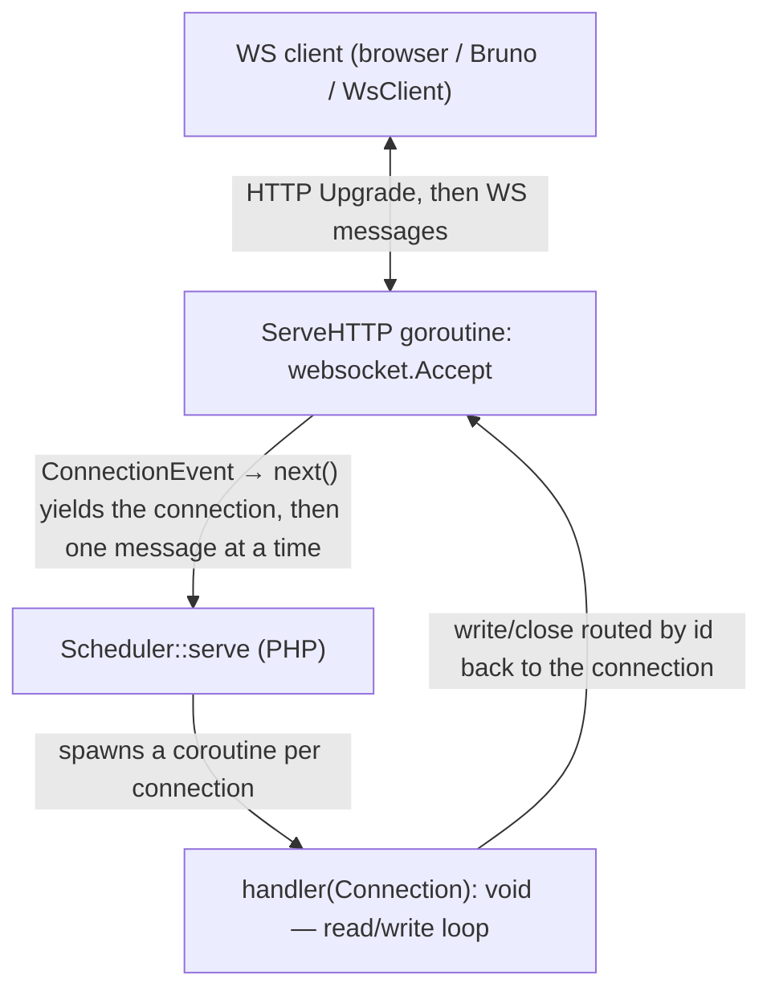

English | [Русский](websocket-server.ru.md)

# WebSocket server

A long-lived WebSocket server: the network lives in the Go extension, and every upgraded
connection is streamed into PHP and handled in its own coroutine. A hybrid of two
references — the handshake and listener come from the [HTTP server](http-server.md)
(`net/http.Server`), and after the upgrade the connection works in the push model of the
[socket server](socket-server.md): the handler receives a `Connection` and drives the
dialogue itself — it reads inbound messages and sends messages to the client at any time.

It runs under the same [worker master](worker-master.md).

## Contents

- [How it works](#how-it-works)
- [Quick start](#quick-start)
- [Connection: read / write / close](#connection-read--write--close)
- [Text and binary](#text-and-binary)
- [Server push](#server-push)
- [Parameters](#parameters)
- [Concurrency](#concurrency)
- [Keepalive and timeouts](#keepalive-and-timeouts)
- [Error handling](#error-handling)
- [Graceful shutdown and SO_REUSEPORT](#graceful-shutdown-and-so_reuseport)
- [Start and stop log](#start-and-stop-log)
- [Running under the worker master](#running-under-the-worker-master)
- [Limits](#limits)

## How it works

A connection starts as an ordinary HTTP request with `Upgrade: websocket`. The listener
is a standard `net/http.Server`; a request with a valid upgrade is accepted by the
[`coder/websocket`](https://github.com/coder/websocket) library and becomes a
bidirectional message stream. Any other request gets `426 Upgrade Required`; a request
not on the configured `path` gets `404`.



Framing is the library's WS protocol (opcode, client masking, ping/pong/close control
frames, UTF-8 validation of text), not our length-prefix. So the WS server has its own
inbound message stream on top of `*websocket.Conn`.

## Quick start

```php
use SConcur\Features\WsServer\Dto\Connection;
use SConcur\Features\WsServer\WsServer;

$server = new WsServer(address: '0.0.0.0:9200');

$server->serve(static function (Connection $connection): void {
    // echo: read messages and send them back while the connection is alive
    while (($message = $connection->read()) !== null) {
        $connection->write($message);
    }
});
```

The handler — `Closure(Connection): void` — runs in the connection's coroutine and drives
its lifecycle itself. When the handler returns, the connection is closed automatically.

## Connection: read / write / close

`Connection` (`src/Features/WsServer/Dto/Connection.php`, shared base class —
`src/Features/Socket/Dto/AbstractConnection.php`):

| Member | Description |
| --- | --- |
| `read(): ?string` | the next inbound message; `null` — the client closed its side, the connection ended, or `maxMessageBytes` was exceeded. Cooperatively suspends the coroutine until a message arrives |
| `write(string $data, bool $binary = false): void` | send a message to the client (with backpressure: waits until the bytes are flushed). Text by default, `binary: true` — binary. Throws `WsServerConnectionClosedException` if the connection is gone |
| `lastMessageWasBinary(): bool` | whether the last `read()` returned a binary message (otherwise text) |
| `close(): void` | close the connection (idempotent, best-effort) |
| `isClosed(): bool` | whether the connection is closed |
| `id`, `remoteAddr`, `localAddr`, `path`, `subprotocol` | identifier, addresses, upgrade path, and the negotiated subprotocol |

Inside the handler you can make async calls (Sleeper, Mongodb, SQL, HTTP client) between
reads/writes — the coroutine cooperatively suspends, and other connections keep being
served.

## Text and binary

WS distinguishes text and binary messages. `read()` returns the payload as a string
(binary-safe), and the type of the last message is reported by `lastMessageWasBinary()`.
`write()` sends text by default — this is friendly to the browser and Bruno; for
arbitrary bytes pass `binary: true`.

```php
$server->serve(static function (Connection $connection): void {
    while (($message = $connection->read()) !== null) {
        // echo, preserving the message type
        $connection->write($message, binary: $connection->lastMessageWasBinary());
    }
});
```

## Server push

The handler is not required to reply to every inbound message and may push as many as it
wants, including without any inbound:

```php
$server->serve(static function (Connection $connection): void {
    $connection->read(); // one inbound -> a stream of responses

    for ($index = 0; $index < 10; $index++) {
        $connection->write("update-$index");

        Sleeper::sleep(seconds: 1); // async work runs between pushes
    }
});
```

Broadcast to other connections is not built in — the application can keep references to
`Connection` and write to them itself (`write` is routed by `id` on the Go side).

## Parameters

The `WsServer` constructor (defaults mirror Go):

| Parameter | Default | Purpose |
| --- | --- | --- |
| `address` | `0.0.0.0:9200` | listener address `host:port` |
| `handshakeTimeoutMs` | `10000` | max time to read the upgrade headers |
| `idleTimeoutMs` | `0` (off) | idle timeout between inbound messages; an idle connection is kept alive by the keepalive ping |
| `writeTimeoutMs` | `30000` | max time to send one message (and one ping) |
| `pingIntervalMs` | `30000` | server keepalive ping cadence (`0` — off) |
| `maxMessageBytes` | `1048576` (1 MiB) | size limit of a single inbound message; exceeding it closes the connection with code 1009 |
| `maxConcurrency` | `0` (no limit) | max connections served at once; excess ones wait for a free slot |
| `maxConnections` | `0` (no limit) | stop the server after N served connections (a leak guard) |
| `shutdownTimeoutMs` | `5000` | drain timeout for in-flight connections on stop |
| `reusePort` | `false` | `SO_REUSEPORT` — a pool of processes on one port (Linux) |
| `path` | `/` | the path on which the upgrade is accepted (empty string — any path); another path → `404` |
| `allowedOrigins` | `[]` | list of host patterns for the origin check (empty — everything allowed, the check is skipped) |
| `subprotocols` | `[]` | negotiable WebSocket subprotocols |
| `onError` | `null` | handler error hook |
| `masterPid` | `null` | orphan check under the master |

`allowedOrigins`/`subprotocols` are arrays, so they are not expanded from the master's
argv; set them in the worker script code if needed.

## Concurrency

Concurrency is between connections: each connection in its own coroutine, so dozens of
connections work in parallel. `maxConcurrency` limits the number of connections served at
once (a slot is held for the whole lifetime of a connection); excess upgrades wait for a
free slot.

> CPU-bound / native block. A heavy synchronous handler (native `sleep`, a CPU loop)
> freezes the single PHP thread — the cooperative model does not preempt it. There is no
> per-message timeout in the push model; the bounds are set by the idle timeout,
> `writeTimeoutMs`, the keepalive ping, and the graceful stop.

## Keepalive and timeouts

The server pings the client every `pingIntervalMs`; if it gets no pong within
`writeTimeoutMs`, it considers the peer dead and closes the connection. This keeps a
push-only connection alive when the client sends nothing into it. `idleTimeoutMs` (if
set) ends a connection's input when too much time passes between inbound messages. A
message larger than `maxMessageBytes` closes the connection with code 1009 (message too
big), and on the handler side `read()` returns `null`.

## Error handling

If the handler throws an exception, it is caught, the connection is closed, and the
`onError: Closure(Throwable, Connection): void` hook can observe it (logging) and, if
needed, send a final message before the close:

```php
$server = new WsServer(
    onError: function (Throwable $exception, Connection $connection): void {
        error_log($exception->getMessage());

        try {
            $connection->write('error');
        } catch (Throwable) {
        }
    },
);
```

`Connection::write` throws `WsServerConnectionClosedException` when the client has already
disconnected — the handler can catch it and stop the push loop, or let it unwind the
coroutine.

## Graceful shutdown and SO_REUSEPORT

On a signal (SIGTERM/SIGINT), on reaching `maxConnections`, or on being orphaned
(`masterPid`), the server stops accepting new connections (closes the listener) and ends
the input of in-flight connections: a handler reading in a loop gets `null` (its current
write still goes through) and returns. A push-only handler that does not read is finished
by a forced close once the grace elapses (`drainGrace`, 2 s). Then the drain of in-flight
is bounded by `shutdownTimeoutMs`. In an `SO_REUSEPORT` pool the kernel immediately hands
new connections to the siblings, after which the process exits on its own.

`reusePort: true` lets several processes listen on one port (one process per core) — the
basis for scaling under the worker master.

Each stop step is written as a line to `STDOUT` — see [Start and stop log](#start-and-stop-log).

## Start and stop log

The server writes lifecycle lines to `STDOUT` (alongside the per-connection access log,
which the Go side writes on each connection's close). On start — a single line, as soon
as the listener is up:

```
2026-06-28T12:00:00.000000 sconcur ws server listening on 0.0.0.0:9200 pid=12345 version=0.5.1 maxConcurrency=0 maxConnections=0 reusePort=0
```

It carries the address, the process pid, the extension version, and the key limits. On
graceful shutdown — one line per step:

```
2026-06-28T12:00:01.000000 sconcur ws server shutdown: stop accepting (reason=signal), draining 2 in-flight
2026-06-28T12:00:01.050000 sconcur ws server shutdown: drained all in-flight
2026-06-28T12:00:01.060000 sconcur ws server shutdown: stopped
```

`reason=signal` — a stop on `SIGTERM`/`SIGINT` (or the loss of the master); `reason=limit`
— on reaching the `maxConnections` limit. The lines are written by the PHP side and
flushed right away. Under the [worker master](worker-master.md) they land in the shared
log.

## Running under the worker master

The server is a "server-agnostic" worker for `bin/sconcur-server`. An example config is
`config/sconcur.ws-server.config.json`; the worker script builds the server from argv:

```php
use SConcur\Features\WsServer\Dto\Connection;
use SConcur\Features\WsServer\WsServer;

$server = WsServer::fromArgs($_SERVER['argv']);

$server->serve(static function (Connection $connection): void {
    while (($message = $connection->read()) !== null) {
        $connection->write($message);
    }
});
```

The parameters from the `server` block of the JSON config are expanded by the master into
`--key=value` argv (`fromArgs` parses them), and its own pid is injected via the
`--masterPid` flag (orphan check). `reusePort: true` enables a pool of processes across
cores. The pool reports statistics through the master panel (`GET /api/stats`) — via the
`connections` section, as in the socket server. Details are in the
[worker master](worker-master.md) and [server statistics](admin-stats.md).

## Limits

- TCP only. Unix sockets are not supported (`SO_REUSEPORT` does not apply to `AF_UNIX`).
- A single endpoint. There are no application HTTP routes: anything that is not an upgrade
  is `426`.
- Broadcast is not built in. Push to other connections is up to the application.
- No per-message timeout. The bounds are the idle timeout, `writeTimeoutMs`, the keepalive
  ping, and the graceful stop.
- `permessage-deflate` (compression) and TLS are not yet enabled.
- The library's general limits (CLI only, Linux only, NTS only, no `pcntl_fork` after the
  extension is loaded) — see the [README](../README.md).
