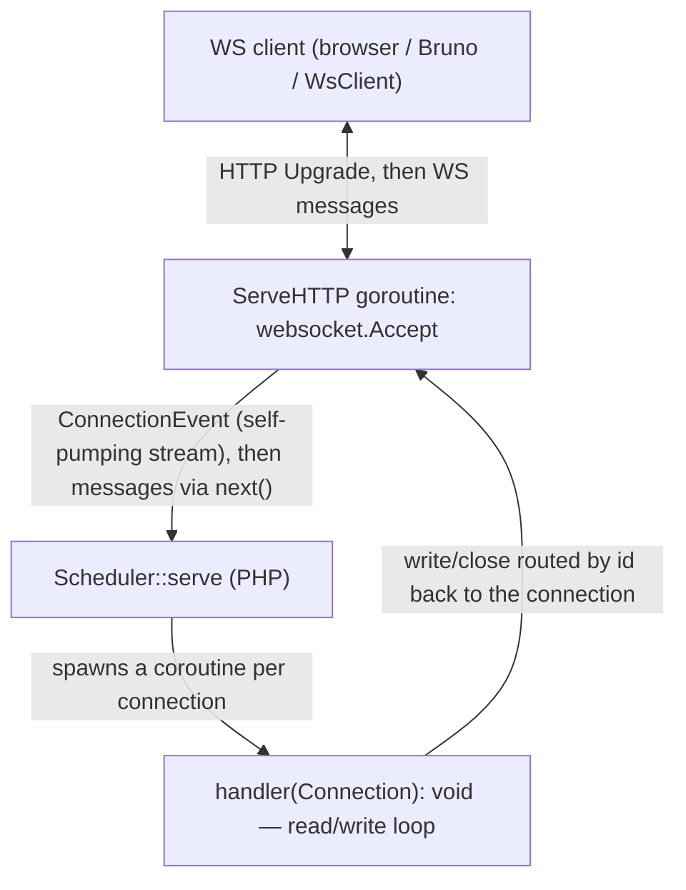

English | [Русский](websocket-server.ru.md)

# WebSocket server

A long-lived WebSocket server: the network lives in the Go extension, and every
upgraded connection is streamed into PHP and handled in its own coroutine. It is a
hybrid — the handshake and listener come from the [HTTP server](http-server.md)
(`net/http.Server`), and after the upgrade the connection works in the push model
of the [socket server](socket-server.md). It runs under the same
[worker master](worker-master.md).

## How it works

A connection starts as an ordinary HTTP request with `Upgrade: websocket`. A
request with a valid upgrade is accepted by [`coder/websocket`](https://github.com/coder/websocket)
and becomes a bidirectional message stream; any other request gets `426 Upgrade
Required`, and a request not on the configured `path` gets `404`. Framing is the
library's WS protocol (opcode, client masking, ping/pong/close control frames,
UTF-8 validation of text), not the length-prefix of the socket server, so the WS
server has its own inbound message stream on top of `*websocket.Conn`.


```mermaid
flowchart TB
    client["WS client (browser / Bruno / WsClient)"]
    serve["ServeHTTP goroutine: websocket.Accept"]
    sched["Scheduler::serve (PHP)"]
    handler["handler(Connection): void — read/write loop"]

    client <-->|"HTTP Upgrade, then WS messages"| serve
    serve -->|"ConnectionEvent (self-pumping stream), then messages via next()"| sched
    sched -->|"spawns a coroutine per connection"| handler
    handler -->|"write/close routed by id back to the connection"| serve
```

## Quick start

```php
use SConcur\Features\WsServer\Dto\Connection;
use SConcur\Features\WsServer\WsServer;

$server = new WsServer(address: '0.0.0.0:9200');

$server->serve(static function (Connection $connection): void {
    // echo: read messages and send them back while the connection is alive
    while (($message = $connection->read()) !== null) {
        $connection->write($message);
    }
});
```

The handler — `Closure(Connection): void` — runs in the connection's coroutine and
drives its lifecycle itself; when it returns, the connection is closed
automatically.

## Connection: read / write / close

`Connection` (`src/Features/WsServer/Dto/Connection.php`, shared base class —
`src/Features/Socket/Dto/AbstractConnection.php`):

| Member | Description |
| --- | --- |
| `read(): ?string` | the next inbound message; `null` — the client closed its side, the connection ended, or `maxMessageBytes` was exceeded. Cooperatively suspends the coroutine |
| `write(string $data, bool $binary = false): void` | send a message (with backpressure: waits for the flush). Text by default. Throws `WsServerConnectionClosedException` if the connection is gone |
| `lastMessageWasBinary(): bool` | whether the last `read()` returned a binary message |
| `close(): void` | close the connection (idempotent, best-effort) |
| `isClosed(): bool` | whether the connection is closed |
| `id`, `remoteAddr`, `localAddr`, `path`, `subprotocol` | identifier, addresses, upgrade path and the negotiated subprotocol |

`read()` returns the payload as a binary-safe string; `write()` sends text by
default (friendly to browsers and Bruno), and `binary: true` sends arbitrary bytes:

```php
$connection->write($message, binary: $connection->lastMessageWasBinary()); // echo, preserving the type
```

Inside the handler you can make async calls (Sleeper, Mongodb, SQL, HTTP client)
between reads and writes — the coroutine suspends cooperatively and other
connections keep being served.

## Server push

The handler is not required to reply to every inbound message and may push as many
as it wants, including without any inbound:

```php
$server->serve(static function (Connection $connection): void {
    $connection->read();

    for ($index = 0; $index < 10; $index++) {
        $connection->write("update-$index");

        Sleeper::sleep(seconds: 1); // async work runs between pushes
    }
});
```

Broadcast to other connections is not built in — the application can keep
references to `Connection` and write to them itself (`write` is routed by `id` on
the Go side).

## Parameters

The `WsServer` constructor; the PHP defaults mirror Go.

| Parameter | Default | Purpose |
| --- | --- | --- |
| `address` | `0.0.0.0:9200` | listener address `host:port` |
| `handshakeTimeoutMs` | `10000` | max time to read the upgrade headers |
| `idleTimeoutMs` | `0` (off) | idle timeout between inbound messages; an idle connection is kept alive by the keepalive ping |
| `writeTimeoutMs` | `30000` | max time to send one message (and one ping) |
| `pingIntervalMs` | `30000` | server keepalive ping cadence (`0` — off) |
| `maxMessageBytes` | `1048576` (1 MiB) | size limit of a single inbound message; exceeding it closes the connection with code 1009 |
| `maxConcurrency` | `0` (no limit) | max connections served at once; excess ones wait for a free slot |
| `maxConnections` | `0` (no limit) | stop the server after N served connections (a leak guard) |
| `shutdownTimeoutMs` | `5000` | drain timeout for in-flight connections on stop |
| `reusePort` | `false` | `SO_REUSEPORT` — a pool of processes on one port (Linux) |
| `path` | `/` | the path on which the upgrade is accepted (empty string — any path); another path → `404` |
| `allowedOrigins` | `[]` | host patterns for the origin check (empty — the check is skipped) |
| `subprotocols` | `[]` | negotiable WebSocket subprotocols |
| `onError` | `null` | handler-error hook |
| `masterPid` | `null` | orphan check under the master |
| `telemetrySocket` | `''` (off) | unix socket for stats snapshots, injected by the master ([stats](admin-stats.md)) |
| `serverName` | `'sconcur-server'` | worker name in the stats snapshots |
| `telemetryIntervalMs` | `0` | stats cadence (`0` — pusher default, 1000 ms) |
| `preemptionQuantumMs` | `5` | automatic-preemption quantum (`0` — off), see [coroutine switching](coroutine-switching.md) |

`allowedOrigins`/`subprotocols` are arrays, so they are not expanded from the
master's argv; set them in the worker script if needed.

## Concurrency, keepalive and errors

Concurrency is between connections: each lives in its own coroutine.
`maxConcurrency` limits how many are served at once (a slot is held for the whole
lifetime of a connection); excess upgrades wait for a free slot. The same CPU-bound
caveat as everywhere applies: a native blocking call freezes the single PHP thread,
while a userland CPU loop is preempted every
[quantum](coroutine-switching.md).

The server pings the client every `pingIntervalMs`; with no pong within
`writeTimeoutMs` it considers the peer dead and closes the connection — this keeps
a push-only connection alive when the client sends nothing. `idleTimeoutMs` (if
set) ends a connection's input when too much time passes between inbound messages.
A message larger than `maxMessageBytes` closes the connection with code 1009, and
on the handler side `read()` returns `null`.

If the handler throws, the exception is caught, the connection is closed, and the
`onError: Closure(Throwable, Connection): void` hook can observe it and send a
final message before the close. In ordinary code `write` throws
`WsServerConnectionClosedException` once the client has disconnected.

## Graceful shutdown and SO_REUSEPORT

On a signal (SIGTERM/SIGINT), on reaching `maxConnections`, or on being orphaned
(`masterPid`), the server stops accepting new connections and ends the input of
in-flight ones: a handler reading in a loop gets `null` (its current write still
goes through) and returns. A push-only handler that does not read is finished by a
forced close once the grace elapses (`drainGrace`, 2 s), after which the drain is
bounded by `shutdownTimeoutMs`. In an `SO_REUSEPORT` pool the kernel immediately
hands new connections to siblings, and the process exits on its own.

Lifecycle lines go to `STDOUT` alongside the per-connection access log written by
the Go side:

```
2026-06-28T12:00:00.000000 sconcur ws server listening on 0.0.0.0:9200 pid=12345 version=0.9.0 maxConcurrency=0 maxConnections=0 reusePort=0
2026-06-28T12:00:01.000000 sconcur ws server shutdown: stop accepting (reason=signal), draining 2 in-flight
2026-06-28T12:00:01.050000 sconcur ws server shutdown: drained all in-flight
2026-06-28T12:00:01.060000 sconcur ws server shutdown: stopped
```

## Running under the worker master

The server is a server-agnostic worker for `bin/sconcur-server`; an example config
is `config/sconcur.ws-server.config.json`.

```php
$server = WsServer::fromArgs($_SERVER['argv']);

$server->serve(static function (Connection $connection): void {
    while (($message = $connection->read()) !== null) {
        $connection->write($message);
    }
});
```

The master expands the `server` block into `--key=value` argv and injects its own
pid via `--masterPid`; `reusePort: true` enables a pool across cores. The pool
reports statistics through the master panel (`GET /api/stats`) via the
`connections` section, as in the socket server — see
[worker master](worker-master.md) and [server statistics](admin-stats.md).

## Limits

- TCP only, no unix sockets.
- A single endpoint: there are no application HTTP routes — anything that is not an
  upgrade is `426`.
- Broadcast is not built in.
- No per-message timeout: the bounds are the idle timeout, `writeTimeoutMs`, the
  keepalive ping and the graceful stop.
- `permessage-deflate` (compression) and TLS are not yet enabled.
- The library's general limits (CLI only, Linux only, NTS only, no `pcntl_fork`
  after the extension is loaded) — see the [README](../README.md).
