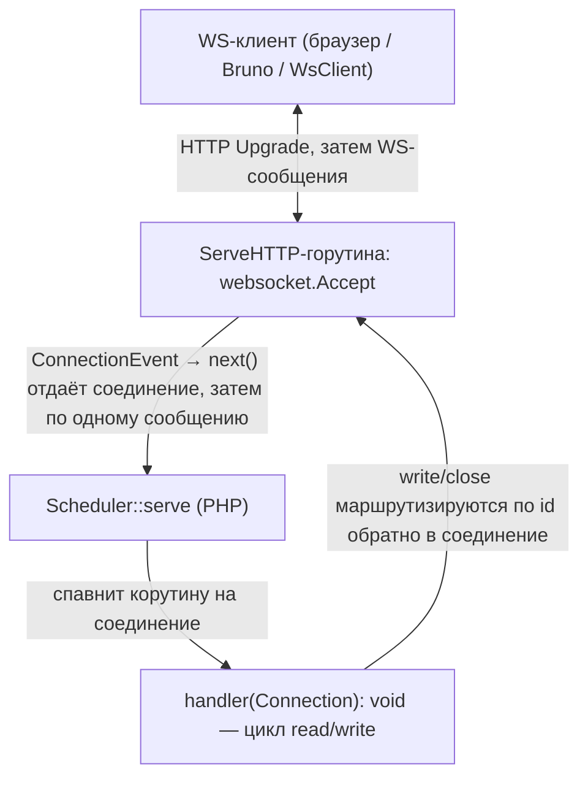

# WebSocket-сервер

Долгоживущий WebSocket-сервер: сеть живёт в Go-расширении, каждое апгрейднутое
соединение стримится в PHP и обрабатывается в своей корутине. Гибрид двух эталонов —
рукопожатие и слушатель взяты у [HTTP-сервера](http-server.ru.md) (`net/http.Server`),
а после апгрейда соединение работает по push-модели [сокет-сервера](socket-server.ru.md):
обработчик получает `Connection` и сам ведёт диалог — читает входящие сообщения и шлёт
сообщения клиенту в любой момент.

Запускается под тем же [мастером воркеров](worker-master.ru.md).

## Содержание

- [Как это устроено](#как-это-устроено)
- [Быстрый старт](#быстрый-старт)
- [Connection: read / write / close](#connection-read--write--close)
- [Текст и бинарь](#текст-и-бинарь)
- [Server push](#server-push)
- [Параметры](#параметры)
- [Конкурентность](#конкурентность)
- [Keepalive и таймауты](#keepalive-и-таймауты)
- [Обработка ошибок](#обработка-ошибок)
- [Graceful shutdown и SO_REUSEPORT](#graceful-shutdown-и-so_reuseport)
- [Лог старта и остановки](#лог-старта-и-остановки)
- [Запуск под мастером воркеров](#запуск-под-мастером-воркеров)
- [Ограничения](#ограничения)

## Как это устроено

Соединение начинается как обычный HTTP-запрос с `Upgrade: websocket`. Слушатель —
стандартный `net/http.Server`; запрос с валидным апгрейдом принимается библиотекой
[`coder/websocket`](https://github.com/coder/websocket) и становится двунаправленным
потоком сообщений. Любой другой запрос получает `426 Upgrade Required`; запрос не на
сконфигурированный `path` — `404`.



Фрейминг — это WS-протокол библиотеки (opcode, маскирование клиента, control-фреймы
ping/pong/close, UTF-8-валидация text), а не наш length-prefix. Поэтому у WS-сервера свой
поток входящих сообщений поверх `*websocket.Conn`.

## Быстрый старт

```php
use SConcur\Features\WsServer\Dto\Connection;
use SConcur\Features\WsServer\WsServer;

$server = new WsServer(address: '0.0.0.0:9200');

$server->serve(static function (Connection $connection): void {
    // echo: читаем сообщения и шлём обратно, пока соединение живо
    while (($message = $connection->read()) !== null) {
        $connection->write($message);
    }
});
```

Обработчик — `Closure(Connection): void` — исполняется в корутине соединения и сам
управляет его жизненным циклом. Когда обработчик завершается, соединение закрывается
автоматически.

## Connection: read / write / close

`Connection` (`src/Features/WsServer/Dto/Connection.php`, общий базовый класс —
`src/Features/Socket/Dto/AbstractConnection.php`):

| Член | Описание |
| --- | --- |
| `read(): ?string` | следующее входящее сообщение; `null` — клиент закрыл свою сторону, соединение завершено или превышен `maxMessageBytes`. Кооперативно приостанавливает корутину до прихода сообщения |
| `write(string $data, bool $binary = false): void` | отправить сообщение клиенту (с backpressure: ждёт, пока байты уйдут). По умолчанию text, `binary: true` — бинарное. Бросает `WsServerConnectionClosedException`, если соединение разорвано |
| `lastMessageWasBinary(): bool` | был ли последний прочитанный `read()` бинарным (иначе text) |
| `close(): void` | закрыть соединение (идемпотентно, best-effort) |
| `isClosed(): bool` | закрыто ли соединение |
| `id`, `remoteAddr`, `localAddr`, `path`, `subprotocol` | идентификатор, адреса, путь апгрейда и согласованный subprotocol |

Внутри обработчика можно делать асинхронные вызовы (Sleeper, Mongodb, SQL,
HTTP-клиент) между чтениями/записями — корутина кооперативно приостанавливается,
другие соединения продолжают обслуживаться.

## Текст и бинарь

WS различает text и binary сообщения. `read()` возвращает payload как строку
(бинарно-безопасно), а тип последнего сообщения отдаёт `lastMessageWasBinary()`.
`write()` по умолчанию шлёт text — это дружелюбно к браузеру и Bruno; для произвольных
байтов передайте `binary: true`.

```php
$server->serve(static function (Connection $connection): void {
    while (($message = $connection->read()) !== null) {
        // эхо с сохранением типа сообщения
        $connection->write($message, binary: $connection->lastMessageWasBinary());
    }
});
```

## Server push

Обработчик не обязан отвечать на каждое входящее сообщение и может пушить сколько
угодно, в том числе без входящих:

```php
$server->serve(static function (Connection $connection): void {
    $connection->read(); // одно входящее -> поток ответных

    for ($index = 0; $index < 10; $index++) {
        $connection->write("update-$index");

        Sleeper::sleep(seconds: 1); // между пушами идёт async-работа
    }
});
```

Broadcast в другие соединения не встроен — приложение может хранить ссылки на
`Connection` и писать в них самостоятельно (`write` маршрутизируется по `id` на
Go-стороне).

## Параметры

Конструктор `WsServer` (значения по умолчанию зеркалят Go):

| Параметр | По умолчанию | Назначение |
| --- | --- | --- |
| `address` | `0.0.0.0:9200` | адрес слушателя `host:port` |
| `handshakeTimeoutMs` | `10000` | максимум на чтение заголовков апгрейда |
| `idleTimeoutMs` | `0` (выкл) | idle-таймаут между входящими сообщениями; idle-соединение держит keepalive-ping |
| `writeTimeoutMs` | `30000` | максимум на отправку одного сообщения (и одного ping) |
| `pingIntervalMs` | `30000` | период серверного keepalive-ping (`0` — выкл) |
| `maxMessageBytes` | `1048576` (1 MiB) | лимит размера одного входящего сообщения; превышение закрывает соединение с кодом 1009 |
| `maxConcurrency` | `0` (без лимита) | максимум одновременно обслуживаемых соединений; лишние ждут свободный слот |
| `maxConnections` | `0` (без лимита) | остановить сервер после N обслуженных соединений (мера против утечек) |
| `shutdownTimeoutMs` | `5000` | таймаут дренажа in-flight соединений при остановке |
| `reusePort` | `false` | `SO_REUSEPORT` — пул процессов на один порт (Linux) |
| `path` | `/` | путь, на котором принимается апгрейд (пустая строка — любой путь); другой путь → `404` |
| `allowedOrigins` | `[]` | список host-паттернов для origin-проверки (пусто — разрешено всё, проверка пропускается) |
| `subprotocols` | `[]` | согласуемые WebSocket-subprotocol'ы |
| `onError` | `null` | хук ошибки обработчика |
| `masterPid` | `null` | orphan-чек под мастером |

`allowedOrigins`/`subprotocols` — массивы, поэтому не разворачиваются из argv мастера;
задавайте их в коде воркер-скрипта при необходимости.

## Конкурентность

Конкурентность — между соединениями: каждое соединение в своей корутине, поэтому
десятки соединений работают параллельно. `maxConcurrency` ограничивает число
одновременно обслуживаемых соединений (слот держится всё время жизни соединения);
лишние апгрейды ждут свободный слот.

> CPU-bound / нативный блок. Тяжёлый синхронный обработчик (нативный `sleep`,
> CPU-цикл) замораживает единственный поток PHP — кооперативная модель его не
> вытесняет. Per-message-таймаута в push-модели нет; границы задают idle-таймаут,
> `writeTimeoutMs`, keepalive-ping и graceful-остановка.

## Keepalive и таймауты

Сервер пингует клиента каждые `pingIntervalMs`; не получив pong за `writeTimeoutMs`,
считает пира мёртвым и закрывает соединение. Это держит живым push-only соединение, в
которое клиент ничего не шлёт. `idleTimeoutMs` (если задан) завершает ввод соединения,
когда между входящими сообщениями проходит слишком много времени. Сообщение больше
`maxMessageBytes` закрывает соединение с кодом 1009 (message too big), и на стороне
обработчика `read()` возвращает `null`.

## Обработка ошибок

Если обработчик бросает исключение, оно перехватывается, соединение закрывается, а хук
`onError: Closure(Throwable, Connection): void` может это пронаблюдать (логирование) и при
необходимости отправить финальное сообщение перед закрытием:

```php
$server = new WsServer(
    onError: function (Throwable $exception, Connection $connection): void {
        error_log($exception->getMessage());

        try {
            $connection->write('error');
        } catch (Throwable) {
        }
    },
);
```

`Connection::write` бросает `WsServerConnectionClosedException`, когда клиент уже
отключился — обработчик может его поймать и остановить пуш-цикл, либо дать ему размотать
корутину.

## Graceful shutdown и SO_REUSEPORT

По сигналу (SIGTERM/SIGINT), по достижении `maxConnections` или при сиротстве
(`masterPid`) сервер перестаёт принимать новые соединения (закрывает слушатель) и
завершает ввод in-flight соединений: обработчик, читающий в цикле, получает `null` (его
текущая запись ещё проходит) и завершается. Push-only обработчик, который не читает,
добивается принудительным закрытием по истечении грейса (`drainGrace`, 2 c). Затем
дренаж in-flight ограничен `shutdownTimeoutMs`. На пуле `SO_REUSEPORT` ядро тут же
раздаёт новые соединения соседям, после чего процесс завершается сам.

`reusePort: true` позволяет нескольким процессам слушать один порт (один процесс на
ядро) — основа масштабирования под мастером воркеров.

Каждый шаг остановки пишется строкой в `STDOUT` — см. [Лог старта и остановки](#лог-старта-и-остановки).

## Лог старта и остановки

Сервер пишет в `STDOUT` строки жизненного цикла (наряду с per-connection access-логом,
который Go-сторона пишет при закрытии каждого соединения). При старте — одна строка, как
только листенер запущен:

```
2026-06-28T12:00:00.000000 sconcur ws server listening on 0.0.0.0:9200 pid=12345 version=0.5.1 maxConcurrency=0 maxConnections=0 reusePort=0
```

В ней адрес, pid процесса, версия расширения и ключевые лимиты. При graceful shutdown —
по строке на шаг:

```
2026-06-28T12:00:01.000000 sconcur ws server shutdown: stop accepting (reason=signal), draining 2 in-flight
2026-06-28T12:00:01.050000 sconcur ws server shutdown: drained all in-flight
2026-06-28T12:00:01.060000 sconcur ws server shutdown: stopped
```

`reason=signal` — остановка по `SIGTERM`/`SIGINT` (или потере мастера); `reason=limit` —
по достижению предела `maxConnections`. Строки пишет PHP-сторона и сразу флашит. Под
[мастером воркеров](worker-master.ru.md) они попадают в общий лог.

## Запуск под мастером воркеров

Сервер — «server-agnostic»-воркер для `bin/sconcur-server`. Пример конфига —
`config/sconcur.ws-server.config.json`; воркер-скрипт строит сервер из argv:

```php
use SConcur\Features\WsServer\Dto\Connection;
use SConcur\Features\WsServer\WsServer;

$server = WsServer::fromArgs($_SERVER['argv']);

$server->serve(static function (Connection $connection): void {
    while (($message = $connection->read()) !== null) {
        $connection->write($message);
    }
});
```

Параметры из блока `server` JSON-конфига мастер разворачивает в `--ключ=значение` argv
(`fromArgs` их разбирает), а свой pid прокидывает флагом `--masterPid` (orphan-чек).
`reusePort: true` включает пул процессов на ядра. Статистику пул отдаёт через панель
мастера (`GET /api/stats`) — секцией `connections`, как у сокет-сервера. Подробности —
в [мастере воркеров](worker-master.ru.md) и [статистике сервера](admin-stats.ru.md).

## Ограничения

- Только TCP. Unix-сокеты не поддерживаются (`SO_REUSEPORT` неприменим к `AF_UNIX`).
- Один эндпоинт. Прикладных HTTP-маршрутов нет: всё, что не апгрейд, — `426`.
- Broadcast не встроен. Push в другие соединения — силами приложения.
- Нет per-message-таймаута. Границы — idle-таймаут, `writeTimeoutMs`, keepalive-ping и
  graceful-остановка.
- `permessage-deflate` (сжатие) и TLS пока не включены.
- Общие ограничения библиотеки (только CLI, только Linux, только NTS, нельзя
  `pcntl_fork` после загрузки расширения) — см. [README](../README.md).
