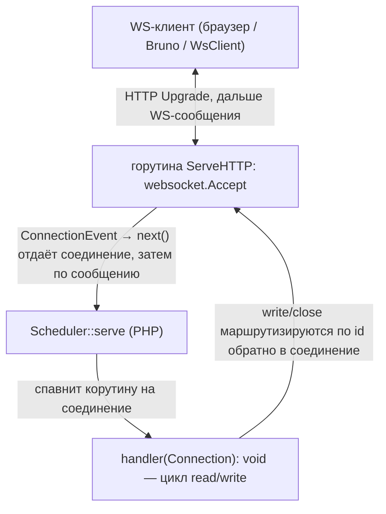

[English](websocket-server.md) | Русский

# WebSocket-сервер

Долгоживущий WebSocket-сервер: сеть живёт в Go-расширении, а каждое поднятое до WS
соединение стримится в PHP и обрабатывается в своей корутине. Это гибрид —
листенер и рукопожатие взяты у [HTTP-сервера](http-server.ru.md)
(`net/http.Server`), а после апгрейда соединение работает в push-модели
[сокет-сервера](socket-server.ru.md). Работает под тем же
[мастером воркеров](worker-master.ru.md).

## Как это работает

Соединение начинается обычным HTTP-запросом с `Upgrade: websocket`. Запрос с
валидным апгрейдом принимает [`coder/websocket`](https://github.com/coder/websocket),
и он становится двунаправленным потоком сообщений; любой другой запрос получает
`426 Upgrade Required`, а запрос не на настроенный `path` — `404`. Фрейминг — это
WS-протокол библиотеки (opcode, маскирование клиента, управляющие кадры
ping/pong/close, валидация UTF-8 у текста), а не length-prefix сокет-сервера,
поэтому у WS-сервера свой поток входящих сообщений поверх `*websocket.Conn`.


```mermaid
flowchart TB
    client["WS-клиент (браузер / Bruno / WsClient)"]
    serve["горутина ServeHTTP: websocket.Accept"]
    sched["Scheduler::serve (PHP)"]
    handler["handler(Connection): void — цикл read/write"]

    client <-->|"HTTP Upgrade, дальше WS-сообщения"| serve
    serve -->|"ConnectionEvent → next() отдаёт соединение, затем по сообщению"| sched
    sched -->|"спавнит корутину на соединение"| handler
    handler -->|"write/close маршрутизируются по id обратно в соединение"| serve
```

## Быстрый старт

```php
use SConcur\Features\WsServer\Dto\Connection;
use SConcur\Features\WsServer\WsServer;

$server = new WsServer(address: '0.0.0.0:9200');

$server->serve(static function (Connection $connection): void {
    // echo: читаем сообщения и отправляем обратно, пока соединение живо
    while (($message = $connection->read()) !== null) {
        $connection->write($message);
    }
});
```

Обработчик — `Closure(Connection): void` — исполняется в корутине соединения и сам
ведёт его жизненный цикл; когда он возвращает управление, соединение закрывается
автоматически.

## Connection: read / write / close

`Connection` (`src/Features/WsServer/Dto/Connection.php`, общий базовый класс —
`src/Features/Socket/Dto/AbstractConnection.php`):

| Член | Описание |
| --- | --- |
| `read(): ?string` | следующее входящее сообщение; `null` — клиент закрыл свою сторону, соединение завершилось или превышен `maxMessageBytes`. Кооперативно приостанавливает корутину |
| `write(string $data, bool $binary = false): void` | отправить сообщение (с backpressure: ждёт сброса). По умолчанию текст. Бросает `WsServerConnectionClosedException`, если соединения уже нет |
| `lastMessageWasBinary(): bool` | было ли последнее `read()` бинарным |
| `close(): void` | закрыть соединение (идемпотентно, best-effort) |
| `isClosed(): bool` | закрыто ли соединение |
| `id`, `remoteAddr`, `localAddr`, `path`, `subprotocol` | идентификатор, адреса, путь апгрейда и согласованный субпротокол |

`read()` отдаёт полезную нагрузку бинарно-безопасной строкой; `write()` по
умолчанию шлёт текст (это дружественно браузеру и Bruno), а `binary: true` — любые
байты:

```php
$connection->write($message, binary: $connection->lastMessageWasBinary()); // echo с сохранением типа
```

Внутри обработчика между чтениями и записями можно делать асинхронные вызовы
(Sleeper, Mongodb, SQL, HTTP-клиент) — корутина приостанавливается кооперативно, а
другие соединения продолжают обслуживаться.

## Server push

Обработчик не обязан отвечать на каждое входящее сообщение и может пушить сколько
угодно, в том числе вообще без входящих:

```php
$server->serve(static function (Connection $connection): void {
    $connection->read();

    for ($index = 0; $index < 10; $index++) {
        $connection->write("update-$index");

        Sleeper::sleep(seconds: 1); // между пушами идёт async-работа
    }
});
```

Broadcast в другие соединения не встроен — приложение может держать ссылки на
`Connection` и писать в них само (`write` маршрутизируется по `id` на Go-стороне).

## Параметры

Конструктор `WsServer`; дефолты PHP зеркалят Go.

| Параметр | Дефолт | Назначение |
| --- | --- | --- |
| `address` | `0.0.0.0:9200` | адрес прослушивания `host:port` |
| `handshakeTimeoutMs` | `10000` | максимальное время чтения заголовков апгрейда |
| `idleTimeoutMs` | `0` (выкл.) | idle-таймаут между входящими сообщениями; простаивающее соединение держит keepalive-ping |
| `writeTimeoutMs` | `30000` | максимальное время отправки одного сообщения (и одного ping) |
| `pingIntervalMs` | `30000` | период серверного keepalive-ping (`0` — выкл.) |
| `maxMessageBytes` | `1048576` (1 MiB) | лимит размера одного входящего сообщения; превышение закрывает соединение с кодом 1009 |
| `maxConcurrency` | `0` (без лимита) | сколько соединений обслуживается одновременно; лишние ждут слот |
| `maxConnections` | `0` (без лимита) | остановить сервер после N обслуженных соединений (защита от утечек) |
| `shutdownTimeoutMs` | `5000` | таймаут дренажа активных соединений при остановке |
| `reusePort` | `false` | `SO_REUSEPORT` — пул процессов на одном порту (Linux) |
| `path` | `/` | путь, на котором принимается апгрейд (пустая строка — любой путь); другой путь → `404` |
| `allowedOrigins` | `[]` | шаблоны хостов для проверки origin (пусто — проверка пропускается) |
| `subprotocols` | `[]` | согласуемые субпротоколы WebSocket |
| `onError` | `null` | хук ошибки обработчика |
| `masterPid` | `null` | проверка на сироту под мастером |
| `telemetrySocket` | `''` (выкл.) | unix-сокет для снапшотов статистики, инжектируется мастером ([статистика](admin-stats.ru.md)) |
| `serverName` | `'sconcur-server'` | имя воркера в снапшотах статистики |
| `telemetryIntervalMs` | `0` | период снапшотов (`0` — дефолт пушера, 1000 мс) |
| `preemptionQuantumMs` | `5` | квант автоматической преемпции (`0` — выкл.), см. [переключение корутин](coroutine-switching.ru.md) |

`allowedOrigins`/`subprotocols` — массивы, поэтому из argv мастера они не
разворачиваются; задавайте их в коде воркер-скрипта.

## Конкурентность, keepalive и ошибки

Конкурентность — между соединениями: каждое живёт в своей корутине.
`maxConcurrency` ограничивает число одновременно обслуживаемых (слот держится всю
жизнь соединения); лишние апгрейды ждут слот. Действует та же оговорка про CPU:
нативный блокирующий вызов замораживает единственный PHP-поток, а userland
CPU-цикл вытесняется каждый [квант](coroutine-switching.ru.md).

Сервер пингует клиента каждые `pingIntervalMs`; не получив pong за
`writeTimeoutMs`, считает пира мёртвым и закрывает соединение — это держит живым
push-соединение, в которое клиент ничего не шлёт. `idleTimeoutMs` (если задан)
завершает вход соединения, когда между входящими сообщениями проходит слишком
много времени. Сообщение больше `maxMessageBytes` закрывает соединение с кодом
1009, а на стороне обработчика `read()` возвращает `null`.

Если обработчик бросил исключение, оно перехватывается, соединение закрывается, а
хук `onError: Closure(Throwable, Connection): void` может его увидеть и отправить
прощальное сообщение перед закрытием. В обычном коде `write` бросает
`WsServerConnectionClosedException`, когда клиент уже отключился.

## Graceful shutdown и SO_REUSEPORT

По сигналу (SIGTERM/SIGINT), при достижении `maxConnections` или при осиротении
(`masterPid`) сервер перестаёт принимать новые соединения и завершает вход
активных: обработчик, читающий в цикле, получает `null` (текущая запись всё же
проходит) и возвращает управление. Push-обработчик, который не читает, добивается
принудительным закрытием по истечении grace (`drainGrace`, 2 c), после чего дренаж
ограничен `shutdownTimeoutMs`. В пуле `SO_REUSEPORT` ядро сразу отдаёт новые
соединения соседям, и процесс выходит сам.

Строки жизненного цикла идут в `STDOUT` рядом с access-логом на соединение,
который пишет Go-сторона:

```
2026-06-28T12:00:00.000000 sconcur ws server listening on 0.0.0.0:9200 pid=12345 version=0.9.0 maxConcurrency=0 maxConnections=0 reusePort=0
2026-06-28T12:00:01.000000 sconcur ws server shutdown: stop accepting (reason=signal), draining 2 in-flight
2026-06-28T12:00:01.050000 sconcur ws server shutdown: drained all in-flight
2026-06-28T12:00:01.060000 sconcur ws server shutdown: stopped
```

## Запуск под мастером воркеров

Сервер — «server-agnostic» воркер для `bin/sconcur-server`; пример конфига —
`config/sconcur.ws-server.config.json`.

```php
$server = WsServer::fromArgs($_SERVER['argv']);

$server->serve(static function (Connection $connection): void {
    while (($message = $connection->read()) !== null) {
        $connection->write($message);
    }
});
```

Мастер разворачивает блок `server` в argv `--key=value` и инжектит свой pid через
`--masterPid`; `reusePort: true` включает пул по ядрам. Пул отдаёт статистику через
панель мастера (`GET /api/stats`) секцией `connections`, как у сокет-сервера — см.
[мастер воркеров](worker-master.ru.md) и
[статистику сервера](admin-stats.ru.md).

## Ограничения

- Только TCP, unix-сокетов нет.
- Единственная ручка: прикладных HTTP-маршрутов нет — всё, что не апгрейд, это
  `426`.
- Broadcast не встроен.
- Нет per-message таймаута: границы задают idle-таймаут, `writeTimeoutMs`,
  keepalive-ping и graceful-остановка.
- `permessage-deflate` (сжатие) и TLS пока не включены.
- Общие ограничения библиотеки (только CLI, только Linux, только NTS, нельзя
  `pcntl_fork` после загрузки расширения) — см. [README](../README.ru.md).
